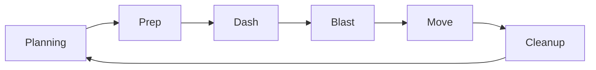
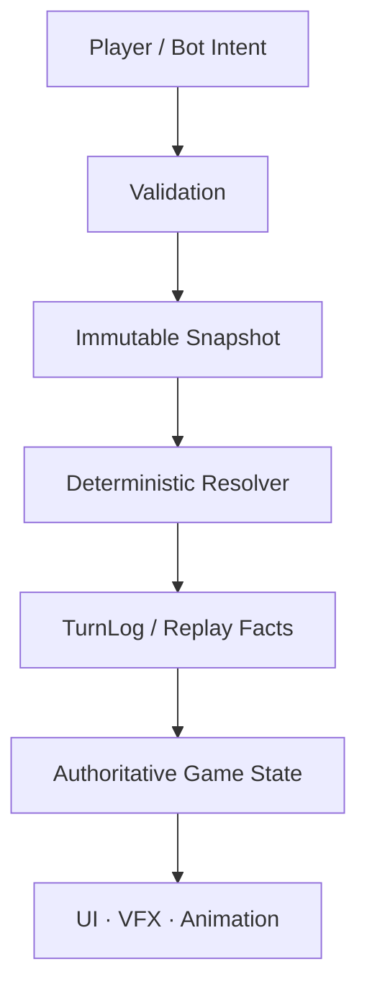

# RefactorTactics

**RefactorTactics** è un tattico competitivo PC-first a **turni simultanei**, sviluppato in **Unreal Engine 5.8.1**.

Ogni giocatore pianifica la propria azione, il gioco costruisce uno snapshot condiviso dello stato e il resolver applica le decisioni secondo regole deterministiche.

> [!IMPORTANT]
> **Release v0.1:** vertical slice **2v2 offline contro bot**.  
> **Formato competitivo Standard:** **3v3**.  
> Il 2v2 resta il formato Skirmish/vertical slice; il 4v4+ è riservato a stress test e scenari di scala.
>
> Questo README non duplica conteggi di test, SHA, issue o checkpoint. Per lo stato corrente usa la [roadmap v0.1](docs/roadmap/roadmap-v0.1.md) e il [checkpoint di esecuzione](docs/roadmap/roadmap-checkpoint.md).

## Il gioco in breve

- **Planning simultaneo** — i giocatori pianificano senza conoscere il piano avversario.
- **Risoluzione deterministica** — stesso snapshot, regole/versione, seed e decisioni registrate producono lo stesso risultato.
- **Mappa esagonale multilivello** — quota, coperture, LOS, terreni e topologia fanno parte della strategia.
- **Informazione parziale** — vista, rumore e Team Knowledge determinano ciò che una squadra conosce.
- **Reazioni e finestre live** — il resolver può fermarsi a un decision boundary e registrare una scelta senza delegare l'esito ad animazioni o frame rate.
- **Contenuti data-driven** — eroi, azioni ed equipaggiamenti sono configurati tramite `UPrimaryDataAsset`.

Roster v0.1:

**Gadget · Phase · Riktor · Wraith**

## Come funziona un turno



Il **Move normale** resta l'ultima fase volontaria. Dash e altri spostamenti speciali possono risolvere prima soltanto quando appartengono alla propria fase o regola.

Azioni universali correnti:

`Wait · Move · BasicAttack · Guard · Brace · Interact · Overwatch`

## Architettura

RefactorTactics separa nettamente **simulazione** e **presentazione**.



### Principi

1. **La simulazione decide, la presentazione mostra.**  
   Animazioni, montage, VFX e timing non stabiliscono gli esiti.

2. **Un solo modello spaziale autorevole.**  
   `FRTCellId{X=q, Y=r, Layer}` identifica le celle del grafo esagonale multilivello.

3. **C++ per le regole competitive.**  
   Blueprint, UMG, animazioni e VFX gestiscono soprattutto configurazione e presentazione.

4. **Server-authority-ready.**  
   Anche il vertical slice offline mantiene una separazione compatibile con un futuro server autorevole.

5. **Privacy by design.**  
   Il planning avversario non viene replicato ai client per poi essere semplicemente nascosto in UI.

6. **La mappa è dati, non migliaia di Actor.**  
   Celle e archi appartengono al grafo; rendering e interazioni visuali usano layer dedicati.

## Stack tecnico

| Area | Scelta corrente |
|---|---|
| Engine | Unreal Engine **5.8.1** |
| Runtime | **C++** |
| Presentazione | Blueprint · UMG · VFX · Animation |
| Ability system v0.1 | `UPrimaryDataAsset` |
| Hero data | `URTHeroData` |
| Action data | `URTActionData` |
| Equipment data | `URTEquipmentData` |
| Mappa | Grafo esagonale multilivello |
| Coordinate | `FRTCellId` |
| Pathfinding | A* con costi interi |
| Test | Unreal Automation Framework + Scenario Harness |
| Versionamento | Git, senza Git LFS |
| Target | Windows · PC-first |

**GAS non fa parte della v0.1.**

## Struttura del repository

```text
RefactorTactics.uproject
│
├─ Source/
│  ├─ RefactorTactics/
│  │  ├─ Core/
│  │  ├─ Map/
│  │  ├─ Pathfinding/
│  │  ├─ Turn/
│  │  ├─ Combat/
│  │  ├─ Ability/
│  │  ├─ Unit/
│  │  ├─ Terrain/
│  │  ├─ Perception/
│  │  ├─ Bot/
│  │  ├─ Replay/
│  │  ├─ UI/
│  │  └─ Tests/
│  │
│  └─ RefactorTacticsEditor/
│
├─ Plugins/
│  └─ RTDeveloperTools/
│
├─ Content/
│  └─ RT/
│
├─ Scenarios/
├─ Config/
├─ docs/
├─ tools/
│
├─ scripts/
│  └─ rt-suite.ps1
│
├─ AGENTS.md
└─ CLAUDE.md
```

La mappa dettagliata delle classi è in:

[`docs/technical/architecture/architettura-codice.md`](docs/technical/architecture/architettura-codice.md)

## Eseguire il progetto

### Requisiti

- Windows
- Unreal Engine **5.8.1**
- Visual Studio 2022
- workload **Game development with C++**

### Setup

1. Clona il repository.
2. Apri `RefactorTactics.uproject`.
3. Se necessario genera i file Visual Studio dal `.uproject`.
4. Compila il target **Development Editor**.
5. Apri il progetto in Unreal Editor.
6. Avvia una delle mappe di sviluppo con **Play**.

### Mappe utili

`Content/RT/Maps/Dev/L_Prototype`

Vertical slice 2v2.

`Content/RT/Maps/Dev/L_DevSandbox`

Sandbox tecnica per griglia, mappa e sistemi di sviluppo.

Parte del livello viene costruita a runtime dal GameMode; una viewport molto semplice prima del Play può quindi essere normale.

### Input di sviluppo

| Input | Azione |
|---|---|
| WASD | Pan camera |
| Rotellina | Zoom |
| Home | Ricentra |
| F | Centra sull'unità selezionata |
| Click | Selezione / interazione contestuale |
| Spazio | Risolvi il turno nella demo |
| R | Riavvia la partita |

Per build, suite e validatori correnti usa [`AGENTS.md`](AGENTS.md). I comandi operativi non vengono duplicati nel README per evitare che le due versioni divergano.

## Documentazione

### Voglio capire il progetto

→ [`docs/README.md`](docs/README.md)

Indice e gerarchia documentale.

### Voglio capire le decisioni

→ [`docs/product/piano-canonico-mvp.md`](docs/product/piano-canonico-mvp.md)

Canone e invarianti.

→ [`docs/decisions/RT_PDR_00_Decision_Log.md`](docs/decisions/RT_PDR_00_Decision_Log.md)

Decision Log.

→ [`docs/OPEN_DECISIONS.md`](docs/OPEN_DECISIONS.md)

Decisioni ancora aperte.

### Voglio sapere a che punto siamo

→ [`docs/roadmap/roadmap-v0.1.md`](docs/roadmap/roadmap-v0.1.md)

Scope e gate della release.

→ [`docs/roadmap/roadmap-checkpoint.md`](docs/roadmap/roadmap-checkpoint.md)

Stato corrente misurato.

→ [`docs/roadmap/v0.1-definition-of-done.md`](docs/roadmap/v0.1-definition-of-done.md)

Definition of Done della v0.1.

### Voglio lavorare sul codice

→ [`docs/CONTEXT_INDEX.md`](docs/CONTEXT_INDEX.md)

Mappa del contesto.

→ [`docs/technical/architecture/architettura-codice.md`](docs/technical/architecture/architettura-codice.md)

Architettura C++.

→ [`docs/technical/tooling/convenzioni-contenuti-ue.md`](docs/technical/tooling/convenzioni-contenuti-ue.md)

Naming, asset e organizzazione Unreal.

## Fonti e materiale storico

`docs/research/` contiene input e materiale non ancora recepito.

`docs/archive/` conserva documentazione storica e provenance.

PDF, export, handoff e materiale di ricerca **non diventano automaticamente fonti normative**. Le regole implementative devono essere verificate sugli owner correnti.

## Roadmap

Il progetto procede per slice incrementali:

```text
v0.1
2v2 offline vs bot
        │
        ▼
networking / tooling / hardening
        │
        ▼
formato competitivo Standard
3v3
```

Il README non replica milestone, conteggi di test o percentuali di avanzamento: queste informazioni cambiano frequentemente e appartengono alla roadmap.

## Coding agent

Per lavorare sul repository:

1. [`AGENTS.md`](AGENTS.md) — contratto operativo condiviso.
2. [`CLAUDE.md`](CLAUDE.md) — overlay per Claude Code / SuperClaude.
3. Spec owner della feature.
4. Codice e test esistenti.

Il README è una **porta d'ingresso al progetto**, non la source of truth delle regole competitive.

## Licenza

La licenza del progetto non è ancora definita.

---

**RefactorTactics è in sviluppo attivo.**

L'obiettivo non è soltanto far funzionare il gioco, ma mantenere **regole, codice, test, replay e documentazione verificabili e coerenti** mentre il progetto cresce.