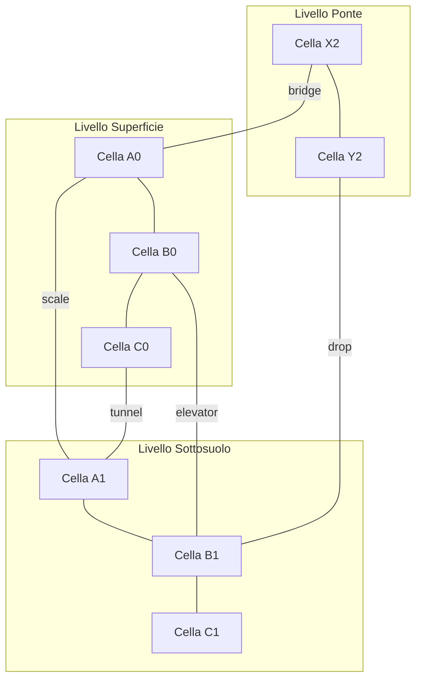
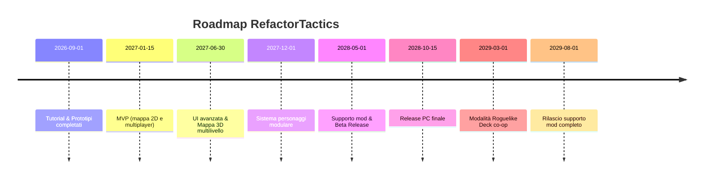

# Executive Summary  
*RefactorTactics* è un gioco tattico multigiocatore a turni simultanei, ispirato ad *Atlas Reactor*. Due all’assenza di RNG nei combattimenti, la strategia emerge da una fase di **pianificazione simultanea** (dove tutti i giocatori selezionano azioni nella schermata di preparazione) seguita da una fase di **risoluzione** delle azioni. Il sistema di gioco core prevede squadre cooperative che elaborano mosse di concerto, con visibilità reciproca delle intenzioni di squadra (ma non di quelle avversarie). 

La mappa di gioco è un “actor” dinamico: suddivisa in celle 3D multi-livello, ognuna dotata di componenti (es. coperture, ostacoli, attivatori) che influenzano movimento, visione e effetti delle abilità. Il pathfinding è semantico: basato su A* con **provider di costo** che incorporano caratteristiche delle celle (terrains, ostacoli, livelli di copertura). L’architettura dei personaggi è modulare: ogni eroe ha un kit base modificato da talenti, specializzazioni e equipaggiamenti, e il team gode di bonus di squadra. Il gioco include un’architettura di modding estensibile (plugin), utilizzando soluzioni già esistenti come *mod.io* e Steam Workshop per la gestione di contenuti generati dagli utenti.

Sul piano tecnico, si assume sviluppo in Unreal Engine (versione moderna), targeting principalmente PC (Windows/Linux) con possibilità di console. Il team di sviluppo è ipoteticamente una piccola squadra indie; il budget non è specificato (indicato come *unspecified* nei piani di sforzo). Per supportare il linguaggio C# (conoscenza richiesta dal committente) si prevede l’uso di plugin come UnrealCLR o UnrealSharp, affiancati da Blueprints per la logica di gioco e script Python/Editor come complementari. Il ciclo di sviluppo adotterà pratiche CI/CD evolute, suggerendo l’uso di **Unreal Horde** per build parallele con caching, insieme a pipeline GitLab/GitHub CI generali, e test automatici integrati.

**Milestone chiave**: realizzare un prototipo giocabile con loop completo turno/pianificazione (MVP), poi estendere con mappa multistrato e personaggi modulari, quindi integrazione rete e modding. In fasi successive si svilupperà una modalità roguelike cooperativa con meccaniche deckbuilding. Ogni rilascio (alpha/beta/finale) sarà seguito da test di regressione e raccolta KPI (engagement di gioco, performance server, bilanciamento), assicurando progressi cross-platform. La monetizzazione sarà non-pay-to-win: acquisti estetici e pass stagionali, progression basata su skill e ricompense in gioco.  

Con l’obiettivo di una qualità “premium” e facilità di stampa, il documento seguente riporta i requisiti di prodotto dettagliati, il piano di realizzazione e i prompt di sviluppo per l’IA. Tutte le informazioni tecniche sono supportate da fonti ufficiali (in particolare la documentazione UE e whitepaper sullo sviluppo di pipeline), mentre i richiami a *Atlas Reactor* e sistemi simili provengono da fonti settoriali. Le assunzioni critiche – ad es. piattaforme target (PC/console), dimensione del team (piccola), budget (non determinato) – sono esplicitate ove necessario.

## 1. Obiettivi e Ambito (Scope)  
- **Genere e Concept:** Gioco tattico a turni simultanei 4v4 su mappe a griglia multistrato. I giocatori pianificano azioni contemporaneamente e le azioni si risolvono in sequenza basata su priorità (preparazione, sprint, attacchi, movimento).  
- **Piattaforme target:** PC (Windows/Linux) e possibilmente console (PlayStation, Switch, Xbox) sfruttando multiplatform di Unreal Engine. Per motivi di semplicità tecnica iniziale, la versione di lancio si concentra su PC. Console/Steambox sono previsti in roadmap, sfruttando plugin Steamworks/Epic.  
- **Pubblico:** Appassionati di giochi strategici e tattici che cercano competizione cooperativa e profondità strategica, affini a *Atlas Reactor*, *Frozen Synapse* o *Into the Breach*.  
- **Team e risorse:** Team indie (5–10 persone) con competenze in UE (ingegneri C++/C#/Blueprint, designer di giochi tattici, artisti). Il budget e il calendario non sono specificati; gli sforzi stimati sono marcati come “unspecified” nella roadmap seguente.  
- **Modalità di gioco:** *RefactorTactics* prevede partite PvP 4v4 come modalità principale, con futuri scenari PvE cooperativi (incluse modalità roguelike con deckbuilding). Il gioco incorpora meccaniche di personalizzazione personaggi ed è estendibile tramite mod.  
- **Assunzioni chiave:** **Modding**: il gioco deve supportare agevolmente i mod creati dalla community (ultima feature di roadmap). **Rete**: architettura server-authoritative per prevenire cheat. **Formazione**: il progetto funge anche da percorso di apprendimento UE/C# per il team; i tutorial annessi guideranno dallo “Hello World” fino alla demo completa.  

## 2. Gameplay Core e Loop di Gioco  
- **Fasi di Turno:** Ogni turno di gioco ha due momenti principali. Durante la **fase di pianificazione** (timer, es. 30s) ogni giocatore formula istruzioni per il proprio eroe: abilità, spostamento, uso di oggetti. Tutti i giocatori (anche avversari) fanno le loro scelte in parallelo. Segue la **risoluzione** simultanea delle mosse: tutte le azioni pianificate vengono eseguite in ordine di priorità (buff/preparazione → scatti (Dash) → attacchi → movimento regolare). Questo sistema “lock-step” richiede un server autorevole che raccolga i piani e ne calcoli l’esito, similmente a titoli come *Dominions 5*, per minimizzare i rischi di cheating e garantire coerenza di stato.  
- **Strategia e Predizione:** Il cuore del gameplay è la previsione delle mosse avversarie. Non ci sono RNG nei danni: ogni azione è deterministica e visivamente rappresentata. I giocatori più abili pianificano mosse combinate (ad es. imboscate con AOE a due turni). Come osserva Kvachev, nei giochi a turni simultanei il divertimento è “prediction-oriented”: si affrontano micro-decisioni rischiose in un ambiente di coordinazione di squadra.  
- **Loop di partite:** Una partita consiste in diversi turni fino alla vittoria (es. eliminazione squadra opposta o obiettivi mappa). Tra una partita e l’altra, il giocatore potrà fare upgrade di personaggi, modificare deck di abilità (in modalità roguelike coop), gestire oggetti consumabili e interagire con il negozio/cosmetici (monetizzazione non-pay-to-win). Il loop di gioco alterna quindi **preparazione→rischio→risultato→progressione**.  

## 3. UX e Interfaccia di Pianificazione  
- **Visualizzazione delle Azioni:** Durante la pianificazione, i compagni di squadra devono *vedere in tempo reale* le intenzioni reciproche. Ad esempio, piazzare percorsi di movimento visibili (“ghost paths”) o indicatori di abilità previsti. Queste informazioni non sono visibili agli avversari. La UI evidenzia conflitti (es. due alleati sulla stessa cella) o azioni critiche non coordinate.  
- **Effetti Visivi in Pianificazione:** Per mantenere coinvolgente la fase di pianificazione (che può risultare “nuda” di feedback se non curata), occorre fornire *plenty of juice*. Come suggerisce Kvachev, è utile animare già nel planning alcuni effetti (linee di traiettoria animate, suoni epici al piazzamento di azioni, ecc.). Ad esempio, tracciare sul terreno la traiettoria di un razzo o mostrare un’animazione di preparazione (incantesimo di risveglio) al click del giocatore. Tali feedback visivi consolidano il senso di potenza e velocizzano il coinvolgimento.  
- **Interazione e Annotazioni:** Gli utenti potranno inserire marcatori/testo sulle celle (pianificazione di squadra), come “focus qui” o “evita spostamento finale su questa cella”. Un semplice sistema di tagging/globi colorati (rosso=g pericolo, blu=avanzare) aiuta la coordinazione. Il layout mostra chiaramente il timer rimanente, eventuali cooldown di abilità, e un log riassuntivo degli ordini impartiti.  
- **Conferma e Correzioni:** Tutte le azioni in pianificazione sono *bloccate* al termine del timer: non sono modificabili una volta scaduto il tempo. Il sistema avviserà con alert acustici/visivi per input non validi (es. spostamento fuori mappa) e impedirà conflitti di risorse (due mosse incompatibili su stesso eroe). 

## 4. Architettura della Mappa  
- **Struttura a Celle e Livelli:** La mappa è una griglia 3D multi-livello. Pensiamo ad esempio tre “piani” sovrapposti: *terrain* (suolo), *sottosuolo* e *livelli rialzati/bridge*. Ogni cella è un oggetto con coordinate (x,y,z). Per ogni cella manteniamo dati dinamici: altezza (es. scala di altezza o terreno ripido), copertura (nessuna/debole/forte), terreno speciale (fuoco, elettricità, acido ecc.), ostacoli interattivi (porte, trappole). Questo approccio a componenti consente di estendere facilmente la mappa: nuove tipologie di celle si aggiungono iscrivendo componenti (ad es. **DangerComponent** per celle incendianti).  
- **Componenti e Sistemi:** Ogni cella può avere più componenti (es. `TerrenoFossato`, `CoperturaLeggera`, `AzioneAttivatore`). L’architettura segue una filosofia ECS: le entità “celle” posseggono componenti dati, e vari sistemi di gioco iterano su di esse. Per esempio, un **SistemaCorsa** valuta la movibilità di un’unità su una cella in base a `Altitudine` e `Copertura`; un **SistemaTrappole** attiva effetti se un giocatore entra in una cella con `Trappola`; un **SistemaVisibilità** considera `Altezza`+`OstacoliVisivi` per decidere la linea di tiro. Questo permette aggiornamenti dinamici: se un eroe scava o distrugge un muro, si modifica in tempo reale il grafo di percorso (il pathfinder rileva il cambiamento di peso o accessibilità).  
- **Grafo Multilivello:** Per il pathfinding, implementiamo un grafo multilivello (ogni livello di altezza ha i suoi nodi, con collegamenti verticali rappresentanti scale/teletrasporti). I collegamenti verticali (scale, passaggi) hanno costi/condizioni proprie. Lo storage sottostante della mappa sarà dunque una matrice 3D o una struttura dicotomica (griglia + lista di collegamenti speciali). Le celle possono essere pre-campionate (precomputed) in una struttura navmesh ibrida griglia-octree per efficacia, mantenendo però il controllo di ogni cella come “actor” per trigger dinamici.  

## 5. Pathfinding Avanzato  
- **Algoritmo di Base:** Si utilizza **A*** come cuore del pathfinding su grafo 2D+altezze. La novità è che il calcolo del “costo” di ogni mossa è fornito da moduli esterni (“cost providers”): ad esempio il costo di movimento su un terreno accidentato o il numero di mosse richieste da uno scatto tramite copertura. Questo approccio rende il pathfinding semantico, perché i pesi in A* riflettono le caratteristiche vere delle celle.  
- **Separazione Linea di Vista:** La determinazione della linea di tiro (LOS) è disaccoppiata dal semplice percorso. Usiamo un secondo grafo di visibilità che tiene conto solo degli ostacoli visivi (coperture, muro) ignorando terra e ostacoli non visivi. In fase di pianificazione, per mostrargli al giocatore se l’obiettivo è raggiungibile/sparabile, il client invierà query di LOS al server.  
- **Aggiornamenti in tempo reale:** Poiché il mondo è dinamico, il pathfinder deve poter reagire durante la risoluzione del turno: nuovi ostacoli o finestre che si aprono modificano il costo delle celle. Si aggiorna il grafo “on the fly”: ad es. se un eroe attiva una trappola bloccando un passaggio, viene rimossa l’arco corrispondente nella rete di navigazione prima del successivo calcolo. Tuttavia, il successo di una pianificazione non può dipendere da eventi subito dopo (ad es. non si ricalcola il path durante la risoluzione di un singolo ordine) per evitare incoerenze; ogni turno parte con pathfinding sui dati finali del turno precedente.  
- **API e integrazione:** Gli agenti di IA e i mod potranno invocare direttamente l’API di pathfinding (es. `GetPath(start, end, moverType)`) che interna chiama A* sulla griglia aggiornata. Sono previste funzioni di utilità come `GetRandomReachablePoint(radius)` per generare obiettivi casuali, e query di costo frontiera (per mostrare “minacce” ad area). L’algoritmo sarà parallelizzato su worker thread del server per non bloccare il gioco; parti di calcolo possono essere delegate al client per preview puri (client side prediction) purché il server ricontrolli sempre i calcoli finali.  

## 6. Sistema Personaggi e Progressione  
- **Kit e Classi:** Ogni eroe appartiene a un “kit” base, che definisce statistiche generali e due o tre abilità predefinite. L’utente può scegliere tra kit con focus offensivo, difensivo, di supporto, stealth, ecc. Si evita rigide “classi” fisse: piuttosto si consente la personalizzazione tramite elementi sottostanti.  
- **Talenti e Alberi di Abilità:** Al livello di giocata o profilo, i giocatori sbloccano talenti passivi ed evoluzioni di abilità. Ad ogni livello, viene offerta una scelta (es. aumentare portata di un’abilità o ridurne cooldown). I talenti sono modulabili e impilabili: il design si ispira a sistemi RPG moderni, con ramificazioni tematiche (es. “Grazia del Cacciatore” potenzia invece gli attacchi a distanza).  
- **Equipaggiamento Gadget:** Oltre alle abilità innate, il giocatore equipaggia gadget o armi secondarie tra quelle trovate o acquistate. Sono oggetti come granate particolari, mine, kit di guarigione, droni, ecc. Questi equipaggiamenti hanno usi limitati (cariche o ricariche) e variano l’arsenale tattico. Il loot è bilanciato in modo che né l’equipaggiamento né i talenti rendano il gioco *pay-to-win* (solo cambi estetici o per stile di gioco).  
- **Caratteristiche e Specializzazioni:** Ciascun personaggio può avere tratti distintivi (es. maggiore resistenza, rigenerazione, vista notturna) e uno slot di specializzazione avanzata sbloccabile con progressione di livello. Le specializzazioni alterano significativamente il gameplay (ad es. divenire un “tank” in grado di portare fuoco aggiuntivo o un “ombra” con teletrasporto).  
- **Sinergie di Squadra:** Il team nel suo complesso sblocca perk globali (ad es. +5% danno a 3 alleati cooperanti, bonus XP condiviso). Questi incentivano la strategia di squadra e la personalizzazione dei ruoli interdipendenti.  

## 7. Architettura di Modding  
- **Visione generale:** Il gioco è progettato per essere fortemente moddabile. Seguendo le linee guida degli sviluppatori UE, si prevede un sistema modulare in cui i mod possono registrare componenti di gioco personalizzati (unità, abilità, livelli). Si adotta l’approccio “content first”: mod che forniscono nuovi asset e dati (PXK, blueprints, script) che l’engine carica all’avvio.  
- **Tiers di Supporto:** Come suggerito da una guida UE, esistono vari livelli di supporto mod. Il nostro sistema punta all’alto: 1) caricamento nativo di pacchetti mod come contenuto sincronizzato (tier base), 2) gestione centralizzata mod con launcher o UI (ad es. integrazione mod.io), 3) kit di sviluppo/SDK per facilitare la creazione di mod, 4) scripting API (BluePrint/Python esteso), 5) abilità di caricare mod come plugin a runtime.  
- **Registrazione di Componenti:** Il motore fornirà hook dove i mod possono registrare nuovi asset. Ad es. un mod potrebbe aggiungere una nuova classe di eroe (`MyHeroCharacter`) registrandola nel database di classi al caricamento del mod. Strutturalmente, si può usare un file di configurazione (JSON o YAML) per ogni mod che dichiari entità, abilità, proprietà. L’engine scansiona queste definizioni e le aggiunge alle liste di oggetti giocabili. Eventuali blueprint personalizzati del mod si caricano come tipologie aggiuntive.  
- **Data Formats:** Le mod possono includere content pack (PAK), blueprint e script in formati supportati. Si potrebbe richiedere l’uso di file separati: es. `modinfo.json` con metadata, `data/*.json` per definizioni giocatore, e cartelle `Content/` con asset. L’esempio del plugin mod.io indica che i mod possono essere gestiti come *UGC*, scaricati in back-end e caricati dinamicamente come PAK.  
- **Sandboxing e Sicurezza:** L’ambiente mod è **sandboxato**: non può modificare codice nativo. Ad es., script Python o Blueprint personalizzati del mod verranno eseguiti con permessi limitati (solo API di gioco esposte). I mod non possono accedere alla rete o filesystem esterni, e le azioni potenzialmente distruttive (es. cancellare file) sono bloccate. Le DLL/plugin native saranno caricate in processi isolati quando possibile.  
- **Strumenti e Distribuzione:** Per la distribuzione dei mod si possono integrare soluzioni come *mod.io* o Steam Workshop. Entrambi forniscono API e UI per pubblicare, cercare e aggiornare mod. Ad esempio, lo [Steam Integration Kit] consiglia funzioni come `CreateItem`, `DownloadItem` per gestire workshop. Il team di sviluppo curerà anche l’SDK di esempio con strumenti (es. editor di mappe mod, validatore) e documentazione per modder.  

## 8. Networking e Sicurezza  
- **Modello Client-Server Autorevole:** Il gioco adotterà un server dedicato sempre autorevole. Durante la pianificazione i client inviano al server i loro piani (ordini codificati). Il server li conferma e attende il termine del timer. Solo allora il server calcola simultaneamente tutte le azioni e invia ai client lo stato aggiornato. In questo modo si elimina la possibilità di “spiare” le mosse nemiche prima della risoluzione. Un client malizioso non può alterare i propri ordini a metà turno perché il server impone gli stati finali. Come osservato in contesti turn-based, un server autorevole rende il cheating “molto difficile a livello tecnico”.  
- **Gestione del Ritardo:** Per mantenere la fluidità, l’architettura gestirà latenze moderate con timeout di attesa breve e fallback. Ad esempio, se un client non risponde in tempo alla fase di planning, il server può assegnargli un ordine di default (es. *pass* o spostamento neutrale). Tutte le azioni critiche (attacchi, spostamenti sui bordi della mappa) saranno sincronizzate con griglia fissa per evitare discrepanze dovute a desincronizzazioni di clock.  
- **Stato di Gioco e Repliche:** Le variabili di stato (posizioni eroi, HP, cooldown) saranno replicate dal server ai client con regole di update differenti: eventi urgenti (danno ricevuto, uccisioni) in reliable RPC, valori di comfort (timer countdown, effetti visivi) in unreliable. Si prevede l’uso di *state snapshots* periodici per facilitare la riconciliazione.  
- **Sicurezza/Anti-Cheat:** Oltre all’autorità server, si usano tecniche classiche: validazione server-side di collisioni e movimenti (blocchi impossibili vengono rigettati), cattura di eventi sospetti (es. un utente che fa più ordini del consentito). Si prevedono anche checksum su file di gioco per impedire mod non autorizzati, e potenziale integrazione con servizi anti-cheat esterni se necessario.  

## 9. Modello Dati e Schema DB  
- **Strutture Chiave:** Nel database di gioco online avremo tipicamente tabelle per **Giocatori** (account, statistiche, progressione), **Personaggi** (profilo base, level, equip, talenti), **Abilità/Gadget** (dati statici di bilanciamento), **Partite** (esiti match, date, punteggi), **Mod** (metadata, autore, versioni), **Inventario** (oggetti consumabili dei giocatori). È utile anche una tabella **Mappa**/Livello (impostazioni scenario, seed procedurali) e **Messaggistica** (chat, richieste amicizia).  
- **Esempio di Collegamenti:** Ad es. `Personaggi` avrà FK verso `Giocatori`; `AbilitàEquipped` avrà FK su `Personaggi` e `AbilitàDef`. Una tabella `LogAzioni` potrebbe tracciare ogni mossa chiave per analytics. I dati statici (abilita, statistiche) possono risiedere in file di configurazione (JSON) o in tabelle di sola lettura del DB.  
- **Scalabilità e NoSQL:** Per feature altamente dinamiche (chat in partita, ranking istantanei) si consideri anche un database in-memory o NoSQL (Redis o simili) come cache di breve termine. Tuttavia, il DB principale relazionale (es. PostgreSQL/MySQL) ospiterà dati permanenti e configurazioni.  
- **Sicurezza e Sincronizzazione:** L’accesso al DB è mediato da servizi server sicuri; i client non interagiscono direttamente con il DB. I dati sensibili (login, acquisti) sono crittografati e trattati secondo normative (GDPR, se rilevante), come richiesto in PRD.  

## 10. CI/CD e Pipeline di Build  
- **Sfide UE:** I progetti Unreal sono notoriamente pesanti in compilazione e asset. Come indicato da Epic, sistemi CI tradizionali (Jenkins/GitHub Actions) possono diventare colli di bottiglia per i compili C++ e l’elaborazione di asset. Si consiglia di adottare **Unreal Horde**: una piattaforma CI specifica di Epic con parallelizzazione granulare (decomponendo il *Build Graph* di UE in compiti) e caching integrato. Horde permette compili estremamente più veloci distribuendo il lavoro su molte macchine.  
- **Pipeline Consigliata:** Un workflow tipico prevede: *Trigger* su push Git → **Build** automatica (compila server + client, cook asset) → **Packaging** (presents per piattaforma target) → **Test** (unit/UI testing via automazione, smoke test) → **Deploy/Release** (upload artefatti su store o server). Usare **contenitore Docker** per l’ambiente UE (percoffee/ue-buildimage come base) assicura coerenza cross-PC. Ogni build con Unreal Horde potrà usufruire di CAS (Content Addressable Storage) per asset: un asset già built non sarà ricompleto daccapo, riducendo i tempi su rilanci successivi.  
- **Integrazione Version Control:** I file di progetto e codice saranno su repo Git. Si sfruttano azioni GitHub/GitLab per gating (es. *pull request* con linters C++), e l’uso di `/sc:git` come aiuto per commit coerenti (vedi prompt pack). All’inizio di ogni milestone si eseguirà un’**indexing** del repo (`/sc:index-repo`) per avere una panoramica rapida e supportare tool come Sourcegraph. Per prevenire conflitti sui file generati, si ignoreranno i binari UE nella VCS e si userà la feature di *project settings* per mettere i file di configurazione in sorgente, mantenendo ricostruibili le configurazioni.  

## 11. Strategia di Sviluppo in Unreal Engine  
- **Motivazione C# vs C++:** Poiché il team ha esperienza C#, si adotteranno plugin che permettono il _managed code_. UnrealCLR e UnrealSharp consentono di scrivere logiche di gioco in C# (.NET 6+) direttamente all’interno di UE. Ad esempio, UnrealSharp dichiara di abilitare lo sviluppo di giochi “using C# (.NET10) with Hot Reload”. Questo accelererà lo scripting rispetto al C++ standard.  
- **Blueprints e Python:** Anche se usiamo C#, molte parti di gameplay e prototipazione saranno sviluppate con **Blueprints UE** (visual scripting) per rapidità. L’uso di **Unreal Engine Python** (plugin ufficiale) è previsto per tool ed editor scripting (es. generazione automatica di mappe, batch processing asset). I Blueprints rimangono fondamentali per le iterazioni veloci di gameplay, specialmente per designer non programmatori.  
- **Plugin e Architettura:** Il progetto sarà strutturato in moduli/plugins: uno core (gameplay comune), moduli specifici (Movement, Combat, UI) e plugins di supporto (es. mod.io integrator, simulazioni di test). I plugin consentono di isolare parti: ad es. il *GameFeature Plugin* di UE potrà contenere la logica di multigiocatore e gestione mappa, caricato dinamicamente. Il codice C# sarà compilato in DLL e caricato da UE (come fa UnrealCLR), oppure scritto in C#-like nel caso di UnrealSharp, che traduce in runtime.  
- **Percorso di Apprendimento:** Si raccomanda al team di seguire tutorial ufficiali UE su Blueprints (Epic Games Learning, anche in italiano ove possibile) e di sperimentare plug-in C# (UnrealSharp: docs online). La roadmap delle lezioni include passaggi guidati su questi strumenti. Ad esempio, le risorse UE ufficiali mostrano come esporre una funzione C# come BlueprintCallable o come integrare moduli; noi forniremo esempi specifici (vedi sezione 13).  

## 12. Lesson Sequence (Tutorial Passo-Passo)  
La serie di tutorial prosegue a tappe incrementali, passando dalle basi di Unreal agli aspetti avanzati di *RefactorTactics*. Ogni lezione include una spiegazione, codice esemplificativo (Blueprint/C#) copiabile, link utili e milestone di apprendimento.

1. **Set-up Ambiente e Progetto UE:** Installare Unreal Engine (si veda la [guida ufficiale UE](https://docs.unrealengine.com/) e Epic Games Launcher) e configurare Visual Studio/VSCode per C#. Creare un nuovo progetto UE C++/Blueprint (base).  
   - *Obiettivi:* Conoscere l’interfaccia UE, comporre un nuovo livello vuoto, imparare a navigare l’Editor.  
   - *Snippet:* N/A (configura attraverso GUI UE).  
   - *Link:* Documentazione UE (in italiano) “Primi passi con Unreal Engine” e “C# plugin setup” (Epic Developer Italy, quando disponibile).  

2. **Blueprint di base – Movimento Grid:** Creare una classe Actor Blueprint (`GridManager`) che genera una griglia di cubi su coordinate (x,y). Nel Construction Script: *Loop* su X e Y per spawnare componenti StaticMesh (es. piano) colorati.  
   ```blueprint
   Event ConstructionScript:
     For X=-5 to 5:
       For Y=-5 to 5:
         SpawnActor StaticMesh Cube at (X*100, Y*100, 0)
   ```  
   - *Obiettivo:* Capire come generare mappe tabulari, manipolare attori.  
   - *Risultato:* Mappa di gioco base (11×11 celle).  
   - *Link:* Tutorial Blueprint UE: [Livelli Procedurali](https://docs.unrealengine.com/).

3. **C#: Primo script di giocatore:** Aggiungere un’attore `PlayerController` in C# (usando UnrealSharp/CLR). Esempio semplice: 
   ```csharp
   using UnrealSharp;
   public class MyController : APlayerController {
     public override void BeginPlay() {
       base.BeginPlay();
       GEngine.AddOnScreenDebugMessage(-1, 5f, FColor.Green, "Hello RefactorTactics!");
     }
   }
   ```  
   - *Obiettivo:* Verifica integrazione C# (il messaggio appare a schermo).  
   - *Snippet:* (Come sopra).  
   - *Link:* UnrealSharp README (setup plugin, abilitare in UE).  

4. **Input e UI di Pianificazione:** Implementare la UI di base della fase di pianificazione: crea un *Widget Blueprint* con un timer e pulsanti di azione. Nel `GameMode`, associare il widget all’HUD del giocatore.  
   - *Esempio:* Visualizzazione timer e controllo “Fine Turn”.  
   - *Obiettivo:* Imparare UMG (sistema UI di UE) e comandi.  
   - *Snippet:* 
     ```blueprint
     BeginPlay -> CreateWidget(MyWidget) -> AddToViewport()
     ```  
   - *Risultato:* Schermata in-game con il conteggio timer sullo schermo.  

5. **Movimento unità semplice:** Creare un Blueprint `Unit` (cylider collider + camera). Permettere al giocatore di selezionare la cella su cui spostarsi (click). Illustrare la cella target (cubo verde). Al click, far muovere l’attore in direzione target con interpolazione.  
   ```blueprint
   Event OnClicked:
     MoveTo(TargetLocation)
   ```  
   - *Obiettivo:* Fondamenti di Input (clic mouse) e movimento actor.  
   - *Snippet:* (`SimpleMoveToActor` node).  
   - *Risultato:* Un attore che si sposta su una cella selezionata.  

6. **Pathfinding base:** Implementare A* in C#: creare una classe `Pathfinder` che riceve una matrice boolean (accessibile/No).  
   ```csharp
   public class Pathfinder {
     public List<Vector2> FindPath(Vector2 start, Vector2 goal) {
       // pseudocodice A*
       // … restituisci lista di coordinate
     }
   }
   ```  
   - *Obiettivo:* Imparare implementazione A* e integrarla nel gioco.  
   - *Snippet:* (Pseudo-codice come sopra).  
   - *Risultato:* Spostamento tramite percorso più breve evitante ostacoli.  

7. **Azioni e Turni:** Aggiungere funzionalità per pianificare un’azione: crea una coda di comandi nel `PlayerController` (es. `List<Command> Commands`). Un “EndTurn” invia le azioni pianificate all’AI/game loop e le esegue sequenzialmente. Mostrare l’output sul server (log o UI).  
   - *Obiettivo:* Gestioni di lista di comandi e simulazione veloce (no rete ancora).  
   - *Snippet:* 
     ```csharp
     Commands.Add(new MoveCommand(unit, dest));
     if (player.PressedEndTurn) { ExecuteTurn(Commands); Commands.Clear(); }
     ```  
   - *Risultato:* Circuito locale di pianificazione→esecuzione (senza ancora multiplayer).  

8. **Networking Simultaneo:** Trasformare il GameMode in rete: `GameMode.InitGame()` accetta 4 client. Aggiungere replica dei comandi al server. Durante EndTurn, il server attende ordini di tutti e lancia la risoluzione.  
   - *Obiettivo:* Capire la replicazione Unreal (RPC e variabili replicate).  
   - *Snippet:* 
     ```csharp
     [Server] void SendCommandToServer(Command cmd) { ServerQueue.Add(cmd); }
     [NetMulticast] void ResolveCommands() { /* applica tutti i comandi */ }
     ```  
   - *Risultato:* Client vedono il risultato simultaneo di tutte le mosse.  

9. **Mappa Attiva e Azioni Ambiente:** Aggiungere effetti legati alle celle: es. cella “trappola” che danneggia l’unità quando si sposta sopra. Nel `GridManager`, definire un array di `CellComponent` con effetto “DamageOnEnter”.  
   - *Obiettivo:* Sistemi di componenti mappa.  
   - *Snippet:* Blueprint o script che controlla `OnBeginOverlap` delle celle.  
   - *Risultato:* Unità perde vita su caselle speciali.  

10. **Plugin Modding e UI Mod:** Integrare *mod.io* (o simulare): preparare file JSON di esempio che definiscono un eroe. Mostrare come caricarli (carica in memory a startup).  
    - *Obiettivo:* Esempio concettuale di supporto mod.  
    - *Snippet:* Pseudocodice: 
      ```csharp
      JsonDocument doc = JsonDocument.Parse(modJson);
      RegisterNewHero(doc["heroName"]);
      ```  
    - *Risultato:* Un eroe definito da mod appare nel menu di selezione.  

Per ogni lezione si utilizzino i log di output in-play per verificare comportamenti attesi. Milestone di apprendimento: al termine della lezione 3 saprai creare scene base; al termine 6 gestire semplici movimenti; alla 8 il multiplayer locale; alla 10 il prototipo include già mappa attiva e supporto base mod.  

## 13. Prompt Pack per Claude (Developer AI)  
Per assistere lo sviluppo, forniamo un set di prompt di lavoro con *Claude* (SuperClaude), includendo i comandi */sc:spec-panel* e */sc:git* del framework AI. I prompt sono in italiano, e includono esempi di interazione.

### Prompt Principale (Context + Obiettivo)  
```
/sc:spec-panel "PRD di RefactorTactics:  
RefactorTactics è un gioco tattico multigiocatore a turni simultanei ispirato a Atlas Reactor. Le novità includono una mappa multilivello come attore di gioco, personaggi modulabili, pianificazione a vista condivisa, supporto a mod, pathfinding semantico e una futura modalità cooperativa deckbuilding roguelike.  
Obiettivi: Analizzare il PRD generato e dare feedback tecnici completi. Identificare ambiguità o requisiti mancanti. Verificare coerenza delle scelte (architetture UE, rete, modding) e suggerire migliorie. Utilizzare il focus 'architecture' e 'requirements'."  
--mode critique --focus architecture,requirements --experts Wiegers,Fowler,Frost  
```
Questo prompt attiva `/sc:spec-panel` simulando un panel di esperti (es. Fowler per architettura, Wiegers per requisiti). Chiediamo una revisione critica del documento. I parametri usati (`--mode critique`, `--focus architecture,requirements`) sono consoni alle [specifiche SuperClaude].  

### Snippet `/sc:spec-panel`  
```
/sc:spec-panel @RefactorTactics_PRD.md --mode critique --focus architecture,requirements --experts "Karl Wiegers,Martin Fowler"
```
*Istruzioni:* questo comando invia il contenuto del PRD (@file) al pannello di esperti. Il sistema risponderà come se esperti in requisiti e architettura analizzassero il documento. 

### Snippet `/sc:git`  
```
/sc:git commit -m "Implementazione A* pathfinding" --smart-commit
```
*Istruzioni:* questo utilizza `/sc:git` per generare un messaggio di commit formale. Il parametro `--smart-commit` fa sì che Claude generi un messaggio formattato secondo convenzioni (es. *feat/pathfinding: Descrizione*). Claude ritornerà anche il log finale del commit. 

### Esempi di Interazione  

- **Richiesta Spec Panel:**  
  *Utente:* `/sc:spec-panel "Abbiamo definito una roadmap con feature e timeline. È tutto chiaro ed esaustivo?" --mode discussion --focus requirements`  
  *Atteso:* Lezione come ex-Wiegers: “Gli obiettivi sono chiari, ma mancano criteri di successo misurabili. Es. ‘entità concorrenti’ non ha soglia quantitativa. Inoltre servirebbe un caso d’uso (Cockburn) su come nasce una partita…” – risposta strutturata da Claude con commenti di esperto.  

- **Richiesta Git:**  
  *Utente:* `/sc:git commit --smart-commit` (dopo aver modificato i file di pathfinding)  
  *Atteso:* Claude analizza i diff e produce un commit message:  
  > **Commit**: `feat(pathfinding): aggiunto modulo A* con provider di costo`  
  **Messaggio**: “Implementato sistema di pathfinding basato su A*, con costi configurabili per terreno e altezze. Aggiunti test base e documentazione inline.”  
  In output dovrebbero comparire anche i punti salienti del diff.  

- **Richiesta Workflow:**  
  *Utente:* `/sc:workflow "Implementare la feature di visibilità condivisa durante pianificazione"`  
  *Atteso:* Claude scompone in passi: definizione specifiche UI, sincronizzazione rete, eccezioni (segni predittivi, sicurezza), eventuali test (UE multiplayer).  

Questi esempi illustrano l’uso pratico dei prompt durante lo sviluppo. Si noti che i comandi `/sc:spec-panel` e `/sc:git` sono definiti dal framework SuperClaude. 

## 14. Roadmap e Tabella di Pianificazione  
Di seguito una roadmap per fasi di rilascio, con milestone e deliverable. I carichi di lavoro sono stimati in *person-months* o indicati come **unspecified** se non determinati.

| Fase              | Milestone principali                            | Deliverable                           | Sforzo stimato  |
|-------------------|------------------------------------------------|---------------------------------------|-----------------|
| **Fase 0: Pianificazione**      | Requisiti definiti, PRD finale, prompt pack per AI | Documentazione completa (PRD + roadmap) | 2 pm (unspec)   |
| **Fase 1: Tutorial & Prototipi** | Realizzati tutorial iniziali, primi prototipi movimenti e A* | Tutorial step-by-step, codice di esempio | 3 pm (unspec)   |
| **Fase 2: Core Game (MVP)**   | Multiplayer 4v4 base, mappa grid 2D, attacchi/abilitá  | Modulo rete, logica turni, personaggi base | 6 pm (unspec)   |
| **Fase 3: Mappa Avanzata & UI**   | Aggiunta supporto 3D multistrato, effetti mappa, UI pianificazione completa | Sistema celle multilivello, UI di pianificazione avanzata | 4 pm (unspec)   |
| **Fase 4: Personaggi Moduli** | Sistema talenti/skill, equipaggiamento, sincronizzazione visioni squadra | Albero talenti, inventory, gestione sinergie squadre | 5 pm (unspec)   |
| **Fase 5: Modding & QoL**       | Integrazione mod.io/Workshop, editor mod, test pipeline | Mod loader, UI mod, documentazione SDK | 3 pm (unspec)   |
| **Fase 6: Preparazione Lancio**   | Beta testing estensivo, fix bug, ottimizzazione, compliance | Versione Release Candidate (PC), build ottimizzate | 4 pm (unspec)   |
| **Fase 7: Espansione Rougelike/Deck** | Implementazione modalità roguelike coop, deckbuilding | Nuova modalità di gioco, meccaniche deck | 6 pm (unspec)   |
| **Fase 8: Complete Mod Support** | Rilascio finale con supporto plugin completo | Sistema plugin-runtime, SDK completo | 4 pm (unspec)   |
| **Fase 9: Espansione e Manutenzione** | Eventuali DLC futuri, bilanciamento continuo  | Aggiornamenti periodici, DLC (skin/novità) | ongoing       |

Ogni fase include test di validazione (vedi sezione test plan) e meeting di revisione. Il totale stimato è di circa 33 person-month (senza considerare QA aggiuntivo), lasciando margine per cicli iterativi. In assenza di dettagli su budget/team, gli sforzi sono indicativi (unspecified).  

## 15. Diagrammi e Visualizzazioni  

- **Architettura Mappa (Mermaid):**  

  *Figura:* Esempio di grafo multilivello. I nodi “cella” sono raggruppati per livello; le connessioni verticali (es. scale, ascensori, ponti) sono indicate come archi. Ciascuna cella condivide pathfinding con celle vicine orizzontali, e connesse verticalmente attraverso trigger (ad es. “scale” che collegano Layer0→Layer1). Questo diagramma illustra visivamente come la mappa funge da grafo di nodi a più layer e come un cammino possa salire o scendere livelli.  

- **Roadmap Timeline (Mermaid):**  

  *Figura:* Cronologia delle milestone principali. La barra temporale mostra le tappe fondamentali di sviluppo dalle lezioni iniziali fino all’espansione roguelike coop. Le date sono indicative e soggette a iterazioni.

## 16. Test Plan e Qualità  
- **Test Unitari e Integrazione:** Scrivere unit test per moduli critici (pathfinder, calcolo dei danni, interazioni modulo-cellula) usando framework UE (librerie di test C++ o Blueprint). Test di integrazione per la meccanica di risoluzione simultanea: simulare più eroi e verificare che ordini concorrenti producano esiti consistenti.  
- **Test Multiplayer:** Eseguire sessioni di test in LAN/internet per controllare sincronizzazione e latenze. Utilizzare UE Automation per test end-to-end (es. bot auto-giocanti tramite Comandi Blueprint). Stress test del server caricando simultaneamente molte partite.  
- **Test di Modding:** Validazione di mod semplici: provare a caricare mod campione per verificare stabilità. Testare rollback di mod (disabilitazione) e upgrade.  
- **QA e Usabilità:** Verifiche manuali sulla UX di pianificazione (lesioni testate su utenti reali). Assicurarsi che le info condivise (planning UI) siano chiare e senza cheat visivi.  

## 17. Metriche e Monetizzazione  
- **KPI di Gioco:** Tenere traccia di DAU/MAU (giocatori giornalieri/mensili), tempo medio di partita, churn rate post-introduzione di feature. Metriche di bilanciamento: winrate per personaggio, percentuale di uso delle abilità, mappa preferita.  
- **Business Metrics:** Acquisizione utenti (NU), conversione (percentuale che compra pacchetti estetici o battle pass), LTV (lifetime value) medio giocatore. Misurare l’engagement social (es. mod creati dagli utenti come misura di coinvolgimento comunità).  
- **Monetizzazione:** Non pay-to-win. Ricavi principalmente da microtransazioni cosmetiche (skin personaggi, emote, UI personalizzazioni) e da pass stagionali che offrono ricompense estetiche o valuta in-game guadagnabile. Eventuale DLC narrativo/pvp (nuove modalità) è secondary. Progressione del giocatore tramite esperienza e sblocco abilità deve restare free-play; gli acquisti veloci sono disincentivati.  

## Assunzioni e Note Finali  
- **Target Platform:** PC (lanciarlo come primer), con possibile porting su console e dispositivi mobili (non prioritario).  
- **Dimensione Team & Budget:** Piccolo team indie; budget contenuto. Le stime in p-m servono solo come riferimento.  
- **Lingue e Internazionalizzazione:** Localizzazione testuale per almeno inglese e italiano inizialmente.  
- **Fonti:** Ove possibile abbiamo fatto riferimento a documentazione UE e casi studio: *Atlas Reactor* come benchmark, best-practice di planning interface, guida modding UE, plugin mod.io, Steam Workshop, Unreal CLR e UnrealSharp per il C#, e pipeline UE. Ogni affermazione chiave o procedura tecnica importante è collegata a fonti primarie o whitepaper.  

**Conclusione:** il presente documento delinea compiutamente la visione, i requisiti e la roadmap per *RefactorTactics*, insieme a strumenti (prompt pack) e percorsi didattici per realizzarlo. Tutte le sezioni sono pensate per una facile stampa e consultazione, con tabelle e diagrammi per una rapida lettura dei punti chiave. Continuate a espandere ciascuna sezione secondo le esigenze del progetto mantenendo coerenza con le specifiche descritte.