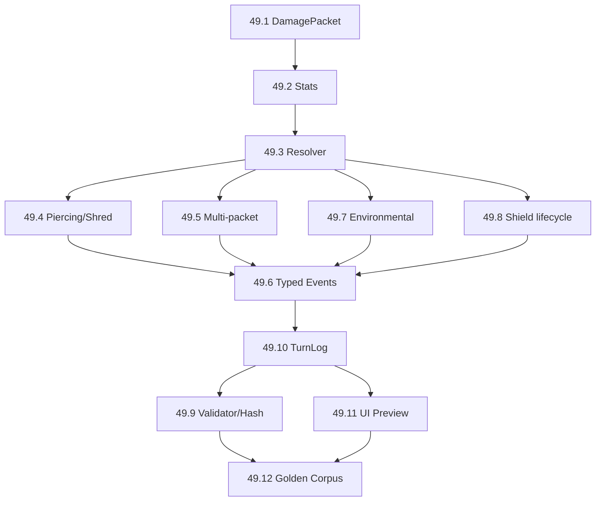

# PRD v1.0 — Coperture, Hex Grid e Damage Model

## Executive summary

Ho completato il PRD in italiano e l’handoff tecnico per l’implementazione, partendo da un audit del `main` e delle issue GitHub esistenti prima di proporre nuovo lavoro.

La conclusione architetturale centrale è questa:

```text
HEX / TOPOLOGY
    ↓
Cover + Facing
    ↓
Active Defense
    ↓
DamagePacket
    ↓
Armor + DamageResistance
    ↓
TemporaryShield
    ↓
Shield
    ↓
Health
    ↓
Typed Events
    ↓
TurnLog
```

Il documento non rifonda hex o cover: E2 è ancora aperta, ma il repository ha già completato la migrazione del substrato a hex e i checkpoint di codice principali; ciò che resta lì è soprattutto il gate/playtest umano. fileciteturn14file0L3-L7 La vecchia epic E9 per coperture e strutture è invece già chiusa, quindi il PRD tratta la cover esistente come una dipendenza, non come un nuovo sistema. fileciteturn15file0L3-L7

La precedente domanda sul fatto che Overwatch/Predictive ignorassero la cover è anch’essa chiusa: #888 è `CLOSED`. fileciteturn4file0L3-L8 La regola corrente, documentata da #1392, è che dal 25 agosto 2026 i colpi al decision boundary rispettano **cover e facing come un tiro normale**; #1392 resta aperta perché manca parte della spiegazione nella traccia/UI, non perché la regola sia ancora da scegliere. fileciteturn5file0L3-L7

## Decisioni consolidate nel PRD

Il PRD assume come normative tutte le decisioni prese in questa conversazione:

| Dominio | Regola congelata |
|---|---|
| **Armor** | signed; può essere negativa |
| Applicabilità Armor | solo `DamageSource=Direct` |
| **Shield** | stat/risorsa, non azione |
| Range Shield | `0..MaxShield` |
| **MaxShield** | sì |
| Shield negativo | mai |
| Overshield | no nella baseline |
| TemporaryShield | rispetta MaxShield, viene consumato prima, il residuo scade |
| Shield regeneration | nessuna rigenerazione automatica |
| Status/control | Shield assorbe il danno ma non li cancella |
| **Resistance** | signed per `DamageType`; negativa = weakness |
| DamageType iniziali | `Kinetic`, `Fire`, `Electric` |
| **DamagePacket** | esattamente un DamageType |
| Mixed damage | più packet |
| Multi-hit | mitigazione per packet logico, non per projectile visuale |
| **Source** | almeno `Direct` / `Environmental` |
| Environmental | niente Armor, Resistance sì, Shield sì |
| **Shape** | `Single`, `Line`, `Cone`, `Area`; non decide Armor |
| Armor + Resistance | un unico passaggio matematico |
| Zero dopo active defense | non può essere riattivato da Armor/Resistance negativa |
| **Piercing** | ignora solo Armor positiva |
| **Shred** | modifica Armor e può portarla negativa |
| DoT | legge la Resistance quando il packet risolve |
| Eventi | `Hit`, `ShieldDamage`, `HealthDamage` distinti |
| Affinity/Weakness | identità semantica, non generazione automatica delle Resistance |
| Healing | cura HP, non Shield |
| UI/bot | stessa query pura del resolver |
| Networking | apply competitivo server-authoritative |
| GAS | lifecycle/presentation, non autorità del Damage Resolver |

Il documento formalizza inoltre la separazione:

```text
DamageSource → decide l'applicabilità di Armor
DamageType   → decide quale DamageResistance leggere
Shape        → decide geometria/targeting
```

Perciò:

```text
Fireball
Direct + Fire + Area
→ Cover
→ Active Defense
→ Armor + FireResistance
→ Shield
→ HP
```

mentre:

```text
Burning
Environmental + Fire
→ no Armor
→ FireResistance
→ Shield
→ HP
```

### Il problema `Action.Shield`

L’audit conferma che #1403 è ancora aperta e che nel catalogo corrente esiste ancora `Action.Shield`, irraggiungibile come `Cleanse` e `Purge`; la stessa issue documenta inoltre che materiale canonico precedente la presentava come capacità consegnata. fileciteturn3file0L3-L7

Il PRD prescrive quindi una **migrazione**, non l’assegnazione dell’azione a un eroe:

```text
Action.Shield       → legacy da ritirare
Shield              → stat
MaxShield           → stat
TemporaryShield     → quota temporanea della stat Shield

skill specifica
    ↓
GrantShield / RestoreShield
```

Il codice corrente parte già da una base utile: `ARTUnit` possiede `Health`, `MaxHealth`, `Shield`, `Affinity` e `Weakness`, mentre il nuovo modello aggiunge esplicitamente Armor, MaxShield e DamageResistance. fileciteturn11file0L1-L2

### Damage Resistance contro Control Resistance

Ho reso esplicito un conflitto di nomenclatura importante. #440 è aperta e usa già il termine “Resistance”, ma per un'altra meccanica: degradazione del **control/status**, ad esempio `Root → Slow`, con `Full / Degraded / Rejected`; la stessa issue stabilisce anche che danno e status debbano essere risolti separatamente. fileciteturn7file0L3-L7

Il PRD propone quindi termini non ambigui:

```text
DamageResistance
→ intero signed per DamageType
→ modifica il danno

ControlResistance / StatusResistance
→ sistema E36
→ degrada un effetto di controllo
```

Non devono condividere implicitamente formula, enum o pipeline solo perché entrambe si chiamavano “Resistance”.

## Audit delle dipendenze e della migrazione

Un altro risultato importante della ricerca è #1491, aperta oggi, 27 agosto 2026: `Action.Interact` produce attualmente un colpo da zero con Shape `Single` e può quindi consumare/attivare una reazione da hit, arrivando persino a provocare un counter da 10 danni. fileciteturn20file0L3-L7 L'issue individua la causa nell'accoppiamento implicito tra `Single` e “conta come colpo”, non nella quantità di danno. fileciteturn20file0L4-L6

E49 usa questo caso come regression test e vieta la deduzione:

```text
Shape == Single
        ≠
CountsAsAttack
        ≠
ProducesDamagePacket
        ≠
Hit
```

Il packet deve dichiarare la semantica, per esempio con `bCountsAsHit`, oppure la produzione stessa di packet deve far parte del contratto dell'azione.

Anche il TurnLog ha un precedente utile: #1430, ora chiusa, aveva scoperto che `RearHitBypassedCover` aveva due produttori che usavano `Amount` con significati completamente diversi, una volta come direzione e una volta come punti di riduzione. fileciteturn19file0L3-L7 Questo è il motivo per cui il PRD richiede payload tipizzati/univoci per il Damage TurnLog invece di un generico `Amount` reinterpretato dai consumatori.

Sul lato roadmap, non vengono duplicate le epic già esistenti. E40 è aperta e stabilisce già che la resolution sia server-authoritative; la sua CP 40.5/#783 fa girare il resolver sul server e fa ricevere al client il TurnLog risolto. fileciteturn18file0L3-L7 E41 è anch'essa aperta e formalizza già il confine `Resolver decide → GAS applica/presenta`, vietando che montage o AbilityTask decidano un esito competitivo. fileciteturn21file0L3-L7

Questa scelta è anche prudente rispetto alle API Unreal: l’`AbilitySystemComponent` espone gli Attributes e gli effetti GAS, ma la stessa documentazione Epic avverte che alcuni valori letti lato client possono non riflettere gli effetti predetti in modo completo; nel contesto di RefactorTactics questo rafforza la scelta di mantenere il resolver/snapshot canonico come authority competitiva anziché trasformare GAS nella sorgente di verità. citeturn0search0

Per la validation, Unreal 5.8 offre un framework Data Validation configurabile a livello di progetto e un `EditorValidatorSubsystem` capace di validare changelist/asset anche attraverso commandlet; il PRD sfrutta quindi quella infrastruttura per il gate dei DamageType e delle statistiche, anziché progettare un validator editor parallelo. citeturn0search3turn0search6

Infine, E45 è aperta e dice esplicitamente che **v1.0 non aggiunge feature**: è il production gate su deployment, replay, performance, validation, smoke packaged e rollback. fileciteturn22file0L3-L7 Il Damage Model viene quindi consegnato in anticipo e soltanto certificato alla 1.0.

## Roadmap e backlog prodotti

La nuova epic è strutturata come:

```text
E49 · Damage Model, Armor, Shield e Damage Resistance

49.1  DamagePacket / Source / DamageType / Shape
49.2  Defensive Stats
49.3  Canonical Damage Resolver
49.4  Piercing / Shred
49.5  Multi-packet
49.6  Hit / ShieldDamage / HealthDamage
49.7  Environmental Damage
49.8  MaxShield / TemporaryShield
49.9  Validator / Hash / Versioning
49.10 TurnLog
49.11 UI Preview
49.12 Golden Corpus / Determinism / Replay
```

Con ordine di dipendenza:



La roadmap complessiva conserva quella già presente nel repository:

```text
v0.1
  → correggere debito Action.Shield / semantica

v0.2
  → E49 Damage Model

v0.3
  → Information / visibility policy

v0.4
  → Operations + stress/performance

v0.5
  → E40 server authority

v0.6
  → E41 GAS bridge

v0.7
  → E42 dedicated

v0.8
  → E43 balance/batch

v0.9
  → E44 feature freeze

v1.0
  → E45 production certification
```

La roadmap interna conferma questa sequenza v0.5→v1.0 e distingue esplicitamente Online Foundation, Ability Runtime, Competitive Alpha, Balance, Release Candidate e Launch; E45 resta il gate finale, non un nuovo contenitore di feature. fileciteturn17file0L1-L2

Il PRD contiene inoltre le due tabelle di alternative richieste. Per MaxShield la decisione baseline è già congelata sul **cap globale**, anche per TemporaryShield. Per Armor negativa la meccanica signed è congelata, mentre il numero minimo rimane volutamente balance: la raccomandazione è un `Rules.MinArmor` data-driven e hashato, eventualmente impostato molto basso durante il prototipo, evitando un `-10` hardcoded.

## File pronti per GitHub e implementazione

Sono stati generati quattro artefatti.

> ⚠️ **I link erano `sandbox:/mnt/data/…`**, cioè puntatori alla sandbox della sessione che ha
> prodotto questo report: sono effimeri per costruzione — morti quando quella sessione è finita, non
> rotti per errore. Nessuno dei quattro file è mai entrato nel repository. Restano i nomi, per
> riconoscerli se ricompaiono, e lo stato di ciascuno verificato il 2026-08-28.

**PRD Markdown completo**, con executive summary, scope, requisiti funzionali/non funzionali, data model/API, Mermaid ER e pipeline, pseudocodice, due esempi TurnLog, payload JSON preview, migration plan, test plan, DoD, rischi, roadmap e template issue:

`PRD_E49_Damage_Model_Hex_Cover_v1.0.md` — ✅ **il contenuto è stato recepito**: riassunto e verificato
in `docs/research/prd/prd-damage-model-armor-shield.md` (2026-08-27), che ne dichiara provenienza e
livello — PRD di ricerca, **non** fonte normativa.

**Backlog E49 machine-readable**, contenente l'epic e le dodici issue con `title`, `body`, `labels` ed `epic`, pronto come input per automazione/Claude/GitHub tooling:

`E49_issues_proposte.json` — ⛔ non presente nel repository.

**PR template dedicato**, con checklist delle decisioni canoniche, migration/versioning, TurnLog/replay, mutation proof, networking, GAS, bot e performance:

`PULL_REQUEST_TEMPLATE_E49.md` — ⛔ non presente nel repository, che ha solo
`.github/ISSUE_TEMPLATE/` e nessun template di PR.

**Bundle unico** con tutti e tre gli artefatti:

`E49_PRD_handoff_bundle.zip` — ⛔ non presente nel repository: era lo zip dei tre file qui sopra.

Il materiale è deliberatamente impostato affinché l'implementatore non debba reinterpretare le decisioni di design: la parte ancora aperta al balance, in particolare il valore di `MinArmor`, è marcata come tale; le invarianti già decise sono invece espresse come requisiti e acceptance criteria, così una PR che le viola deve risultare esplicitamente non conforme anziché introdurre una nuova regola per accidente.