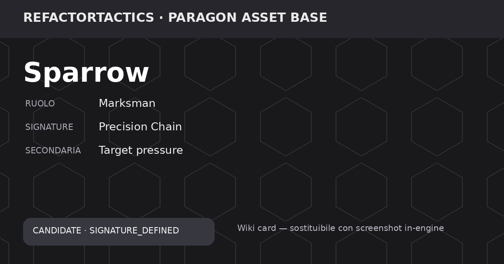

# Sparrow



> 🧩 **Stato RefactorTactics:** `CANDIDATE / SIGNATURE_DEFINED`  
> **Release:** `UNASSIGNED`  
> **Roster ufficiale:** `NO`  
> **Asset base:** Paragon — Sparrow  
> **RT Character ID:** `TBD`

## Panoramica

Nel Character Master Matrix, **Sparrow** è uno slot asset Paragon candidato con macro ruolo **Marksman**. La Signature definita è **Precision Chain**, affiancata da **Target pressure**. Il design è legato ai framework **Resource, Mark** e richiede soprattutto **Attack history, LOS, range, target state**. Il kit completo, le statistiche competitive, il CharacterId e la release non sono ancora definiti.

Questa pagina descrive **il concept RefactorTactics**, non il kit originale del MOBA Paragon. L'asset Paragon è la base visiva/animativa; abilità, regole, numeri e identità finale di RefactorTactics devono restare originali e data-driven.

## Scheda dati

| Campo | Valore |
| --- | --- |
| Asset key | `ASSET_SPARROW` |
| Asset base | Sparrow |
| Macro ruolo RT | Marksman |
| Signature primaria | **Precision Chain** |
| Signature secondaria | Target pressure |
| Framework principali | Resource, Mark |
| Complessità tecnica | 3/5 |
| Dipendenze tecniche | Attack history, LOS, range, target state |
| Design status | `SIGNATURE_DEFINED` |
| ReleaseVersion | `UNASSIGNED` |
| RT Character ID | `TBD` |
| Player question | TBD — da definire quando il personaggio entra in design attivo. |
| Provenienza asset | Final Paragon asset release (2018) |

## Descrizione della Signature

**Precision Chain** è la Signature assegnata a Sparrow nel Character Master Matrix. La meccanica secondaria associata è **Target pressure**.

Il documento collega questa identità ai framework **Resource, Mark** e alle dipendenze **Attack history, LOS, range, target state**. Trigger, stato preciso, payoff, counterplay numerico e telegraphing non sono ancora definiti: non vengono completati qui per evitare di trasformare una pagina Wiki in una nuova fonte di design non approvata.

## Identità tattica attuale

Il ruolo di lavoro è **Marksman**. La Signature indica quale parte del sistema tattico questo slot dovrebbe mettere in primo piano, ma il comportamento completo verrà definito solo quando il personaggio passa da `SIGNATURE_DEFINED` a `KIT_DRAFT` / `DATA_SPEC`.

### Player question

> TBD — da definire quando il personaggio entra in design attivo.

La domanda primaria non è ancora definita nel documento sorgente.

> **Ownership del kit:** le abilità di questa pagina appartengono esclusivamente a questo personaggio. Le sinergie con altri eroi sono esempi derivati da stati, superfici, geometria e altre regole comuni; non sono abilità condivise. Vedi [Sinergie e combinazioni](../../wiki/game/sinergie-e-combinazioni.md).

## Abilità / Skill

**Non definite.**

Il kit completo di Sparrow non è ancora stato progettato per RefactorTactics. Non vengono importate automaticamente le abilità originali di Paragon e non vengono inventati nomi, danni, cooldown, range o effetti.

Quando il personaggio entra in design attivo questa sezione dovrà contenere almeno:

| Slot | Stato |
| --- | --- |
| Ability 1 | `TBD` |
| Ability 2 | `TBD` |
| Ability 3 | `TBD` |
| Ability 4 | `TBD` |
| Reaction / Overwatch profile | `TBD` |

## Statistiche

**Non definite.** HP, movimento, vista, armor, resistenze, iniziativa, precisione e budget non sono canonici per questo candidato.

## Dipendenze di implementazione

Attack history, LOS, range, target state.

La release non deve essere assegnata finché i framework necessari non sono abbastanza maturi da supportare uno scenario automatico, test deterministici e counterplay leggibile.

## Immagine

La card mostrata in cima è una **Wiki card generata dal dataset**, non l'artwork del personaggio. Il path è già stabile:

```text
docs/characters/images/paragon/sparrow.png
```

Può essere sostituita in seguito con uno **screenshot in-engine dell'asset Paragon già presente nel progetto**, mantenendo lo stesso nome file e senza modificare la pagina.

## Stato produzione

| Area | Stato |
| --- | --- |
| Signature | `DEFINED` |
| Kit | `NOT DEFINED` |
| Statistiche | `NOT DEFINED` |
| Risorsa firma | `NOT DEFINED` |
| Reazioni | `NOT DEFINED` |
| Equipaggiamento specifico | `NOT DEFINED` |
| Varianti | `NOT DEFINED` |
| Release | `UNASSIGNED` |

## Governance

Promuovere questo personaggio richiede aggiornamento coordinato di Character Data, Signature Mechanics, Ability Data, scenari automatici, Wiki e roadmap. La pagina non deve essere usata per assegnare valori competitivi non presenti nei dati autorevoli.

## Fonti

- `RefactorTactics_Character_Master_Matrix.md`
- `RefactorTactics_Characters_Wiki_Data_v0.4.xlsx`
- Epic Games — Paragon asset release pages
