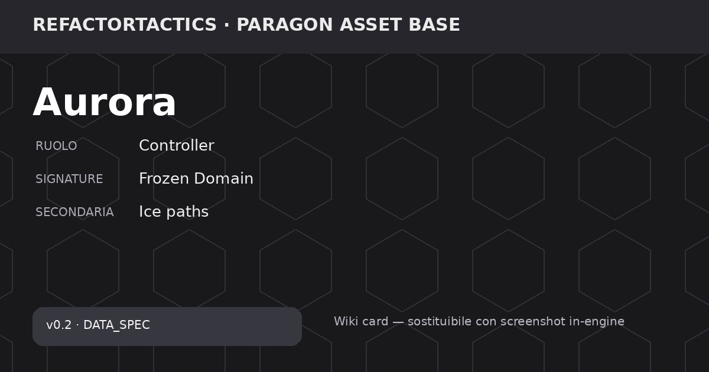

# Aurora

> 🧪 **Stato repository:** personaggio pianificato per **v0.2**. I valori sono `DATA_SPEC` / `DESIGN_SPEC`: servono a design, bilanciamento e Wiki, ma **non sono ancora runtime canonico v0.1**. Le finestre Fast Reaction storiche richiedono review prima dell'implementazione.

> **Asset base:** Paragon — Aurora  
> **Hero_Key:** `ASSET_AURORA`  
> **RT Character ID:** `TBD`  
> **Release:** `v0.2`  
> **Roster status:** Release v0.2  
> **Provenienza visuale:** mesh e animazioni vengono dallo slot Paragon **Aurora**, omonimo del nome di lavoro ([D-037](../../decisions/RT_PDR_00_Decision_Log.md) · tabella owner in [`paragon.md`](../paragon.md)). Il nome coincide, il RT Character ID resta **TBD**: coincidere non è essere deciso.

## Panoramica

Controller del terreno che trasforma il campo di battaglia tramite ghiaccio, ostacoli e fumo freddo. Il suo valore cresce quando riesce a costruire un Frozen Domain che modifica movimento, linee e opzioni tattiche.

## Identità tattica

| Campo | Valore |
| --- | --- |
| Ruolo primario | Controller |
| Ruolo secondario | Striker |
| Macro ruolo Signature | Controller |
| Specializzazione | Cryo Terrain Shaper |
| Profilo range | Medium |
| Tipo danno | Cold |
| Complessità gameplay | High |
| Complessità tecnica (1–5) | 4 |
| Risorsa firma | Cariche Termiche |
| Signature primaria | Frozen Domain |
| Signature secondaria | Ice paths |
| Framework principali | Territory, Environment, Movement |
| Dipendenze tecniche | Dynamic terrain, ice, LOS, movement costs |
| Player question | Quale parte della mappa trasformo? |

> **Nota bilanciamento:** Roster v0.2: design numerico disponibile; non sostituisce i quattro eroi canonici v0.1.

## Meccanica firma

### Descrizione della meccanica

**Frozen Domain** trasforma porzioni della mappa in un dominio di ghiaccio utile ad Aurora. La meccanica è territoriale: crea o converte terreno, modifica movimento e visibilità, e costruisce condizioni che rendono più forti le sue scelte successive.

Le **Cariche Termiche** hanno cap 100, start 40 e rigenerazione 10 tramite azioni Cold nella specifica v0.2. Il kit lega attacco lineare, decoy/ostacoli, AoE e oscuramento a trasformazioni del terreno.

Il controgioco previsto è usare fuoco o altre riconversioni ambientali, evitare le aree preparate e spezzare la continuità del dominio. I dettagli sono ancora **DESIGN_SPEC**.

### Lettura tattica

**Obiettivo del giocatore.** Costruire un Frozen Domain che modifichi terreno, movimento e visibilità, poi sfruttare quel dominio con attacchi e controllo.

**Counterplay / rischio.** Fuoco, riconversione del terreno e percorsi che evitano il dominio riducono il valore del setup.

### Dati della meccanica

| Campo | Valore |
| --- | --- |
| Mechanic ID | `MECH_AURORA_FROZEN_DOMAIN` |
| Nome | Frozen Domain |
| Scope | Exclusive |
| Tipo | Primary Signature |
| Secondaria | Ice paths |
| Framework | Territory, Environment, Movement |
| Dipendenze tecniche | Dynamic terrain, ice, LOS, movement costs |
| Player question | Quale parte della mappa trasformo? |
| State | Celle ghiacciate controllate e relative trasformazioni del terreno |
| Activation / Trigger | Crea, estende o converte ghiaccio tramite abilità e interazioni ambientali |
| Payoff | Mobilità sul dominio, modifica archi/costi, setup e requisiti di abilità, sacrificio/riconversione |
| Counterplay | Fuoco; riconversione terreno; evitare aree preparate; spezzare la continuità |
| Telegraphing | Public/observed tramite stato mappa |
| Design Status | DATA_SPEC |

## Statistiche base

| Campo | Valore |
| --- | --- |
| HP | 780 |
| Armatura | 18 |
| Resistenza | 24 |
| Movimento base | 6 |
| Iniziativa | 6 |
| Precisione (1–10) | 7 |
| Potenza (1–10) | 6 |
| Controllo (1–10) | 10 |
| Supporto (1–10) | 6 |
| Durabilità (1–10) | 5 |
| Indice Combat | 53 |
| Budget Punti | 62 |
| Delta Budget | -9 |

**Stato dati:** `SOURCE_VALUE` — Valori design v0.2 ereditati dalla matrice precedente.

## Visione e stealth

| Campo | Valore |
| --- | --- |
| Sight Range (hex) | 7 |
| Detection (0–100) | 58 |
| Identification (0–100) | 55 |
| Tracking (turni) | 2 |
| Vision Height | 2 |
| Stealth (1–10) | 5 |
| Reveal Recovery Step | 3 |
| Spotting Support (1–10) | 8 |
| Firma Movimento | 5 |
| Firma Attacco | 9 |
| Sensor Resist (1–10) | 4 |
| Contatto Default | Rilevato |

> 360° base; coni solo per overwatch/sensori. Attacco rivela almeno origine o direzione.

**Stato dati:** `SOURCE_VALUE` — Valori design v0.2 ereditati dalla matrice precedente.

## Mobilità

| Campo | Valore |
| --- | --- |
| Move Hex / MP | 6 |
| Sprint Bonus | 1 |
| Dash Range | 5 |
| Verticalità (1–10) | 6 |
| Costo Acqua | 2 |
| Costo Ghiaccio | 1 |
| Costo Fango | 3 |
| Porta AP | 1 |
| Ponte Mod | 0 |
| Tunnel Mod | 1 |
| Ascensore AP | 1 |
| Knockback Resist | 5 |
| Collision Priority | 1 |

> Costi interi; A* autorevole; NavMesh solo visualizzazione.

**Stato dati:** `SOURCE_VALUE` — Valori design v0.2 ereditati dalla matrice precedente.

## Risorsa firma

| Resource_ID | Nome | Cap | Start | Regen | Regen_Trigger | Spesa | Regola | Audience | Implementation_Status |
| --- | --- | --- | --- | --- | --- | --- | --- | --- | --- |
| RES_THERMAL | Cariche Termiche | 100 | 40 | 10 | Cold action | Freeze/terrain | Heat riduce | Team-visible | DESIGN_SPEC |

> **Ownership del kit:** le abilità di questa pagina appartengono esclusivamente a questo personaggio. Le sinergie con altri eroi sono esempi derivati da stati, superfici, geometria e altre regole comuni; non sono abilità condivise. Vedi [Sinergie e combinazioni](https://github.com/DegrassiAaron/refactor-tactics-main/wiki/sinergie-e-combinazioni).

## Abilità

### Glacial Lance

#### Descrizione

Glacial Lance è un attacco lineare Cold da 120 danni a range 5. Continua lungo la linea pianificata e può congelare acqua superficiale.

| Campo | Valore |
| --- | --- |
| Ability ID | `ABL_AURORA_01` |
| Categoria | Attacco lineare |
| Priorità | 55 |
| Costo risorsa | 1 |
| Cooldown (turni) | 1 |
| Range (hex) | 5 |
| AoE Radius | 0 |
| Danno base | 120 |
| Control Strength | 2 |
| Durata (turni) | 1 |
| Loss/Contact Policy | ContinueAlongPlannedLine |
| Interazione terreno | Congela acqua superficiale |
| Gameplay Tags | `Ability.Offense.Cold` |
| Implementation Status | DESIGN_SPEC |
| Data Status | SOURCE_VALUE |

> Valori design v0.2 ereditati dalla matrice precedente.

#### Uso tattico e limiti

Combina danno e trasformazione del terreno, creando materiale per Frozen Domain. È `DESIGN_SPEC v0.2`.

### Frozen Simulacrum

#### Descrizione

Frozen Simulacrum è un Dash/Decoy a range 4 che lascia un ostacolo o simulacro persistente e può modificare archi.

| Campo | Valore |
| --- | --- |
| Ability ID | `ABL_AURORA_02` |
| Categoria | Dash/Decoy |
| Priorità | 25 |
| Costo risorsa | 2 |
| Cooldown (turni) | 3 |
| Range (hex) | 4 |
| AoE Radius | 0 |
| Danno base | 0 |
| Control Strength | 1 |
| Durata (turni) | 1 |
| Loss/Contact Policy | PersistOnCell |
| Interazione terreno | Crea ostacolo/decoy e modifica archi |
| Gameplay Tags | `Ability.Mobility.Terrain` |
| Implementation Status | DESIGN_SPEC |
| Data Status | SOURCE_VALUE |

> Valori design v0.2 ereditati dalla matrice precedente.

#### Uso tattico e limiti

Aurora usa il movimento per cambiare anche la geometria dietro di sé. È una specifica di design, non ancora runtime.

### Hoarfrost Ring

#### Descrizione

Hoarfrost Ring è un'AoE Cold da 75 danni, range 4 e raggio 2, con controllo 3 e durata 2. Crea ghiaccio e rallenta.

| Campo | Valore |
| --- | --- |
| Ability ID | `ABL_AURORA_03` |
| Categoria | AoE circolare |
| Priorità | 65 |
| Costo risorsa | 3 |
| Cooldown (turni) | 4 |
| Range (hex) | 4 |
| AoE Radius | 2 |
| Danno base | 75 |
| Control Strength | 3 |
| Durata (turni) | 2 |
| Loss/Contact Policy | FireAtLastKnownCell |
| Interazione terreno | Rallenta; crea ghiaccio |
| Gameplay Tags | `Ability.Control.AOE.Cold` |
| Implementation Status | DESIGN_SPEC |
| Data Status | SOURCE_VALUE |

> Valori design v0.2 ereditati dalla matrice precedente.

#### Uso tattico e limiti

È il principale strumento per estendere Frozen Domain su una zona ampia e rendere costoso attraversarla.

### Whiteout

#### Descrizione

Whiteout crea un'area di fumo freddo a range 5 e raggio 2 per 2 turni. Riduce Identification senza comportarsi come copertura fisica.

| Campo | Valore |
| --- | --- |
| Ability ID | `ABL_AURORA_04` |
| Categoria | Visione/Stealth |
| Priorità | 40 |
| Costo risorsa | 2 |
| Cooldown (turni) | 4 |
| Range (hex) | 5 |
| AoE Radius | 2 |
| Danno base | 0 |
| Control Strength | 2 |
| Durata (turni) | 2 |
| Loss/Contact Policy | PersistOnArea |
| Interazione terreno | Fumo freddo: riduce identification, non cover |
| Gameplay Tags | `Ability.Vision.Obscure` |
| Implementation Status | DESIGN_SPEC |
| Data Status | SOURCE_VALUE |

> Valori design v0.2 ereditati dalla matrice precedente.

#### Uso tattico e limiti

Serve a separare visibilità e protezione: oscura informazione e targeting senza creare una parete. È `DESIGN_SPEC`.

## Fast Reactions / Reaction

### Descrizione delle reazioni

- **`REACT_AURORA_MIRROR`** — Quando un attacco lineare attraversa Aurora, la specifica propone `Ice Mirror` o `Cold Step`; il mirror crea un clone/cover fragile. La finestra storica di 6 s va riallineata.
- **`REACT_AURORA_STEP`** — Quando Aurora viene identificata nel fumo, la specifica propone un breve `Cold Step` oppure `Ice Mirror`. La finestra storica di 5 s è da rivedere.

| Reaction_ID | Trigger | Tipo | Finestra_sec_SOURCE | Costo | Priorità | Scelta_A | Scelta_B | Default_Timeout | Tradeoff | Implementation_Status |
| --- | --- | --- | --- | --- | --- | --- | --- | --- | --- | --- |
| REACT_AURORA_MIRROR | Attacco lineare la attraversa | Decoy | 6 | 20 | 70 | Ice Mirror | Cold Step | Cold Step | Crea clone cover fragile | REVIEW_REQUIRED |
| REACT_AURORA_STEP | Nemico la identifica nel fumo | Dash | 5 | 20 | 80 | Cold Step | Ice Mirror | Cold Step | Dash breve, aumenta cooldown | REVIEW_REQUIRED |

> ⚠️ **Review required:** una o più finestre temporali sono valori sorgente/storici. Il modello corrente di Fast Reaction usa una baseline di 3,0 s; questi valori vanno riallineati prima dell'implementazione.
> `REACT_AURORA_MIRROR` — Valore storico dal Balance Matrices; riallineare al modello Fast Reaction più recente prima dell'implementazione.
> `REACT_AURORA_STEP` — Valore storico dal Balance Matrices; riallineare al modello Fast Reaction più recente prima dell'implementazione.

## Equipaggiamento

Per la v0.2 questa pagina mostra l'equipaggiamento **specifico dell'eroe** definito nella matrice. Il catalogo generico v0.1 resta un sistema separato finché non viene deciso come migrare nella release successiva.

| Equipment_ID | Slot | Nome | Budget | Vantaggio | Svantaggio | Sinergia | Principio | Implementation_Status |
| --- | --- | --- | --- | --- | --- | --- | --- | --- |
| EQ_CRYO_CORE | Core | Cryo Core | 2 | Freeze +1 durata | Danno -15 | Hoarfrost | Controllo vs burst | DESIGN_SPEC |
| EQ_FROST_SKATES | Boots | Frost Skates | 2 | Move su ghiaccio +2 | Armor -4 | Cold Step | Mobilità fragile | DESIGN_SPEC |
| EQ_WHITEOUT_LENS | Gadget | Whiteout Lens | 3 | Opacity fumo +1 | Aurora detection -10 | Whiteout | Nasconde anche l'utilizzatore | DESIGN_SPEC |

## Varianti

| Variant_ID | Nome | Vantaggio | Svantaggio | Incompatibile_Con | Specializzazione | Implementation_Status |
| --- | --- | --- | --- | --- | --- | --- |
| VAR_AURORA_01 | Black Ice | Ghiaccio aumenta danno elettrico | Alleati soffrono scivolamento | VAR_AURORA_02 | Combo | DESIGN_SPEC |
| VAR_AURORA_02 | Soft Snow | Alleati ignorano ghiaccio | Freeze strength -1 | VAR_AURORA_01 | Support | DESIGN_SPEC |
| VAR_AURORA_03 | Dense Whiteout | Opacity +1 | Durata -1 | — | Vision | DESIGN_SPEC |
| VAR_AURORA_04 | Shatter Path | Dash danneggia cover fragile | Dash range -1 | — | Map | DESIGN_SPEC |

## Talenti

_NOT DEFINED nelle tabelle correnti; nessun talento è stato inventato._

## Stato produzione

| Campo | Valore |
| --- | --- |
| Page Status | DATA_READY_v0.2 |
| Stats | DEFINED |
| Vision | DEFINED |
| Mobility | DEFINED |
| Signature | DEFINED |
| Abilities | DEFINED (4) |
| Reactions | DEFINED (2) |
| Resource | DEFINED |
| Equipment | DEFINED hero-specific + generic |
| Variants | DEFINED (4) |
| Talents | NOT DEFINED |
| Release | v0.2 |

## Stato della pagina

Questa pagina descrive un personaggio **pianificato per la v0.2**. Meccanica, skill e numeri sono `DATA_SPEC` / `DESIGN_SPEC`: servono a design e bilanciamento, ma **non sono ancora regole runtime canoniche**. Le descrizioni non promuovono automaticamente questi dati a canone.

## Governance

- **Dataset:** `docs/src/data/characters-wiki-data-v0.4.xlsx`.
- **Release dati:** `v0.2`.
- I campi `—` / `TBD` sono intenzionali: indicano che la fonte non definisce quel valore.
- La Wiki è una vista documentale; il runtime non deve usare Markdown come fonte competitiva.
- Per la v0.2, questi dati devono passare da review, validator, implementazione e test prima di diventare canone runtime.
