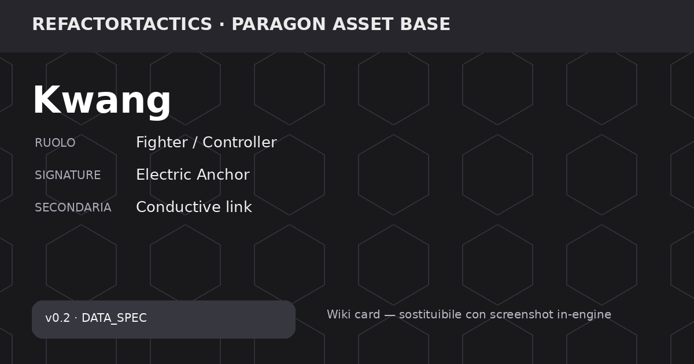

# Kwang

<!-- RT_FEATURE_STATUS:BEGIN RT-FEAT-CHAR-V02-ROSTER -->

> ⚠️ **Progettata, non implementata.** Questa pagina descrive una meccanica **decisa e documentata** che il gioco **non esegue ancora**: oggi non è giocabile. Blocco generato dal Feature Registry, non modificare a mano.  
> Feature: `RT-FEAT-CHAR-V02-ROSTER` · Release: `v0.2` · Roadmap: `—`  
> Stato: **DESIGNED** · Gate: `0/8`  
> Scenario: `—`  
> Pagina di **progetto**: nessun dato di gioco e nessuna epic aperta per questo personaggio.  
> Verificato il `2026-08-08` su `2094b86`

<!-- RT_FEATURE_STATUS:END RT-FEAT-CHAR-V02-ROSTER -->

> 🧪 **Stato repository:** personaggio pianificato per **v0.2**. I valori sono `DATA_SPEC` / `DESIGN_SPEC`: servono a design, bilanciamento e Wiki, ma **non sono ancora runtime canonico v0.1**. Le finestre Fast Reaction storiche richiedono review prima dell'implementazione.

> **Asset base:** Paragon — Kwang  
> **Hero_Key:** `ASSET_KWANG`  
> **RT Character ID:** `TBD`  
> **Release:** `v0.2`  
> **Roster status:** Release v0.2  
> **Provenienza visuale:** mesh e animazioni vengono dallo slot Paragon **Kwang**, omonimo del nome di lavoro ([D-037](../../decisions/RT_PDR_00_Decision_Log.md) · tabella owner in [`paragon.md`](../paragon.md)). Il nome coincide, il RT Character ID resta **TBD**: coincidere non è essere deciso.

## Panoramica

Duellante/controller elettrico che usa una spada-ancora persistente come punto di potere. L'Anchor modifica geometria, conduzione, ritorni e minaccia territoriale, soprattutto in combinazione con acqua e metallo.

## Identità tattica

| Campo | Valore |
| --- | --- |
| Ruolo primario | Bruiser |
| Ruolo secondario | Controller |
| Macro ruolo Signature | Fighter / Controller |
| Specializzazione | Electro Duelist |
| Profilo range | Melee |
| Tipo danno | Electric |
| Complessità gameplay | High |
| Complessità tecnica (1–5) | 4 |
| Risorsa firma | Carica Tempesta |
| Signature primaria | Electric Anchor |
| Signature secondaria | Conductive link |
| Framework principali | PersistentEntity, Link, Environment |
| Dipendenze tecniche | Persistent object, electricity, water, geometry |
| Player question | Dove piazzo il mio punto di potere? |

> **Nota bilanciamento:** Roster v0.2: design numerico disponibile; non sostituisce i quattro eroi canonici v0.1.

## Meccanica firma

### Descrizione della meccanica

**Electric Anchor** usa una spada-ancora persistente come secondo punto geometrico del personaggio. Kwang non controlla solo la propria cella: piazza un riferimento sul campo e costruisce abilità, ritorni e propagazioni attorno alla relazione Kwang↔Anchor.

La **Carica Tempesta** ha cap 100, start 25, rigenera 15 tramite interazioni elettriche e decade di 10 per turno nella specifica v0.2. Il kit combina attacco ravvicinato, ancoraggio, ritorno e catena elettrica con acqua e metallo.

Il controgioco previsto è disabilitare o rendere inutile l'Anchor, fare grounding e uscire dalla geometria preparata. Tutto resta **DESIGN_SPEC v0.2**.

### Lettura tattica

**Obiettivo del giocatore.** Piazzare Sword Anchor in una posizione che migliori geometria, ritorno e conduzione, poi costruire il turno attorno al link con l'Anchor.

**Counterplay / rischio.** Un Anchor mal posizionato o neutralizzato riduce molte opzioni. Grounding e uscita dalle superfici conduttive limitano il payoff elettrico.

### Dati della meccanica

| Campo | Valore |
| --- | --- |
| Mechanic ID | `MECH_KWANG_ELECTRIC_ANCHOR` |
| Nome | Electric Anchor |
| Scope | Exclusive |
| Tipo | Primary Signature |
| Secondaria | Conductive link |
| Framework | PersistentEntity, Link, Environment |
| Dipendenze tecniche | Persistent object, electricity, water, geometry |
| Player question | Dove piazzo il mio punto di potere? |
| State | Anchor persistente e link geometrico Kwang↔Anchor |
| Activation / Trigger | Piazza e mantiene Sword Anchor; sfrutta acqua/metallo e geometria |
| Payoff | Modifica geometria abilità, zone elettrificabili, reposition e minaccia territoriale |
| Counterplay | Distruzione/disable; grounding; uscire dalla geometria; interrompere condizioni ambientali |
| Telegraphing | Persistent entity public/observed secondo visibilità |
| Design Status | DATA_SPEC |

## Statistiche base

| Campo | Valore |
| --- | --- |
| HP | 900 |
| Armatura | 26 |
| Resistenza | 20 |
| Movimento base | 6 |
| Iniziativa | 6 |
| Precisione (1–10) | 7 |
| Potenza (1–10) | 8 |
| Controllo (1–10) | 8 |
| Supporto (1–10) | 3 |
| Durabilità (1–10) | 7 |
| Indice Combat | 54.8 |
| Budget Punti | 62 |
| Delta Budget | -7.2 |

**Stato dati:** `SOURCE_VALUE` — Valori design v0.2 ereditati dalla matrice precedente.

## Visione e stealth

| Campo | Valore |
| --- | --- |
| Sight Range (hex) | 6 |
| Detection (0–100) | 48 |
| Identification (0–100) | 45 |
| Tracking (turni) | 1 |
| Vision Height | 2 |
| Stealth (1–10) | 3 |
| Reveal Recovery Step | 3 |
| Spotting Support (1–10) | 5 |
| Firma Movimento | 8 |
| Firma Attacco | 10 |
| Sensor Resist (1–10) | 2 |
| Contatto Default | Contatto incerto |

> 360° base; coni solo per overwatch/sensori. Attacco rivela almeno origine o direzione.

**Stato dati:** `SOURCE_VALUE` — Valori design v0.2 ereditati dalla matrice precedente.

## Mobilità

| Campo | Valore |
| --- | --- |
| Move Hex / MP | 6 |
| Sprint Bonus | 1 |
| Dash Range | 4 |
| Verticalità (1–10) | 4 |
| Costo Acqua | 2 |
| Costo Ghiaccio | 3 |
| Costo Fango | 2 |
| Porta AP | 1 |
| Ponte Mod | 1 |
| Tunnel Mod | 0 |
| Ascensore AP | 1 |
| Knockback Resist | 7 |
| Collision Priority | 2 |

> Costi interi; A* autorevole; NavMesh solo visualizzazione.

**Stato dati:** `SOURCE_VALUE` — Valori design v0.2 ereditati dalla matrice precedente.

## Risorsa firma

| Resource_ID | Nome | Cap | Start | Regen | Regen_Trigger | Spesa | Regola | Audience | Implementation_Status |
| --- | --- | --- | --- | --- | --- | --- | --- | --- | --- |
| RES_STORM | Carica Tempesta | 100 | 25 | 15 | Electric interaction | Chain/counter | Decay 10/turn | Team-visible | DESIGN_SPEC |

> **Ownership del kit:** le abilità di questa pagina appartengono esclusivamente a questo personaggio. Le sinergie con altri eroi sono esempi derivati da stati, superfici, geometria e altre regole comuni; non sono abilità condivise. Vedi [Sinergie e combinazioni](https://github.com/DegrassiAaron/refactor-tactics-main/wiki/sinergie-e-combinazioni).

## Abilità

### Storm Slash

#### Descrizione

Storm Slash è l'attacco ravvicinato elettrico di Kwang: 135 danni, range 2, raggio 1, con bonus contro bersagli bagnati.

| Campo | Valore |
| --- | --- |
| Ability ID | `ABL_KWANG_01` |
| Categoria | Attacco arco |
| Priorità | 50 |
| Costo risorsa | 1 |
| Cooldown (turni) | 1 |
| Range (hex) | 2 |
| AoE Radius | 1 |
| Danno base | 135 |
| Control Strength | 1 |
| Durata (turni) | 1 |
| Loss/Contact Policy | FollowTrackedTarget |
| Interazione terreno | Bonus su bersaglio bagnato |
| Gameplay Tags | `Ability.Offense.Electric` |
| Implementation Status | DESIGN_SPEC |
| Data Status | SOURCE_VALUE |

> Valori design v0.2 ereditati dalla matrice precedente.

#### Uso tattico e limiti

Tiene Kwang efficace vicino all'Anchor e crea una naturale sinergia con acqua/Wet. È `DESIGN_SPEC v0.2`.

### Sword Anchor

#### Descrizione

Sword Anchor piazza l'elemento persistente centrale del kit a range 5. Infligge 55 danni e crea un nodo conduttivo che modifica gli archi vicini.

| Campo | Valore |
| --- | --- |
| Ability ID | `ABL_KWANG_02` |
| Categoria | Controllo/Arco |
| Priorità | 35 |
| Costo risorsa | 2 |
| Cooldown (turni) | 3 |
| Range (hex) | 5 |
| AoE Radius | 1 |
| Danno base | 55 |
| Control Strength | 2 |
| Durata (turni) | 2 |
| Loss/Contact Policy | PersistOnCell |
| Interazione terreno | Crea nodo conduttivo e modifica archi vicini |
| Gameplay Tags | `Ability.Control.Anchor` |
| Implementation Status | DESIGN_SPEC |
| Data Status | SOURCE_VALUE |

> Valori design v0.2 ereditati dalla matrice precedente.

#### Uso tattico e limiti

La posizione dell'Anchor decide geometria, ritorno e futuri circuiti elettrici: è la scelta strategica che struttura il turno di Kwang.

### Lightning Return

#### Descrizione

Lightning Return permette a Kwang di tornare verso la spada-ancora fino a range 5, infliggendo 85 danni e producendo shock sull'acqua.

| Campo | Valore |
| --- | --- |
| Ability ID | `ABL_KWANG_03` |
| Categoria | Dash/Reazione |
| Priorità | 20 |
| Costo risorsa | 2 |
| Cooldown (turni) | 3 |
| Range (hex) | 5 |
| AoE Radius | 0 |
| Danno base | 85 |
| Control Strength | 1 |
| Durata (turni) | 0 |
| Loss/Contact Policy | FollowAnchor |
| Interazione terreno | Ritorna alla spada; shock su acqua |
| Gameplay Tags | `Ability.Reaction.Dash` |
| Implementation Status | DESIGN_SPEC |
| Data Status | SOURCE_VALUE |

> Valori design v0.2 ereditati dalla matrice precedente.

#### Uso tattico e limiti

È mobilità legata a una condizione preparata: senza Anchor utile perde gran parte del valore. È `DESIGN_SPEC`.

### Tempest Circuit

#### Descrizione

Tempest Circuit è l'AoE/catena principale: 110 danni, range 6, raggio 2 e controllo 3. Si propaga attraverso acqua e metallo e la specifica prevede friendly fire.

| Campo | Valore |
| --- | --- |
| Ability ID | `ABL_KWANG_04` |
| Categoria | AoE catena |
| Priorità | 70 |
| Costo risorsa | 4 |
| Cooldown (turni) | 5 |
| Range (hex) | 6 |
| AoE Radius | 2 |
| Danno base | 110 |
| Control Strength | 3 |
| Durata (turni) | 1 |
| Loss/Contact Policy | FireAtLastKnownCell |
| Interazione terreno | Propaga su acqua/metal; friendly-fire previsto |
| Gameplay Tags | `Ability.Offense.AOE.Electric` |
| Implementation Status | DESIGN_SPEC |
| Data Status | SOURCE_VALUE |

> Valori design v0.2 ereditati dalla matrice precedente.

#### Uso tattico e limiti

È il payoff di Electric Anchor e delle superfici conduttive: forte quando la geometria è stata preparata, rischioso se alleati e nemici condividono lo stesso circuito.

## Fast Reactions / Reaction

### Descrizione delle reazioni

- **`REACT_KWANG_RETURN`** — Quando Kwang perde LOS o viene circondato, la specifica permette `Lightning Return` verso l'Anchor oppure `Static Guard`. Richiede Sword Anchor e la finestra di 6 s è storica.
- **`REACT_KWANG_GUARD`** — Quando arriva danno elettrico o controllo, la specifica permette `Static Guard` oppure `Lightning Return`; Static Guard accumula Carica Tempesta. La finestra di 5 s è storica.

| Reaction_ID | Trigger | Tipo | Finestra_sec_SOURCE | Costo | Priorità | Scelta_A | Scelta_B | Default_Timeout | Tradeoff | Implementation_Status |
| --- | --- | --- | --- | --- | --- | --- | --- | --- | --- | --- |
| REACT_KWANG_RETURN | Kwang perde LOS o viene circondato | Dash | 6 | 20 | 90 | Lightning Return | Static Guard | Static Guard | Richiede Sword Anchor | REVIEW_REQUIRED |
| REACT_KWANG_GUARD | Danno elettrico/controllo in arrivo | Counter | 5 | 15 | 95 | Static Guard | Lightning Return | Static Guard | Accumula Carica Tempesta | REVIEW_REQUIRED |

> ⚠️ **Review required:** una o più finestre temporali sono valori sorgente/storici. Il modello corrente di Fast Reaction usa una baseline di 3,0 s; questi valori vanno riallineati prima dell'implementazione.
> `REACT_KWANG_RETURN` — Valore storico dal Balance Matrices; riallineare al modello Fast Reaction più recente prima dell'implementazione.
> `REACT_KWANG_GUARD` — Valore storico dal Balance Matrices; riallineare al modello Fast Reaction più recente prima dell'implementazione.

## Equipaggiamento

Per la v0.2 questa pagina mostra l'equipaggiamento **specifico dell'eroe** definito nella matrice. Il catalogo generico v0.1 resta un sistema separato finché non viene deciso come migrare nella release successiva.

| Equipment_ID | Slot | Nome | Budget | Vantaggio | Svantaggio | Sinergia | Principio | Implementation_Status |
| --- | --- | --- | --- | --- | --- | --- | --- | --- |
| EQ_STORM_CAPACITOR | Core | Storm Capacitor | 3 | Carica max +25 | Regen -5 | Tempest Circuit | Picco vs ritmo | DESIGN_SPEC |
| EQ_INSULATED_GUARD | Armor | Insulated Guard | 2 | Electric resist +4 | Cold resist -3 | Static Guard | Affinità con vulnerabilità | DESIGN_SPEC |
| EQ_ANCHOR_CHAIN | Weapon | Anchor Chain | 2 | Sword Anchor range +1 | Return cost +5 | Sword Anchor | Setup più forte | DESIGN_SPEC |

## Varianti

| Variant_ID | Nome | Vantaggio | Svantaggio | Incompatibile_Con | Specializzazione | Implementation_Status |
| --- | --- | --- | --- | --- | --- | --- |
| VAR_KWANG_01 | Deep Conduction | Catena acqua +1 bersaglio | Danno primario -15 | VAR_KWANG_02 | Combo | DESIGN_SPEC |
| VAR_KWANG_02 | Duelist Circuit | Storm Slash +20 vs singolo | Nessuna catena | VAR_KWANG_01 | Striker | DESIGN_SPEC |
| VAR_KWANG_03 | Grounded Anchor | Sword Anchor crea cover 1 | Return range -1 | — | Controller | DESIGN_SPEC |
| VAR_KWANG_04 | Static Veil | Sensor resist +3 | Sight -1 | — | Stealth | DESIGN_SPEC |

## Talenti

_NOT DEFINED nelle tabelle correnti; nessun talento è stato inventato._

## Stato produzione

| Campo | Valore |
| --- | --- |
| Page Status | DATA_READY_v0.2 |
| Stats | DEFINED |
| Vision | DEFINED |
| Mobility | DEFINED |
| Signature | DEFINED |
| Abilities | DEFINED (4) |
| Reactions | DEFINED (2) |
| Resource | DEFINED |
| Equipment | DEFINED hero-specific + generic |
| Variants | DEFINED (4) |
| Talents | NOT DEFINED |
| Release | v0.2 |

## Stato della pagina

Questa pagina descrive un personaggio **pianificato per la v0.2**. Meccanica, skill e numeri sono `DATA_SPEC` / `DESIGN_SPEC`: servono a design e bilanciamento, ma **non sono ancora regole runtime canoniche**. Le descrizioni non promuovono automaticamente questi dati a canone.

## Governance

- **Dataset:** `docs/src/data/characters-wiki-data-v0.4.xlsx`.
- **Release dati:** `v0.2`.
- I campi `—` / `TBD` sono intenzionali: indicano che la fonte non definisce quel valore.
- La Wiki è una vista documentale; il runtime non deve usare Markdown come fonte competitiva.
- Per la v0.2, questi dati devono passare da review, validator, implementazione e test prima di diventare canone runtime.
