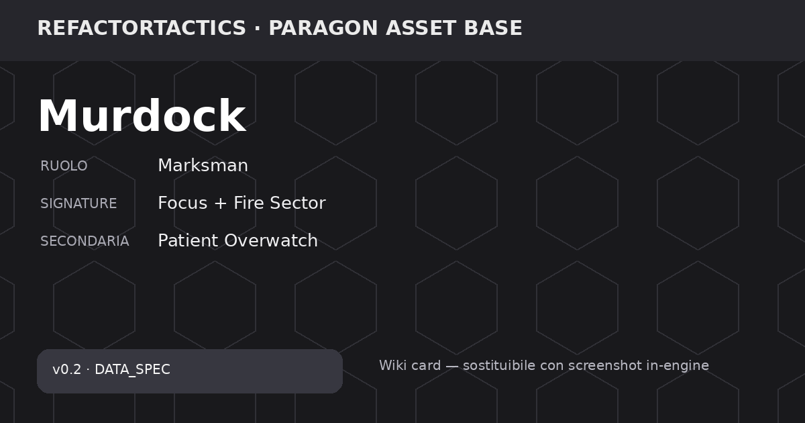

# Murdock

> 🧪 **Stato repository:** personaggio pianificato per **v0.2**. I valori sono `DATA_SPEC` / `DESIGN_SPEC`: servono a design, bilanciamento e Wiki, ma **non sono ancora runtime canonico v0.1**. Le finestre Fast Reaction storiche richiedono review prima dell'implementazione.

> **Asset base:** Murdock  
> **Hero_Key:** `ASSET_MURDOCK`  
> **RT Character ID:** `TBD`  
> **Release:** `v0.2`  
> **Design status:** `DATA_SPEC`  
> **Roster status:** Release v0.2

## Panoramica

Marksman di controllo che domina linee di tiro e settori attraverso Focus, Overwatch, sensori e fuoco di soppressione. Premia disciplina di posizione, facing e lettura dei corridoi.

## Identità tattica

| Campo | Valore |
| --- | --- |
| Ruolo primario | Marksman |
| Ruolo secondario | Controller |
| Macro ruolo Signature | Marksman |
| Specializzazione | Suppressive Sentinel |
| Profilo range | Long |
| Tipo danno | Kinetic |
| Complessità gameplay | Medium |
| Complessità tecnica (1–5) | 3 |
| Risorsa firma | Munizioni Speciali |
| Signature primaria | Focus + Fire Sector |
| Signature secondaria | Patient Overwatch |
| Framework principali | Resource, Reaction, Facing |
| Dipendenze tecniche | Facing, LOS, Overwatch, cover |
| Player question | Quale settore voglio dominare? |

> **Nota bilanciamento:** Roster v0.2: design numerico disponibile; non sostituisce i quattro eroi canonici v0.1.

## Meccanica firma

### Descrizione della meccanica

**Focus + Fire Sector** definisce Murdock come marksman di controllo. La sua forza non è muoversi continuamente, ma scegliere un settore, mantenerlo sotto osservazione e rendere rischioso attraversarlo.

Le **Munizioni Speciali** hanno cap e start 4; la specifica v0.2 prevede rigenerazione 1 tramite Wait/Reload. Rail shot, suppressive lane, sensori e mine servono tutti a costruire informazione e pressione lungo linee precise.

Il controgioco previsto è negare LOS con smoke, spostarlo, fiancheggiarlo o obbligarlo a cambiare settore. I numeri sono **DESIGN_SPEC v0.2**.

### Lettura tattica

**Obiettivo del giocatore.** Scegliere un settore, mantenerlo in LOS e renderlo rischioso con Rail Shot, Overwatch, sensori e mine.

**Counterplay / rischio.** Smoke, flank e displacement rompono il settore preparato e costringono Murdock a riposizionarsi invece di capitalizzare Focus.

### Dati della meccanica

| Campo | Valore |
| --- | --- |
| Mechanic ID | `MECH_MURDOCK_FOCUS_FIRE_SECTOR` |
| Nome | Focus + Fire Sector |
| Scope | Exclusive |
| Tipo | Primary Signature |
| Secondaria | Patient Overwatch |
| Framework | Resource, Reaction, Facing |
| Dipendenze tecniche | Facing, LOS, Overwatch, cover |
| Player question | Quale settore voglio dominare? |
| State | Focus + settore/facing controllato |
| Activation / Trigger | Mantiene posizione e facing; controlla lo stesso settore; evita displacement |
| Payoff | Potenzia Overwatch, controllo settore, range/precisione e penetrazione situazionale |
| Counterplay | Smoke; displacement; flank; chiusura LOS |
| Telegraphing | Stato personale/team; settore armato osservabile secondo regole di informazione |
| Design Status | DATA_SPEC |

## Statistiche base

| Campo | Valore |
| --- | --- |
| HP | 700 |
| Armatura | 13 |
| Resistenza | 18 |
| Movimento base | 5 |
| Iniziativa | 7 |
| Precisione (1–10) | 10 |
| Potenza (1–10) | 8 |
| Controllo (1–10) | 5 |
| Supporto (1–10) | 3 |
| Durabilità (1–10) | 3 |
| Indice Combat | 46.7 |
| Budget Punti | 62 |
| Delta Budget | -15.3 |

**Stato dati:** `SOURCE_VALUE` — Valori design v0.2 ereditati dalla matrice precedente.

## Visione e stealth

| Campo | Valore |
| --- | --- |
| Sight Range (hex) | 11 |
| Detection (0–100) | 68 |
| Identification (0–100) | 78 |
| Tracking (turni) | 3 |
| Vision Height | 2 |
| Stealth (1–10) | 3 |
| Reveal Recovery Step | 4 |
| Spotting Support (1–10) | 8 |
| Firma Movimento | 7 |
| Firma Attacco | 10 |
| Sensor Resist (1–10) | 2 |
| Contatto Default | Identificato |

> 360° base; coni solo per overwatch/sensori. Attacco rivela almeno origine o direzione.

**Stato dati:** `SOURCE_VALUE` — Valori design v0.2 ereditati dalla matrice precedente.

## Mobilità

| Campo | Valore |
| --- | --- |
| Move Hex / MP | 5 |
| Sprint Bonus | 1 |
| Dash Range | 2 |
| Verticalità (1–10) | 3 |
| Costo Acqua | 3 |
| Costo Ghiaccio | 3 |
| Costo Fango | 3 |
| Porta AP | 2 |
| Ponte Mod | 1 |
| Tunnel Mod | 1 |
| Ascensore AP | 1 |
| Knockback Resist | 3 |
| Collision Priority | 1 |

> Costi interi; A* autorevole; NavMesh solo visualizzazione.

**Stato dati:** `SOURCE_VALUE` — Valori design v0.2 ereditati dalla matrice precedente.

## Risorsa firma

| Resource_ID | Nome | Cap | Start | Regen | Regen_Trigger | Spesa | Regola | Audience | Implementation_Status |
| --- | --- | --- | --- | --- | --- | --- | --- | --- | --- |
| RES_AMMO | Munizioni Speciali | 4 | 4 | 1 | Wait/Reload | Rail/Tracer | Reload costs action | Team-visible | DESIGN_SPEC |

## Abilità

### Rail Shot

#### Descrizione

Rail Shot è il colpo a lungo raggio di Murdock: 180 danni a range 10. La specifica prevede penetrazione della cover bassa e una firma elevata.

| Campo | Valore |
| --- | --- |
| Ability ID | `ABL_MURDOCK_01` |
| Categoria | Attacco lineare |
| Priorità | 75 |
| Costo risorsa | 1 |
| Cooldown (turni) | 1 |
| Range (hex) | 10 |
| AoE Radius | 0 |
| Danno base | 180 |
| Control Strength | 1 |
| Durata (turni) | 0 |
| Loss/Contact Policy | ContinueAlongPlannedLine |
| Interazione terreno | Penetra cover bassa; firma alta |
| Gameplay Tags | `Ability.Offense.Ranged` |
| Implementation Status | DESIGN_SPEC |
| Data Status | SOURCE_VALUE |

> Valori design v0.2 ereditati dalla matrice precedente.

#### Uso tattico e limiti

È il payoff della posizione preparata: grande portata e danno, ma richiede una linea utile e rende evidente la presenza del marksman.

### Suppressive Lane

#### Descrizione

Suppressive Lane arma una linea di Overwatch fino a range 8 con raggio 1, 95 danni e controllo 2 per 2 turni.

| Campo | Valore |
| --- | --- |
| Ability ID | `ABL_MURDOCK_02` |
| Categoria | Overwatch |
| Priorità | 30 |
| Costo risorsa | 2 |
| Cooldown (turni) | 3 |
| Range (hex) | 8 |
| AoE Radius | 1 |
| Danno base | 95 |
| Control Strength | 2 |
| Durata (turni) | 2 |
| Loss/Contact Policy | RetargetNearestVisible |
| Interazione terreno | Crea arco sorvegliato; interrompe sprint |
| Gameplay Tags | `Ability.Reaction.Overwatch` |
| Implementation Status | DESIGN_SPEC |
| Data Status | SOURCE_VALUE |

> Valori design v0.2 ereditati dalla matrice precedente.

#### Uso tattico e limiti

Serve a dominare un corridoio e interrompere Sprint. La reaction associata deve essere riallineata al modello Fast Reaction corrente prima dell'implementazione.

### Tracer Beacon

#### Descrizione

Tracer Beacon è un sensore a range 7 e raggio 1 per 2 turni che aumenta Tracking e Identification sul bersaglio o area seguita.

| Campo | Valore |
| --- | --- |
| Ability ID | `ABL_MURDOCK_03` |
| Categoria | Sensore |
| Priorità | 25 |
| Costo risorsa | 2 |
| Cooldown (turni) | 3 |
| Range (hex) | 7 |
| AoE Radius | 1 |
| Danno base | 0 |
| Control Strength | 2 |
| Durata (turni) | 2 |
| Loss/Contact Policy | FollowTrackedTarget |
| Interazione terreno | Aumenta tracking e identification |
| Gameplay Tags | `Ability.Vision.Sensor` |
| Implementation Status | DESIGN_SPEC |
| Data Status | SOURCE_VALUE |

> Valori design v0.2 ereditati dalla matrice precedente.

#### Uso tattico e limiti

È il lato informativo del kit: rende più stabile il contatto e prepara Rail Shot o Overwatch.

### Concussive Mine

#### Descrizione

Concussive Mine è una trappola a range 5, raggio 1, 80 danni e controllo 2 per 2 turni. Spinge e rivela l'attraversamento.

| Campo | Valore |
| --- | --- |
| Ability ID | `ABL_MURDOCK_04` |
| Categoria | Trappola/AoE |
| Priorità | 45 |
| Costo risorsa | 3 |
| Cooldown (turni) | 4 |
| Range (hex) | 5 |
| AoE Radius | 1 |
| Danno base | 80 |
| Control Strength | 2 |
| Durata (turni) | 2 |
| Loss/Contact Policy | PersistOnCell |
| Interazione terreno | Spinge; rivela attraversamento |
| Gameplay Tags | `Ability.Trap.Control` |
| Implementation Status | DESIGN_SPEC |
| Data Status | SOURCE_VALUE |

> Valori design v0.2 ereditati dalla matrice precedente.

#### Uso tattico e limiti

Trasforma una previsione di percorso in controllo del terreno. È `DESIGN_SPEC`, non implementazione v0.1.

## Fast Reactions / Reaction

### Descrizione delle reazioni

- **`REACT_MURDOCK_SHOT`** — Quando un nemico entra nell'arco sorvegliato, la specifica propone uno Snapshot oppure Mark Target; lo Snapshot infligge danno ridotto e interrompe Sprint. La finestra di 7 s è storica.
- **`REACT_MURDOCK_MARK`** — Quando un contatto incerto diventa rilevato, la specifica permette `Mark Target` senza danno oppure Snapshot, con bonus di tracking. La finestra di 6 s è storica.

| Reaction_ID | Trigger | Tipo | Finestra_sec_SOURCE | Costo | Priorità | Scelta_A | Scelta_B | Default_Timeout | Tradeoff | Implementation_Status |
| --- | --- | --- | --- | --- | --- | --- | --- | --- | --- | --- |
| REACT_MURDOCK_SHOT | Nemico entra nell'arco sorvegliato | Overwatch | 7 | 1 | 75 | Snapshot | Mark Target | Mark Target | Danno ridotto, interrompe sprint | REVIEW_REQUIRED |
| REACT_MURDOCK_MARK | Contatto incerto diventa rilevato | Sensor | 6 | 15 | 85 | Mark Target | Snapshot | Mark Target | Nessun danno, tracking +2 | REVIEW_REQUIRED |

> ⚠️ **Review required:** una o più finestre temporali sono valori sorgente/storici. Il modello corrente di Fast Reaction usa una baseline di 3,0 s; questi valori vanno riallineati prima dell'implementazione.
> `REACT_MURDOCK_SHOT` — Valore storico dal Balance Matrices; riallineare al modello Fast Reaction più recente prima dell'implementazione.
> `REACT_MURDOCK_MARK` — Valore storico dal Balance Matrices; riallineare al modello Fast Reaction più recente prima dell'implementazione.

## Equipaggiamento

Per la v0.2 questa pagina mostra l'equipaggiamento **specifico dell'eroe** definito nella matrice. Il catalogo generico v0.1 resta un sistema separato finché non viene deciso come migrare nella release successiva.

| Equipment_ID | Slot | Nome | Budget | Vantaggio | Svantaggio | Sinergia | Principio | Implementation_Status |
| --- | --- | --- | --- | --- | --- | --- | --- | --- |
| EQ_RAIL_COIL | Weapon | Rail Coil | 3 | Rail Shot danno +25 | Firma attacco +2 | Rail Shot | Potenza vs rivelazione | DESIGN_SPEC |
| EQ_TRACER_MAG | Ammo | Tracer Magazine | 2 | Tracking +1 turno | Danno -15 | Tracer Beacon | Informazione vs danno | DESIGN_SPEC |
| EQ_STABILIZED_STOCK | Weapon | Stabilized Stock | 2 | Precisione +1 | Move -1 dopo tiro | Snapshot | Posizionale | DESIGN_SPEC |

## Varianti

| Variant_ID | Nome | Vantaggio | Svantaggio | Incompatibile_Con | Specializzazione | Implementation_Status |
| --- | --- | --- | --- | --- | --- | --- |
| VAR_MURDOCK_01 | Long Watch | Overwatch range +2 | Finestra reaction -2 sec | VAR_MURDOCK_02 | Marksman | DESIGN_SPEC |
| VAR_MURDOCK_02 | Fast Track | Mark Target immediato | Tracking -1 turno | VAR_MURDOCK_01 | Vision | DESIGN_SPEC |
| VAR_MURDOCK_03 | Breach Rail | Penetra high cover danneggiata | Danno -25 | — | Map | DESIGN_SPEC |
| VAR_MURDOCK_04 | Safe Trigger | Friendly fire warning diventa blocco | Non può sparare in linee incerte | — | Safety | DESIGN_SPEC |

## Talenti

_NOT DEFINED nelle tabelle correnti; nessun talento è stato inventato._

## Stato produzione

| Campo | Valore |
| --- | --- |
| Page Status | DATA_READY_v0.2 |
| Stats | DEFINED |
| Vision | DEFINED |
| Mobility | DEFINED |
| Signature | DEFINED |
| Abilities | DEFINED (4) |
| Reactions | DEFINED (2) |
| Resource | DEFINED |
| Equipment | DEFINED hero-specific + generic |
| Variants | DEFINED (4) |
| Talents | NOT DEFINED |
| Release | v0.2 |

## Stato della pagina

Questa pagina descrive un personaggio **pianificato per la v0.2**. Meccanica, skill e numeri sono `DATA_SPEC` / `DESIGN_SPEC`: servono a design e bilanciamento, ma **non sono ancora regole runtime canoniche**. Le descrizioni non promuovono automaticamente questi dati a canone.

## Governance

- **Dataset:** `RefactorTactics_Characters_Wiki_Data_v0.4.xlsx`.
- **Release dati:** `v0.2`.
- I campi `—` / `TBD` sono intenzionali: indicano che la fonte non definisce quel valore.
- La Wiki è una vista documentale; il runtime non deve usare Markdown come fonte competitiva.
- Per la v0.2, questi dati devono passare da review, validator, implementazione e test prima di diventare canone runtime.
