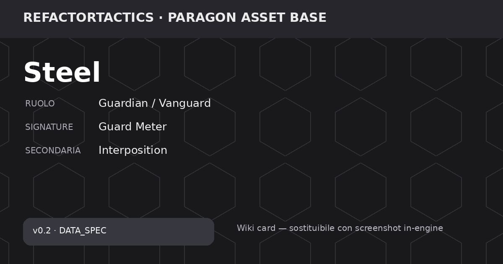

# Steel

<!-- RT_FEATURE_STATUS:BEGIN RT-FEAT-CHAR-V02-ROSTER -->

> ⚠️ **Progettata, non implementata.** Questa pagina descrive una meccanica **decisa e documentata** che il gioco **non esegue ancora**: oggi non è giocabile. Blocco generato dal Feature Registry, non modificare a mano.  
> Feature: `RT-FEAT-CHAR-V02-ROSTER` · Release: `v0.2` · Roadmap: `—`  
> Stato: **DESIGNED** · Gate: `0/8`  
> Scenario: `—`  
> Pagina di **progetto**: nessun dato di gioco e nessuna epic aperta per questo personaggio.  
> Verificato il `2026-08-08` su `2094b86`

<!-- RT_FEATURE_STATUS:END RT-FEAT-CHAR-V02-ROSTER -->

> 🧪 **Stato repository:** personaggio pianificato per **v0.2**. I valori sono `DATA_SPEC` / `DESIGN_SPEC`: servono a design, bilanciamento e Wiki, ma **non sono ancora runtime canonico v0.1**. Le finestre Fast Reaction storiche richiedono review prima dell'implementazione.

> **Asset base:** Paragon — Steel  
> **Hero_Key:** `ASSET_STEEL`  
> **RT Character ID:** `TBD`  
> **Release:** `v0.2`  
> **Roster status:** Release v0.2  
> **Provenienza visuale:** mesh e animazioni vengono dallo slot Paragon **Steel**, omonimo del nome di lavoro ([D-037](../../decisions/RT_PDR_00_Decision_Log.md) · tabella owner in [`paragon.md`](../paragon.md)). Il nome coincide, il RT Character ID resta **TBD**: coincidere non è essere deciso.

## Panoramica

Difensore frontale e controller che protegge gli alleati attraverso interposizione, coperture direzionali e reazioni. La sua identità ruota attorno alla scelta di chi proteggere e al momento in cui impegnare lo scudo.

## Identità tattica

| Campo | Valore |
| --- | --- |
| Ruolo primario | Guardian |
| Ruolo secondario | Controller |
| Macro ruolo Signature | Guardian / Vanguard |
| Specializzazione | Shield Interposer |
| Profilo range | Short |
| Tipo danno | Kinetic |
| Complessità gameplay | Medium |
| Complessità tecnica (1–5) | 3 |
| Risorsa firma | Integrità Scudo |
| Signature primaria | Guard Meter |
| Signature secondaria | Interposition |
| Framework principali | Resource, Reaction, Link |
| Dipendenze tecniche | Reaction, cover, ally protection, displacement |
| Player question | Chi proteggo e quando intervengo? |

> **Nota bilanciamento:** Roster v0.2: design numerico disponibile; non sostituisce i quattro eroi canonici v0.1.

## Meccanica firma

### Descrizione della meccanica

**Guard Meter** ruota attorno all'**Integrità Scudo** e alla scelta di quando spendere capacità difensiva per proteggere una linea o un alleato. Steel è pensato come Guardian/Vanguard: rende costoso attaccare attraverso di lui, ma deve scegliere dove impegnarsi.

L'Integrità Scudo parte da 100, ha cap 100 e rigenera 15 nel Cleanup secondo la specifica v0.2. Le abilità combinano spinta, cover direzionale, interposizione e controllo ad area.

Il controgioco previsto è separarlo dagli alleati, attaccare da più angoli, forzare displacement e consumare lo scudo prima dello scambio decisivo. Tutti questi valori sono **DESIGN_SPEC v0.2**, non runtime canonico della v0.1.

### Lettura tattica

**Obiettivo del giocatore.** Stare nella zona in cui può proteggere alleati e linee, decidendo quando spendere Integrità Scudo in interposizione, cover o controllo.

**Counterplay / rischio.** Separazione, pressione da più angoli e displacement possono costringerlo a difendere il bersaglio sbagliato o a consumare lo scudo troppo presto.

### Dati della meccanica

| Campo | Valore |
| --- | --- |
| Mechanic ID | `MECH_STEEL_GUARD_METER` |
| Nome | Guard Meter |
| Scope | Exclusive |
| Tipo | Primary Signature |
| Secondaria | Interposition |
| Framework | Resource, Reaction, Link |
| Dipendenze tecniche | Reaction, cover, ally protection, displacement |
| Player question | Chi proteggo e quando intervengo? |
| State | Guard / Integrità Scudo e stato di protezione |
| Activation / Trigger | Intercetta danno; blocca displacement; protegge tramite cover; reaction difensiva valida |
| Payoff | Migliora interposition, guard reaction, displacement difensivo e protezione alleato |
| Counterplay | Ignorarlo; separarlo dagli alleati; displacement; pressione da più angoli |
| Telegraphing | Team-visible / public quando l'effetto è osservabile |
| Design Status | DATA_SPEC |

## Statistiche base

| Campo | Valore |
| --- | --- |
| HP | 1150 |
| Armatura | 38 |
| Resistenza | 28 |
| Movimento base | 4 |
| Iniziativa | 4 |
| Precisione (1–10) | 6 |
| Potenza (1–10) | 5 |
| Controllo (1–10) | 9 |
| Supporto (1–10) | 8 |
| Durabilità (1–10) | 10 |
| Indice Combat | 60.2 |
| Budget Punti | 62 |
| Delta Budget | -1.8 |

**Stato dati:** `SOURCE_VALUE` — Valori design v0.2 ereditati dalla matrice precedente.

## Visione e stealth

| Campo | Valore |
| --- | --- |
| Sight Range (hex) | 6 |
| Detection (0–100) | 50 |
| Identification (0–100) | 45 |
| Tracking (turni) | 2 |
| Vision Height | 2 |
| Stealth (1–10) | 2 |
| Reveal Recovery Step | 3 |
| Spotting Support (1–10) | 7 |
| Firma Movimento | 9 |
| Firma Attacco | 10 |
| Sensor Resist (1–10) | 1 |
| Contatto Default | Contatto incerto |

> 360° base; coni solo per overwatch/sensori. Attacco rivela almeno origine o direzione.

**Stato dati:** `SOURCE_VALUE` — Valori design v0.2 ereditati dalla matrice precedente.

## Mobilità

| Campo | Valore |
| --- | --- |
| Move Hex / MP | 4 |
| Sprint Bonus | 1 |
| Dash Range | 2 |
| Verticalità (1–10) | 3 |
| Costo Acqua | 3 |
| Costo Ghiaccio | 3 |
| Costo Fango | 2 |
| Porta AP | 1 |
| Ponte Mod | 1 |
| Tunnel Mod | 1 |
| Ascensore AP | 1 |
| Knockback Resist | 10 |
| Collision Priority | 3 |

> Costi interi; A* autorevole; NavMesh solo visualizzazione.

**Stato dati:** `SOURCE_VALUE` — Valori design v0.2 ereditati dalla matrice precedente.

## Risorsa firma

| Resource_ID | Nome | Cap | Start | Regen | Regen_Trigger | Spesa | Regola | Audience | Implementation_Status |
| --- | --- | --- | --- | --- | --- | --- | --- | --- | --- |
| RES_SHIELD | Integrità Scudo | 100 | 100 | 15 | Cleanup | Difesa/interpose | Break a 0 | Team-visible | DESIGN_SPEC |

> **Ownership del kit:** le abilità di questa pagina appartengono esclusivamente a questo personaggio. Le sinergie con altri eroi sono esempi derivati da stati, superfici, geometria e altre regole comuni; non sono abilità condivise. Vedi [Sinergie e combinazioni](../../wiki/game/sinergie-e-combinazioni.md).

## Abilità

### Shield Bash

#### Descrizione

Shield Bash è un attacco ravvicinato lineare: 145 danni, range 2 e spinta 1. La specifica prevede un bonus contro bordi o coperture.

| Campo | Valore |
| --- | --- |
| Ability ID | `ABL_STEEL_01` |
| Categoria | Attacco lineare |
| Priorità | 60 |
| Costo risorsa | 1 |
| Cooldown (turni) | 1 |
| Range (hex) | 2 |
| AoE Radius | 0 |
| Danno base | 145 |
| Control Strength | 2 |
| Durata (turni) | 1 |
| Loss/Contact Policy | FollowTrackedTarget |
| Interazione terreno | Spinge 1; bonus contro bordo/coperte |
| Gameplay Tags | `Ability.Offense.Melee` |
| Implementation Status | DESIGN_SPEC |
| Data Status | SOURCE_VALUE |

> Valori design v0.2 ereditati dalla matrice precedente.

#### Uso tattico e limiti

Serve a liberare spazio davanti a Steel e a convertire il controllo frontale in displacement. È `DESIGN_SPEC v0.2`.

### Bulwark Arc

#### Descrizione

Bulwark Arc crea una copertura direzionale in un'area di raggio 3 per 2 turni, bloccando proiettili secondo la specifica.

| Campo | Valore |
| --- | --- |
| Ability ID | `ABL_STEEL_02` |
| Categoria | Difesa/Cover |
| Priorità | 35 |
| Costo risorsa | 2 |
| Cooldown (turni) | 2 |
| Range (hex) | 0 |
| AoE Radius | 3 |
| Danno base | 0 |
| Control Strength | 0 |
| Durata (turni) | 2 |
| Loss/Contact Policy | PersistOnCell |
| Interazione terreno | Crea cover direzionale e blocca proiettili |
| Gameplay Tags | `Ability.Defense.Cover` |
| Implementation Status | DESIGN_SPEC |
| Data Status | SOURCE_VALUE |

> Valori design v0.2 ereditati dalla matrice precedente.

#### Uso tattico e limiti

È l'abilità che rende fisico il ruolo di Guardian: sceglie una linea da proteggere. Il trade-off delle varianti riguarda durata, mobilità e qualità della cover.

### Interpose

#### Descrizione

Interpose è un Dash/reazione fino a 3 celle che segue un alleato e permette a Steel di inserirsi nella linea di minaccia, trasferendo parte del danno.

| Campo | Valore |
| --- | --- |
| Ability ID | `ABL_STEEL_03` |
| Categoria | Dash/Reazione |
| Priorità | 20 |
| Costo risorsa | 2 |
| Cooldown (turni) | 3 |
| Range (hex) | 3 |
| AoE Radius | 0 |
| Danno base | 0 |
| Control Strength | 1 |
| Durata (turni) | 0 |
| Loss/Contact Policy | FollowAlly |
| Interazione terreno | Si interpone e trasferisce parte danno |
| Gameplay Tags | `Ability.Reaction.Guard` |
| Implementation Status | DESIGN_SPEC |
| Data Status | SOURCE_VALUE |

> Valori design v0.2 ereditati dalla matrice precedente.

#### Uso tattico e limiti

È il ponte tra mobilità e protezione. La specifica usa `FollowAlly` e resta da riallineare al modello di reaction più recente prima dell'implementazione.

### Seismic Lock

#### Descrizione

Seismic Lock è un'AoE di controllo: 90 danni, range 1, raggio 2, controllo 3. La specifica include danno alle cover fragili e interruzione dello Sprint.

| Campo | Valore |
| --- | --- |
| Ability ID | `ABL_STEEL_04` |
| Categoria | AoE controllo |
| Priorità | 70 |
| Costo risorsa | 3 |
| Cooldown (turni) | 4 |
| Range (hex) | 1 |
| AoE Radius | 2 |
| Danno base | 90 |
| Control Strength | 3 |
| Durata (turni) | 1 |
| Loss/Contact Policy | FireAtLastKnownCell |
| Interazione terreno | Danneggia cover fragile; interrompe sprint |
| Gameplay Tags | `Ability.Control.AOE` |
| Implementation Status | DESIGN_SPEC |
| Data Status | SOURCE_VALUE |

> Valori design v0.2 ereditati dalla matrice precedente.

#### Uso tattico e limiti

Serve a rendere pericoloso avvicinarsi o attraversare la zona frontale di Steel. È `DESIGN_SPEC`.

## Fast Reactions / Reaction

### Descrizione delle reazioni

- **`REACT_STEEL_GUARD`** — Quando una nuova minaccia entra nel raggio di un alleato, la specifica storica offre `Interpose` o `Brace`, consumando Integrità Scudo. La finestra sorgente di 6 s è `REVIEW_REQUIRED`.
- **`REACT_STEEL_BRACE`** — Quando Steel sta per subire spinta o stun, la specifica storica permette `Brace` o `Interpose`; Brace riduce il controllo ma rinuncia al movimento. La finestra di 5 s va riallineata.

| Reaction_ID | Trigger | Tipo | Finestra_sec_SOURCE | Costo | Priorità | Scelta_A | Scelta_B | Default_Timeout | Tradeoff | Implementation_Status |
| --- | --- | --- | --- | --- | --- | --- | --- | --- | --- | --- |
| REACT_STEEL_GUARD | Nuova minaccia entra nel raggio alleato | Guardia | 6 | 15 | 90 | Interpose | Brace | Brace | Consuma 1 Integrità Scudo | REVIEW_REQUIRED |
| REACT_STEEL_BRACE | Steel sta per subire spinta/stun | Difesa | 5 | 10 | 95 | Brace | Interpose | Brace | Riduce controllo, rinuncia al movimento | REVIEW_REQUIRED |

> ⚠️ **Review required:** una o più finestre temporali sono valori sorgente/storici. Il modello corrente di Fast Reaction usa una baseline di 3,0 s; questi valori vanno riallineati prima dell'implementazione.
> `REACT_STEEL_GUARD` — Valore storico dal Balance Matrices; riallineare al modello Fast Reaction più recente prima dell'implementazione.
> `REACT_STEEL_BRACE` — Valore storico dal Balance Matrices; riallineare al modello Fast Reaction più recente prima dell'implementazione.

## Equipaggiamento

Per la v0.2 questa pagina mostra l'equipaggiamento **specifico dell'eroe** definito nella matrice. Il catalogo generico v0.1 resta un sistema separato finché non viene deciso come migrare nella release successiva.

| Equipment_ID | Slot | Nome | Budget | Vantaggio | Svantaggio | Sinergia | Principio | Implementation_Status |
| --- | --- | --- | --- | --- | --- | --- | --- | --- |
| EQ_SHIELD_REINFORCER | Core | Shield Reinforcer | 2 | Integrità Scudo +25 | Move -1 | Interpose | No pure upgrade | DESIGN_SPEC |
| EQ_KINETIC_BRACE | Gadget | Kinetic Brace | 2 | Knockback resist +3 | Sight -1 | Brace | Più stabile, meno informazione | DESIGN_SPEC |
| EQ_MOBILE_BARRIER | Core | Mobile Barrier | 3 | Bulwark Arc +1 hex | Cooldown +1 | Bulwark Arc | Più controllo, meno frequenza | DESIGN_SPEC |

## Varianti

| Variant_ID | Nome | Vantaggio | Svantaggio | Incompatibile_Con | Specializzazione | Implementation_Status |
| --- | --- | --- | --- | --- | --- | --- |
| VAR_STEEL_01 | Fortress | Bulwark Arc dura +1 turno | Move -1 | VAR_STEEL_02 | Guardian | DESIGN_SPEC |
| VAR_STEEL_02 | Battering Ram | Shield Bash spinge +1 | Integrità Scudo -20 | VAR_STEEL_01 | Controller | DESIGN_SPEC |
| VAR_STEEL_03 | Rescue Protocol | Interpose range +1 | Danno trasferito +10% | — | Support | DESIGN_SPEC |
| VAR_STEEL_04 | Open Guard | Spotting +2 dietro scudo | Cover value -1 | — | Vision | DESIGN_SPEC |

## Talenti

_NOT DEFINED nelle tabelle correnti; nessun talento è stato inventato._

## Stato produzione

| Campo | Valore |
| --- | --- |
| Page Status | DATA_READY_v0.2 |
| Stats | DEFINED |
| Vision | DEFINED |
| Mobility | DEFINED |
| Signature | DEFINED |
| Abilities | DEFINED (4) |
| Reactions | DEFINED (2) |
| Resource | DEFINED |
| Equipment | DEFINED hero-specific + generic |
| Variants | DEFINED (4) |
| Talents | NOT DEFINED |
| Release | v0.2 |

## Stato della pagina

Questa pagina descrive un personaggio **pianificato per la v0.2**. Meccanica, skill e numeri sono `DATA_SPEC` / `DESIGN_SPEC`: servono a design e bilanciamento, ma **non sono ancora regole runtime canoniche**. Le descrizioni non promuovono automaticamente questi dati a canone.

## Governance

- **Dataset:** `docs/src/data/characters-wiki-data-v0.4.xlsx`.
- **Release dati:** `v0.2`.
- I campi `—` / `TBD` sono intenzionali: indicano che la fonte non definisce quel valore.
- La Wiki è una vista documentale; il runtime non deve usare Markdown come fonte competitiva.
- Per la v0.2, questi dati devono passare da review, validator, implementazione e test prima di diventare canone runtime.
