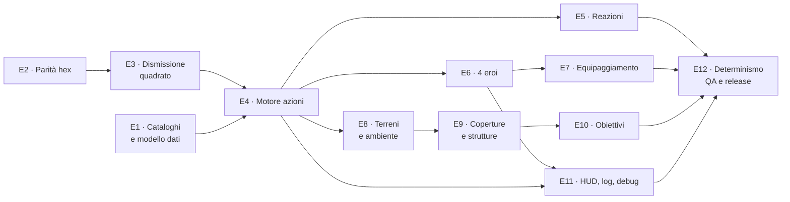
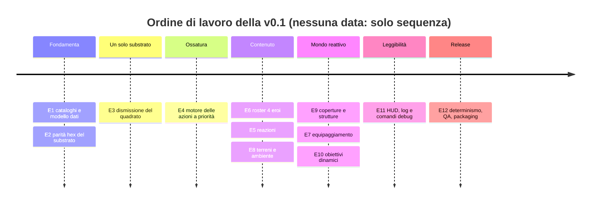

# RefactorTactics — Roadmap v0.1 (vertical slice 2v2 su hex)

> **Stato**: pianificata · **Ultimo aggiornamento**: 2026-08-05 · **Branch di lavoro**: `docs/v0.1-roadmap-review`
> **Scope sorgente**: `docs/PDR/RT_PDR_12_Catalog_v0.1.pdf` + `docs/src/RefactorTactics — Catalogo e bilanciamento v0.1.pdf`
> **Decisione abilitante**: [`adr-0003-modello-azioni-v01.md`](adr-0003-modello-azioni-v01.md)
>
> Questa è la vista **di release**: cosa deve esistere perché la v0.1 sia consegnabile.
> La vista **di esecuzione** (milestone M6–M11, stato per checkpoint) resta
> [`roadmap-checkpoint.md`](roadmap-checkpoint.md); la mappatura fra le due è in §8.
> Le decisioni vincolanti restano in [`piano-canonico-mvp.md`](piano-canonico-mvp.md).

---

## 1. Cosa è la v0.1

Un vertical slice **2v2 offline contro bot** su griglia **esagonale multilivello** con:

- **4 eroi** distinti (Flux, Riva, Bastion, Vektor), 4 abilità ciascuno + 1 variante;
- **catalogo azioni** completo (~35 azioni con ID stabile, fase, priorità intera, fallback, cooldown);
- **reazioni** preparate in planning (1 attivazione per turno);
- **8 terreni attivi** con stati (Wet, Burning, Electrified, Obscured, …) e propagazione deterministica;
- **coperture direzionali e strutture** (porte, ponti, pannelli) che cambiano la topologia;
- **obiettivi dinamici** e fine partita a 12 turni;
- **HUD** con intenti alleati e certezza (confermato / previsto / incerto), **combat log** e comandi `rt.Debug.*`;
- **determinismo verificato** (100 ripetizioni a seed fisso, checksum identico) e **build packaged** giocabile.

**Fuori scope v0.1** (restano north-star): multiplayer in rete, 4v4, GAS, progressione, modding, editor di
mappe dinamico a runtime, stack di reazioni interattivo.

### Principi non negoziabili della v0.1

1. Il simulatore decide, UI/animazioni mostrano (invariante #1).
2. Determinismo: stessa snapshot + stesso seed ⇒ stesso risultato (#4).
3. Coordinate intere (`FRTCellId`), nessun float in costi, priorità, danni.
4. **Nessun gameplay quadrato parallelo**: un solo substrato (epic **E3**).
5. Offline: nessun networking in v0.1, ma autorità isolata (#5) e privacy dell'intento (#6) rispettate.
6. Ogni checkpoint chiude con **DoD misurabile** e **test automatici**; le verifiche interattive sono voci
   in [`test-manuali-pie.md`](test-manuali-pie.md), non «sembra funzionare».

---

## 2. Stato attuale — feature → file → stato

Legenda: ✅ fatto e testato · 🟡 esiste ma parziale/non allineato al catalogo · 🟥 quadrato, da sostituire · ⏳ non esiste

| Feature | File | Stato |
|---|---|---|
| Coordinate esagonali (assiale/cubica) | `Map/RTCellId.h` | ✅ |
| Dati cella hex (superficie, costo, blocchi, transizioni) | `Map/RTHexCellData.h` | ✅ (senza cover, vedi sotto) |
| Asset mappa + hash stabile | `Map/RTHexMapAsset.{h,cpp}` | ✅ |
| Rendering mappa (ISM, no Actor per cella) | `Map/RTHexMapActor.{h,cpp}` | ✅ |
| A\* esagonale multilivello, costi interi | `Pathfinding/RTHexPathLibrary.{h,cpp}` | ✅ |
| Snapshot, budget, collisioni simultanee, TurnLog hex | `Turn/RTHexSimLibrary.{h,cpp}`, `Turn/RTHexSim.h` | ✅ |
| LOS esagonale, forme Line/Cone/Area | `Map/RTHexVisionLibrary.{h,cpp}` | ✅ |
| Bot utility su hex | `Bot/RTHexBotLibrary.{h,cpp}` | ✅ |
| TurnLog: hash, serializzazione versionata, checksum, I/O | `Turn/RTTurnLog.h`, `Turn/RTTurnLogLibrary.{h,cpp}` | ✅ |
| Editor mode mappa hex | `Source/RefactorTacticsEditor/` | ✅ (residuo verifiche PIE) |
| Playback del movimento | `Turn/RTPlaybackLibrary.{h,cpp}` | ✅ |
| **Allestimento partita** | `RTGameMode.{h,cpp}` | 🟥 quadrato + roster hard-coded a 2 archetipi |
| **Posizione dell'unità** | `Unit/RTUnit.{h,cpp}` | 🟥 `FRTGridCoord` |
| **Orchestrazione turno** | `Turn/RTTurnManager.{h,cpp}` | 🟥 quadrato |
| **Input / selezione / preview** | `Player/RTPlayerController.{h,cpp}` | 🟥 quadrato |
| **HUD e combat log** | `UI/RTHUD.{h,cpp}` | 🟥 quadrato |
| **Combat math e resolver** | `Combat/RTCombatLibrary.*`, `Combat/RTCombatResolver.*` | 🟥 quadrato (matematica riusabile) |
| **Resolver movimento** | `Turn/RTMovementResolver.{h,cpp}` | 🟥 quadrato (sostituito da `ResolveHexPaths`) |
| Bot quadrato | `Bot/RTBotLibrary.{h,cpp}` | 🟥 da dismettere (E3) |
| Griglia quadrata | `Grid/RTGridActor.*`, `Grid/RTGridLibrary.*` | 🟥 da dismettere (E3) |
| Macro-fasi del turno | `Turn/RTTurnRules.h` (`ERTMatchPhase`) | ✅ **invariato** dall'ADR-0003 |
| Abilità data-driven | `Ability/RTAbilityData.h` | 🟡 nessun `ActionId`, `Priority`, `Fallback`, `bCanBeInterrupted`; range in distanza di Manhattan; **zero asset `DA_`** |
| Terreni | `Terrain/RTTerrainData.h`, `Terrain/RTTerrainLibrary.*`, `Terrain/RTTerrainTypes.h` | 🟡 v1 quadrata (5 tipi), da riportare agli 8 del catalogo su hex |
| Budget movimento | `Turn/RTHexSimLibrary.*` | 🟡 a celle, da portare a **5 MP** con costi 1/2 |
| **Coperture direzionali** (riduzione danno per bordo) | — | ⏳ *verificato assente*: `FRTHexCellData` ha solo `MoveCost`/`bBlocksMovement`/`bBlocksLineOfSight` |
| **Strutture** (porte, ponti, pannelli, integrità) | — | ⏳ |
| **Reazioni** | — | ⏳ |
| **Obiettivi dinamici / Activate / Interact** | — | ⏳ |
| **Comandi debug `rt.Debug.*`** | — | ⏳ *verificato assente*: nessun `FAutoConsoleCommand` in `Source/` |
| **Intenti alleati con certezza** | — | ⏳ |

**Suite automatica**: **172** macro `IMPLEMENT_SIMPLE_AUTOMATION_TEST` in `Source/RefactorTactics/Tests/`
(25 file, conteggio verificato 2026-08-05). **63** esagonali (`RTHex*`), il resto quadrate o neutre.

**Stato in una riga**: le fondamenta esagonali sono complete e testate, ma **nessuna partita ci gira sopra**
e il catalogo v0.1 (azioni, eroi, reazioni, ambiente, obiettivi) è **tutto da costruire**.

---

## 3. Epic della v0.1

| Epic | Titolo | Priorità | CP | Perché |
|---|---|---|---|---|
| **E1** | Canone, cataloghi e modello dati | **P0** | 4 | Senza ID stabili e data asset, ogni azione diventa codice hard-coded |
| **E2** | Parità hex del substrato | **P0** | 8 | Non si costruiscono 4 eroi sopra la griglia quadrata |
| **E3** | Dismissione del quadrato | **P0** | 3 | Doppia manutenzione = ambiguità su dove va scritta una regola |
| **E4** | Motore delle azioni a priorità | **P0** | 8 | È l'ossatura che regge azioni, reazioni, ambiente e obiettivi |
| **E5** | Reazioni | P1 | 4 | Punto di rischio dell'ADR-0003 (revisione prevista alla chiusura) |
| **E6** | Roster: 4 eroi | P1 | 6 | L'identità dei personaggi è un pilastro di prodotto |
| **E7** | Equipaggiamento e loadout | P2 | 4 | Scelta orizzontale (ogni variante ha uno svantaggio) |
| **E8** | Terreni, stati e ambiente | P1 | 5 | La mappa come sistema di gioco (pilastro) |
| **E9** | Coperture e strutture | P2 | 5 | Topologia mutevole: cache e path vanno invalidati, mai fantasma |
| **E10** | Obiettivi dinamici e fine partita | P2 | 3 | Chiude il loop: la partita ha un motivo per muoversi |
| **E11** | HUD, log e debug | P1 | 4 | Leggibilità tattica + osservabilità (senza `rt.Debug.*` si debugga a occhio) |
| **E12** | Determinismo, QA e release | **P0** | 5 | Gate di release: senza checksum e packaged non è v0.1 |

**Totale: 12 epic, 59 checkpoint.**

> **Nessuna stima in giorni.** Il progetto è a dev singolo e non esiste una velocity misurata: inventare date
> sarebbe una metrica falsa. La roadmap ordina il lavoro e ne fissa i gate; il calendario si deriva a
> posteriori dai checkpoint chiusi.

### Dipendenze fra epic

### Sequenza consigliata

---

## 4. Convenzione dei checkpoint

Ogni checkpoint dichiara: **ID stabile** (`CPx.y`) · obiettivo · **DoD misurabile** · **test automatici** ·
verifica PIE se serve · file coinvolti · rischi · criterio di chiusura.

**Criterio di chiusura standard** (vale per tutti se non specificato diversamente): il branch di feature è
mergiato nel branch padre con build Game + Editor verdi, suite automatica verde comprensiva dei test nuovi,
documentazione aggiornata e voci PIE registrate con esito reale.

---

## 5. Epic in dettaglio

### E1 — Canone, cataloghi e modello dati · P0

**Obiettivo**: il contenuto della v0.1 diventa **dati con ID stabili**, non codice. Nessuna regola numerica
hard-coded in C++.

| CP | Obiettivo | DoD misurabile | Test / verifica |
|---|---|---|---|
| **1.1** | ADR-0003 e allineamento del canone | ADR accettato con tabella di rimappatura fasi e divergenze scartate; `piano-canonico-mvp.md` §3/§6 rimanda all'ADR (movimento 5 MP, reazioni in scope); nessun documento dichiara più «4 celle / Dash 3» come vigente | Revisione documentale: `grep -n "4 celle" docs/design/*.md` non trova occorrenze vigenti |
| **1.2** | Cataloghi versionati | `docs/design/balance/RT_{Action,Terrain,Equipment,Hero,TestMatrix}Catalog_v0.1.md` esistono; ogni azione dichiara ID, macro-fase, priorità, range, costo, cooldown, fallback, interrompibilità; ogni terreno costo + interazioni; ogni variante arma ha **almeno uno svantaggio** | Revisione documentale + `CP 1.4` (validator) li usa come riferimento |
| **1.3** | Tipi C++ e data asset | `ERTResolutionPhase` (codici catalogo) + mappatura a `ERTMatchPhase`; `FRTActionDef`; `URTActionData`, `URTHeroData`, `URTEquipmentData` come `UPrimaryDataAsset` con `GetPrimaryAssetId()` univoco; **nessun float** in costo/priorità/danno; asset `PDA_*` sotto `Content/RT/` feature-first | `Catalog.PhaseMappingIsTotal`, `Catalog.IdsAreUnique`, `Catalog.NoFloatInIntegerFields` |
| **1.4** | Validator del catalogo | Un test (ed eventualmente un commandlet riusabile in CI) **fallisce** su: ID duplicato, fallback mancante, priorità non intera, azione senza macro-fase, variante senza svantaggio | `Catalog.ValidatorRejectsInvalidAsset` (asset di prova volutamente invalido) |

**File coinvolti**: `docs/design/balance/*`, `Source/RefactorTactics/Ability/`, `Source/RefactorTactics/Core/RTTypes.h`,
`Source/RefactorTactics/Turn/RTTurnRules.h`, `Content/RT/`.

**Rischi**: `URTAbilityData` esiste già con campi che si sovrappongono al catalogo (`RangeCells`, `Power`,
`CooldownTurns`, `bDash`, `bKnockback`). Va **esteso o sostituito con una migrazione dichiarata**, non
duplicato — altrimenti nascono due definizioni di abilità.

---

### E2 — Parità hex del substrato · P0

**Obiettivo**: la partita 2v2 gira **interamente** su griglia esagonale, con parità funzionale rispetto al
comportamento quadrato di riferimento. **Sostituzione del substrato, nessuna feature nuova.**

> Corrisponde 1:1 alla milestone **M6** di `roadmap-checkpoint.md` (CP 6.1–6.8). Gli ID `CP2.x` di questa
> roadmap e `CP6.x` di quella indicano lo **stesso lavoro**: non si eseguono due volte.

| CP | Obiettivo | DoD misurabile | Test / verifica |
|---|---|---|---|
| **2.1** | Allestimento su mappa hex | `ARTGameMode` allestisce da `ARTHexMapActor` + `URTHexMapAsset`; `ARTUnit` ha la posizione autorevole in `FRTCellId` (**sostituzione**, non campo parallelo); l'occupazione è ricostruibile dallo stato unità | Build Editor + suite verde; `PIE-HEXPLAY-1` |
| **2.2** | Movimento end-to-end | `ARTTurnManager` costruisce `FRTHexSnapshot`, risolve con `ResolveHexPaths`, applica gli esiti, produce il TurnLog con `BuildMoveLog`; playback sui centri esagonali senza deriva | Test d'integrazione headless 2v2 in `UWorld`; `PIE-HEXPLAY-4/5` |
| **2.3** | Input, selezione, preview | Raycast → cella assiale del layer corretto (riuso di `RTHexEditorClick`, non una seconda implementazione); waypoint con rifiuto di celle oltre budget/bloccate/occupate; anteprima percorso | `PIE-HEXPLAY-2/3` |
| **2.4** | Combat su hex | Attacchi e forme (Single/Area/Line/Cone via `HexLine`/`HexCone`), LOS via `URTHexVisionLibrary`, energia/ultimate, status Root/Slow/Reveal su `FRTCellId`; resolver «raccogli poi applica» ordine-indipendente | Test per forma + permutazione dell'input; `PIE-HEXPLAY-6` |
| **2.5** | Dash e knockback su hex | Fase Dash con budget esagonale; knockback a 6 direzioni (spinte opposte si annullano, contesa resta ferma) | Test TDD, il caso quadrato è il riferimento di comportamento |
| **2.6** | Bot su hex | `ARTTurnManager` pianifica i bot via `URTHexBotLibrary`; nessuna mossa illegale proponibile (candidate da `ReachableCells`); pesi utility `UPROPERTY` tunabili in PIE | Test d'integrazione (smoke/panic/support/tuning); `PIE-HEXPLAY-7` |
| **2.7** | HUD e osservabilità su hex | Barre HP/scudo/energia, timer, fase, combat log e anteprima piani sui centri esagonali; reason code del TurnLog con coordinate assiali `(q,r,L)` | `PIE-HEXPLAY-9` |
| **2.8** | Playtest della partita hex | Mappa di prova (esagono r=4, ostacoli, celle che bloccano la vista, superficie costosa, piattaforma su layer 1 con una transizione); partita completa fino alla vittoria | Sessione D: `PIE-HEXPLAY-1..9` tutte ✅ |

**Rischi**: la sostituzione della coordinata su `ARTUnit` tocca **35 file** → va fatta a fette compilabili,
non in un commit unico. Il knockback esagonale (6 direzioni invece di 8) è l'unico punto che richiede una
**decisione di design**, non una traduzione.

---

### E3 — Dismissione del quadrato · P0

**Obiettivo**: un solo substrato in repo, con un punto di ritorno esplicito prima della rimozione.

| CP | Obiettivo | DoD misurabile | Test / verifica |
|---|---|---|---|
| **3.1** | Punto di ritorno + inventario | Tag git annotato (`pre-hex-only`) sull'ultimo commit con entrambi i substrati; i test non-hex classificati in **neutri** / **da portare** / **da rimuovere**, tabella pubblicata | Tag esistente; tabella in `roadmap-checkpoint.md` |
| **3.2** | Rimozione del gameplay quadrato | Via `Grid/RTGridActor`, `Grid/RTGridLibrary`, `Turn/RTMovementResolver`, `Bot/RTBotLibrary` e i test relativi; ciò che è neutro (combat math, serializzazione TurnLog, regole di fase) resta e gira | Build verde; suite verde; `grep -rl FRTGridCoord Source/` non restituisce codice nel flusso di gioco |
| **3.3** | Misurazione dei budget | KPI misurati **una volta su hex** e registrati: FPS client, path mediana, preview, resolver per turno. Un numero misurato, anche fuori target, vale più di un ⏳ | Log/profiling allegato alla PR; valori nella tabella KPI di `v0.1-definition-of-done.md` |

**Rischi**: rimuovere prima che E2 sia completa lascia il gioco senza substrato funzionante. **E3 non inizia
finché CP 2.8 non è verde.**

---

### E4 — Motore delle azioni a priorità · P0

**Obiettivo**: un resolver che prende azioni dichiarate come dati e le risolve nell'ordine
`macro-fase → priorità → ActionId → UnitId → EventSequence`, con fallback espliciti.

| CP | Obiettivo | DoD misurabile | Test / verifica |
|---|---|---|---|
| **4.1** | Registry e ordinamento | Le azioni pianificate si risolvono per macro-fase e, dentro la fase, per priorità intera crescente; a parità, tie-break totale su `ActionId → UnitId → EventSequence`; **mai** l'ordine di una `TMap` | `Actions.OrderByPriority`, `Actions.PermutationInvariant`, `Actions.PhaseMappingRespectsAtlas` (Move **dopo** BasicAttack) |
| **4.2** | Budget 5 MP e micro-step | Budget 5 MP; costo 1 cella normale, 2 difficile, 2 salita via rampa; Sprint 8 MP + `Status.Exposed`; il percorso **non** viene ricalcolato globalmente durante la resolution | `Actions.Move.BudgetCosts`, `Actions.Sprint.AppliesExposed`, `Actions.Move.NoGlobalRecompute` |
| **4.3** | Fallback | `Fallback.{Stop,Wait,AttackCell,AttackTarget,BasicAttack,Cancel}` implementati; Move usa sempre `Stop`, AoE `AttackCell`, attacchi diretti e cure `Cancel`, reazioni nessuno; **nessun** targeting automatico casuale | Un test per fallback + `Actions.Fallback.NoRandomTargeting` |
| **4.4** | Azioni fondamentali | `Wait`, `Move`, `BasicAttack`, `Guard`, `Activate`, `Interact` con fase/priorità del catalogo; `Guard` riduce di 15 il primo danno diretto e resiste a una spinta di 1, scade nel Cleanup | Un test per azione + `Actions.Guard.FirstHitOnly` |
| **4.5** | Azioni di movimento | `Sprint`, `Dash`, `Charge`, `Leap`, `Reposition`; ciascuna dichiara **Dash o Move** come macro-fase (ADR-0003 §3); Charge 20 danni + Push 1 e si ferma all'impatto; Leap ignora unità e coperture basse ma subisce la cella d'atterraggio | `Actions.Dash.BlockedArc`, `Actions.Charge.StopsOnImpact`, `Actions.Leap.IgnoresIntermediateCells` |
| **4.6** | Azioni offensive | `PrecisionAttack` (24, ignora copertura bassa), `HeavyAttack` (35, 20 alle strutture), `LineAttack` (22, primo bersaglio, range 5), `CircularAoE` (18, raggio 1, friendly fire), `SuppressiveLine`, `MarkTarget` (+6 al prossimo colpo alleato, consumato) | Un test per azione + `Actions.AoE.FriendlyFire`, `Actions.MarkTarget.ConsumedOnce` |
| **4.7** | Azioni di controllo | `Push`/`Pull` (1 cella, nessuno spostamento illegale, copertura alta blocca), `Root` (annulla i micro-step non risolti, non impedisce attacchi), `Interrupt` (solo su azioni con `bCanBeInterrupted`), `Slow` (+1 costo) | `Actions.Push.InvalidDestination`, `Actions.Root.CancelsRemainingSteps`, `Actions.Interrupt.OnlyInterruptible` |
| **4.8** | Collisioni simultanee v0.1 | Stessa cella e stessa priorità → entrambe si fermano prima; Charge prevale su Move; cella occupata da unità immobile → si ferma prima; due Charge opposte → entrambe si fermano; **nessun** esito dipendente dal Player ID | `Actions.Move.CellConflict`, `Actions.Charge.BeatsMove`, `Actions.Charge.HeadOnStops`, `Actions.Collisions.NoPlayerIdBias` |

**Rischi**: è l'epic con la superficie più ampia. Il criterio di taglio è per **famiglia di azioni**
(4.4 → 4.7), non «tutte insieme»: ogni CP deve chiudere con la suite verde.

---

### E5 — Reazioni · P1

**Obiettivo**: reazioni dichiarate in planning, valutate deterministicamente nella fase, **1 attivazione per
turno**, senza attese nel resolver (invariante #3).

| CP | Obiettivo | DoD misurabile | Test / verifica |
|---|---|---|---|
| **5.1** | Slot e trigger | Ogni eroe dichiara 0-1 reazione in planning; il trigger è valutato sullo snapshot della fase, senza `Delay`/timeline; **massimo una attivazione per turno** per modulo | `Reactions.SingleActivation`, `Reactions.NoResolverWait` (il resolver non attende) |
| **5.2** | Difensive | `Counter` (16 danni dopo il colpo ricevuto, non su danno ambientale), `Deflect` (−20 al danno diretto, l'attacco conta come avvenuto), `Brace` (blocca la prima spinta, −10 ai danni diretti, blocca il movimento volontario), `Shield` (25 scudo consumato prima degli HP, scade nel Cleanup), `Cleanse` (rimuove **uno** stato scelto in planning) | Un test per reazione + `Reactions.Deflect.ZeroDamageStillHits` |
| **5.3** | Intercept | L'intercettore diventa il bersaglio se un alleato entro 2 celle è bersagliato da un attacco **diretto** con traiettoria compatibile; **non** intercetta AoE né hazard | `Reactions.Intercept`, `Reactions.Intercept.RejectsAoE`, `Reactions.Intercept.RejectsHazard` |
| **5.4** | Privacy delle reazioni | La reazione preparata è visibile agli **alleati** durante il planning e **mai** ai nemici; nessun intento in `GameState` replicato globalmente | `Reactions.IntentNotVisibleToEnemy` (estensione di `FRTIntentVisibilityTest`) |

**Rischi**: è il punto di revisione dell'ADR-0003. Se il costo sfonda: degradare alle difensive di fase Prep
(`Guard`/`Brace`/`Shield`) e rimandare `Counter`/`Intercept`/`Deflect` **fuori** dalla v0.1, aggiornando la DoD.

---

### E6 — Roster: 4 eroi · P1

**Obiettivo**: quattro identità leggibili e diverse, definite come dati.

| CP | Obiettivo | DoD misurabile | Test / verifica |
|---|---|---|---|
| **6.1** | `URTHeroData` e statistiche | Salute, movimento (MP), range visivo, resistenza push, affinità ambientale, debolezza; attacco base per fascia (corpo a corpo 28/r1, corto 25/r3, medio 22/r4, lungo 20/r6) | `Heroes.StatsFromData`, `Heroes.BasicAttackByRangeBand` |
| **6.2** | Flux — tecnico della conduzione | 90 HP, 5 MP, vista 6, affinità elettricità; `ArcPulse` (22, r4), `LinearDischarge` (24, +8 su Wet), `ConductiveNode`, `Overload` (18 + Interrupt dispositivi), `ReactiveCapacitor`; variante concentrata/ramificata | `Heroes.Flux.WetBonus`, `Heroes.Flux.VariantTradeoff` |
| **6.3** | Riva — manipolatrice dell'acqua | 95 HP, 5 MP, vista 5, affinità acqua; `PressureJet` (16 + Wet + Push 1), `CircularTide` (cura 18 alleati / Wet nemici), `FluidTrail` (Dash 3 + acqua), `MistVeil` (fumo r1), `FlowReaction`; variante curativa/urto | `Heroes.Riva.TideHealsAlliesWetsEnemies` |
| **6.4** | Bastion — architetto del campo | 120 HP, 4 MP, vista 5, resistenza push 1, affinità strutture; `ImpactShot` (24, r3), `KineticPanel` (copertura 30 HP), `Reconfigure`, `Ram` (Charge 20 + Push 1), `Interposition`; variante rinforzato/adattivo | `Heroes.Bastion.PanelCreatesCover`, `Heroes.Bastion.PushResistance` |
| **6.5** | Vektor — duellante predittivo | 100 HP, 6 MP, vista 6, affinità movimento; `PulseShot` (21, r4), `InterceptShot` (16 + stop movimento), `PassingBlade` (Dash 3, 20 attraversando), `Deflection` (−20), `Feint`; variante preciso/esteso | `Heroes.Vektor.InterceptShotStopsMovement` |
| **6.6** | Selezione e spawn 2v2 | `ARTGameMode` spawna 4 eroi da `URTHeroData` (non più `RangerUnitClass`/`GuardianUnitClass` hard-coded); fallback visivo al cilindro se l'asset manca | Test d'integrazione (4 eroi distinti in `UWorld`); `PIE-V01-ROSTER` |

**Rischi**: 4 eroi × 4 abilità × varianti = 20 combinazioni di regole. Nessuna variante deve essere migliore
in ogni parametro (vincolo del catalogo, verificato dal validator di CP 1.4).

---

### E7 — Equipaggiamento e loadout · P2

| CP | Obiettivo | DoD misurabile | Test / verifica |
|---|---|---|---|
| **7.1** | Varianti arma (6) | `Precision` (+1 range, −4 danni), `Impact` (Push 1, −1 range), `Overcharge` (+6 danni, +1 cooldown), `Split` (+1 bersaglio, −6 danni), `Suppressive` (Slow, −5 danni), `Environmental` (hazard migliorato, −5 diretto); **ognuna ha uno svantaggio** | `Equipment.WeaponVariantHasTradeoff` (tutte), `Equipment.Precision.RangeAndDamage` |
| **7.2** | Gadget (8) | `Medkit` (18), `BreachCharge` (35 a struttura), `Sprinkler` (acqua r1), `Insulator` (immune a una propagazione), `SmokeEmitter` (fumo r1), `PortableCover`, `Sensor`, `Anchor`; cooldown 3 turni | Un test per gadget + `Equipment.Gadget.CooldownEnforced` |
| **7.3** | Moduli reazione (7) | `EmergencyDash`, `ReactiveShield` (15), `CounterShot` (14), `AllyIntercept`, `HazardEscape`, `Cleanse`, `Anchor`; una attivazione per turno | `Equipment.ReactionModule.SingleActivation` |
| **7.4** | Loadout e validazione | Ogni eroe: **1** variante + **1** gadget + **1** modulo; nessun livello, rarità o upgrade in partita; loadout consigliati del catalogo caricati come default | `Equipment.LoadoutExactlyOneEach`, `Equipment.NoInMatchProgression` |

---

### E8 — Terreni, stati e ambiente · P1

**Obiettivo**: la mappa agisce. Gli effetti ambientali risolvono nel Cleanup **prima dei KO** (ADR-0003 §3),
così colpiscono anche chi è appena entrato nella cella durante il Move.

| CP | Obiettivo | DoD misurabile | Test / verifica |
|---|---|---|---|
| **8.1** | 8 terreni | `Floor`, `Rough` (2 MP, Dash/Charge vietati), `ShallowWater` (2 MP, Wet, spegne Burning, conduce), `Fire` (10 danni + Burning), `Conductive` (propaga, non applica Wet), `Smoke` (Obscured, targeting max 2), `Ice` (costo 1; scivolamento **opzionale**, il catalogo lo dichiara rimandabile), `HighGround` | `Terrain.CostsFromCatalog`, `Terrain.Rough.BlocksDash`, `Terrain.Smoke.LimitsTargeting` |
| **8.2** | Stati temporanei | `Wet`, `Burning` (8 danni nel Cleanup, 2 turni, rimosso da Wet), `Electrified`, `Obscured`, `Rooted`, `Exposed` (+5 al primo danno diretto), `Marked` (+6, consumato), `Slow` (+1 costo); durata e scadenza nel Cleanup | Un test per stato + `Status.ExpiresInCleanup` |
| **8.3** | Propagazione elettrica | Attraversa celle conduttive adiacenti, massimo **3 celle**; 20 danni iniziali, 12 propagati; **ogni unità colpita una sola volta** per evento; ordine `distanza dalla sorgente → CellId → UnitId` | `Environment.WaterElectricPropagation`, `Environment.Propagation.HitsUnitOnce`, `Environment.Propagation.DeterministicOrder` |
| **8.4** | Interazioni fuoco/acqua | L'acqua **rimuove** il fuoco e cancella Burning; il fuoco non incendia acqua né metallo; propagazione deterministica | `Environment.WaterExtinguishesFire`, `Environment.Fire.DoesNotIgniteWaterOrMetal` |
| **8.5** | Azioni ambientali e di supporto | `Heal` (20, non supera il massimo, non rimuove stati), `CreateWater` (r1, 2 turni), `Ignite` (2 turni), `Electrify`, `CreateCover` (30 integrità, 2 turni, non sovrapponibile), `ModifyArc` | Un test per azione + `Actions.CreateCover.NoOverlap` |

**Rischi**: la propagazione senza limite è un errore esplicito del catalogo (§17). Il limite di 3 celle e
l'unicità del colpo per unità sono **test**, non commenti.

---

### E9 — Coperture e strutture · P2

**Obiettivo**: la topologia cambia durante la partita senza mai produrre path fantasma.

| CP | Obiettivo | DoD misurabile | Test / verifica |
|---|---|---|---|
| **9.1** | Copertura bassa direzionale | Associata a un **bordo** della cella (6 lati); riduce di 10 il danno diretto **solo** dal lato protetto; non protegge da AoE con centro sul lato protetto; integrità 30 | `Cover.DirectionalDamageReduction`, `Cover.LowCover.WrongSideNoReduction`, `Cover.LowCover.AoESameSide` |
| **9.2** | Copertura alta e distruzione | Blocca movimento, LOS e proiettili; integrità 50; distruggibile (`HeavyAttack` 20, `BreachCharge` 35); alla distruzione la LOS si riapre **e il grafo si aggiorna** | `Cover.HighCover.BlocksAll`, `Cover.Destruction.ReopensLOS` |
| **9.3** | Porte e revisione del grafo | Stati `Open/Closed/Locked/Destroyed`; ogni cambio incrementa la **revisione del chunk** e invalida cache di lookup e path; una porta chiusa a metà turno non produce path fantasma | `Structures.Door.StateChangeBumpsRevision`, `Structures.Door.InvalidatesPathCache` |
| **9.4** | Ponti e `ModifyArc` | Il ponte è un arco fra due celle, attivo/disattivo/distrutto; non si muove durante la resolution; rimuovendolo i due layer tornano irraggiungibili (il path **fallisce**, non teletrasporta) | `Structures.Bridge.RemovalBreaksPath`; `PIE-HEXPLAY-8` |
| **9.5** | Pannello cinetico | `Bastion.KineticPanel` e `Gadget.PortableCover` creano una copertura bassa temporanea (integrità 30, 2 turni; variante rinforzato 45/1 turno, adattivo 25 + una rotazione gratuita) | `Structures.KineticPanel.TemporaryCover` |

**Rischi**: `FRTHexCellData` **non ha** oggi il campo cover — va aggiunto con **versione del formato**
incrementata e migrazione dell'asset esistente (`DA_HexMap_Sandbox`), altrimenti si rompe la serializzazione.

---

### E10 — Obiettivi dinamici e fine partita · P2

| CP | Obiettivo | DoD misurabile | Test / verifica |
|---|---|---|---|
| **10.1** | `Activate` / `Interact` | Attivano un oggetto **adiacente**: porta, consolle, ascensore, generatore, sprinkler, ponte, obiettivo; effetto risolto nel Blast, conseguenze topologiche nel Cleanup | `Objectives.ActivateAdjacentOnly`, `Objectives.ActivateDoorChangesGraph` |
| **10.2** | Obiettivo contestabile | Un obiettivo può essere contestato (anche con `Wait`); la verifica avviene nel **Cleanup**; contestazione paritaria = nessun progresso | `Objectives.ContestedNoProgress`, `Objectives.CheckedInCleanup` |
| **10.3** | Fine partita | La partita termina per eliminazione della squadra **oppure** al raggiungimento dell'obiettivo **oppure** al **turno 12** (in tal caso vince chi ha più progresso; parità = pareggio dichiarato) | `Match.EndsOnElimination`, `Match.EndsOnTurnLimit`, `Match.TieIsDeclared` |

**Rischi**: il canone fissava «vittoria = squadra eliminata». L'aggiunta di obiettivi e limite di turni è una
modifica di regole coperta dall'ADR-0003: va riflessa in `piano-canonico-mvp.md §6` insieme al budget MP.

---

### E11 — HUD, log e debug · P1

| CP | Obiettivo | DoD misurabile | Test / verifica |
|---|---|---|---|
| **11.1** | HUD di partita | Barre HP/scudo/energia, timer di planning, fase corrente, slot occupati (movimento/principale/reazione), cooldown residui per azione | `PIE-V01-HUD` |
| **11.2** | Intenti alleati e certezza | Gli intenti **alleati** sono mostrati con tre livelli: **confermato** (collegamento certo), **previsto** (valido nello snapshot corrente), **incerto** (una cella potrebbe cambiare durante il movimento); nessun intento avversario mostrato né replicato | `UI.IntentCertaintyClassification`; `PIE-V01-INTENT` |
| **11.3** | Combat log con reason code | Ogni esito del TurnLog compare nel log con coordinate assiali `(q,r,L)`, `ActionId`, `Priority` e `ValidationResult`; i fallback applicati sono espliciti | `UI.LogContainsReasonAndCoords`; `PIE-V01-LOG` |
| **11.4** | Comandi `rt.Debug.*` | `rt.Debug.DrawGrid`, `DrawPaths`, `DrawCover`, `DrawIntent`, `DrawResolution`, `DumpSnapshot`, `DumpTurnLog`, `VerifyReplay` esistono e funzionano in PIE e in build Development; le celle mostrano `CellId`, `TerrainId`, `TraversalCost`, `OccupantId`, `HazardTags`, `CoverEdges`, `ChunkRevision` | `Debug.VerifyReplayDetectsDivergence` (test che introduce una divergenza e verifica che il comando la rilevi); `PIE-V01-DEBUG` |

---

### E12 — Determinismo, QA e release · P0

| CP | Obiettivo | DoD misurabile | Test / verifica |
|---|---|---|---|
| **12.1** | Replay deterministico rinforzato | Stessa snapshot + stesso seed + stesse definizioni + stesso ordine ⇒ checksum finale **identico** su **almeno 100 ripetizioni** | `Simulation.DeterministicReplay` (100 iterazioni), `Simulation.ChecksumStableAcrossPermutations` |
| **12.2** | Matrice test manuali v0.1 | Le 12 voci `PIE-V01-*` esistono in `test-manuali-pie.md` con precondizione ed esito atteso e sono **eseguite** | Sessione E di `test-manuali-pie.md` completa |
| **12.3** | Suite automatica completa | I 10 test nominati dal catalogo (§15) esistono con quei nomi e sono verdi; nessun test disabilitato o saltato per far passare la build | `RunUAT`/Automation: elenco completo verde; `grep -rn "skip\|disable" Source/RefactorTactics/Tests/` senza esiti |
| **12.4** | KPI misurati | FPS client, path mediana, preview completa, resolver per turno **misurati e registrati** (anche se fuori target); replay divergence = 0; intent leak = 0 | Tabella KPI di `v0.1-definition-of-done.md` compilata con numeri reali |
| **12.5** | Release interna v0.1 | Packaging Windows **Development** e **Shipping** dal codice solo-hex; una partita completa giocata **senza editor**, dall'avvio alla vittoria | `RunUAT BuildCookRun` → BUILD SUCCESSFUL + avvio e partita verificati |

---

## 6. Test automatici previsti dal catalogo

I dieci nomi richiesti dal catalogo (§15) sono **vincolanti**: devono esistere con questi nomi.

| Test | Copre | CP |
|---|---|---|
| `RefactorTactics.Actions.Move.PathBlocked` | fallback `Stop` su percorso bloccato | 4.3 |
| `RefactorTactics.Actions.Move.CellConflict` | collisione simultanea sulla stessa cella | 4.8 |
| `RefactorTactics.Actions.Dash.BlockedArc` | Dash interrotto da copertura alta/muro | 4.5 |
| `RefactorTactics.Actions.Push.InvalidDestination` | spinta verso cella non valida | 4.7 |
| `RefactorTactics.Environment.WaterElectricPropagation` | propagazione elettrica deterministica | 8.3 |
| `RefactorTactics.Environment.WaterExtinguishesFire` | acqua rimuove il fuoco | 8.4 |
| `RefactorTactics.Cover.DirectionalDamageReduction` | copertura bassa direzionale (−10) | 9.1 |
| `RefactorTactics.Reactions.Intercept` | l'intercettore diventa bersaglio | 5.3 |
| `RefactorTactics.Reactions.SingleActivation` | una attivazione per turno | 5.1 |
| `RefactorTactics.Simulation.DeterministicReplay` | 100 ripetizioni, checksum identico | 12.1 |

Ogni test di determinismo esegue la stessa simulazione con **stesso snapshot, seed, definizioni e ordine**.

---

## 7. Mappatura con la roadmap canonica M6–M11

La v0.1 **non è una roadmap parallela**: riorganizza per release il lavoro delle milestone canoniche e ne
aggiunge il contenuto del catalogo.

| Epic v0.1 | Milestone canonica | Relazione |
|---|---|---|
| E1 | — | **Nuova**: il canone non prevedeva cataloghi versionati né validator |
| E2 | **M6** Parità hex | **Identica** (CP 2.x ≡ CP 6.x) |
| E3 | **M7** Dismissione del quadrato | Identica, meno il packaging (spostato in E12) |
| E4, E5 | — | **Nuove**: introdotte dall'ADR-0003 |
| E6 | parte di **M8** | M8 copriva la presentazione (mesh/anim); E6 aggiunge le **regole** dei 4 eroi |
| E7 | — | **Nuova** |
| E8, E9 | **M9** Ambienti tattici | E8/E9 sono M9 con i valori del catalogo, anticipata dentro la v0.1 |
| E10 | — | **Nuova** (il canone fissava vittoria = eliminazione) |
| E11 | parte di **M8** + osservabilità | Estende l'HUD con intenti/certezza e i comandi debug |
| E12 | **M7** CP 7.3/7.4 + **M11** parziale | Anticipa i KPI e il packaging; la CI e il soak restano a M11 |
| — | **M10** Rete e privacy | **Fuori dalla v0.1** (resta post-release) |
| — | **M11** Production readiness | Fuori, tranne quanto assorbito in E12 |

Il residuo delle verifiche PIE dell'editor mappa (`PIE-HEX-MODE-E/F/G/H/L/N`) resta in **M9 CP 9.1**: non è
un gate della v0.1, perché l'editor è uno strumento, non una feature di gioco.

---

## 8. Rischi della v0.1

| Rischio | P/I | Mitigazione | Stato |
|---|---|---|---|
| Scope: 59 checkpoint per un dev singolo | **H/H** | Ordine per priorità: se il tempo stringe si taglia **E7**, poi **E10**, poi le varianti di **E6** — mai E1/E2/E3/E4/E12 | attivo |
| La sostituzione della coordinata rompe il gioco a metà | H/H | E2 a fette compilabili, ogni CP con suite verde; tag `pre-hex-only` prima di E3 | attivo |
| Le reazioni sfondano il budget di complessità | M/H | Revisione dell'ADR-0003 alla chiusura di E5; via di degrado già scritta (solo difensive di Prep) | pianificato |
| Doppia definizione di abilità (`URTAbilityData` vs `URTActionData`) | **H/M** | CP 1.3 dichiara migrazione o estensione, non duplicazione; il validator di CP 1.4 fallisce su ID doppi | attivo |
| Il campo cover manca in `FRTHexCellData` | M/M | CP 9.1 incrementa la versione del formato e migra `DA_HexMap_Sandbox` | pianificato |
| Budget da 4 celle a 5 MP invalida i pesi del bot | M/M | CP 4.2 riparametrizza; i test del bot (smoke/panic/support/tuning) sono il gate | pianificato |
| KPI mai misurati → target mitici | M/M | CP 3.3 forza una misura reale prima di aggiungere contenuto | pianificato |
| Verifiche PIE che si accumulano | M/M | Nuova **sessione E** in `test-manuali-pie.md`, chiusa da E12 | attivo |
| Obiettivi dinamici cambiano la condizione di vittoria del canone | M/M | Coperto dall'ADR-0003; `piano-canonico-mvp.md §6` aggiornato in CP 1.1 | pianificato |

---

## 9. Problemi riscontrati nella pianificazione precedente

Rilevati confrontando `roadmap-checkpoint.md` con il repository (2026-08-05):

1. **Conteggio dei test sbagliato**: la roadmap dichiarava «169 test», il repository ne ha **172**
   (25 file in `Source/RefactorTactics/Tests/`). Il CP 6.0 riportava già 172: le due cifre convivevano nello
   stesso documento. → corretto.
2. **Il roster non era pianificato**: nessuna milestone conteneva i 4 eroi, benché i PDR e il catalogo li
   diano per centrali. M8 copriva solo la **presentazione** (mesh, anim, anelli). → epic E6.
3. **Il catalogo azioni non era tracciato**: `URTAbilityData` esiste dal 2026-08 ma **nessun asset `DA_`** è
   stato creato e nessun checkpoint lo richiedeva. Le abilità erano di fatto hard-coded. → epic E1, E4.
4. **Coperture date per esistenti**: `hex-map-roadmap.md`/ADR-0002 citano la «cover direzionale a 6 lati» tra
   i dati cella, ma `FRTHexCellData` **non ha** quel campo (verificato). La copertura oggi è solo
   posizionale (celle che bloccano la LOS). → epic E9 con migrazione del formato.
5. **Obiettivi dinamici assenti da ogni milestone**: presenti nei PDR e nel catalogo, mai entrati nella
   roadmap. Il canone fissava «vittoria = eliminazione», senza registrare la divergenza. → epic E10 + ADR-0003.
6. **Osservabilità non pianificata**: i comandi `rt.Debug.*` sono richiesti dal catalogo §16 e non esistono
   (nessun `FAutoConsoleCommand` in `Source/`). → CP 11.4.
7. **README fuori sincrono di diverse milestone**: dichiarava «27 test automatici», «MVP giocabile»,
   packaging bloccato e struttura di `docs/` non più vera. → aggiornato.
8. **Nessun gate di determinismo con ripetizioni**: il replay era verificato una volta
   (`RefactorTactics.HexSim.ReplayDivergenceZero`); il catalogo chiede **100 ripetizioni** con checksum. → CP 12.1.

---

## 10. Rapporto con gli altri documenti

| Documento | Ruolo |
|---|---|
| [`piano-canonico-mvp.md`](piano-canonico-mvp.md) | **Canone**: decisioni vincolanti e invarianti |
| [`adr-0003-modello-azioni-v01.md`](adr-0003-modello-azioni-v01.md) | Decisione che abilita questa roadmap |
| *questo file* | **Release v0.1**: epic, checkpoint, DoD per checkpoint |
| [`v0.1-definition-of-done.md`](v0.1-definition-of-done.md) | Gate di release, KPI, checklist trasversale |
| [`v0.1-issue-plan.md`](v0.1-issue-plan.md) | Titoli e body delle issue (e mappa issue ↔ checkpoint) |
| [`roadmap-checkpoint.md`](roadmap-checkpoint.md) | **Esecuzione**: stato delle milestone M6–M11 |
| [`roadmap-editor.md`](roadmap-editor.md) | **Operativo in editor**: sedute di authoring e verifica (U1–U17) |
| [`test-manuali-pie.md`](test-manuali-pie.md) | Verifiche interattive, sessioni A–E |
| `docs/design/balance/` | Cataloghi azioni/terreni/equipaggiamento/eroi/test (creati in CP 1.2) |
