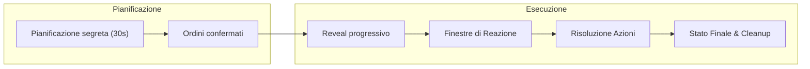

# RefactorTactics – Sequenza di Risoluzione del Turno

## Sommario Esecutivo
- **Pianificazione segreta (WEGO):** ~30s per programmare tutti gli ordini. In Phantom Brigade la fase di pianificazione risultava **molto più lunga** dell’esecuzione. Ogni unità riceve un ordine compatto (es. *Muovi+AbilitàX*), con percorso calcolato automaticamente. Sono previsti fallback configurabili (es. cambiare bersaglio se invalido, mantenere posizione), macro-comandi (es. “proteggi Y”), e reazioni automatiche preimpostate (parata, copertura) per velocizzare la pianificazione.  
- **Reveal & Esecuzione (45–60s):** le intenzioni nemiche vengono rivelate **progressivamente** (icone generiche → elemento→ bersaglio specifico). Le azioni si risolvono su una **timeline orizzontale** (simile a un editor video) con finestre di reazione brevi (~3s). Si può **intervenire** con nuove azioni (`Reaction`) o modificare quelle in corso (`Patch`). La risoluzione segue un ordine **LIFO** (last-in-first-out), come nello stack di Magic.  
- **Meccaniche di risoluzione:** si usano code separate: *Command Queue* (ordini pianificati), *Reaction Stack* (risposte dinamiche) e *State Queue* (effetti di sistema come morte, scadenze). Gli eventi simultanei vengono ordinati in base a **priorità** (sistema→attivo→difensore→terreno→globale). Ogni azione ha attributi (velocità *Immediate/Reazione/Rapida/Standard/Lenta*, priorità, timing risoluzione) e checkpoint interni (OnMove, OnHit, ecc.) per inserire reazioni. Vedi tabelle in basso per categorie e budget di default.  
- **UI/UX:** focus su chiarezza e ritmo. Use **timeline semplificata** (icone unità+abilità, barre di durata) e log post-turno. Minimizzare le interruzioni: pochi popup di reazione (max 2–3 totali), timer brevi (3s), reazioni automatiche se possibile. La camera segue eventi critici (danni alti, uccisioni, interrupt) e raggruppa azioni indipendenti in parallelo. Fornire feedback testuali (es. “Carica fallita – ostacolo” invece di “fallita”) e opzioni fallback visibili. Prevedere review/replay del turno per comprendere esiti complessi.  
- **Implementazione POC:** definire data model (JSON) con campi standard (`speed`, `timing`, `trigger`, `conditions`, `effects`, `priority`, ecc.). Fornire snippet di esempio (vedi sotto). Impostare default consigliati: es. 2 Reaction Points per squadra, profondità stack ≈5, max 3 finestre di reazione per round, timer 3s, max 4 unità/squadra. Include diagrammi flow/timeline (vedi oltre) e checklist finale di passo per il prototipo.  

## Pianificazione (30s)
- **Secret Planning:** fase WEGO in cui ciascuna parte programma in privato le mosse. Il nemico vede solo segnali generali (es. postura offensiva, caricamento) e **non** i dettagli dell’abilità. L’interfaccia mostra la piazzola e icone semplificate (es. freccia o fulmine per attacco d’elemento) durante la selezione.
- **Ordini compatti:** ogni unità riceve *un solo* comando principale (tipicamente **Muovi + Azione**). Il percorso verso il bersaglio è calcolato automaticamente e proposto (in base a linee di movimento). L’utente conferma con pochi click/tap: seleziona unità, abilità, bersaglio/area. Selezione di fallback (bersaglio alternativo predefinito, posizione difensiva) è possibile.
- **Comportamenti predefiniti:** unità senza ordine eseguono stance difensive o mantengono posizione, e attivano reazioni impostate (es. *parata automatica alla prima difesa*, *ritirata su ordine*, *caccia all’avversario più vicino*). Queste impostazioni si configurano fuori battaglia (friend-fire off, azioni di overwatch, trigger autom., ecc.) per ridurre carico decisionale.
- **Politiche di fallback:** prevedere regole automatiche se l’ordine iniziale fallisce (bersaglio si sposta). Esempi: “se bersaglio non valido, colpisci nemico più vicino” oppure “annulla azione e recupera risorsa”. L’UI deve mostrare la policy attiva (tooltip) in fase di pianificazione.
- **Reazioni preimpostate:** ogni abilità *Reazione* (es. parata, schivata, contrattacco) può essere configurata come “automatica” (trigger a risposta istantanea), “con conferma” (popup tempo-limitato) o “disabilitata”. Ciò permette di spendere punti reazione in modo strategico e avere meno interruzioni.
- **Ripeti/Auto-Confirm:** pulsanti per ripetere piani precedenti o conferma automatica allo scadere del timer (invece di panic-click). Un’attività semplificata: se il giocatore non assegna ordini a un’unità entro fine timer, questa esegue un comportamento predefinito (es. stand-by difensivo).
- **Limiti squadra:** consigliato max **3–4 unità** controllate per squadra. Aumentare le unità moltiplica il carico decisionale e rallenta la fase di pianificazione.

 *Figura: **Pianificazione segreta** – visualizzazione di Phantom Brigade con traiettorie pianificate delle unità (esempio di interfaccia WEGO).*

## Rivelazione ed Esecuzione (45–60s)
- **Livelli di rivelazione:** mostriamo l’azione nemica a step: inizialmente solo l’intenzione generale (es. attacco a distanza vs corpo a corpo), poi dettaglio di elemento e area, infine bersaglio. Ad ogni livello si apre la finestra di reazione corrispondente. Personaggi con analisi o visione speciale possono svelare più dettagli.
- **Finestre di reazione su eventi:** le opzioni di risposta sono basate su trigger osservabili (*OnUnitTargeted*, *OnAttackDeclared*, *OnTileEntered*, ecc.), non su eventi segreti. Ad esempio, il giocatore non può schivare “al momento della pianificazione”, ma solo quando un nemico inizia visibilmente a muoversi su di lui.  
- **Tipi di intervento:**  
  - *Reazioni classiche:* Counter (annulla azione), Interrupt (ferma/exit), Redirect (cambia bersaglio), Dodge, Shield, ecc. Ad es. *Contrincantesimo* rimuove la magia dal loop; *Deviazione* rimanda il colpo altrove.  
  - *Patch (modificatori dinamici):* permettono di modificare un’abilità in esecuzione senza inserirne una nuova nella pila. Es.: mentre un’unità carica, un alleato può “infondere fuoco” nella carica (aggiungendo danno elementale) o “ri-bersagliare” la traiettoria. Questo crea combo emergenti senza definire esplicitamente ogni combo nel design.  
- **Batching vs Serializzazione:** azioni indipendenti (es. attacchi in zone diverse) possono essere mostrate in parallelo; invece, eventi collegati (es. carica + barriera + spinta) vengono riprodotti sequenzialmente con focus camera. Ad esempio, se un tank fa fuoco in Area A mentre un’altra unità corre in Area B, si mostrano simultaneamente; ma se una carica interagisce con un trigger, si centra la scena sulla collisione.  
- **Timeline UI:** una barra orizzontale nell’HUD mostra la sequenza delle azioni programmate: ogni nodo contiene icona/unità+abilità e vettore tempo (colore o icone per categoria di velocità). (Phantom Brigade ha adottato una timeline lineare di tipo “video editing” per posizionare azioni nel tempo.) Durante l’esecuzione il cursore scorre avanti. L’utente può mettere in pausa la riproduzione per esaminare o selezionare eventi nel log.  
- **Camera e animazioni:** focus automatico solo su eventi chiave (danni alti, uccisioni, catene elementali); movimenti banali (percorrenza caselle vuote, danni passivi) possono essere visualizzati “indietro” o accelerati. Per eventi multipli usa picture-in-picture o indicatori (es. mini-mappa). L’utente deve poter intervenire leggermente su angolo/zoom senza interrompere il flusso.  
- **Log e Replay:** mostrare in sovrimpressione brevi summary (es. “Gi al tank infligge 20 danni”), e permettere dopo il turno una schermata di log dettagliato (timestamp, catena eventi) per chiarire esiti inattesi. Questo aiuta a capire perché, ad esempio, un’abilità è stata annullata.  

## Sequenza di Risoluzione Dettagliata
- **Code separate:**  
  - *Command Queue:* contiene le azioni principali ordinate pianificate.  
  - *Reaction Stack:* contiene le azioni reattive inserite di volta in volta. Si risolve LIFO (ultimo elemento inserito, primo risolto).  
  - *State Queue:* contiene effetti di sistema obbligatori (morte unità, scadenza status, caduta terreno, ecc.) che si attivano come SB (State-Based Actions).  
- **Ordine di risoluzione:** generalmente si procede in questo ciclo: esegui una comando dalla queue → apri finestra reazioni → risolvi l’ultima reazione → applica effetti intermedi → controlla stati (morti, buff scaduti) → eventualmente inserisci nuovi trigger in stack → continua con il prossimo comando.  
- **APNAP adattato:** nelle situazioni di trigger simultanei, si usa un ordine di gruppo: 1) effetti di sistema (State Queue), 2) effetto dell’unità attiva, 3) trigger di alleati dell’attivo, 4) trigger avversari, 5) terreno/oggetti, 6) effetti globali di missione. All’interno di ogni gruppo, le priorità interne (velocità, valore Priority, iniziativa) decidono l’ordine deterministico.  
- **Categorie temporali:** sintetizziamo 5 livelli di “velocità” nell’interfaccia giocabile:  
  - *Immediate:* effetti istantanei, non impilabili (es. rimozione status, perdita risorsa).  
  - *Reazione:* uscite istantanee dei giocatori (es. parata, schivata, contrattacco).  
  - *Veloce:* azioni rapide che entrano nella pila (es. attacco leggero, scudo base).  
  - *Standard:* azioni principali (es. attacco forte, magia media, movimento lungo).  
  - *Lenta:* azioni potenti/rituali che si risolvono al termine della fase o round successivo (es. meteorite, resurrezione).  

| Velocità    | Descrizione             | Esempio                 |
|-------------|-------------------------|-------------------------|
| Immediate   | Effetti istantanei di sistema (no controrisposte) | Morte unità, scadenza buff |
| Reazione    | Risposte rapide del giocatore (fast response) | Parata, schivata, contrattacco |
| Veloce      | Azioni rapide inseribili nella pila | Attacco leggero, cura rapida |
| Standard    | Azioni principali del turno | Attacco pieno, incantesimo medio |
| Lenta       | Azioni potenti/lente (end-of-phase) | Meteorite, evocazione grande |

- **Checkpoint interni:** ogni abilità complessa può essere suddivisa in fasi interne (es. *Carica*: Inizio movimento → Ogni passo → Arrivo bersaglio → Impatto → Danno). A ogni checkpoint è possibile attivare trigger specifici (OnActionStart, OnMoveStep, OnHit, OnDamageApplied, OnAbilityEnd, ecc.) e aprire nuove finestre reazione se valido.
- **Limiti di stack:** per prevenire explosion, impostare parametri di sicurezza: es. profondità massima pila = 5, max 1 reazione per unità per round, max 2–3 finestre globali per round. Eventuali azioni eccedenti possono essere posticipate alla fine della fase.  
- **Esempio illustrativo:**  
  1. *Attacco base* Standard di A su B entra in Command Queue.  
  2. Durante esecuzione, B usa *Scudo Rapido* (Reaction) → stack: [Scudo][Attacco].  
  3. A usa *Impetuo* (Reaction) prima che il danno colpisca → stack: [Impetuo][Scudo][Attacco].  
  4. Risoluzione stack LIFO: Impetuo (annulla prossimo controllo) → Scudo (riduce danno) → Attacco (colpisce ridotto).  
  5. Se B muore, si attiva State Queue (*OnDeath*), potenzialmente generando nuovi trigger (es. evocazione).

## Problemi UX/UI e Soluzioni
- **Budget di interruzioni:** per mantenere il ritmo (~60s), limitare le pause. Esempio: max **3 finestre** di reazione/round (2–3 totali), con **timer 2–3s** ciascuna. Se il giocatore non risponde in tempo, usare risposta predefinita o passi successivi autom.  
- **Reazioni automatiche:** incentivare impostazioni automatizzate. Ad esempio, una *Parata base* può attivarsi automaticamente alla prima minaccia fisica, senza popup. Molte risposte minori non dovrebbero creare popup intrusivi, ma agire silenziosamente (mostrando solo un breve effetto visivo).  
- **Finestre contestuali raggruppate:** evitare popup multipli per eventi correlati. Un unico prompt può coprire catene di eventi in successione breve. Esempio: “Guardiano sta caricando su terreno elettrico. Vuoi reagire?” (invece di tre popup separati per carica, acqua, scarica).  
- **Lingua visiva chiara:** usare simboli e codici colore coerenti: p.es. icona fulmine per Reazioni, clessidra per azioni Lente, ecc. Nel timeline, differenziare le barre di durata per categoria (arancione per Veloce, rosso per Standard, viola per Lenta). Unità sul campo mostrano indicatori di *intent* (“!” attacco, “⚡” mossa rapida) per rendere prevedibile cosa scatta.  
- **Feedback su esiti:** ogni deviazione dal piano va spiegata immediatamente. Es.: “Obiettivo Uscito dal Raggio: azione annullata”, “Parata attivata: danno ridotto” piuttosto che messaggi generici. Questo aiuta a ricostruire la catena causale.  
- **Politiche di fallback visibili:** durante la pianificazione permettere di impostare azioni alternative. Se si verifica un fallimento, mostrare nella UI cosa è successo (es. “Tiro fallito, bersaglio alternativo: Goblin più vicino”).  
- **Accelerazione intelligente:** se la risoluzione supera 60s, applicare automaticamente speed-up: saltare animazioni minori (movimenti arati, danni periodici), comprimere sequenze elementali semplici, accorciare transizioni. Sempre salvaguardare l’ordine degli eventi.  
- **Accessibilità e controllo:** abilitare pausa manuale in single-player. Fornire opzioni UX per diminuire complessità (es. nascondi buff secondari, semplifica grafica effetti).  

## Implementazione (dati e API)
- **Modello dati azioni/effetti:** ogni abilità/trigger va descritto in JSON o data-driven. Campi consigliati:
  - `id`: identificatore univoco.
  - `speed`: una delle categorie (Reaction/Fast/Standard/Slow).
  - `timing`: quando risolvere (Now, EndOfAction, EndOfPhase, ecc.).
  - `trigger`: evento che scatena (OnAllyTargeted, OnDamage, OnTileEntered, OnDeath, ecc.).
  - `conditions`: condizioni booleane (es. “Target.Health < 50%”).
  - `effects`: lista di azioni da applicare (ApplyDamage, Heal, ApplyStatus, RedirectTarget, ecc.) con parametri.
  - `priority`: valore numerico per ordinamenti secondari.
  - `interruptRules`: regole su come l’effetto può essere interrotto o deviato.
  
  Esempio JSON di skill reattiva:
  ```json
  {
    "id": "skill_counter_shield",
    "speed": "Reaction",
    "timing": "Now",
    "trigger": "OnAllyTargeted",
    "conditions": ["Target.Distance <= 3", "Source.HasReactionPoint"],
    "effects": [
      { "type": "ApplyShield", "value": 30 },
      { "type": "RedirectTarget", "target": "Source" }
    ],
    "priority": 200,
    "interruptRules": {
      "canBeCountered": true,
      "canBeRedirected": false
    }
  }
  ```
- **Ordinamento deterministico:** implementare la logica APNAP/priority: in caso di trigger simultanei, ordinare prima per owner (attivo/difensore), poi per priorità/velocità. Applicare LIFO alla Reaction Stack. Ciò garantisce riproducibilità degli esiti.  
- **Categorie/Default:** definire un set standard di velocità (Reaction, Fast, Standard, Slow; Immediate solo interno). Distinguere `timing` di risoluzione (ad es. `Now` vs `EndOfPhase`). Impostare guardrail: Reaction Points (RP) spalmati sulla squadra (es. 2–3 totali), max 1 RP per unità per round; stack limitato a 5 elementi; max 1-2 trigger reattivi programmati per unità.  
- **Tabelle di default:** vedi sotto per i valori consigliati di queste categorie e risorse.  
- **Checklist POC (sintetica):**  
  - Definire le classi/JSON per Action, Effect, Unit, Terrain, ecc.  
  - Implementare le code: *Command Queue*, *Reaction Stack*, *State Queue*.  
  - Gestire le *priority windows*: apertura automatica di finestre reazione in base a trigger visibili.  
  - Creare HUD di pianificazione: selezione unità, assegnazione abilità/bersaglio, gestione timer.  
  - Realizzare Timeline HUD per l’esecuzione (barra orizzontale).  
  - Gestire risoluzione LIFO con priorità (inserimento pull pop).  
  - Implementare 3 velocità e esecuzioni con timer (movimento, attacchi con durata).  
  - Integrare camera e HUD dinamico per reazioni (popup contestuali, highlight bersagli).  
  - Testare e calibrare limiti (stack depth, RP) per evitare stalli o combo infinite.  

| **Categoria Tempo** | **Descrizione**               | **Esempio**               |
|---------------------|-------------------------------|---------------------------|
| Immediate           | Effetti sistema immediati     | Morte unità, rimozione buff |
| Reazione           | Risposta istantanea del giocatore | Parata, schivata           |
| Veloce             | Azione rapida (entra pila)    | Attacco leggero, scudo    |
| Standard           | Azione di base del turno      | Attacco completo, magia media |
| Lenta              | Azione potente, lenta (fine fase) | Meteorite, rituale        |

| **Parametro**               | **Default consigliato** |
|-----------------------------|:-----------------------:|
| Reaction Points per squadra | 2 (max 3 con pochi membri) |
| Profondità max dello stack  | 5                     |
| Finestre reazione per turno | 2–3 (totali squadra)   |
| Tempo reazione (per finestra) | 3s                  |
| Azioni per unità           | 1 comando principale + 1 fallback |
| Unità per squadra          | ≤4                    |

### Diagramma di flusso (mermaid)


**Checklist POC:** stabilire le seguenti milestone:
- [ ] Creare data model JSON (Action/Effect) con campi sopra indicati.  
- [ ] Implementare sistemi di code (Command, Reaction, State) con LIFO e APNAP.  
- [ ] Sviluppare UI di pianificazione (selezione unità/abilità/bersagli, timer).  
- [ ] Sviluppare UI di esecuzione (timeline visibile, popup reazioni contestuali).  
- [ ] Aggiungere meccanismi React vs Patch in engine (inserimento vs modifica).  
- [ ] Definire tutte le categorie di velocità e triggers di default (vedi tabelle).  
- [ ] Introdurre guardrail UX (limiti RP, timer, accelerazione automatica).  
- [ ] Test e debug: provare scenari di reazione multipla, fallback, edge-case (nessun bersaglio, info nascoste).  

**Fonti:** il modello si ispira a giochi come *Phantom Brigade* (simulazione turni simultanei e UI timeline) e *Magic: The Gathering* (meccanica dello stack LIFO). Altri spunti da esperienze di UI/UX tattica e card game sono stati adattati per garantire chiarezza e velocità. Non sono stati rintracciati manuali ufficiali specifici per queste meccaniche, dunque le decisioni si basano su best-practice di game design simultaneo.