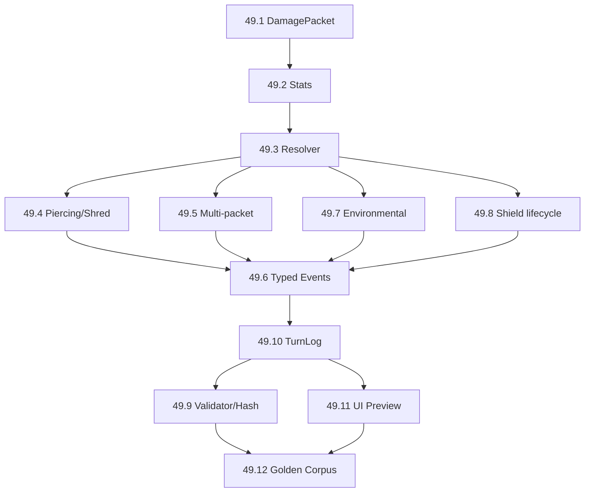

# PRD — Damage Model, Armor, Shield e Damage Resistance (E49 proposta)

> **Non è fonte normativa.** Livello **8** della gerarchia, come gli altri PRD di questa cartella. Non
> autorizza da solo a implementare ciò che contiene: è un **input di ricerca**, e un handoff non è autorità.
> Le decisioni vivono in [`../../product/piano-canonico-mvp.md`](../../product/piano-canonico-mvp.md) e negli
> [ADR](../../decisions/); i numeri vigenti nei [cataloghi di bilanciamento](../../balance/README.md).
>
> **Tipo**: PRD esterno riassunto e verificato · **Origine**: 2026-08-27 · **Verifica**: 2026-08-27

## Da dove viene, e cosa manca

| Sorgente | Cosa contribuisce | Stato |
|---|---|---|
| `deep-research-report.md` (fuori repository: `refactor-tactics-main/docs/src/`) | Executive summary della sessione di ricerca: pipeline, tabella delle decisioni congelate, struttura E49 | Recepito qui |
| `PRD_E49_Damage_Model_Hex_Cover_v1.0.md` | Requisiti funzionali/non funzionali, data model, pseudocodice, due esempi TurnLog, payload JSON, migration plan, test plan, DoD | 🔴 **Irrecuperabile** |
| `E49_issues_proposte.json` | Epic + dodici issue machine-readable | 🔴 **Irrecuperabile** |
| `PULL_REQUEST_TEMPLATE_E49.md` | Checklist di PR per il dominio | 🔴 **Irrecuperabile** |

⚠️ **Chi legge non ha il PRD: ha il suo riassunto.** I quattro artefatti erano link `sandbox:/mnt/data/…` di
una sessione chiusa, e non esistono né nel repository né altrove sul disco. Il dettaglio implementativo —
pseudocodice, acceptance criteria, esempi di traccia — **non è mai atterrato**. Va riprodotto prima di
aprire le issue, non citato come se fosse disponibile.

Il report originale conteneva inoltre marker di citazione (`fileciteturn…`, `citeturn0search…`) che qui
sono stati rimossi: puntavano a contesti di sessione non risolvibili. Le affermazioni che sostenevano sono
state **rimisurate sul branch corrente** — sezione [Stato verificato](#stato-verificato-contro-il-repository).

## La tesi

Un ordine di applicazione unico, dalla topologia al log:

```text
HEX / TOPOLOGY → Cover + Facing → Active Defense → DamagePacket
    → Armor + DamageResistance → TemporaryShield → Shield → Health
    → Typed Events → TurnLog
```

Il documento **non rifonda hex né cover**: li tratta come dipendenze già consegnate. Innesta il modello sul
punto in cui oggi il danno si applica davvero.

### Le tre separazioni

```text
DamageSource → decide l'applicabilità di Armor
DamageType   → decide quale DamageResistance leggere
Shape        → decide geometria/targeting
```

Perciò `Fireball` (`Direct + Fire + Area`) attraversa `Cover → Active Defense → Armor + FireResistance →
Shield → HP`, mentre `Burning` (`Environmental + Fire`) salta Armor e passa da `FireResistance → Shield →
HP`. La forma non decide la mitigazione.

🔴 **E la forma non decide nemmeno se un'azione è un colpo.** È la lezione di
[#1491](https://github.com/DegrassiAaron/refactor-tactics-main/issues/1491): `Action.Interact` produceva un
packet da zero danni con `Shape=Single` e armava una reazione da hit, incassando un contrattacco da 10.

```text
Shape == Single  ≠  CountsAsAttack  ≠  ProducesDamagePacket  ≠  Hit
```

Il packet deve **dichiarare** la semantica (`bCountsAsHit`), o la produzione stessa dev'essere parte del
contratto dell'azione. Nessuna deduzione implicita dalla geometria.

## Decisioni congelate nel report

| Dominio | Regola |
|---|---|
| **Armor** | signed; può essere negativa |
| Applicabilità Armor | solo `DamageSource=Direct` |
| **Shield** | stat/risorsa, **non** azione |
| Range Shield | `0..MaxShield` |
| MaxShield | sì |
| Shield negativo | mai |
| Overshield | no nella baseline |
| TemporaryShield | rispetta MaxShield, consumato per primo, il residuo scade |
| Shield regeneration | ~~nessuna rigenerazione automatica~~ — 🔴 **superata da [D-224]** (2026-08-28): ogni unità porta 5 punti di scudo base che si ricaricano nel Cleanup |
| Status/control | Shield assorbe il danno ma non li cancella |
| **DamageResistance** | signed per `DamageType`; negativa = weakness |
| DamageType iniziali | `Kinetic`, `Fire`, `Electric` |
| **DamagePacket** | esattamente un `DamageType` |
| Mixed damage | più packet |
| Multi-hit | mitigazione per packet **logico**, non per projectile visuale |
| **DamageSource** | almeno `Direct` / `Environmental` |
| Environmental | niente Armor; Resistance sì, Shield sì |
| **Shape** | `Single`, `Line`, `Cone`, `Area`; non decide Armor |
| Armor + Resistance | un unico passaggio matematico |
| Zero dopo active defense | non riattivabile da Armor/Resistance negativa |
| **Piercing** | ignora solo Armor **positiva** |
| **Shred** | modifica Armor e può portarla negativa |
| DoT | legge la Resistance quando il packet risolve |
| Eventi | `Hit`, `ShieldDamage`, `HealthDamage` **distinti** |
| Affinity/Weakness | identità semantica, non generazione automatica delle Resistance |
| Healing | cura HP, non Shield |
| UI/bot | stessa query pura del resolver |
| Networking | apply competitivo server-authoritative |
| GAS | lifecycle/presentation, **non** autorità del Damage Resolver |

⚠️ **Una sola voce resta aperta al bilanciamento**: il minimo di Armor negativa. La raccomandazione è un
`Rules.MinArmor` data-driven e hashato, non un `-10` hardcoded.

### Il debito `Action.Shield`

Il report prescrive una **migrazione**, non l'assegnazione dell'azione a un eroe:

```text
Action.Shield    → legacy da ritirare
Shield           → stat
MaxShield        → stat
TemporaryShield  → quota temporanea della stat Shield

skill specifica → GrantShield / RestoreShield
```

### DamageResistance contro ControlResistance

Il termine «Resistance» è già occupato da un'altra meccanica. Servono nomi che non collidano:

```text
DamageResistance             ControlResistance / StatusResistance
→ intero signed per          → sistema E36 (#440)
  DamageType                 → degrada un effetto di controllo
→ modifica il danno            (Full / Degraded / Rejected)
```

Non devono condividere formula, enum o pipeline solo perché portavano lo stesso nome. `#440` stabilisce
anche che danno e status si risolvano **separatamente**.

## Stato verificato contro il repository

Misurato il **2026-08-27** su `feat/1510-la-misura-non-mente`, HEAD `59c5f580`. Il report è stato scritto lo
stesso giorno, e in due punti il repository lo ha già superato.

| Affermazione del report | Misura sul branch | Esito |
|---|---|---|
| `Action.Shield` esiste ed è irraggiungibile | Spedita da `RTCatalogLibrary.cpp:1399`, dichiarata esclusa in `RTCatalogTests.cpp:501` (*«Aspetta il suo eroe»*) | ✅ regge |
| `Action.Purge` è irraggiungibile | **[D-218]** (oggi) l'ha resa raggiungibile come base di `Reaction.Cleanse`; il gate `Catalog.EveryCoreActionIsReachableOrDeclared` è diventato rosso da solo chiedendo di togliere l'esclusione | ❌ **superato** |
| `#1403` è aperta | `OPEN`, ma il titolo cita **tre** azioni e una è caduta: restano `Cleanse` e `Shield` | ⚠️ parziale |
| `ARTUnit` ha `Health`, `MaxHealth`, `Shield`, `Affinity`, `Weakness` | `RTUnit.h:77,80,83,118,121` | ✅ regge |
| Armor, MaxShield, DamageResistance, DamagePacket sono nuovi | **Zero** riscontri in `Source/` | ✅ regge |
| TemporaryShield è da introdurre (fetta 49.8) | 🔴 **Esiste già**: `AddTemporaryShield`, `ExpireTemporaryShield`, `GetTemporaryShield` (`RTUnit.h:496-613`), consumato per primo e scaduto nel Cleanup. Manca **solo** il cap `MaxShield` | ⚠️ **già fatto a metà** |
| Affinity/Weakness sono identità semantica, non Resistance | Assegnate in `RTHeroCatalogLibrary.cpp` e validate lì; **non compaiono in nessun calcolo di danno** | ✅ regge |
| Il punto d'innesto è la pipeline del danno | `URTCombatLibrary::ApplyDamage(Damage, Shield, Health)`: assorbe con lo scudo, poi scala la salute. Nessun tipo, nessuna sorgente, nessuna mitigazione | ✅ confermato |
| `#1491` è «aperta oggi» | 🔴 **`CLOSED`** — corretta e mergiata (PR #1507) | ❌ **stale** |
| `#440` è aperta e usa «Resistance» per il control | `OPEN` — *«CP 36.5 · resistance degrada, immunity nega, cleanse per categoria»* | ✅ la collisione è reale |
| `#1392` è aperta | `OPEN` | ✅ regge |
| E40/E41/E45 aperte; v1.0 non aggiunge feature | `roadmap-post-v0.1.md:40-45` conferma la sequenza v0.5→v1.0 e E45 come gate di produzione | ✅ regge |
| E49 è una proposta | Nessun riscontro documentale: **non esiste** nella roadmap | ✅ proposta, non stato |

### Cosa è stato consegnato da qui, e cosa questo documento non dice più

**[D-224]** (2026-08-28) ha spedito una fetta di questo PRD e ne ha **superata una tesi**:

- ✅ **`DamageSource` esiste**, nella forma binaria `Direct` / `Environmental`, e decide se lo scudo base
  partecipa. È la parte di 49.1 che serviva davvero; `DamageType`, `Shape`, `Piercing` e `Shred` restano
  non implementati e speculativi.
- 🔴 **«Nessuna rigenerazione automatica» è caduta**: ogni unità porta 5 punti di scudo base che tornano
  pieni nel Cleanup. La decisione lo dichiara come supersessione, non lo fa di straforo.
- ⚠️ **`MaxShield` non è arrivato**: lo scudo temporaneo resta senza tetto, perché nessuna decisione
  presa finora ne aveva bisogno.
- ⚠️ **La migrazione «`Action.Shield` da azione a stat» non è stata fatta.** Provata e ritirata prima del
  merge: dare un portatore a quell'azione porta il kit di un eroe a 11 voci contro i 10 tasti di
  `ARTPlayerController::AbilityHotkeys()`. `#1403` resta aperta.

⚠️ **`#1491` chiusa non svuota la lezione**: il regression test resta dovuto, perché ciò che è stato corretto
è il caso singolo, non l'accoppiamento `Shape → Hit` come classe di difetto.

## Il delta del 2026-08-28 — [D-235](../../decisions/RT_PDR_00_Decision_Log.md)

Consumato il kit *Combat Effect Model + Skill Card Grammar Delta*
([archivio](../../archive/src/handoff/2026-08-28-combat-skillgrammar-delta.md) ·
[referto](../../roadmap/plans/combat-skillgrammar-delta-spec-panel-2026-08-28.md)). **Undici** delle sue
invarianti erano già nella tabella qui sopra e non si riscrivono; il divieto `Shape ⇒ Attack ⇒ Hit ⇒ Damage`
è già chiuso da **D-221** con `bCountsAsAttack`. Quello che segue è ciò che restava.

### 🔴 `Armor` e `BaseShield` occupano lo stesso asse

È il conflitto che nessuna delle due fonti poteva vedere: questo documento è stato verificato il
**2026-08-27**, **D-224** ha spedito `BaseShield = 5` il **2026-08-28**.

| | `Armor` (proposta) | `BaseShield = 5` (spedito) |
|---|---|---|
| Condizione | solo `DamageSource = Direct` | solo `DamageSource = Direct` — testualmente la stessa |
| Effetto | **riduce** il danno del colpo | **assorbe** dal pool |
| Si consuma? | no, vale a ogni colpo | sì, e si ricarica nel Cleanup |
| Aggirabile da | `Piercing` | niente, oggi |

Misurato: su un'unità con `Armor 3`, due colpi `Direct` da 10 nello stesso turno tolgono **9 HP invece di
15**. Introdurre `Armor` senza dichiarare il rapporto con `BaseShield` è una modifica di bilanciamento del
**40%** presa per omissione — e `D-224` ha già misurato quanto costi sbagliare quest'asse: *«a 5 punti
indistinti un contrattacco da 10 perderebbe metà del suo peso»*.

⛔ **Questo blocca la fetta `49.2`**, non la rimanda: il rapporto fra i due va deciso **prima** che `Armor`
esista, ed è una decisione di bilanciamento, non di modello.

### La formula additiva — proposta, non congelata

```text
ApplicableArmor = Direct ? Armor : 0        con Piercing: min(Armor, 0)
Defense         = ApplicableArmor + DamageResistance[DamageType]
FinalDamage     = max(0, BaseDamage - Defense)
```

✅ **È internamente coerente**, verificata sui casi al confine: `Armor +3 → 7`, `Armor −4 → 14`,
`Environmental` ignora Armor, `Piercing` su `Armor +5` dà `0` e su `Armor −4` lascia `−4` senza riportarla a
zero — come la prosa richiede.

⛔ **Non si congela**, e non per prudenza: `Armor`, `DamageType`, `DamageResistance`, `DamagePacket` e
`Shred` hanno **zero occorrenze in `Source/`** (2026-08-28, `483e031a`). Una formula i cui termini non
esistono non è eseguibile da nessun test, e nessun gate direbbe che è divergente. Resta qui come proposta
finché `49.1` e `49.2` non atterrano — con il blocco qui sopra davanti.

⚠️ **Due zeri, uno solo dichiarato terminale.** Il kit dichiara terminale lo zero prodotto dall'Active
Defense. Ma `max(0, …)` ne produce **un secondo**, per saturazione della difesa, e di quello nessuno dice
nulla. Il giorno in cui esisterà un *«minimo 1 danno»*, un `on damage dealt` o un DoT che rilegge il packet,
i due si comporteranno diversamente. **Vanno distinti nel tipo di ritorno**, non in prosa.

### Vulnerability è una famiglia, non una stat

Non nasce una statistica universale `Vulnerability`. Le meccaniche restano distinte e non si sommano in un
moltiplicatore generico:

```text
FireResistance < 0  → vulnerabilità a quel DamageType, già numerica
Armor < 0           → vulnerabilità agli impatti Direct
Exposed             → modifica la relazione con Cover
Marked              → tag consumabile o interrogabile
Wet                 → stato ambientale che abilita interazioni
control weakness    → dominio ControlResistance / StatusResistance
```

⚠️ **Conseguenza pratica**: `FireResistance = -4` **è già** la vulnerabilità al fuoco. Non nasce accanto un
secondo status `VulnerableToFire` che dica la stessa cosa in un altro posto.

### Gli elementi sono verbi sistemici, non colori del danno

Un elemento può `Generate · Apply · Propagate · Transform · Consume`. La baseline preferita per `Wet +
Electric` è la **propagazione su rete conduttiva**, non un `+X%` universale al danno elettrico. Un
`DamageTakenModifier` percentuale può esistere, ma **esplicito, scoped e raro**: pile di moltiplicatori
generici (`Vulnerable +X%`, `Marked +Y%`, `Wet +Z%`) sono illeggibili al tavolo e insostituibili in un log.

⚠️ Resta fermo ciò che questo documento già dice: `Affinity`/`Weakness` sono **identità semantica** e non
generano `DamageResistance`. `Affinity.Electricity` può governare propagazione, consumo di stati e payoff di
kit senza implicare `ElectricResistance += X`.

### Due trigger in più

Ai tre eventi già congelati — `Hit`, `ShieldDamage`, `HealthDamage` — si aggiungono `OnStatusApplied` e
`OnDisplaced`. La ragione è la stessa dei primi tre: *«ha fatto danno»* non è sinonimo di *«ha colpito»*, e
un `Push` che riesce senza togliere HP è un fatto che qualcuno vorrà osservare.

## E49 proposta

```text
E49 · Damage Model, Armor, Shield e Damage Resistance

49.1  DamagePacket / Source / DamageType / Shape      49.7   Environmental Damage
49.2  Defensive Stats                                 49.8   MaxShield / TemporaryShield
49.3  Canonical Damage Resolver                       49.9   Validator / Hash / Versioning
49.4  Piercing / Shred                                49.10  TurnLog
49.5  Multi-packet                                    49.11  UI Preview
49.6  Hit / ShieldDamage / HealthDamage               49.12  Golden Corpus / Determinism / Replay
```



Collocazione proposta nella roadmap: **v0.2**, dopo la correzione del debito `Action.Shield` in v0.1 e prima
di Information/visibility policy. Non tocca la sequenza `v0.5 → v1.0` già fissata da
[`../../roadmap/roadmap-post-v0.1.md`](../../roadmap/roadmap-post-v0.1.md).

### Perché il TurnLog vuole payload tipizzati

Precedente utile: `#1430`, chiusa, aveva scoperto che `RearHitBypassedCover` aveva **due produttori** che
usavano `Amount` con significati diversi — una volta una direzione, una volta punti di riduzione. Da qui la
richiesta di payload univoci per gli eventi di danno, invece di un `Amount` generico reinterpretato dai
consumatori.

### Vincoli di piattaforma richiamati

- L'`AbilitySystemComponent` espone Attributes ed effetti, ma la documentazione Epic avverte che alcuni
  valori letti lato client possono non riflettere gli effetti predetti: ragione in più per tenere
  resolver/snapshot come autorità competitiva, coerente con E41.
- UE 5.8 offre Data Validation a livello di progetto e un `EditorValidatorSubsystem` usabile da commandlet:
  il gate su DamageType e statistiche va costruito lì, non come validator parallelo.

⚠️ Entrambe le righe vengono dal report e **non sono state riverificate** contro la documentazione Epic in
questa sessione: la verifica è dovuta prima di fondarci una fetta.

## Cosa questo documento non fa

- **Non apre E49** e non crea issue: la roadmap non la contiene, e il dettaglio che le issue richiederebbero
  è negli artefatti irrecuperabili.
- **Non decide `MinArmor`**: è bilanciamento, e resta aperto per scelta.
- **Non chiude `#1403`**: `Action.Shield` resta senza kit. Se la migrazione «Shield da azione a stat» viene
  accettata, l'issue si chiude **ritirando** l'azione, non assegnandola — ma quella è una decisione di
  prodotto, e il suo posto è [`../../OPEN_DECISIONS.md`](../../OPEN_DECISIONS.md), accanto a `CLEANSE-1`,
  che già lega l'uscita di `Action.Shield` a quella di `Action.Cleanse`.
