# Execution map — cosa blocca cosa

> `GENERATO` · lo riscrive `python scripts/feature_registry.py shortlist`.
> **Cosa e'**: la figura delle dipendenze di esecuzione, con lo stato di ogni nodo.
> **Cosa non e'**: una fonte. Nodi, archi e readiness vengono da
> [`project-graph.json`](project-graph.json), che li deriva dagli owner; la topologia da
> [`execution-graph.yaml`](execution-graph.yaml).

La stessa figura, interattiva e filtrabile, e' il tab **Execution Map** del
[Project Control Center](../control-center/README.md). I conteggi e le tabelle stanno
sulla Wiki, in [Stato del progetto](https://github.com/DegrassiAaron/refactor-tactics-main/wiki/Stato-del-progetto):
li' il diagramma non compare perche' **le pagine Wiki non rendono Mermaid**.

Fetta «THIN_SLICE» · **20 nodi** · **11 dipendenze dure** · **7 relazioni molli**.

```mermaid
flowchart LR
  issue_164["164 DONE"]
  i_issue_164((.)) -.- issue_164
  issue_165["165 READY"]
  issue_166["166 UNKNOWN"]
  issue_166 -.- o_issue_166((.))
  issue_314["314 UNKNOWN"]
  issue_314 -.- o_issue_314((.))
  issue_319["319 READY"]
  i_issue_319((.)) -.- issue_319
  issue_319 -.- o_issue_319((.))
  issue_512["512 BLOCKED"]
  issue_66["66 DONE"]
  i_issue_66((.)) -.- issue_66
  issue_75["75 READY"]
  i_issue_75((.)) -.- issue_75
  issue_170["170 BLOCKED"]
  issue_171(["171 UNKNOWN"])
  issue_171 -.- o_issue_171((.))
  issue_625["625 READY"]
  i_issue_625((.)) -.- issue_625
  issue_625 -.- o_issue_625((.))
  issue_649["649 READY"]
  i_issue_649((.)) -.- issue_649
  issue_649 -.- o_issue_649((.))
  issue_687["687 READY"]
  i_issue_687((.)) -.- issue_687
  issue_687 -.- o_issue_687((.))
  issue_287["287 READY"]
  i_issue_287((.)) -.- issue_287
  issue_288["288 UNKNOWN"]
  issue_288 -.- o_issue_288((.))
  issue_289["289 UNKNOWN"]
  issue_289 -.- o_issue_289((.))
  issue_593["593 READY"]
  i_issue_593((.)) -.- issue_593
  issue_593 -.- o_issue_593((.))
  session_U7[["U7 READY"]]
  i_session_U7((.)) -.- session_U7
  session_U7 -.- o_session_U7((.))
  session_U8[["U8 READY"]]
  i_session_U8((.)) -.- session_U8
  session_U8 -.- o_session_U8((.))
  session_U9(["U9 READY"])
  i_session_U9((.)) -.- session_U9
  session_U9 -.- o_session_U9((.))
  issue_164 ==> issue_165
  issue_165 ==> issue_166
  issue_165 ==> issue_314
  issue_165 ==> issue_512
  issue_512 ==> issue_170
  issue_66 ==> issue_170
  issue_75 ==> issue_170
  issue_170 ==> issue_171
  issue_287 ==> issue_288
  issue_287 ==> issue_289
  issue_166 -. follows .-> issue_314
  issue_314 -. follows .-> issue_319
  issue_625 -. follows .-> issue_170
  issue_593 -. related .-> session_U7
  issue_593 -. related .-> session_U9
  issue_649 -. related .-> issue_170
  issue_687 -. related .-> issue_170
  session_U7 -. implements .-> issue_287
  session_U8 -. implements .-> issue_288
  session_U9 -. verifies .-> issue_289
  classDef ready fill:#173a2a,stroke:#4ec98a,color:#e6e9ef;
  classDef blocked fill:#3a1f22,stroke:#e06c75,color:#e6e9ef;
  classDef waiting fill:#3a3320,stroke:#e0b050,color:#e6e9ef;
  classDef done fill:#1e2b24,stroke:#4ec98a,color:#99a1b3;
  classDef unknown fill:#22262f,stroke:#4a5162,color:#99a1b3;
  classDef stub fill:#0f1115,stroke:#5a6273;
  class issue_164,issue_66 done;
  class issue_165,issue_319,issue_75,issue_625,issue_649,issue_687,issue_287,issue_593,session_U7,session_U8,session_U9 ready;
  class issue_166,issue_314,issue_171,issue_288,issue_289 unknown;
  class issue_512,issue_170 blocked;
  class i_issue_164,o_issue_166,o_issue_314,i_issue_319,o_issue_319,i_issue_66,i_issue_75,o_issue_171,i_issue_625,o_issue_625,i_issue_649,o_issue_649,i_issue_687,o_issue_687,i_issue_287,o_issue_288,o_issue_289,i_issue_593,o_issue_593,i_session_U7,o_session_U7,i_session_U8,o_session_U8,i_session_U9,o_session_U9 stub;
```

**Come si legge.** Freccia piena `==>` una dipendenza dura: finche' l'origine non e' fatta,
la destinazione non puo' cominciare. Freccia tratteggiata un legame che **non blocca** —
`follows` e' ordine consigliato, `related` navigazione, `implements`/`verifies` dicono chi
realizza e chi giudica. Il cerchietto attaccato a un nodo e' un **lato libero**: a sinistra
vuol dire che niente lo trattiene, a destra che non sblocca niente di dichiarato.

La **forma** dice chi deve intervenire: rettangolo `CODE` (repository), rettangolo doppio
`ASSET` (un asset da costruire e committare), rettangolo arrotondato `PIE` (un verdetto
davanti all'editor). Il colore ripete la readiness, che e' scritta dentro ogni nodo: serve
a scorrere la figura, non a decodificarla.
