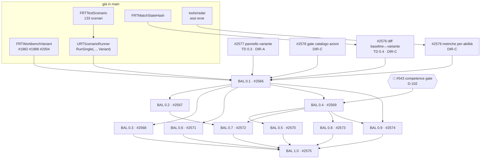

# Roadmap Balance — `CR-BALANCE`, da `BAL 0.1` a `BAL 1.0`

> `CURRENT` · **Stato**: vivo · **Aperta**: 2026-09-06 · **Misurata su**: `origin/main` = `7c1af4c4` e GitHub LIVE
> **Epic ancora**: [#2565](https://github.com/DegrassiAaron/refactor-tactics-main/issues/2565) · **Vista**: [`capability-roadmaps.md`](capability-roadmaps.md) — capability `CR-BALANCE`, la decima
> **Decisioni**: `D-023` · `D-102` · `D-108` · `D-121` · `D-154` · [ADR-0010](../decisions/adr-0010-esposizione-blueprint-scenario-harness.md)
> **Release**: `out_of_release_scope`
> **Confine**: [#1105](https://github.com/DegrassiAaron/refactor-tactics-main/issues/1105) possiede il **workflow** del Tactical Designer; [#1950](https://github.com/DegrassiAaron/refactor-tactics-main/issues/1950) possiede la **variante**; questo documento possiede la **domanda di bilanciamento** che li attraversa.

> 🔴 **Questo documento non possiede stato.** La source of truth sono le issue e le milestone GitHub. Quando
> questo file e GitHub non concordano, **vince GitHub**. Non introduce una seconda scala di release, non
> assegna lavoro e non è owner di nessuna feature.

---

## 1. Vision

Cambiare un numero di bilanciamento è oggi un atto **senza strumento di misura**: si modifica un catalogo
Markdown, si costruisce, si guarda una partita e si tira una conclusione da un campione di uno.

L'outcome di questa capability sta in una riga, e ogni stadio ne è una fetta:

> **Il designer cambia un parametro d'abilità e sa, con evidenza riproducibile, quali scenari cambiano esito
> e di quanto — senza scrivere C++, senza scrivere JSON a mano, e senza che il numero raggiunga la produzione
> per errore.**

Il ciclo completo:

```text
catalogo canonico → variante sperimentale → validazione → metriche derivate
     → esecuzione deterministica sui sistemi REALI → diff baseline↔variante
          → evidenza (TurnLog + StateHash) → promozione esplicita al dato canonico
```

---

## 2. Principi

### 2.1 Nessun secondo simulatore

```text
Dati canonici + regole del gioco
        │
        ├─── resolver              ← l'unica autorità sull'esito
        ├─── Scenario Harness      ← esegue il percorso reale del giocatore
        ├─── TurnLog / StateHash   ← l'evidenza
        │
        └─── pure query / DTO
                    │
                    ▼
             lente di bilanciamento
```

⛔ Nessun resolver, targeting, LOS o pathfinding di lato-strumento. **Se lo strumento dice 28 e la partita
dice 24, lo strumento ha smesso di essere una lente** — ed è motivo di arresto, non un numero da tarare.

Il vincolo esiste già ed è normativo: [ADR-0010](../decisions/adr-0010-esposizione-blueprint-scenario-harness.md),
il §3 di [`../technical/tooling/spec-tactical-designer.md`](../technical/tooling/spec-tactical-designer.md), e
il *«cosa NON autorizza»* di `D-154`.

Il principio ha già una prova costruita: `URTScenarioRunner` entra **dagli stessi ingressi del giocatore** —
scrive i piani sulle unità e chiama `LockInAndResolve()` — e il commento del suo header lo dichiara *non
negoziabile*. Il turn manager e il resolver non sanno di essere sotto test.

### 2.2 I cataloghi Markdown possiedono i numeri

`D-023`. Il workbook `RefactorTactics_Balance_Matrices_v0.1.xlsx` è **`RESEARCH`**: materiale d'analisi, mai
fonte per risolvere un conflitto contro i `.md`. Vedi [`../balance/README.md`](../balance/README.md).

### 2.3 Le metriche sono descrittive, il verdetto è umano

⛔ Nessun `Balance Score` opaco come gate (`D-154`). Le formule sono **esplicite, versionate, testate e
spiegabili**, oppure non sono un criterio. Il gate umano resta
[#403](https://github.com/DegrassiAaron/refactor-tactics-main/issues/403) (`U20/PIE-BAL1`).

### 2.4 La maturità di capability non è una release

⚠️ **`BAL 0.7` non ha niente a che vedere con `v0.7`.** Stessa convenzione di `TD 0.x`, `GKP 0.1`,
`Replay 0.3`, `PRESENT 0.2`.

Il precedente è registrato: il **2026-08-13** una milestone *«Skill Balance Lab v0.3»* fu proposta e
dichiarata **superata**, con la ragione scritta in `D-154` — *«uno strumento collocato nella roadmap di
release compete con la consegna»*. Due referti successivi hanno respinto ⛔ la stessa forma di errore due
altre volte: la scala `TD 0.1 … TD 1.0` rinumerata, e `SW-E1 … SW-E9`.

**Questa è la quarta volta che la proposta arriva, ed è la prima in cui non apre una scala nuova.**

### 2.5 Il vocabolario

**`Variant`**, non `Candidate`. `D-154` ha misurato che `Candidate` è già occupato in cinque header di
`Source/RefactorTactics` con **due** significati: la mossa valutata dal bot, e ciò che il raycast trova sotto
il cursore. Un terzo lo renderebbe illeggibile.

⚠️ E `Variant` ha già **due** portatori che ogni fetta deve nominare invece di ignorare:

| Struct | Cosa significa oggi |
|---|---|
| `FRTAbilityVariant` | variante di **loadout** — *«un compromesso ORIZZONTALE: cambia COME si usa l'abilità, non QUANTO è forte»* |
| `FRTScenarioVariant` | variante di **allestimento** — **solo celle**, e un canary di **equità** |
| `FRTWorkbenchVariant` | la variante **sperimentale**: *«questa abilità, ma con questo numero»* |

### 2.6 Si linka, non si duplica

Regola 1 della vista: **un solo primary owner per issue**. Gli stadi da `BAL 0.4` in poi sono **indici**:
nominano il proprio owner e non ne rivendicano lo scope. Se uno stadio e il suo owner divergono, ha ragione
l'owner.

---

## 3. Il gap che questa capability chiude, misurato

Il repository aveva **nove** capability nella vista longitudinale. Nessuna era il bilanciamento — e il lavoro
esisteva comunque, sparso su otto owner che non si vedevano fra loro.

| Dove vive oggi | Owner | Ma |
|---|---|---|
| i numeri canonici | [`../balance/`](../balance/) (`D-023`) | 35 ID d'azione **senza gate** contro il C++ |
| la variante sperimentale | #1950 (`TD 0.3`) — cinque figli su cinque chiusi | nessun **ingresso**: il dato c'è, il pannello no |
| l'esecuzione | `URTScenarioRunner` · 133 scenari · 11 tipi di assertion | ✅ consegnata |
| il confronto fra due run | `TD 0.4`, dichiarato dall'owner | **nessuna issue lo possedeva** |
| le metriche derivate | `tools/radar/` | misurano l'**eroe**, non l'**abilità** |
| la misura a lotti | #776 (`E43`, `v0.8`) | 🔴 bloccata dal competence gate `D-102` (#543) |
| il runtime d'abilità | #774 (`E41`, `v0.6`) | GAS **runtime, mai autorità** |
| il gate umano | #403 (`BAL-1`) | `U20/PIE-BAL1` |

---

## 4. Cosa è già consegnato, e non va rifatto

Questa è la metà dell'audit che conta: **gran parte del ciclo esiste**.

| Pezzo | Owner | Stato |
|---|---|---|
| dove vive l'override, e perché non nel formato scenario | #1982 | ✅ chiusa |
| `FRTWorkbenchVariant` — `VariantId`, `Overrides`, `IsBaseline()` | #1988 | ✅ chiusa |
| `Validate()` **prima** di scrivere · `OutRestore` come `Reset` | `Ability/RTWorkbenchVariant.h` | ✅ in `main` |
| la variante raggiunge **ogni** unità che porta l'azione | #2004 | ✅ chiusa |
| il readout espone il campo che il resolver legge | #1953 | ✅ chiusa |
| il guardiano `Actions.HeroKitsMatchTheirCatalogDef` | #1963 | ✅ **esiste** |
| i nove stadi del danno, registrati invece che scartati | #1951 | ✅ chiusa |
| esecuzione canonica, `Reset`, `Result`, TurnLog | #1117 | ✅ chiusa |
| `RunSingle(World, Scenario, tearDown, Variant)` | `ScenarioHarness/` | ✅ in `main` |
| la variante in PIE da `L_DevSandbox` | `RTScenarioSession::WorkbenchVariant` | ✅ in `main` |
| formato scenario human-readable, versionato, diffabile | `FRTTestScenario` | ✅ **non si duplica, si estende** (`D-154` §4) |
| corpus scenari | **133** file · **11** tipi di assertion · 8 corpora golden | ✅ |
| checksum di stato finale | `Turn/RTMatchStateHash.h` | ✅ consumato da Runner/Session/Draft |
| metriche derivate esplicite e testate | `tools/radar/{rubric,power,precision,profile,balance}.ts` | ✅ per **eroe** |
| parità editor ↔ headless | `RefactorTactics.Scenario.RunFromTheEditorMatchesTheHeadlessRun` | ✅ test verde |
| capability assente dichiarata dal turno | `Requires` → `ERTTestOutcome::Blocked` | ✅ esiste |
| invariante interi del catalogo | `RefactorTactics.Catalog.NoFloatInIntegerFields` | ✅ per reflection |

⚠️ **Il referto del 2026-08-31 dichiarava assente `HeroKitsMatchTheirCatalogDef`.** Rimisurato il 2026-09-06:
`FRTHeroKitsMatchTheirCatalogDefTest` **esiste** in `Source/RefactorTactics/Tests/RTActionMirrorFieldsTests.cpp`,
introdotto da #1963. Quel gap è chiuso, e non è stata aperta una issue per ripararlo.

---

## 5. Gli stadi, da `BAL 0.1` a `BAL 1.0`

| Stadio | Issue | Ruolo | Outcome | Exit gate, in una riga | Owner del lavoro |
|---|---|---|---|---|---|
| `BAL 0.1` | #2566 | **Foundation** | cambio un numero e so quali scenari cambiano esito | 100 run identiche ⇒ stesso `StateHash` e stesso digest di TurnLog; `baseline == variante` ⇒ nessun diff | #1950 · gap #2576 #2577 #2578 #2579 |
| `BAL 0.2` | #2567 | Expand | il confronto passa dall'abilità al kit | due eroi confrontabili sugli stessi assi, ogni banda con la sua derivazione | ⚠️ nessuno oggi |
| `BAL 0.3` | #2568 | Expand | la variante si misura nella mappa | ogni contesto **a runtime** ha uno scenario che lo esercita; ciò che non c'è è `Blocked`, non omesso | #1833 · #995 · #2388 per le regole |
| `BAL 0.4` | #2569 | **Validate** | evidenza in quantità: lotti, sweep, matchup | quello di #776 — 🔴 **dopo** #543 | **#776** (`E43`) |
| `BAL 0.5` | #2570 | Validate | teoria e partita giocata nella stessa unità | confronto solo a parità di versione regole/dati, o rifiutato | **#1567** · **#799** · **#800** |
| `BAL 0.6` | #2571 | Validate | il runtime cambia, l'autorità no | #791 verde: a parità di ingressi il TurnLog non diverge | **#774** (`E41`) · **#791** |
| `BAL 0.7` | #2572 | Expand | una squadra non è la somma di tre kit | una combo di due eroi è uno scenario, e il suo esito è confrontabile con la somma | ⚠️ nessuno oggi |
| `BAL 0.8` | #2573 | Validate | la conclusione regge dove decide il server | stesso `StateHash` locale e autorevole; nessun leak di intento | **#773** (`E40`) · **#781** |
| `BAL 0.9` | #2574 | **Production** | da esperimento a rilascio, tracciabile | promozione **esplicita**; rilascio riproducibile dagli artefatti | `TD 0.9` ⚠️ senza owner · **#403** |
| `BAL 1.0` | #2575 | Production | tutto il giro senza leggere il codice sorgente | prova d'uso condotta da chi non l'ha implementato | `TD 1.0` ⚠️ senza owner |

---

## 6. L'albero di risoluzione

La scala del §5 risponde *«quando»*. Questo albero risponde *«quale problema, quali capability, quali issue lo
dimostrano»*. Sono **due viste sugli stessi owner GitHub**: nessun backlog parallelo.

> ⚠️ **Nota di naming.** Nel repository `RT3` significa già *RT Three Terminals* — il contratto di wave
> `DEV`/`EDITOR`/`VALIDATION` di [`../rt-three-terminals/prompts/RT3_CONTRACT.md`](../rt-three-terminals/prompts/RT3_CONTRACT.md),
> citato da `CLAUDE.md` e `AGENTS.md`. Questo albero **non usa quella sigla**: sarebbe un secondo significato
> su un identificatore canonico, che è la classe di difetto che `D-154` documenta.

### O1 — Sperimentare senza corrompere

> *«Posso cambiare un numero senza che raggiunga la produzione per errore.»*

| Capability | Issue | Stato |
|---|---|---|
| dove vive l'override | #1982 | ✅ chiusa |
| baseline immutabile e variante | #1988 · `FRTWorkbenchVariant` | ✅ chiusa |
| validazione prima della scrittura | `Validate()` · `ERTVariantApplyResult` | ✅ in `main` |
| la variante raggiunge ogni portatore | #2004 | ✅ chiusa |
| gate sul dato canonico | #2578 | 🆕 aperta |

⚠️ **Il requisito *«non modifica il dato di produzione»* è vero per costruzione**: `FRTWorkbenchVariant` non
viene mai serializzata, e le abilità **non sono Data Asset** — nascono da `NewObject<URTActionData>`. Non c'è
un `.uasset` da sporcare: il dato di produzione **è codice**, e ci si arriva solo con una PR.

⚠️ **Ma il rischio reale è un altro, ed è dichiarato**: le istanze `URTActionData` sono condivise e transienti
dentro una run. Il test che morde è *«due run consecutive nella stessa sessione, la seconda senza variante,
danno il risultato baseline»*.

### O2 — Dimostrare cosa cambia

> *«Posso dimostrare cosa cambia nel simulatore, non supporlo.»*

| Capability | Issue | Stato |
|---|---|---|
| schema di scenario | `FRTTestScenario` — 133 scenari | ✅ esiste, si estende |
| runner deterministico | `URTScenarioRunner` | ✅ esiste |
| la variante entra nella run | `RunSingle(..., Variant)` | ✅ esiste |
| scenari golden | 8 corpora in `Source/RefactorTactics/Tests/Golden/` | ✅ esiste |
| **diff baseline↔variante** | #2576 | 🆕 aperta — **era il buco centrale** |
| evidenza | TurnLog · `FRTMatchStateHash` · `RTTestReportWriter` | ✅ esiste |

### O3 — Un designer, senza toccare codice

> *«Chi bilancia non deve compilare.»*

| Capability | Issue | Stato |
|---|---|---|
| ingresso da `L_DevSandbox` | #1678 | 🟡 in corso |
| **pannello della variante** | #2577 | 🆕 aperta |
| readout numerico | #1953 | ✅ chiusa |
| breakdown a nove stadi | #1951 | ✅ chiusa |
| vista metriche · vista scenari · ispettore | `BAL 1.0` (#2575) | ⚠️ senza owner |

### O4 — Comparabilità

> *«Due abilità, due kit, si confrontano con metriche esplicite.»*

| Capability | Issue | Stato |
|---|---|---|
| rubrica, ancore, pesi | `tools/radar/rubric.ts` | ✅ esiste |
| assi dell'eroe | `power` · `precision` · `profile` · `balance` | ✅ esiste |
| **metriche per-abilità e bande** | #2579 | 🆕 aperta |
| kit e composizione | #2567 | ⚠️ senza owner |
| matchup | #2569 → #776 | 🔴 dopo #543 |

### O5 — Fedeltà al contesto tattico

> *«La misura vale nel contesto reale della mappa.»*

| Capability | Owner | Stato |
|---|---|---|
| copertura e posa | #1833 | ⚠️ **otto decisioni aperte**, design |
| verticalità: ledge, caduta, spinta | #2388 | epic, `v0.1` da `D-332` |
| effetti della caduta | #2430 | **non esistono come dato** |
| Elemental Proficiency | #995 | ⚠️ da consolidare, design |
| reazioni e ambiente a runtime | `Spec.Environment.*` · `RTElectricPropagationTests` | ✅ parziale |
| la misura nel contesto | #2568 | ⚠️ senza owner |

⛔ **Non dare per runtime ciò che è design.** Tre delle sei righe qui sopra sono decisioni aperte.

### O6 — Evidenza in quantità

> *«Da pochi golden a molti, riproducibili.»* → #2569 → **#776**, 🔴 dopo **#543**.

### O7 — Fedeltà competitiva

> *«La conclusione regge nel multiplayer autorevole.»* → #2573 → **#773**, e #2571 → **#774** · **#791**.

⚠️ La **replica di rete non esiste ancora**: zero `DOREPLIFETIME` nel gameplay. Un piano che desse per
disponibile la replica live misurerebbe un DTO, non il filo.

### O8 — Modifiche rilasciabili

> *«Da esperimento a release, tracciabile.»* → #2574, con `TD 0.9` e **#403**.

🔴 **`RulesVersion` e `ContentHash` non esistono**: una occorrenza in `Source/`, un commento che dice che
*sarebbero* il loro mestiere. `FRTMatchStateHash` risponde a un'altra domanda — *«le due partite sono finite
uguali?»*, non *«le due run hanno usato lo stesso contenuto?»*. Restano **dichiarati assenti** fino a `BAL 0.9`.

---

## 7. Matrice stadio ↔ outcome

Non un segno di spunta: **come** ogni problema viene progressivamente risolto.

| Outcome | 0.1 | 0.2 | 0.3 | 0.4 | 0.5 | 0.6 | 0.7 | 0.8 | 0.9 | 1.0 |
|---|---|---|---|---|---|---|---|---|---|---|
| **O1** sperimentare senza corrompere | Foundation | — | — | — | — | — | — | — | Production | — |
| **O2** dimostrare cosa cambia | Foundation | — | Expand | Validate | — | Validate | — | Validate | — | — |
| **O3** designer senza codice | Foundation | — | — | — | — | — | — | — | — | Production |
| **O4** comparabilità | Foundation | Expand | — | Expand | Validate | — | Expand | — | — | Production |
| **O5** contesto tattico | — | — | Foundation | Expand | Validate | — | Expand | — | — | — |
| **O6** evidenza in quantità | — | — | — | Foundation | Expand | — | Expand | Validate | — | Production |
| **O7** fedeltà competitiva | — | — | — | — | — | Foundation | — | Validate | Validate | Production |
| **O8** modifiche rilasciabili | Foundation | — | — | — | Expand | — | — | — | Production | Production |

`BAL 0.1` è **Foundation** per cinque outcome su otto. È la ragione per cui è l'unico stadio con dei figli di lavoro.

---

## 8. Grafo delle dipendenze



### Percorso critico

```text
#2577 pannello  →  #2576 diff  →  BAL 0.1 verificato
```

#2578 e #2579 rendono il risultato **leggibile**; senza i primi due non c'è nulla da leggere.

### Prima issue da implementare

> **#2576 — `TD 0.4`, il diff baseline↔variante.**

Le sue due dipendenze (`TD 0.2` e `TD 0.3`) sono chiuse, non tocca l'Editor, e senza di essa il pannello
avrebbe un ingresso e nessuna uscita: si potrebbero comporre varianti ed eseguirle, ma non leggere la
differenza — che è l'unica cosa per cui la capability esiste.

---

## 9. Stato corrente

Lettura di GitHub del **2026-09-06**. Conteggio strutturale, non percentuale di completamento: il peso di una
issue e di un gate non è lo stesso.

| | Conteggio |
|---|---|
| issue di stadio create | 10 (#2566 … #2575) |
| issue di gap create | 4 (#2576 · #2577 · #2578 · #2579) |
| owner esistenti riusati e linkati | 20 |
| issue duplicate create | **0** |
| milestone create | **0** |
| label create | **0** |

---

## 10. Lavoro esistente riusato

| Owner | Cosa possiede | Come lo usa questa capability |
|---|---|---|
| #1105 | il workflow Tactical Designer | `BAL 0.1` ne consuma `TD 0.3` e `TD 0.4` |
| #1950 | la variante d'abilità (`TD 0.3`) | è l'owner del dato; #2577 gli aggiunge l'ingresso |
| #776 | la misura a lotti (`E43`, `v0.8`) | è l'owner di `BAL 0.4`; lo stadio è un indice |
| #543 | il competence gate (`D-102`) | 🔴 precede ogni lotto |
| #774 | GAS come runtime, mai autorità (`E41`) | è l'owner di `BAL 0.6` |
| #791 | regressione di determinismo su GAS | è il gate di `BAL 0.6` |
| #773 · #781 | il turno simultaneo in rete (`E40`) | sono gli owner di `BAL 0.8` |
| #1567 · #799 · #800 | playtest, provenienza, win-rate | sono gli owner di `BAL 0.5` |
| #403 | il gate umano `BAL-1` | resta il verdetto, in ogni stadio |
| #1833 · #995 · #2388 · #2430 | copertura, elementi, verticalità, caduta | possiedono le **regole** che `BAL 0.3` misura |
| #1559 · #322 · #1560 | roster 8 e valori a runtime | correlati di `BAL 0.2` |
| #1678 | ingresso da `L_DevSandbox` | è la porta di #2577 |
| `tools/radar/` | rubrica e metriche | #2579 la **estende**, non la riscrive |
| `Scenarios/` | 133 scenari, 11 assertion | il corpus su cui gira il diff |

---

## 11. Rischi aperti

| Rischio | Perché è reale qui | Mitigazione |
|---|---|---|
| **Backlog parallelo** | quarta ricomparsa della stessa proposta: milestone 2026-08-13 (superata), `TD 0.x` rinumerata ⛔, `SW-E1…SW-E9` ⛔ | gli stadi **linkano**; nessun `E<n>`, nessuna milestone, nessuna label |
| **Secondo simulatore** | uno strumento che ricalcola è più comodo di uno che chiama il resolver | esecuzione obbligata attraverso `URTScenarioRunner`; ADR-0010 |
| **Falso verde del gate** | `catalog-code.ts` lo dichiara di sé: il giorno in cui un literal diventa una costante nominata, *«il parser non trova nulla e il gate resta verde proprio quando servirebbe»* | ogni gate **dichiara la copertura** e cade se scende sotto l'attesa |
| **Metrica letta come verdetto** | una scala `1..10` invita a leggerla come voto | metriche descrittive; il verdetto è #403 |
| **Lotti prima del competence gate** | un numero a lotti, una volta scritto in un report, viene citato | `D-154` lo vieta esplicitamente; #2569 lo dichiara in testa |
| **Dare per runtime ciò che è design** | tre delle sei righe di O5 sono decisioni aperte | `Requires` → `Blocked`, invece dell'omissione silenziosa |
| **Provenance presupposta** | `RulesVersion`/`ContentHash` non esistono | dichiarati assenti fino a `BAL 0.9`; un campo assente e dichiarato è un gap, presupposto è un difetto silenzioso |

---

## 12. Gate di rilascio

Nessuno stadio è `Done` perché la issue è `Closed` o la PR è `merged`. La DoD del repository richiede, dove
applicabile: implementazione · evidenza di log/debug · Automation Test · verifica PIE registrata in
[`../technical/test-manuali-pie.md`](../technical/test-manuali-pie.md) · validazione su `Development`
packaged · nessuna regressione deterministica · nessun invariante di rete violato.

I gate documentali che questa capability non può lasciare rossi:

```sh
node tools/radar/doc-links.ts --check
node tools/radar/doc-tables.ts --check
node tools/radar/generate.ts --check     # D-108: chi tocca una stat rigenera i radar
node tools/radar/catalog-code.ts
cd tools/radar && node --test
```

### 🔴 Stato misurato il 2026-09-06 su `origin/main` = `7c1af4c4`

| Gate | Esito | Nota |
|---|---|---|
| `doc-links --check` | ✅ | 5781 link in 399 documenti |
| `doc-tables --check` | ✅ | 2440 tabelle in 399 documenti |
| `generate.ts --check` | ✅ | 4/4 eroi · 20 abilità · 1 delega risolta |
| `catalog-code.ts` | 🔴 **rosso** | `cpp: 21/28` — **precede questa vista** e non è causato da essa |

**La causa è nota e ha un owner.** `D-334` ha rinominato l'identità `Hero.Riktor` → `Hero.Branth` nel codice;
[`../balance/RT_HeroCatalog_v0.1.md`](../balance/RT_HeroCatalog_v0.1.md) dichiara ancora *Riktor*. Il gate
cerca per nome, non trova il quarto eroe, e perde **7 campi su 28**. I 28 literal nel C++ ci sono tutti: è il
nome, non un valore diventato costante.

Owner: [#2491](https://github.com/DegrassiAaron/refactor-tactics-main/issues/2491) (fette B·C·D di
[#2297](https://github.com/DegrassiAaron/refactor-tactics-main/issues/2297)). La misura è stata registrata lì
invece di aprire una issue nuova.

⚠️ **Conseguenza per questa capability, dichiarata**: finché quel gate è rosso, le sei stat base di **un eroe
su quattro** non sono protette da nulla — ed è il verso peggiore, perché il gate esiste proprio per la deriva
catalogo↔codice che `D-075` pagò con due giorni di divergenza silenziosa. E
[#2578](https://github.com/DegrassiAaron/refactor-tactics-main/issues/2578), che estende lo stesso gate alle
azioni, **presuppone** che sia verde: va sequenziata dopo #2491, o estenderebbe un gate che nessuno guarda.

---

## 13. Referti che hanno prodotto questa vista

| Documento | Cosa ha misurato |
|---|---|
| [`plans/skill-workbench-v0.1-spec-panel-2026-08-31.md`](plans/skill-workbench-v0.1-spec-panel-2026-08-31.md) | il kit *Skill Workbench v0.1→v1.0*: `CREATE` reali 3 su 12 candidate |
| [`plans/td-skill-actionlab-roadmap-spec-panel-2026-08-31.md`](plans/td-skill-actionlab-roadmap-spec-panel-2026-08-31.md) | il kit *TD Skill / Action Lab*: `CREATE = 0` |
| [`capability-roadmaps.md`](capability-roadmaps.md) | il modello di governance a quattro livelli che questa vista riusa |
| [`roadmap-gray-kit-playground.md`](roadmap-gray-kit-playground.md) | il precedente di forma: capability di tooling con documento di dettaglio |
