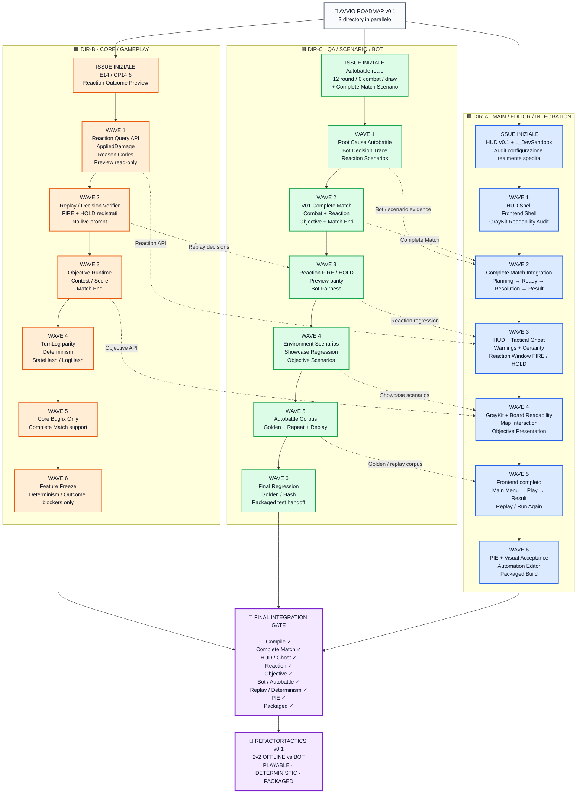

# RefactorTactics — Roadmap main del focus v0.1

> `CURRENT` · **Creato**: 2026-08-28 · **Tipo**: **vista di esecuzione**, non owner.
>
> **Cosa è**: la roadmap principale del focus v0.1, nella forma in cui è stata consegnata — tre lane di
> lavoro (`DIR-A` integrazione · `DIR-B` core · `DIR-C` QA), sei wave ciascuna, un gate finale. Il
> diagramma della §1 è il **mandato ricevuto**, riportato verbatim; tutto ciò che segue è la sua
> verifica contro il repository.
>
> **Cosa non è**: un'assegnazione. Non apre issue, non le riassegna, non sposta scope. Le sedi citate
> nelle tabelle sono **ancoraggi verificati** lato server con `gh`, non una ripianificazione: quando una
> wave e una issue divergono, ha ragione la issue.
>
> **Base di misura**: HEAD `f20c94d9` su `feat/1499-soggetto-esplicito-verdetto-congelato`, **64 avanti /
> 0 dietro** `origin/main` = `ad7f212b` dopo `git fetch --prune`. Stato delle issue letto il 2026-08-28.
>
> **Vista d'insieme delle release**: [`roadmap-v0.1-v1.0.md`](roadmap-v0.1-v1.0.md).

---

**Indice** · [1. Il diagramma](#1-il-diagramma) · [2. Che cos'è una lane, in questo repository](#2-che-cosè-una-lane-in-questo-repository) · [3. Le premesse del diagramma, verificate](#3-le-premesse-del-diagramma-verificate) · [4. Le sei wave, con le sedi verificate](#4-le-sei-wave-con-le-sedi-verificate) · [5. Gli otto handoff](#5-gli-otto-handoff) · [6. Il gate finale, tradotto](#6-il-gate-finale-tradotto) · [7. Come si chiude una wave](#7-come-si-chiude-una-wave) · [8. Limiti dichiarati](#8-limiti-dichiarati)

## 1. Il diagramma



---

## 2. Che cos'è una lane, in questo repository

Il nodo `START` dice **«3 directory in parallelo»**, e la parola *directory* è l'unica del diagramma che
non si può prendere alla lettera. Non perché il parallelismo sia vietato — non lo è più — ma perché ciò
che il progetto protegge non è la directory.

- ✅ **Il parallelismo è il regime accettato.** [D-222](../decisions/RT_PDR_00_Decision_Log.md)
  (2026-08-27) supera la clausola operativa di [D-178](../decisions/RT_PDR_00_Decision_Log.md): più
  sessioni condividono davvero questa working directory — **misurato**, 101 checkout e 6 sessioni in un
  giorno — e fingere che sia una alla volta produce documenti falsi, non ordine.
- 🔴 **Ma non con tre worktree.** Il mutex del motore è **globale sull'eseguibile**: due run di automation
  si uccidono a vicenda anche da checkout diversi. Tre directory che lanciano la propria suite in
  parallelo non sono tre lane, sono una lane e due run non valide.
- 🔑 **Quel che va protetto è la MISURA.** Una suite vale solo se `HEAD`, l'albero, il binario e i
  processi del motore sono gli stessi all'inizio e alla fine. Altrimenti non è rossa né verde: è **NON
  VALIDA**, e non si registra. Per questo si lancia da [`../../scripts/rt-suite.ps1`](../../scripts/rt-suite.ps1)
  e non a mano — quei controlli, a mano, si dimenticano.

∴ **Una lane è un write-set, non una cartella.** Le tre lane si tengono separate se toccano file diversi e
si sincronizzano su una sola misura, non se vivono in tre copie del repository. Il criterio operativo che
ne discende è nella §7.

> ⚠️ **Un `.uasset` resta il vincolo fisico che nessun regime scioglie.** Due binari non si fondono, quindi
> un `.umap` si modifica **da una lane sola per volta**. Il merge del 2026-08-28 lo ha pagato:
> `L_DevSandbox.umap` era modificato da entrambi i lati e si è dovuta scartare una delle due versioni. Le
> mappe versionate sono **quattro** — `L_DevSandbox`, `L_HexArena`, `L_Prototype`, `L_Frontend` — e stanno
> quasi tutte sul percorso di DIR-A.

---

## 3. Le premesse del diagramma, verificate

Un mandato si esegue dopo aver misurato ciò che presuppone. Sette premesse, misurate sulla base dichiarata
in testa: **quattro reggono, tre no**.

| # | Il diagramma assume | Verdetto |
|---|---|---|
| **P1** | `START` · tre directory in parallelo | ⚠️ vero a metà — il regime sì, le *directory* no |
| **P2** | `A0` · HUD v0.1 e `L_DevSandbox` sono lavoro aperto | ✅ confermata |
| **P3** | `B0` · CP 14.6 è la «Reaction Outcome Preview» | ⛔ il checkpoint chiede di più |
| **P4** | `B1` · `AppliedDamage` è un tipo su cui appoggiarsi | ⛔ non esiste |
| **P5** | `C0` · l'autobattle fa 12 round, 0 `Combat`, pareggio | ⛔ falsificata il 2026-08-22 |
| **P6** | `A4` · GrayKit e leggibilità della board sono da fare | ⚠️ le sedi citate sono chiuse |
| **P7** | `A6` · «Packaged Build» è il traguardo della lane | ⚠️ metà è già verde |

**P1 · il parallelismo è il regime, la directory no.** [D-222](../decisions/RT_PDR_00_Decision_Log.md)
accetta il lavoro parallelo — misurato, 101 checkout e 6 sessioni in un giorno — ma il mutex del motore è
globale sull'eseguibile. Leggi «lane» come **write-set disgiunto**, non come cartella: §2.
*Fonte*: [D-222](../decisions/RT_PDR_00_Decision_Log.md) · [`../../CLAUDE.md`](../../CLAUDE.md) §4.

**P2 · confermata.** [#613](https://github.com/DegrassiAaron/refactor-tactics-main/issues/613) (CP 11.7,
Screen HUD in UMG) è aperta, e `L_DevSandbox.umap` è una delle quattro mappe versionate.
*Fonte*: `gh` · `git ls-files '*.umap'`.

**P3 · il titolo del checkpoint non è quello.**
[#166](https://github.com/DegrassiAaron/refactor-tactics-main/issues/166) si chiama *«CP 14.6 — Counterplay,
UI della finestra e misura del pacing»*: la preview è **una parte**, e la DoD chiede anche il pacing
misurato. Una wave che consegna la sola preview lascia il checkpoint aperto.
*Fonte*: `gh` · [`plans/dir-b-core-gameplay-directive-spec-panel-2026-08-28.md`](plans/dir-b-core-gameplay-directive-spec-panel-2026-08-28.md) §5.

**P4 · `AppliedDamage` non esiste.** `git grep -c AppliedDamage` dà **zero** in `Source/` e **cinque**
occorrenze in un solo documento — il piano DIR-B che lo nomina. Non è un riuso: è un nome da introdurre,
con il costo che ne segue. *Fonte*: `git grep`.

**P5 · falsificata il 2026-08-22.** Sulla sorgente spedita il primo colpo cade al **turno 2** e le voci
`Combat` sono **23**. Il difetto non era «non ingaggiano» ma **«ingaggiano e non concludono»**, ed è
tracciato su [#1088](https://github.com/DegrassiAaron/refactor-tactics-main/issues/1088) — **chiusa**. Oggi
il comportamento è presidiato da `Match.Autobattle.EngagesOnTheAuthoredMap` e
`Match.Autobattle.EngagesOnTheGeneratedTestArena`.
*Fonte*: [`../technical/test-manuali-pie.md`](../technical/test-manuali-pie.md) voce `PIE-V01-PLAYSPEED` ·
`git grep Match.Autobattle`.

**P6 · le due sedi del mandato sono chiuse.**
[#956](https://github.com/DegrassiAaron/refactor-tactics-main/issues/956) (CP 47.3, grammatica visiva) e
[#1262](https://github.com/DegrassiAaron/refactor-tactics-main/issues/1262) sono **CLOSED**. Il lavoro
residuo esiste ma ha altre sedi: [#286](https://github.com/DegrassiAaron/refactor-tactics-main/issues/286)
(E21) e [#289](https://github.com/DegrassiAaron/refactor-tactics-main/issues/289) (CP E21.3).
*Fonte*: `gh`.

**P7 · metà del traguardo è verde da dodici giorni.** `G12` — packaging Development **e** Shipping — è ✅
dal 2026-08-16. Quel che resta è **`G13`**: la partita giocabile *senza editor* su una mappa d'autore, e la
via a punti mai esercitata — due mancanze che sono **dati, non codice**.
*Fonte*: [`v0.1-definition-of-done.md`](v0.1-definition-of-done.md) §3.

> 🔴 **P5 è la premessa che costa di più, e vale la pena dire perché.** `C0` è il nodo da cui parte l'intera
> lane QA: se la wave 1 va a cercare la causa di «zero combattimento», cerca un difetto **corretto sei
> giorni fa** e conclude che non esiste. Il difetto vero — le partite ingaggiano e non concludono — è
> l'ingresso corretto di `C1`, e non è lo stesso lavoro.

---

## 4. Le sei wave, con le sedi verificate

Le colonne «sedi» elencano **issue aperte al 2026-08-28** il cui contenuto ricade nella wave. Non sono
un'assegnazione e non aggiungono scope: sono il modo per non ripartire da un titolo di riquadro.

### 🟦 DIR-A · main / editor / integration

| Wave | Cosa consegna | Sedi aperte |
|---|---|---|
| `A0` | HUD v0.1 + `L_DevSandbox`, audit della configurazione spedita | [#613](https://github.com/DegrassiAaron/refactor-tactics-main/issues/613) |
| `A1` | HUD shell · frontend shell · audit di leggibilità | [#613](https://github.com/DegrassiAaron/refactor-tactics-main/issues/613) · [#934](https://github.com/DegrassiAaron/refactor-tactics-main/issues/934) · [#286](https://github.com/DegrassiAaron/refactor-tactics-main/issues/286) |
| `A2` | Complete match: `Planning → Ready → Resolution → Result` | [#77](https://github.com/DegrassiAaron/refactor-tactics-main/issues/77) · [#25](https://github.com/DegrassiAaron/refactor-tactics-main/issues/25) |
| `A3` | HUD + ghost tattico · warning e certezza · finestra `FIRE`/`HOLD` | [#613](https://github.com/DegrassiAaron/refactor-tactics-main/issues/613) · [#1392](https://github.com/DegrassiAaron/refactor-tactics-main/issues/1392) |
| `A4` | GrayKit e leggibilità · interazione mappa · presentazione obiettivo | [#286](https://github.com/DegrassiAaron/refactor-tactics-main/issues/286) · [#289](https://github.com/DegrassiAaron/refactor-tactics-main/issues/289) · [#171](https://github.com/DegrassiAaron/refactor-tactics-main/issues/171) |
| `A5` | Frontend completo · replay / run again | [#934](https://github.com/DegrassiAaron/refactor-tactics-main/issues/934) · [#1330](https://github.com/DegrassiAaron/refactor-tactics-main/issues/1330) |
| `A6` | PIE e accettazione visiva · automation editor · build packaged | [#959](https://github.com/DegrassiAaron/refactor-tactics-main/issues/959) |

- `A0` — la configurazione spedita è stata **l'oggetto** di due difetti già chiusi ([#1069](https://github.com/DegrassiAaron/refactor-tactics-main/issues/1069),
  [#1088](https://github.com/DegrassiAaron/refactor-tactics-main/issues/1088)): l'audit parte da lì, non da zero.
- `A1` — `E46` è **scope dichiarato nuovo** con [D-144](../decisions/RT_PDR_00_Decision_Log.md) e **nessun
  gate della v0.1 lo richiede**: è lane A per collocazione, non per obbligo di release.
- `A2` — è il contenuto del gate **`G10`**, che è ⏳ e chiede una partita **registrata**: log o video, non
  un'asserzione.
- `A3` — ⚠️ **la certezza esiste già**, e dichiararla mancante è un errore registrato: i tre livelli sono
  stati trovati implementati durante una seduta PIE che li diceva assenti.
- `A4` — le sedi originali del mandato sono chiuse, vedi **P6**.
- `A5` — [#1330](https://github.com/DegrassiAaron/refactor-tactics-main/issues/1330) è un difetto **vivo** del percorso di avvio: *«dice impossibile avviare, e
  premendo back la partita parte lo stesso»*.
- `A6` — gate coinvolti: `G9` 🟡 (17 voci `RELEASE-V01`), `G10` ⏳, `G12` ✅, `G13` 🟡 — vedi **P7**.

### 🟧 DIR-B · core / gameplay

| Wave | Cosa consegna | Sedi aperte |
|---|---|---|
| `B0` | E14 / CP 14.6 — reaction outcome preview | [#166](https://github.com/DegrassiAaron/refactor-tactics-main/issues/166) |
| `B1` | Reaction query API · reason code · preview read-only | [#166](https://github.com/DegrassiAaron/refactor-tactics-main/issues/166) · [#1118](https://github.com/DegrassiAaron/refactor-tactics-main/issues/1118) |
| `B2` | Replay / decision verifier · `FIRE` e `HOLD` registrati | [#26](https://github.com/DegrassiAaron/refactor-tactics-main/issues/26) |
| `B3` | Objective runtime · contest / score · match end | [#24](https://github.com/DegrassiAaron/refactor-tactics-main/issues/24) · [#75](https://github.com/DegrassiAaron/refactor-tactics-main/issues/75) |
| `B4` | Parità del TurnLog · determinismo · `StateHash` / `LogHash` | [#26](https://github.com/DegrassiAaron/refactor-tactics-main/issues/26) |
| `B5` | Solo bugfix di core, a supporto del complete match | — |
| `B6` | Feature freeze: solo blocker di determinismo o di esito | — |

- `B0` — ⛔ il checkpoint chiede **anche** counterplay e pacing misurato, vedi **P3**.
- `B1` — ⛔ `AppliedDamage` non esiste (**P4**). [#1118](https://github.com/DegrassiAaron/refactor-tactics-main/issues/1118) è **esattamente** il problema dei reason
  code: *«la risposta e la sua ragione sono un enum solo»*.
- `B2` — ✅ il decisore che il mandato presuppone mancante **è atterrato**: `DecisionProvider` è in
  `RTTurnManager.h` e nel `ScenarioHarness`. Il «no live prompt» non è da costruire, è da **usare**.
- `B3` — ⚠️ **match end esiste già**: `RTMatchEndTests.cpp` copre gli esiti, obiettivo incluso. Manca
  l'**obiettivo contestabile** ([#75](https://github.com/DegrassiAaron/refactor-tactics-main/issues/75), CP 10.2), che è anche la riserva che tiene `G13` a 🟡.
- `B4` — ✅ `G4` è **verde** dal 2026-08-24 (`Replay.Verifier.ResimulationIsDeterministic`): questa wave
  **difende** una proprietà acquisita, non la costruisce.
- `B5`/`B6` — nessuna sede propria per costruzione: esistono per **non** aprirne.

### 🟩 DIR-C · QA / scenario / bot

| Wave | Cosa consegna | Sedi aperte |
|---|---|---|
| `C0` | Autobattle reale + scenario di complete match | [#952](https://github.com/DegrassiAaron/refactor-tactics-main/issues/952) · [#971](https://github.com/DegrassiAaron/refactor-tactics-main/issues/971) |
| `C1` | Root cause autobattle · trace del bot · scenari di reazione | [#952](https://github.com/DegrassiAaron/refactor-tactics-main/issues/952) |
| `C2` | V01 complete match: combat + reaction + objective + match end | [#153](https://github.com/DegrassiAaron/refactor-tactics-main/issues/153) |
| `C3` | `FIRE`/`HOLD` · parità della preview · equità del bot | [#166](https://github.com/DegrassiAaron/refactor-tactics-main/issues/166) |
| `C4` | Scenari d'ambiente · regressione showcase · scenari obiettivo | [#153](https://github.com/DegrassiAaron/refactor-tactics-main/issues/153) · [#75](https://github.com/DegrassiAaron/refactor-tactics-main/issues/75) |
| `C5` | Corpus autobattle · golden + repeat + replay | [#170](https://github.com/DegrassiAaron/refactor-tactics-main/issues/170) |
| `C6` | Regressione finale · golden / hash · handoff del test packaged | [#959](https://github.com/DegrassiAaron/refactor-tactics-main/issues/959) · [#816](https://github.com/DegrassiAaron/refactor-tactics-main/issues/816) |

- `C0` — ⛔ i numeri del riquadro sono superati (**P5**). [#971](https://github.com/DegrassiAaron/refactor-tactics-main/issues/971) è il difetto vivo:
  *«l'input non è impedito, un click pianifica ancora»*.
- `C1` — la causa da cercare è **«ingaggiano e non concludono»**, non «non attaccano».
- `C2` — percorso obbligato: `Intent → Planning → Snapshot → Resolver → TurnLog`. Uno scenario che non
  attraversa il codice vero non prova niente sul codice vero.
- `C3` — la parità da provare è **preview = esito**, e va scritta come asserto falsificabile: un test di
  invarianza senza l'effetto è vacuo.
- `C4` — `E15` è **consumer**: la showcase legge le epic, non le precede.
- `C5` — ⚠️ il golden si **pinna dopo** che i mutatori di stato fuori dal TurnLog sono chiusi: un replay
  che non spiega la propria divergenza pinna un hash, non una prova.
- `C6` — ⚠️ [#816](https://github.com/DegrassiAaron/refactor-tactics-main/issues/816) è **CP 45.9, post-v0.1**: citata perché è la sede della matrice di smoke su
  packaged, **non** perché entri nella v0.1.

---

## 5. Gli otto handoff

Le frecce tratteggiate sono la parte del diagramma che decide se le lane sono davvero parallele. Ognuna
dice: *«questa wave non parte finché quell'altra non ha prodotto qualcosa»*. Perché siano percorribili,
ciò che passa deve essere **un artefatto**, non una conversazione.

| Handoff | Cosa deve attraversare la freccia | Perché non basta «è pronto» |
|---|---|---|
| `B1 → A3` · reaction API | Firme e reason code **compilati**, con un test che li esercita | Un HUD che disegna `FIRE`/`HOLD` su un'API non ancora ferma si riscrive due volte |
| `B2 → C3` · replay decisions | Un replay in cui `FIRE` e `HOLD` sono **registrati e rileggibili** | La parità della preview si misura confrontando due artefatti, non due impressioni |
| `B3 → A4` · objective API | La query che dice chi contende e con che punteggio | La presentazione dell'obiettivo non può inventare uno stato che il runtime non espone |
| `C1 → A2` · evidenza da bot/scenario | Lo scenario che **riproduce** il difetto, non il suo racconto | Vedi **P5**: un racconto di difetto invecchia in sei giorni |
| `C2 → A2` · complete match | Lo scenario che attraversa `Planning → Resolution → Result` per intero | È il presupposto di `G10`, che chiede una partita registrata |
| `C3 → A3` · regressione delle reazioni | Il test che fallisce se la finestra cambia comportamento | Senza, la wave `A3` non sa di aver rotto qualcosa |
| `C4 → A4` · scenari di showcase | Le fixture della showcase, verdi | `E15` consuma i sistemi: se non sono pronti, le fixture sono l'oracolo che lo dice |
| `C5 → A5` · corpus golden/replay | L'hash pinnato, con la sua base | Un hash senza la base che lo ha prodotto non è confrontabile |

> 🔑 **Un handoff che non nomina l'artefatto non è un handoff.** È il difetto che questo repository ha già
> registrato sul protocollo di coordinamento fra directory: un passaggio che non dichiara `HEAD`, albero,
> binario e processi non produce un'integrazione verificabile, comunque siano organizzate le sessioni.

---

## 6. Il gate finale, tradotto

Il nodo `INT` elenca nove spunte. Non sono un elenco nuovo: sono i gate della v0.1, e hanno già un owner
che ne porta l'evidenza. Questa tabella dice **quale spunta è quale gate**, perché un `✓` disegnato non
chiude niente.

| Spunta di `INT` | Gate reale | Stato al 2026-08-24 |
|---|---|---|
| Compile | `G1` — Editor + Development + Shipping, zero warning nuovi | ✅ |
| Complete Match | `G10` — partita 2v2 completa su mappa multilivello, registrata | ⏳ |
| HUD / Ghost | *(nessun gate lo nomina)* — vive in `G9`, subset `RELEASE-V01` | 🟡 |
| Reaction | *(nessun gate lo nomina)* — CP 14.6, e in `G9` per la parte PIE | 🟡 |
| Objective | *(nessun gate lo nomina)* — è la riserva a punti di `G13` | 🟡 |
| Bot / Autobattle | `G2` — suite automation completa verde | 🟡 metà **packaged** non eseguita |
| Replay / Determinism | `G3` · `G4` — i dieci test nominati, 100 ripetizioni a checksum identico | ✅ ✅ |
| PIE | `G9` — le **17** voci del subset `RELEASE-V01` | 🟡 10 verdi · 5 parziali · 2 aperte |
| Packaged | `G12` ✅ · `G13` 🟡 | vedi **P7** |

> ⚠️ **Tre spunte su nove non hanno un gate**, ed è un'informazione, non un difetto del diagramma: HUD,
> reaction e objective sono **contenuti** della release, non condizioni di consegnabilità dichiarate. Il
> conto dei gate — quattordici attivi, `G15` ritirato — e gli stati per riga stanno in
> [`v0.1-definition-of-done.md`](v0.1-definition-of-done.md) §3. Gli stati qui sono una **fotografia
> datata**: non si aggiornano in questa pagina.
>
> 🔴 **E i quattro gate rimanenti non compaiono affatto in `INT`**: `G5` (nessun quadrato residuo), `G6`
> (ID stabili), `G7` (nessun float), `G8` (privacy dell'intento), `G11` (KPI) e `G14` (documentazione
> allineata). Cinque sono verdi e passano inosservati; **`G11` e `G14` sono ⏳**, e un gate finale che non
> li elenca dichiara la release consegnabile mentre due condizioni sono aperte.

---

## 7. Come si chiude una wave

Una wave è chiusa quando la misura che lo dice è **valida**, non quando il lavoro sembra fatto.

```powershell
./scripts/rt-suite.ps1                                    # la suite intera
./scripts/rt-suite.ps1 -Filter RefactorTactics.Scenario   # una sola area, molto più veloce
```

Exit: `0` verde · `1` test falliti · `2` non avviata, motore occupato · `3` **NON VALIDA**, esito non
registrabile. PowerShell e non Git Bash: MSYS traduce gli argomenti che iniziano con `/` e l'harness non
parte nemmeno.

Le tre trappole, che valgono per ogni lane:

1. **Una console variable in testa a `-ExecCmds` fa saltare l'intera coda di automation**, e il log
   somiglia a una run riuscita. Si usa `-dpcvars="nome=valore"`.
2. **Nel log servono due righe**: `Found <n> automation tests based on '<filtro>'` in testa e
   `**** TEST COMPLETE. EXIT CODE: <n> ****` in fondo. Se manca la prima, la run non ha misurato niente.
3. **L'exit code non è un oracolo**: è misurato che una run sia uscita `0` con un test fallito. Si leggono
   i `Result={...}`, e un numero di test sono **due** numeri — «N eseguiti su M dichiarati».

E il criterio di lane, che discende dalla §2: **prima di aprire una wave, dichiara il proprio write-set**.
Se due lane si contendono un `.uasset` o un `.umap`, non sono parallele — una delle due aspetta. Se si
contendono solo file di testo, il merge le riconcilia e il parallelismo regge.

---

## 8. Limiti dichiarati

1. **Le sedi della §4 sono un'istantanea del 2026-08-28.** Una issue chiusa domani rende falsa una cella
   senza che nessuno lo veda: le colonne si rileggono con `gh issue view <n>`, non da qui. È già successo
   al mandato originale — vedi **P6**.
2. **Le tre premesse ⛔ della §3 non sono state corrette nel diagramma.** Il riquadro `C0` continua a dire
   «12 round / 0 combat / draw» perché il diagramma è riportato **verbatim** come consegnato: correggerlo
   in silenzio avrebbe cancellato la traccia di cosa il mandato assumeva. La correzione vive nella §3, e
   chi esegue legge quella.
3. **Questa pagina non è un owner e non apre lavoro.** Le epic stanno in
   [`roadmap-v0.1.md`](roadmap-v0.1.md) §3, i gate in [`v0.1-definition-of-done.md`](v0.1-definition-of-done.md),
   l'esecuzione in [`roadmap-checkpoint.md`](roadmap-checkpoint.md), le release successive in
   [`roadmap-post-v0.1.md`](roadmap-post-v0.1.md). Se una cella di questa pagina contraddice uno di
   quelli, ha ragione l'altro.
4. **Nessuna delle sei wave ha una durata.** Il progetto non ha una velocity misurata: l'ordine è
   informazione, il calendario sarebbe una metrica falsa.
