# RefactorTactics — Roadmap v0.1 → v1.0

> `CURRENT` · **Creato**: 2026-08-28 · **Tipo**: **vista di navigazione**, non owner.
>
> **Cosa è**: il ponte fra le due metà della traiettoria. La v0.1 vive in
> [`roadmap-v0.1.md`](roadmap-v0.1.md) (252 KB), le release da v0.2 a v1.0 in
> [`roadmap-post-v0.1.md`](roadmap-post-v0.1.md) (99 KB): per rispondere a «dove stiamo andando, e cosa
> resta prima del prossimo scalino» oggi si aprono due documenti lunghi e si tiene a mente la giunzione.
> Questa pagina la scrive una volta.
>
> **Cosa non è**: una fonte. Non contiene un solo numero che non sia derivato da un owner citato nella
> stessa riga, e quando lo stato è un'istantanea porta la **data** e il posto in cui rileggerlo. Se questa
> pagina e un owner divergono, **ha ragione l'owner** — e la divergenza è un difetto da correggere qui.
>
> **Base di misura**: HEAD `f20c94d9` sul branch `feat/1499-soggetto-esplicito-verdetto-congelato`,
> **64 avanti / 0 dietro** `origin/main` = `ad7f212b` dopo `git fetch --prune`. Lo stato delle issue è
> letto lato server con `gh`, non trascritto.

---

## 1. Le dieci release

```mermaid
flowchart LR
    V01["v0.1<br/>Vertical slice<br/>Il turno simultaneo<br/>funziona e si vede"]
    V02["v0.2<br/>Struttura e finestre<br/>Il campo diventa<br/>manipolabile"]
    V03["v0.3<br/>Informazione<br/>Quel che non sai vale<br/>quanto quel che fai"]
    V04["v0.4<br/>Operations<br/>Partite lunghe<br/>su mappe grandi"]
    V05["v0.5<br/>Online Foundation<br/>Il turno simultaneo<br/>regge la rete"]
    V06["v0.6<br/>Ability Runtime<br/>Le abilità hanno un runtime,<br/>il resolver resta l'autorità"]
    V07["v0.7<br/>Competitive Alpha<br/>Si gioca su un server che<br/>non è il client di nessuno"]
    V08["v0.8<br/>Beta / Balance<br/>Le partite si misurano<br/>a lotti"]
    V09["v0.9<br/>Release Candidate<br/>Niente di nuovo:<br/>quel che c'è deve reggere"]
    V10["v1.0<br/>Launch<br/>Partita competitiva completa<br/>su infrastruttura di produzione"]

    V01 --> V02 --> V03 --> V04 --> V05 --> V06 --> V07 --> V08 --> V09 --> V10

    S1{{"SOGLIA 1 · il formato<br/>2v2 vs bot ⇒ 3v3"}}
    S2{{"SOGLIA 2 · la rete<br/>offline ⇒ online"}}
    S3{{"SOGLIA 3 · l'autorità<br/>client host ⇒ dedicated"}}
    S4{{"SOGLIA 4 · il freeze<br/>si costruisce ⇒ si consolida"}}

    V01 -.-> S1 -.-> V02
    V04 -.-> S2 -.-> V05
    V06 -.-> S3 -.-> V07
    V08 -.-> S4 -.-> V09

    classDef slice fill:#f3e8ff,stroke:#7e22ce,stroke-width:3px,color:#111827;
    classDef build fill:#dbeafe,stroke:#2563eb,stroke-width:2px,color:#111827;
    classDef online fill:#dcfce7,stroke:#16a34a,stroke-width:2px,color:#111827;
    classDef ship fill:#ffedd5,stroke:#ea580c,stroke-width:2px,color:#111827;
    classDef soglia fill:#f8fafc,stroke:#475569,stroke-width:1px,color:#334155;

    class V01 slice;
    class V02,V03,V04 build;
    class V05,V06,V07 online;
    class V08,V09,V10 ship;
    class S1,S2,S3,S4 soglia;
```

⚠️ **Le frecce sono un ordine, non un calendario.** Il progetto è a dev singolo e non ha una velocity
misurata: [`roadmap-v0.1.md`](roadmap-v0.1.md) §3 lo dichiara esplicitamente — *«nessuna stima in giorni;
inventare date sarebbe una metrica falsa»*. Nessuna riga di questa pagina porta una data futura.

---

## 2. Cosa contiene ogni release

| Release | Tema | Epic | Formato di gioco | Owner dello scope |
|---|---|---|---|---|
| **v0.1** | Il turno simultaneo funziona e si vede | **E1–E21 · E23 · E46 · E47** | Skirmish 2v2 offline vs bot | [`roadmap-v0.1.md`](roadmap-v0.1.md) §3 |
| **v0.2** | Struttura e finestre; roster 8 | E22 · E24–E26 · E35 · E36 · E38 · E39 | Standard 3v3 | [`roadmap-post-v0.1.md`](roadmap-post-v0.1.md) |
| **v0.3** | Informazione e conoscenza parziale estesa | E27–E29 · E33 | Standard 3v3 | [`roadmap-post-v0.1.md`](roadmap-post-v0.1.md) |
| **v0.4** | Operations: partite lunghe, mappe grandi | E30–E32 · E34 · E37 | Operations 4v4+ | [`roadmap-post-v0.1.md`](roadmap-post-v0.1.md) |
| **v0.5** | Online Foundation | E40 | 3v3 online, lobby privata | [`roadmap-post-v0.1.md`](roadmap-post-v0.1.md) |
| **v0.6** | Ability Runtime | E41 | Standard 3v3 online | [`roadmap-post-v0.1.md`](roadmap-post-v0.1.md) |
| **v0.7** | Competitive Alpha | E42 | Standard 3v3 su dedicated | [`roadmap-post-v0.1.md`](roadmap-post-v0.1.md) |
| **v0.8** | Beta / Balance | E43 | 3v3 + batch bot-vs-bot | [`roadmap-post-v0.1.md`](roadmap-post-v0.1.md) |
| **v0.9** | Release Candidate | E44 | Feature freeze | [`roadmap-post-v0.1.md`](roadmap-post-v0.1.md) |
| **v1.0** | Launch | E45 | Standard 3v3 ranked | [`roadmap-post-v0.1.md`](roadmap-post-v0.1.md) |

> 🔴 **La riga v0.1 è l'unica che non si copia dalla tabella dell'owner post-v0.1, e la ragione è
> registrata là.** Quella tabella dichiara `E1–E21` per la v0.1 e avverte in proprio: *«non è un indice
> esaustivo delle epic v0.1 — E46 ed E47 sono v0.1 e non compaiono»*. A cui si aggiunge **E23**, anticipata
> dalla v0.2 il 2026-08-17 ([D-160](../decisions/RT_PDR_00_Decision_Log.md)) e per questo assente
> dall'intervallo `E22 · E24–E26`. La forma scritta qui — `E1–E21 · E23 · E46 · E47` — è **verificata per
> costruzione**: sono **24** epic, che è il totale dichiarato da [`roadmap-v0.1.md`](roadmap-v0.1.md) §3
> con il proprio script di misura. Un intervallo che si legge da solo vale più di uno che richiede di
> ricordare tre eccezioni.

> ⚠️ **`E22` esiste e non è un refuso**: è la Cover Window, e resta in v0.2. Il buco fra E21 ed E23 nella
> riga v0.1 è quello, non un numero saltato.

---

## 3. Le quattro soglie

Le release non sono dieci tacche equidistanti: quattro di quelle frecce cambiano **cosa il progetto è**, e
sono i punti in cui un errore di v0.1 diventa costoso. Sono la ragione per cui
[`roadmap-post-v0.1.md`](roadmap-post-v0.1.md) esiste già oggi, pur non aprendo lavoro.

| Soglia | Fra | Cosa cambia | Cosa deve essere già vero in v0.1 |
|---|---|---|---|
| **1 · il formato** | v0.1 → v0.2 | Da 2v2 offline vs bot a 3v3 fra squadre complete | Nessun numero di gioco hard-coded sul «due»: la composizione è dato di formato (`URTMatchFormatData`, E19), non costante di codice |
| **2 · la rete** | v0.4 → v0.5 | Il turno simultaneo attraversa un socket | **Autorità isolata** e **privacy dell'intento**: gli invarianti #5 e #6, che la v0.1 rispetta pur essendo offline — è il motivo per cui il gate **G8** esiste in una release senza networking |
| **3 · l'autorità** | v0.6 → v0.7 | Il simulatore gira su un dedicated, non sul client di un giocatore | Il resolver decide senza mondo e senza Actor: le regole vivono in funzioni statiche pure, ed è la stessa proprietà che oggi fa girare la suite headless |
| **4 · il freeze** | v0.8 → v0.9 | Si smette di costruire e si consolida | Un TurnLog che spiega la propria divergenza: il determinismo verificato di **G4** è il presupposto di ogni misura a lotti della v0.8 |

∴ **Le tre proprietà che la v0.1 deve consegnare intatte non sono feature**: sono la privacy dell'intento,
l'isolamento dell'autorità e il determinismo verificabile. Le feature si rifanno; queste, se cadono, si
ripagano attraversando ogni release successiva. Gli invarianti sono in
[`piano-canonico-mvp.md`](../product/piano-canonico-mvp.md), che prevale su questa pagina e su ogni roadmap.

---

## 4. Focus v0.1 — dove si legge lo stato

La v0.1 è un vertical slice **2v2 offline contro bot** su griglia esagonale multilivello. La definizione
completa — cosa c'è dentro, cosa resta fuori, i sette principi non negoziabili — è
[`roadmap-v0.1.md`](roadmap-v0.1.md) §1, e non si riassume qui: un riassunto di scope è la forma di
duplicazione che questo repository ha già pagato cinque volte sullo stesso totale.

Quel che serve sapere per **orientarsi** è dove ogni domanda ha risposta:

| Domanda | Owner | Come si legge |
|---|---|---|
| Quali epic esistono e a che punto sono | [`roadmap-v0.1.md`](roadmap-v0.1.md) §2.1, §3 | È l'**unica** vista dello stato delle epic |
| Quando la v0.1 è consegnabile | [`v0.1-definition-of-done.md`](v0.1-definition-of-done.md) §3 | I gate di release, con evidenza per riga |
| A che punto è l'esecuzione | [`roadmap-checkpoint.md`](roadmap-checkpoint.md) | Milestone M6–M11, non duplica §2.1 |
| Come è organizzato il lavoro aperto | [`roadmap-main-v0.1.md`](roadmap-main-v0.1.md) | Tre lane, sei wave, handoff |
| Che numeri valgono oggi | `docs/balance/` | Cataloghi vigenti — **numeri, non regole** ([D-210](../decisions/RT_PDR_00_Decision_Log.md)) |
| Cosa è vero nel codice | `Source/` + la suite | `./scripts/rt-suite.ps1`, mai un documento |

### I gate, in una fotografia datata

Quattordici gate attivi, **`G15` ritirato** il 2026-08-21 con
[D-181](../decisions/RT_PDR_00_Decision_Log.md) insieme al Feature Registry che ne era l'unico meccanismo —
il numero non si riusa. Al **2026-08-24**, data della misura registrata nell'owner:

| | Gate | Cosa resta |
|---|---|---|
| ✅ **7** | `G1` build · `G3` i dieci test nominati · `G4` determinismo · `G5` nessun quadrato residuo · `G6` ID stabili · `G8` privacy dell'intento · `G12` packaging | — |
| 🟡 **4** | `G2` suite · `G7` niente float · `G9` subset PIE `RELEASE-V01` · `G13` giocabile senza editor | Rispettivamente: la metà **packaged** della suite; la revisione dei data asset; 5 parziali + 2 aperte su 17 voci; una mappa d'autore e la via a punti mai esercitata |
| ⏳ **3** | `G10` partita completa registrata · `G11` KPI · `G14` documentazione allineata | Chiedono **occhi e mani in PIE** o una revisione senza oracolo: nessuna automazione li produce |

> ⚠️ **Questa tabella è una fotografia del 2026-08-24, non uno stato.** Non si aggiorna qui e non si cita
> come corrente: si rilegge in [`v0.1-definition-of-done.md`](v0.1-definition-of-done.md) §3, che porta
> l'evidenza riga per riga. È scritta perché la forma della v0.1 residua si vede solo aggregando —
> **metà dei gate aperti non è codice**: è misura, presentazione e documentazione.

> 🔑 **Il conto `7 + 4 + 3 = 14` è la sola aritmetica di questa pagina**, ed è ricavata contando le righe
> `G1`–`G14` della tabella dell'owner, non trascrivendo un numero da una prosa. `G15` non entra nel conto:
> è ⌫.

---

## 5. Cosa questa pagina non decide

- **Non apre lavoro.** La regola di [`roadmap-post-v0.1.md`](roadmap-post-v0.1.md) resta intera: nessuna
  epic oltre la v0.1 si implementa prima che i gate della v0.1 siano verdi. Averla disegnata non la anticipa.
- **Non decide il formato competitivo.** 3v3 è baseline e 4v4 è stress test: la scelta finale è aperta
  ([D-011](../decisions/RT_PDR_00_Decision_Log.md)), e la colonna «formato» della §2 riporta ciò che l'owner
  dichiara per quella release, non una decisione presa qui.
- **Non riassegna epic fra release.** Ogni spostamento — come quello di E23 — è una decisione con un
  `D-nnn`, e va nel [Decision Log](../decisions/RT_PDR_00_Decision_Log.md) prima che in una tabella.

## 6. Limiti dichiarati

1. **La §2 invecchia con lo scope.** Se un'epic cambia release, questa tabella diventa falsa **senza che
   una riga cambi**, e nessun gate confronta una tabella di prosa con la sua fonte — è il difetto che
   [`roadmap-v0.1.md`](roadmap-v0.1.md) §3 documenta per esteso sui propri totali. Prima di usarla per
   decidere, riapri l'owner della riga che ti serve.
2. **La §4 è datata al giorno della misura.** Quattro giorni dopo, una `⏳` può essere verde e nessuno lo
   ha scritto qui.
3. **Le soglie della §3 sono una lettura, non una decisione.** Nessun documento del repository le
   enumera così: sono ricavate dalla colonna «formato di gioco» dell'owner e dagli invarianti del canone.
   Se una di esse contraddice il canone, ha ragione il canone.
