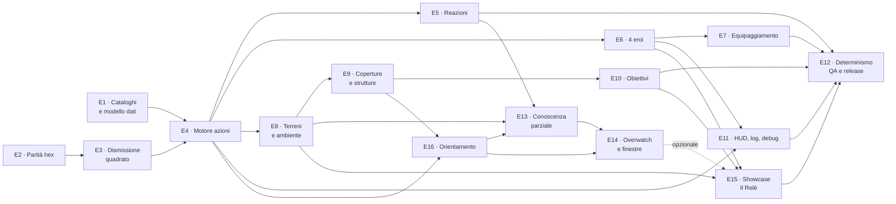
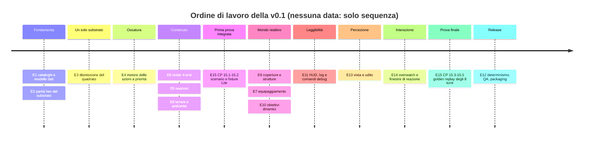

# RefactorTactics — Roadmap v0.1 (vertical slice 2v2 su hex)

> `CURRENT` · **Stato**: in esecuzione · **Ultimo aggiornamento**: 2026-08-08
> **Questa è l'unica vista dello stato delle epic** (§2.1); la vista di esecuzione per milestone è
> [`roadmap-checkpoint.md`](roadmap-checkpoint.md), che non lo duplica.
> **Scope sorgente**: PDR-12 ([`RT_PDR_v0.1_consolidato.md`](../archive/pdr-v0.1/RT_PDR_v0.1_consolidato.md))
> + catalogo di bilanciamento v0.1 ([`prd-personaggi-azioni-e-bilanciamento.md`](../research/prd/prd-personaggi-azioni-e-bilanciamento.md))
> **Decisione abilitante**: [`adr-0003-modello-azioni-v01.md`](../decisions/adr-0003-modello-azioni-v01.md)
>
> Questa è la vista **di release**: cosa deve esistere perché la v0.1 sia consegnabile.
> La vista **di esecuzione** (milestone M6–M11, stato per checkpoint) resta
> [`roadmap-checkpoint.md`](roadmap-checkpoint.md); la mappatura fra le due è in §8.
> Le decisioni vincolanti restano in [`piano-canonico-mvp.md`](../product/piano-canonico-mvp.md).

---

## 1. Cosa è la v0.1

Un vertical slice **2v2 offline contro bot** su griglia **esagonale multilivello** con:

<!-- rename-exempt: la riga dichiara la rinomina: sostituirla la renderebbe muta -->
- **4 eroi** distinti (Gadget, Phase, Riktor, Wraith — [D-120](../decisions/RT_PDR_00_Decision_Log.md); i loro Stable ID restano `Hero.Flux`, `Hero.Riva`, `Hero.Bastion`, `Hero.Vektor`), 4 abilità ciascuno + 1 variante;
- **catalogo azioni** completo (~35 azioni con ID stabile, fase, priorità intera, fallback, cooldown);
- **reazioni** preparate in planning (1 attivazione per turno);
- **8 terreni attivi** con stati (Wet, Burning, Electrified, Obscured, …) e propagazione deterministica;
- **coperture direzionali e strutture** (porte, ponti, pannelli) che cambiano la topologia;
- **obiettivi dinamici** e fine partita a più vie (eliminazione · obiettivo · `RoundLimit`, parametro di formato — **10–14** round in 2v2, valore iniziale 12);
- **HUD** con intenti alleati e certezza (confermato / previsto / incerto), **combat log** e comandi `rt.Debug.*`;
- **determinismo verificato** (100 ripetizioni a seed fisso, checksum identico) e **build packaged** giocabile;
- **shell di frontend** — `Main Menu → Play → partita → Result → Quit`, più pausa, loading ed error modal
  (**E46**, aggiunta il 2026-08-16 con [D-144](../decisions/RT_PDR_00_Decision_Log.md)). ⚠️ Questa voce è
  entrata **dopo** le altre, ed è la ragione per cui la §1 va riletta quando nasce un'epic: il precedente è
  del 2026-08-08, quando questa lista fu corretta perché *«letta com'era, escludeva un'epic pianificata»*.

**Fuori scope v0.1** (restano north-star): multiplayer in rete, 4v4, GAS, progressione, modding, editor di
mappe dinamico a runtime.

> ⚠️ **Precisato il 2026-08-08.** Questa riga diceva «stack di reazioni interattivo» fra le cose fuori scope,
> ma **E14 è in roadmap**: letta com'era, escludeva un'epic pianificata. La distinzione va fatta per bene,
> perché è la stessa di [ADR-0004](../decisions/adr-0004-finestre-di-reazione.md):
>
> | **Fuori** dalla v0.1 | **Dentro**, epic E14 |
> |---|---|
> | stack **LIFO arbitrario** di reazioni | **una** Decision Window, delimitata |
> | reazioni **annidate** | mai annidata: una risposta non ne apre un'altra |
> | finestre che aprono finestre | Overwatch e Fast Reaction, con `Timeout → HOLD` |

### Principi non negoziabili della v0.1

1. Il simulatore decide, UI/animazioni mostrano (invariante #1).
2. Determinismo: stessa snapshot + stesso seed ⇒ stesso risultato (#4).
3. Coordinate intere (`FRTCellId`), nessun float in costi, priorità, danni.
4. **Nessun gameplay quadrato parallelo**: un solo substrato (epic **E3**).
5. Offline: nessun networking in v0.1, ma autorità isolata (#5) e privacy dell'intento (#6) rispettate.
6. Ogni checkpoint chiude con **DoD misurabile** e **test automatici**; le verifiche interattive sono voci
   in [`test-manuali-pie.md`](../technical/test-manuali-pie.md), non «sembra funzionare».
7. **Un'abilità ha un solo owner** ([D-029](../decisions/RT_PDR_00_Decision_Log.md)): le interazioni
   appartengono ai sistemi, le sinergie sono esempi. Nessuna epic di questa roadmap introduce kit di coppia o
   di fazione.

> 📝 **Nota documentale 2026-08-08 — nessuna epic nuova.** [D-029](../decisions/RT_PDR_00_Decision_Log.md) /
> [ADR-0006](../decisions/adr-0006-ownership-abilita-sinergie.md) sono una regola di ownership dei contenuti, non
> una feature: non aggiungono checkpoint runtime. Aggiungono però un **requisito di DoD** per le feature
> cross-character future — dettaglio in
> [`roadmap-checkpoint.md`](roadmap-checkpoint.md) §«Definition of Done trasversale».

---

## 2. Stato attuale — misurato sul repository

Legenda: ✅ fatto e testato · 🟡 esiste ma parziale · ⏳ non esiste · ⌫ rimosso dal repo

> ⚠️ **Riscritta il 2026-08-07** (HEAD `ea9009a`). La versione precedente dichiarava 🟥 «quadrato, da
> sostituire» su **sette righe di codice che non esistono più**: `grep -rl FRTGridCoord Source/` non
> restituisce nulla e `Grid/`, `Turn/RTMovementResolver.*`, `Bot/RTBotLibrary.*` sono stati rimossi al
> **CP 3.2** (issue `#40`, chiusa). Uno stato che sopravvive alla propria smentita è peggio di uno stato
> assente: chi legge dall'alto agisce sul dato falso. La tabella qui sotto è **misurata**, non ricordata.

| Feature | File | Stato |
|---|---|---|
| Coordinate esagonali (assiale/cubica) | `Map/RTCellId.h` | ✅ |
| Dati cella hex (superficie, costo, blocchi, transizioni) | `Map/RTHexCellData.h` | ✅ (senza cover, vedi sotto) |
| Asset mappa + hash stabile | `Map/RTHexMapAsset.{h,cpp}` | ✅ |
| Rendering mappa (ISM, no Actor per cella) | `Map/RTHexMapActor.{h,cpp}` | ✅ |
| A\* esagonale multilivello, costi interi | `Pathfinding/RTHexPathLibrary.{h,cpp}` | ✅ |
| Snapshot, budget, collisioni simultanee, TurnLog hex | `Turn/RTHexSimLibrary.{h,cpp}`, `Turn/RTHexSim.h` | ✅ |
| LOS esagonale, forme Line/Cone/Area | `Map/RTHexVisionLibrary.{h,cpp}` | ✅ |
| Bot utility su hex | `Bot/RTHexBotLibrary.{h,cpp}` | ✅ |
| TurnLog: hash, serializzazione versionata, checksum, I/O | `Turn/RTTurnLog.h`, `Turn/RTTurnLogLibrary.{h,cpp}` | ✅ |
| Editor mode mappa hex | `Source/RefactorTacticsEditor/` | ✅ (residuo verifiche PIE) |
| Playback del movimento | `Turn/RTPlaybackLibrary.{h,cpp}` | ✅ |
| Allestimento partita (mappa hex, roster da catalogo) | `RTGameMode.{h,cpp}`, `Turn/RTMatchSetupLibrary.*` | ✅ CP 2.1/6.1 · formazioni `Gadget+Phase` vs `Riktor+Wraith` |
| Posizione dell'unità | `Unit/RTUnit.{h,cpp}` | ✅ `FRTCellId` autorevole (`FRTGridCoord` **rimosso**) |
| Orchestrazione turno su hex | `Turn/RTTurnManager.{h,cpp}` | ✅ CP 2.2 · snapshot + `ResolveHexPaths` + `BuildMoveLog` |
| Input / selezione / preview | `Player/RTPlayerController.{h,cpp}` | ✅ CP 2.3 |
| HUD e combat log su hex | `UI/RTHUD.{h,cpp}` | ✅ CP 2.7 · reason code con `(q,r,L)` |
| Combat su hex, forme e LOS | `Combat/RTHexCombatLibrary.*`, `Combat/RTCombatResolver.*` | ✅ CP 2.4/2.5 |
| Gameplay quadrato (griglia, bot, resolver, terreni v1) | `Grid/*`, `Bot/RTBotLibrary.*`, `Turn/RTMovementResolver.*`, `Terrain/*` | ⌫ rimosso al CP 3.2 · punto di ritorno: tag `pre-hex-only` |
| Macro-fasi del turno | `Turn/RTTurnRules.h` (`ERTMatchPhase`) | ✅ **invariato** dall'ADR-0003 |
| Catalogo azioni e data asset | `Ability/RTActionDef.h`, `RTActionData.h`, `RTCatalogLibrary.*` | ✅ E1 · `ActionId`, `Priority`, `Fallback`, `Slot`, `MovementStyle`, validator |
| Motore azioni a priorità, fallback, collisioni | `Turn/RTActionQueue*.h`, `RTActionEffectLibrary.*`, `RTActionFallbackLibrary.*` | ✅ E4 (52 test) |
| Reazioni difensive e Intercept | `Turn/RTReactionLibrary.{h,cpp}` | ✅ E5 (24 test) · Counter/Deflect/Brace/Shield/Cleanse/Intercept |
| Roster 4 eroi da dati | `Ability/RTHeroData.h`, `RTHeroCatalogLibrary.*` | ✅ E6 (25 test) · statistiche, kit e **tre reazioni su quattro cablate** (CP 6.7); solo `FlowReaction` resta rinviata a E14 — `InterceptShot` è uscita dall'insieme (Predictive, D-016) |
| Budget movimento | `Turn/RTHexSimLibrary.*` | ✅ **5 MP**, costi interi (CP 4.2) |
| Privacy degli intenti | `Turn/RTIntentPrivacyLibrary.*` | ✅ `FRTPlannedIntent → FilterForTeam → FRTIntentView` |
| Zone controllate / soppressione | `Combat/RTOffensiveActionLibrary.*` | ✅ `FRTSuppressiveZone` · precedente tecnico per Overwatch (E14) |
| Terreni, stati, propagazione | `Terrain/RTTerrainLibrary.*`, `Map/RTHexCellData.h` | ✅ **E8 chiusa**: 8 superfici, stati temporanei, propagazione elettrica, fuoco/acqua, terreno dinamico |
| **Coperture direzionali** (riduzione danno per bordo) | `Map/RTHexCoverLibrary.*` | ✅ `FRTHexCover{Edge, Type, Integrity}` in `FRTHexCellData` — bassa (CP 9.1) e alta (CP 9.2), con distruzione |
| **Strutture** (porte, ponti, pannelli, integrità) | `Map/RTHexCoverLibrary.*` | 🟡 integrità e distruzione ✅ (`Cover.Destruction.*`) · **porte, ponti, coperture temporanee** ⏳ (CP 9.3–9.5) |
| **Fine partita a tre vie** | `Turn/RTTurnRules.*`, `Turn/RTMatchFormatData.h` | ✅ CP 10.3: eliminazione, obiettivo, `RoundLimit` da formato, pareggio dichiarato |
| **Obiettivi dinamici** | — | 🟡 la partita **finisce** per obiettivo (`Match.EndsOnObjective`); **nessun oggetto da attivare** in mappa |
| **Comandi debug `rt.Debug.*`** | `Map/RTHexOverlayConsole.cpp`, `Turn/RTPacingConsole.cpp` | ✅ `rt.Debug.DrawCells` · `rt.Debug.Pacing` |
| **Scenario Test Harness** | `ScenarioHarness/*` | ✅ 5 scenari, console `rt.Test.*`, auto-run via CVar, `result.json` |
| **Conoscenza parziale (vista/udito)** | `Perception/RTTeamKnowledge.*`, `Perception/RTAcousticPropagationLibrary.*`, `Turn/RTTurnManager.cpp` | 🟡 la vista **decide** da CP 13.2: niente bersagli ignoti alla squadra. ✅ **il bot la consuma dal 2026-08-11** (`#160`): `PlanBots` filtra `Ctx.Enemies` sulla conoscenza della propria squadra — *«ignoto alla squadra: per il bot quella cella e' vuota»* (`RTTurnManager.cpp:374`) — e `HexBotPlay.HiddenEnemyFairness` è il canary che lo dimostra. ⏳ restano il **rumore** (CP 13.4, `#159`) e l'**HUD**: marker d'ultimo contatto e area d'incertezza acustica |
| **Finestre di reazione interattive** | `Turn/RTReactionOpportunityTypes.*` | 🟡 l'opportunity ha **identità** (CP 14.3), l'Overwatch **la produce** a ogni micro-step (CP 14.4) e dal 2026-08-14 il resolver **apre davvero la finestra** dentro il calcolo: `FIRE` tronca il movimento residuo e la decisione entra nel TurnLog v8 (E14.5); ⏳ **nessuno può ancora rispondere** — il bot non arma l'Overwatch e l'umano non ha UI, quindi in partita la finestra si chiude in `HoldNoDecider` (E14.6) |
| **Facing come stato di gioco** | `Turn/RTFacingLibrary.*`, `Unit/RTUnit.h`, `Combat/RTHexCombatLibrary.*` | ✅ E16 chiusa il 2026-08-09: derivato da Move e Dash, riorientato dal bersaglio, in snapshot/TurnLog/hash, e l'emisfero posteriore annulla copertura e `Guard` |
| **Scenario showcase e golden replay** | `Tests/` (`ShowcaseRelay.*`) | 🟡 **iniziata**: fixture stabile e scenario lite deterministico |
| **Partita non presidiata (bot vs bot in gioco)** | `RTGameMode.cpp:547`, `Turn/RTTurnManager.cpp` | ✅ **E47.1** (chiusa con #954; DoD rivisto da **D-184**, che toglie «compare un vincitore»). Il turno avanza già da solo — `StartPlanningTimer` chiama `PlanBots`, `OnPlanningTimeout` chiama `LockInAndResolve` — e `HexMatch.PlaysToCompletion` prova il 2v2 bot-contro-bot **headless** fino all'eliminazione. In partita no: `SpawnHero` fa `bIsBotControlled = (TeamId == 1)`, pinnato da `RTHeroSpawnTests`. Manca **la configurazione**, non il motore |
| **Velocità di playback** | `Turn/RTPlaybackLibrary.*` | 🟡 **E47.2 chiusa** ([#955](https://github.com/DegrassiAaron/refactor-tactics-main/issues/955)): `ViewerPlaybackSpeed` si compone col tetto via `EffectivePlaybackSpeed = Max(Viewer, Cap)` e `TickPlayback` la rilegge **a ogni tick**, quindi cambia *durante* la risoluzione. Gate verde — `Match.Autobattle.DeterminismIsIndependentOfPlayback`, sette varianti, tick misurati 465/233/121/166 per x1/x2/x4/cambio-a-caldo. ✅ **E47.7 chiusa** ([#1015](https://github.com/DegrassiAaron/refactor-tactics-main/issues/1015), PR #1028): la manopola si preme in gioco col tasto `V`, e la riga di stato dice quale velocità è attiva — due numeri quando è il tetto a vincere. ⚠️ La verifica manuale `PIE-V01-PLAYSPEED` **resta ⏳**: sul default la partita non presidiata non è osservabile, per [#1069](https://github.com/DegrassiAaron/refactor-tactics-main/issues/1069) (schiera una squadra sola) e [#1088](https://github.com/DegrassiAaron/refactor-tactics-main/issues/1088) (i bot non attaccano). 🔴 **Questa riga diceva *«non c'è alcun controllo `x1/x2/x4`, quindi `PlaybackIndependence` non ha oggi un soggetto da verificare»*, ed era falsa due volte**: il test esiste dal [#958](https://github.com/DegrassiAaron/refactor-tactics-main/issues/958), il controllo dal #955 — e la prima metà era già falsa quando è stata scritta |
| **Grammatica visiva delle celle** | `Map/RTHexMapActor.{h,cpp}` | 🟡 **E47.3**. Il **colore** per superficie c'è in partita — `CellMaterial` legge i tre `PerInstanceCustomData` di `RebuildInstances` — il **secondo canale** (pattern/glifo/forma) non esiste, né in gioco né nell'overlay dell'editor ([D-146](../decisions/RT_PDR_00_Decision_Log.md)) |
| **Seed / varietà pseudo-casuale** | — | ⏳ **fuori dalla v0.1 finché non è deciso**. Zero `FRandomStream` nel runtime: il determinismo è **strutturale**. `FRTTestScenario::Seed` esiste ed è documentato come *«dichiarato ma non consumato»*. Domanda aperta in [`../OPEN_DECISIONS.md`](../OPEN_DECISIONS.md) |

**Suite automatica**: **si misura, non si cita — e da qui in avanti nemmeno si scrive.**

> **Il conteggio della suite si misura sul branch corrente**, non si cita da qui: era un
> blocco generato, e il generatore e' stato rimosso il 2026-08-21 (**D-181**). L'ultimo
> valore pubblicato — *875 test in 107 file* — era gia' fermo mentre la suite ne contava 903.

> Questo numero è già stato sbagliato quattro volte, e la storia vale più della cifra: due viste sono arrivate
> a un merge con **due numeri diversi ed entrambi corretti alla propria base** (394 in 61 alla chiusura di
> CP 9.1, 390 in 61 col primo blocco dell'harness), e dopo l'unione nessuno dei due valeva più. Si rimisura
> **dopo ogni merge**, non alla chiusura del proprio ramo.

### 2.1 Stato delle epic — misurato il 2026-08-08

Una sola tabella, misurata sul repository. **Non esiste più una seconda vista «stato dichiarato vs stato
misurato»**: questo file ne conteneva due, e ognuna correggeva l'altra fino a dire, nella stessa pagina, che
E8 era «da costruire» e «chiusa». La storia di quelle correzioni sta nel Git log e nel changelog, non qui.

Evidenza = i **nomi dei test**, che sono la prova di ciò che esiste:
`grep -rhoE '"RefactorTactics\.[A-Za-z0-9_.]+"' Source/RefactorTactics/Tests/*.cpp`

| Epic | Stato | Evidenza |
|---|---|---|
| **E1** Canone, cataloghi, modello dati | ✅ **chiusa** | 9 test `Catalog.*` — ID unici, niente float nei campi interi, mappatura di fase totale, validator |
| **E2** Parità hex del substrato | ✅ **chiusa** | l'intero turno gira su esagoni |
| **E3** Dismissione del quadrato | ✅ **chiusa** | `FRTGridCoord`, `URTGridLibrary`, `ARTGridActor` non esistono più in `Source/` (CP 7.2) |
| **E4** Motore azioni a priorità | ✅ **chiusa** | 58 test `Actions.*` + `Fallback.*` — ordine per priorità, permutazione-invarianza, collisioni senza bias di Player ID |
| **E5** Reazioni | ✅ **chiusa** | 27 test `Reactions.*` — attivazione singola, nessuna attesa nel resolver, `Intercept`, reazioni componibili |
| **E6** Roster 4 eroi | ✅ **chiusa** | 25 test `Heroes.*` — i quattro eroi corrispondono al catalogo; **tre reazioni su quattro** cablate (`ReactiveCapacitor`, `Interposition`, `Deflection`), solo `FlowReaction` rinviata a E14 — `InterceptShot` non è più una reazione (Predictive, D-016, dal 2026-08-10) |
| **E7** Equipaggiamento e loadout | 🟡 **CP 7.1 chiuso** | 5 test `Equipment.*` — le **sei varianti d'arma** esistono, e il loro trade-off è un **numero** e non solo prosa: `URTEquipmentData` porta `DamageDelta`/`RangeDeltaCells`/`CooldownDeltaTurns`/`AddedEffects`, `ApplyWeaponVariant` li somma all'attacco base dell'eroe (mai valori assoluti: la variante non sa quale arma modifica) e il validator rifiuta una variante che non paghi in almeno uno dei tre. `Equipment.SplitHasNoConsumerYet` pinna il limite dichiarato: il motore v0.1 **non ha cardinalità dei bersagli**, quindi `Weapon.Split` in partita è solo il suo svantaggio · ⏳ **CP 7.2/7.3 sono checkpoint di MOTORE, non di catalogo**: dei 7 moduli di reazione solo 4 hanno un trigger che esiste (`HitByDirectAttack`, `AllyHitByDirectAttack`), mentre `HazardEscape`, `Cleanse` e `Anchor` ne chiedono tre che il motore non ha — e il test `Anchor.CancelsPush` del DoD non è scrivibile finché non esistono · ⏳ CP 7.4 |
| **E8** Terreni, stati e ambiente | ✅ **chiusa** | 39 test `Terrain.*` · `Status.*` · `Environment.*` — superfici, stati temporanei, propagazione elettrica, fuoco/acqua, terreno dinamico |
| **E9** Coperture e strutture | ✅ **chiusa** | 15 test `Cover.*` — bassa (riduzione per bordo, decade dal lato sbagliato), alta (nega vista **e** passo nei due versi), distruzione con revisione e riapertura della LOS · 10 test `Structures.Door.*` + 3 `HexMap.Door*` — la porta è un **bordo** (formato mappa **v4**), letta dallo stesso `BlocksTraversal` di muri e coperture, e un movimento già pianificato si **ferma** davanti a una porta chiusa a metà turno · 7 test `Structures.Bridge.*` + 3 `HexMap.Arc*` — il ponte è un **arco**, non un bordo (CP 9.4) · **CP 9.5 (2026-08-09)**: le coperture si **erigono e si spostano in partita** e scadono nel Cleanup — `Structures.KineticPanel.*`, `Actions.CreateCover.*`, `Heroes.Bastion.{KineticPanelVariantApplied, Reconfigure*}`, `Equipment.PortableCover.*`, e `Spec.Cover.TemporaryCoverExpires` da `BLOCKED` a `PASS` | <!-- rename-exempt: misura datata: riscriverla la renderebbe falsa -->
| **E10** Obiettivi dinamici e fine partita | 🟡 **CP 10.3 chiuso** | 27 test `Match*.*` — fine partita a tre vie, `RoundLimit` da formato, pareggio dichiarato, fallback di formato osservabile · ⏳ nessun oggetto da attivare in mappa |
| **E11** HUD, log e debug | 🟡 **CP 11.3 chiuso nel codice** | 4 `Preview.*`, 4 `PlayerInput.*`, 8 `Playback.*`; console `rt.Debug.DrawCells` e `rt.Debug.Pacing` esistono · **CP 11.3 (2026-08-10, `#79`)**: le voci di combattimento non sono più **anonime** — portano `ActionId` e `BaseActionId`, quindi con due attaccanti nello stesso Blast il replay sa attribuire il colpo (`TurnLog.CombatEntryNamesItsAction`, `TurnLog.BasicAttackLogsBaseAndProfile`) · ⏳ Ghost Timeline (CP 11.5/11.6) · ⏳ comandi `rt.Debug.*` (CP 11.4) |
| **E12** Determinismo, QA e release | 🟡 **CP 12.1 chiuso** | 4 `Simulation.*` — replay deterministico su **100 ripetizioni**, checksum stabile per permutazioni, corpus golden che rifiuta un formato diverso · 13 `Scenario.*` (harness) · 2 `Perf.*` · **2026-08-10 (`#307`)**: il TurnLog registra la **causa** di ogni spostamento — scatto e spinta lasciavano il replay senza spiegazione, ora hanno voce propria (`TurnLog.DisplacementHasCauseAndSource`, `TurnLog.DashIsDistinguishableFromMove`) · ⏳ packaged build (CP 12.3/12.5) |
| **E13** Conoscenza parziale: vista e udito | 🟡 **CP 13.1 – 13.3 chiusi** | 6 test `Vision.*` per la vista di squadra (CP 13.1, `#156`) · **CP 13.2 (2026-08-11, `#157`)**: la vista smette di essere una statistica e comincia a **decidere** — un'azione offensiva contro un bersaglio ignoto alla squadra non parte, e passa dal fallback **dichiarato** dall'azione (`TargetUnknown` nel TurnLog, non un annullamento muto); un contatto solo `Incerto` si colpisce **per cella**, su quella dell'ultimo contatto e non su quella attuale. `FRTTeamKnowledge` è versionata e viaggia nello snapshot; l'identità del ricordo è `StableUnitId`, non l'indice di fase. Cablarlo ha fatto emergere **due difetti latenti**: la vista si fermava alla propria quota (su mappa multilivello nessuno vedeva l'altro piano) e l'harness non sapeva dire dove guarda un'unità · **CP 13.3 (2026-08-11, `#158`)**: 6 test `Noise.*` — il rumore si propaga sul **grafo** e non per raggio euclideo, una soglia decide la detection, superficie e occlusione attenuano, e il risultato è deterministico e invariante per permutazione · ✅ **il bot la consuma dal 2026-08-11** (`#160`): `PlanBots` costruisce `Ctx.Enemies` da `FRTTeamKnowledge` con la stessa regola del targeting umano (`ClassifyTarget`), e `HexBotPlay.HiddenEnemyFairness` è il canary che lo dimostra · ⏳ **CP 13.4** (`#159`) — **la scala di precisione è decisa** ([D-113](../decisions/RT_PDR_00_Decision_Log.md), 2026-08-12): due ampiezze, raggio `4` e `2`, scelte dal **margine sopra soglia** e mai dal tipo di evento (riconoscere il tipo è il Livello 5 della stessa scala). ✅ **`PlausibleOriginCells` è in `main`** dalla [#693](https://github.com/DegrassiAaron/refactor-tactics-main/pull/693), con `TightBandMargin` e tre test `Noise.Plausible*` — la sua firma non riceve la sorgente, che è dove vive la garanzia. *(Questa riga diceva «il lavoro è iniziato fuori da `main`, vive su `feat/159-rumore-contatto-incerto`»: era vero alla stesura e falso dal merge, e mandava a cercare il codice su un branch che non esiste più. Corretta il 2026-08-13.)* ⏳ Restano da fare i **sei** test del DoD (`ProducesUncertainContact`, `AttackRevealsDirection`, `ObserverViewOmitsUnheard`, `HashIsIndependentOfObserver`, `MemoryDoesNotTrackUnseenSource`, `NoHiddenIntentLeak`), la **direzione** per l'attacco, il filtro d'uscita accanto a `RTIntentPrivacyLibrary` e — prima di tutti — l'**emissione**: `grep -rln "RTAcousticPropagationLibrary" Source/` trova la libreria stessa, due file di test e un commento in `RTUnit.h`, quindi **nessun sistema di gioco** chiama la propagazione e in partita nessuno produce ancora un evento sonoro. *(Detto prima «`IsAudible` e `PlausibleOriginCells` non hanno chiamanti fuori da `Tests/`», che è falso della prima: la chiama `PlausibleOriginCells` in `RTAcousticPropagationLibrary.cpp:200`. La conclusione non cambia, la misura sì — corretto il 2026-08-13.)* · ⏳ di CP 13.5 **scenari `Spec.Bot.*` scritti** (2026-08-12, `#615`) e **orientamento nel punteggio** fatto (2026-08-12, `#628`): un colpo fuori dall'arco frontale annulla la copertura del bersaglio, e il termine vale `WDamage x riduzione scavalcata` — nessun peso nuovo da tarare. ⚠️ Solo la copertura: in pianificazione «il bersaglio si guarderà» è un intento privato. ⏳ Resta l'**HUD** (marker d'ultimo contatto, area d'incertezza acustica) e il caso decoy, entrambi dietro CP 13.4 |
| **E14** Overwatch e reazioni interattive | 🟡 **CP 14.3, 14.4 e 14.5 chiusi** | 4 test `Reactions.Opportunity*`/`Overwatch.*` (CP 14.3, `#163`): l'id di una opportunity è una **funzione dei suoi sei campi**, non un GUID — un GUID romperebbe il replay in silenzio · **CP 14.4 (2026-08-10, `#164`)**: 4 test `Overwatch.*` — la zona controllata **riusa `FRTSuppressiveZone`**, il trigger si valuta a **ogni** micro-step, un contatto `Incerto` non lo arma, e più bersagli nello stesso passo danno **una** opportunity (`FIRE:a`/`FIRE:b`/`HOLD`) invece di prompt in sequenza · **CP 14.5 (2026-08-14, `#165`, PR #878)**: 11 test — `ResolveMovement` ha smesso di risolvere in un colpo e guida `Begin`/`ResolveNext`/`Finish`, aprendo il Decision Boundary **fra** due micro-step; `FIRE` tronca il movimento residuo (`StopUnitInPlace`) e le collisioni successive cambiano di conseguenza; la decisione entra nel **TurnLog v8**; `Action.Overwatch` entra nel catalogo core come **quarta generica**, l'anello che mancava perché in partita nessuno poteva armarla · ⏳ **nessun decisore**: il bot non pianifica l'Overwatch e l'umano non ha UI, quindi in partita la finestra si chiude in `HoldNoDecider` e `Spec.Overwatch.HoldThenFire` resta `BLOCKED` — lo sbloccano la UI di **CP 14.6** (`#166`) o il decisore iniettabile dell'harness (`#512`) · ⏳ finestra 3,0 s (spostata a CP 14.6: qui non aveva un lettore), Clash, Time Bank |
| **E15** Showcase «Il Relè» e golden replay | 🟡 **CP 15.3 metà A chiuso** | 4 test `ShowcaseRelay.*` — fixture stabile, scenario lite deterministico, layout del bacino conforme alla spec · **CP 15.3 metà A (`8ca2cc7`, `#169`)**: gli intenti di una partita sono un **dato** e non un click — movimento e azione principale coesistono nello stesso turno, e con lo script delle decisioni **vuoto** lo scenario resta valido (`ShowcaseRelay.ScriptedInputsDriveMatch`) · ⏳ **metà B** (`DecisionProvider` iniettabile): bloccata non da CP 14.3, che è atterrata, ma dal **produttore** delle finestre — `FRTReactionOpportunity` non ha oggi nessun costruttore fuori dai test, quindi il provider non avrebbe interlocutore. Il produttore nasce con **CP 14.5** (`#165`) · ⏳ CP 15.4/15.5 a valle |
| **E16** Orientamento e direzionalità | ✅ **chiusa** | 13 test `Facing.*` + 3 `Combat.*` direzionali + 5 scenari `Spec.Facing.*` — il facing è stato di gioco (derivato da Move e Dash, riorientato dal bersaglio, in snapshot, TurnLog e hash, filtrato per squadra) e la difesa direzionale annulla copertura bassa e `Guard` fuori dall'arco frontale, con la stessa `HexCone` che userà la vista. Resta fuori `FacingUsedByOverwatch`, che è E14. ⚠️ **2026-08-10**: l'epic **resta chiusa** — i suoi due checkpoint sono stati consegnati e i loro DoD reggono — ma [ADR-0008](../decisions/adr-0008-rotazione-e-policy-di-facing.md) ha **allungato la spec** oltre ciò che E16 aveva costruito (budget di pivot per eroe, facing nei micro-step, policy dichiarative). Per questo `RT-FEAT-MAP-FACING` torna `IMPLEMENTING`: non è E16 a essere stata riaperta, è il metro a essersi spostato. Il lavoro nuovo va assegnato, e non ha ancora un checkpoint |
| **E17** Validazione di stress 4v4 | 🟡 **CP 17.1 e 17.2 chiusi** | 4 test `Stress.*`/`Perf.ResolverAt4v4` (2026-08-10, `#222`/`#223`) — il roster core a **quattro** per squadra gioca una partita intera su arena r=8 a tre direttrici, e due esecuzioni identiche danno gli stessi hash confrontati **turno per turno**. Il difetto che l'epic cercava, un `if (Num == 2)` nel resolver, **non è stato trovato**: `NoTeamSizeAssumptionInResolver` interroga 1v1, 2v2, 3v3 e 4v4 — con due sole dimensioni «funziona per ogni N» e «funziona per i due N che ho provato» si leggono uguali. Misurato: resolver **2,319 ms/turno** a 4v4 contro **1,655** a 2v2, TurnLog **11,7 voci/turno** · ⚠️ due metriche del DoD — opportunity di reazione e prompt manuali per turno — sono **non misurabili** e il test lo dichiara: il produttore è CP 14.5 · ⏳ CP 17.3 è una voce PIE. **Non** è un gate di release |
| **E18** Predictive Action, thin slice | ✅ **chiusa 2026-08-10** | 7 test `Predictive.*` + `Heroes.Vektor.InterceptShotIsPredictive` — boundary **puro** e permutazione-invariante, whiff col fallback dichiarato, `InterceptShot` migrata da reazione rinviata a predittiva · `Spec.Predictive.WhiffOnEmptyCell` da `BLOCKED` a **`PASS`** · la showcase passa da **1 a 3** turni giocati | <!-- rename-exempt: misura datata: riscriverla la renderebbe falsa -->
| **E19** Classe di mappa e composizione | 🟡 **parziale** | 5 test `MatchFormat.*` — il formato è un data asset validato, il fallback è **osservabile** e un asset non valido blocca il setup · ⏳ la mappa non dichiara ancora la propria **classe** né il formato le **unità per squadra** ([D-030](../decisions/RT_PDR_00_Decision_Log.md)) |
| **E20** HUD Icon Language | 🟡 **parziale** | 5 test `IconCatalog.*` — ogni chiave risolve, l'ID duplicato e la chiave assente sono **errori di validazione**, la chiave sconosciuta cade sul fallback · ⏳ i widget non consumano ancora il catalogo |
| **E21** Presentazione e leggibilità | 🟡 **parziale** | 4 test `Unit.*` (anello, colore di squadra, posa sul centro-cella, nome breve) + 4 `Camera.*` · ⏳ il grosso è **lavoro in editor** — mesh, animazioni, materiali — che non è testabile headless: vive nelle voci PIE della sessione C |
| **E46** Frontend shell e ciclo di partita | 🟡 **CP 46.1 chiuso · 46.2 completo, in attesa di aggancio** | **38 test** `Frontend.*` + `Startup.*` — **27** e **11**, rimisurati il 2026-08-18 sull'albero unito con due metodi che concordano: run headless (`Queue Empty 27 tests performed` e `11`) e conteggio statico dei nomi dichiarati in `Tests/`. ⚠️ **La riga precedente diceva «32 test» e «di CP 46.2 manca solo il `.uasset`»**: il primo numero era di due giorni prima, il secondo è stato falsificato dalla seduta **U24**, che ha consegnato **tutti e cinque** i `WBP_RT_*` — i tre con classe base più `FrontendRoot` e `ModalLayer`, che non ne hanno una e per i quali il criterio è `no_widget_creates_widgets`. Le otto `verification` delle due Binary Asset Lease sono **consuntivate**: due headless (matrice incrociata delle classi base, e zero `AddToViewport`/`RemoveFromParent`/`CreateWidget` con controprova 2/1/3 sul navigatore), sei dall'autore in editor. ⏳ Resta l'**aggancio**: nessuno chiama ancora `InitializeFrontend`, che è di CP 46.3 (`#938`). **17 test** `Frontend.*` era la misura di `#936` — back stack, modali, nessun dead-end verificato **per esplorazione con copertura misurata**, e il ciclo di vita dei widget. `FRTScreenStack` è un `USTRUCT` puro e `URTFrontendNavigator` un `UGameInstanceSubsystem`: è l'**unico** punto del codebase con `CreateWidget`/`AddToViewport`/`RemoveFromParent`, e la baseline era zero in tutto `Source/`. ⚠️ **La riga precedente diceva «zero test e zero codice … il repository non ha infrastruttura di test UI»**: la seconda metà era falsa già quando fu scritta — `RTScreenHudWidgetTests` (CP 11.7) prova widget headless — e la navigazione non è UI. ⏳ CP 46.3–46.6 · ✅ i cinque `WBP_RT_*` sono consegnati (`U24`, 2026-08-18) |

> 🔴 **E46 è stata aggiunta a questa tabella solo dopo una code review**, il 2026-08-16 — la vista generata
> `roadmap.shortlist.md` la mostrava già come *«senza stato dichiarato nell'owner»*, cioè il generatore
> aveva ragione e il consolidamento che ha creato l'epic non l'aveva letta. È **la stessa forma** del buco
> registrato qui sotto per E18–E21: chi aggiunge un'epic scrive §3 e §5 — dove serve al lavoro — e dimentica
> §2.1, che è la sola vista dello **stato**. Due volte in otto giorni: non è distrazione, è che nessun gate
> confronta l'insieme delle epic di §3 con quello di §2.1.

> ⚠️ **Aggiunte il 2026-08-09.** Queste quattro righe **mancavano**: E18–E21 erano in §3 e in §5 ma non
> in questa tabella, l'unica vista dello stato delle epic. Il buco non era visibile finché
> `feature_registry.py shortlist` non ha dovuto leggere lo stato di ogni epic e ha dichiarato quali non
> lo avevano. Due delle quattro non erano nemmeno «assenti»: **E19** ed **E20** hanno cinque test
> ciascuna, e sarebbero rimaste a zero in ogni vista che le leggesse da qui.

**Due cose vigenti che i documenti non dichiaravano.** Lo **scivolamento su ghiaccio** esiste ed è testato
(`Terrain.Ice.*`), benché il catalogo terreni lo dicesse «rimandabile»: va documentato come vigente, non
costruito né rimosso. E i **10 test vincolanti del catalogo** (§6) **esistono tutti e dieci** — gli ultimi
arrivati sono `Cover.DirectionalDamageReduction` e il decimo, con le sue 100 ripetizioni — che dal 2026-08-11 si
chiama `Replay.Verifier.ResimulationIsDeterministic` invece del `Simulation.DeterministicReplay` del catalogo
([D-103](../decisions/RT_PDR_00_Decision_Log.md)): la proprietà è la stessa, il nome non mente più.

**Stato in una riga**: il **contenuto** della v0.1 è costruito e testato (cataloghi, azioni, reazioni, eroi,
ambiente, coperture, **orientamento**) e gira su un solo substrato esagonale. Mancano la **conoscenza
parziale** (E13), le **finestre di reazione** (E14), l'**equipaggiamento** (E7) e la **leggibilità** (E11). Il
collo di bottiglia non è il codice di gioco: è la **verifica interattiva** — CP 6.8 non è mai stato eseguito.

> Con **E16 chiusa il 2026-08-09** il prerequisito di E13 non c'è più: la premessa del bot cambia **una sola
> volta**, nell'ordine giusto, come chiedeva il registro dei rischi.

### 2.2 ~~Le feature che le epic implementano~~ — rimossa

⛔ **Questa sezione era una tabella generata, e non esiste più** dal 2026-08-21
([D-181](../decisions/RT_PDR_00_Decision_Log.md)). La riscriveva `feature_registry.py`, che è uscito dal
repository insieme a `feature-registry.yaml`.

⚠️ **La ragione per cui esisteva resta valida**: l'epic dice *quando si lavora*, la feature dice *cosa
esiste*, e tenere le due viste sincronizzate a mano è il modo in cui questo repository ha già prodotto
quattro numeri sbagliati. Oggi la seconda vista non c'è — non è che sia tornata manuale.

> **La tabella feature-per-epic e' stata rimossa** con il Feature Registry che la generava
> (**D-181**, 2026-08-21). Le epic e il loro stato restano in §2.1, che e' scritto a mano ed e'
> sempre stato l'owner; le feature non hanno piu' un registro.

---

## 3. Epic della v0.1

| Epic | Titolo | Priorità | CP | Perché |
|---|---|---|---|---|
| **E1** | Canone, cataloghi e modello dati | **P0** | 4 | Senza ID stabili e data asset, ogni azione diventa codice hard-coded |
| **E2** | Parità hex del substrato | **P0** | 8 | Non si costruiscono 4 eroi sopra la griglia quadrata |
| **E3** | Dismissione del quadrato | **P0** | 3 | Doppia manutenzione = ambiguità su dove va scritta una regola |
| **E4** | Motore delle azioni a priorità | **P0** | 8 | È l'ossatura che regge azioni, reazioni, ambiente e obiettivi |
| **E5** | Reazioni | P1 | 5 | Punto di rischio dell'ADR-0003 (revisione prevista alla chiusura) |
| **E6** | Roster: 4 eroi | P1 | 7 | L'identità dei personaggi è un pilastro di prodotto |
| **E7** | Equipaggiamento e loadout | P2 | 5 | Scelta orizzontale (ogni variante ha uno svantaggio) |
| **E8** | Terreni, stati e ambiente | P1 | 5 | La mappa come sistema di gioco (pilastro) |
| **E9** | Coperture e strutture | P2 | 5 | Topologia mutevole: cache e path vanno invalidati, mai fantasma |
| **E10** | Obiettivi dinamici e fine partita | P2 | 3 | Chiude il loop: la partita ha un motivo per muoversi |
| **E11** | HUD, log e debug | P1 | 8 | Leggibilità tattica + osservabilità (senza `rt.Debug.*` si debugga a occhio) |
| **E12** | Determinismo, QA e release | **P0** | 6 | Gate di release: senza checksum e packaged non è v0.1 |
| **E13** | Conoscenza parziale — vista e udito | P2 | 5 | La vista **decide** da CP 13.2; restano il rumore (il suo gemello, coi dati già nel workbook) e il consumo da parte di bot e HUD |
| **E14** | Overwatch e reazioni interattive | P2 | 8 | Bait, bluff e commitment non sono recuperabili con reazioni dichiarate; l'aggancio (`SuppressiveLine`, `InterceptShot`) esiste già |
| **E15** | Showcase «Il Relè» e golden replay | P1 | 5 | La prova integrata che le regole generali producono una partita: fixture, scenario e replay a hash stabile — consumer dei sistemi, mai codice speciale |
| **E16** | Orientamento e direzionalità | P1 | 2 | L'orientamento smette di essere presentazione: decide difesa, percezione e reazioni con una sola primitiva geometrica (`HexCone`). È **prerequisito di E13**. ⚠️ **Emendato il 2026-08-13 da [D-126](../decisions/RT_PDR_00_Decision_Log.md)**: `HexCone` resta la **geometria** condivisa dai tre consumatori — che non cambiano — ma **non è più la primitiva semantica** del facing, che sono le sei direzioni relative. Il cono è strettamente contenuto nell'insieme dei tre lati frontali (**45** celle di divergenza su raggio `1..10`, tutte nello stesso verso — diceva `50`, cifra della regola a linea poi scartata, corretta da [D-147](../decisions/RT_PDR_00_Decision_Log.md)), quindi sostituirlo sarebbe un buff difensivo: il runtime della relazione a sei lati è [#726](https://github.com/DegrassiAaron/refactor-tactics-main/issues/726), **post-v0.1**. ⚠️ **«Zero numeri nuovi» non vale più dal 2026-08-10**: [ADR-0008](../decisions/adr-0008-rotazione-e-policy-di-facing.md) accetta la rotazione come **capacità del personaggio** e introduce **otto** numeri (2 per eroe). Il vanto era di ADR-0005, che su questo è superato |
| **E17** | Validazione di stress 4v4 | P3 | 3 | Misura, non produzione: dove si rompe il sistema con **otto unità** (resolver, leggibilità, prompt di reazione, TurnLog). Mirror del roster core, **dopo E15**. Non decide il formato principale ([D-011](../decisions/RT_PDR_00_Decision_Log.md)) |
| **E18** | Predictive Action — thin slice | P2 | 2 | Il pilastro della **predizione** diventa percepibile con **una sola** azione: decisa in Planning, risolta a un boundary deterministico, **senza input live** ([D-016](../decisions/RT_PDR_00_Decision_Log.md)). Il framework di trap resta fuori |
| **E19** | Classe di mappa e composizione | P2 | 2 | `URTMatchFormatData` **esiste già**, e i due buchi misurati sono **chiusi** (2026-08-09, `#215`/`#216`): la mappa dichiara la propria `MapClass` e il formato dichiara `UnitsPerTeam`, entrambi con consumatori runtime. Dal 2026-08-10 `Format.Skirmish2v2` è **spedito da C++** (`#375`), come le istanze di azioni ed eroi: il formato canonico non dipende più da un `.uasset` che il repository non contiene. **Lo stato autorevole è in `feature-registry.yaml` (`RT-FEAT-MATCH-FORMAT`)**, non in questa riga |
| **E20** | HUD Icon Language | P2 | 3 | Le icone sono un **catalogo semantico**, non texture referenziate nei widget: E11 costruisce l'HUD adesso, e riscrivere ogni widget dopo costa più del file di dati in più ([D-031](../decisions/RT_PDR_00_Decision_Log.md)) |
| **E21** | Presentazione e leggibilità | P1 | 3 | Il gioco smette di essere cilindri colorati. Era l'unico lavoro **dentro** lo scope di release che nessuna epic copriva: viveva solo nella milestone M8, e il Feature Registry lo ha reso visibile il 2026-08-08 |
| **E23** | Muri, porte e interaction graph | P1 | 7 | **Anticipata dalla v0.2 il 2026-08-17** ([D-160](../decisions/RT_PDR_00_Decision_Log.md)). Non è scope nuovo: **metà è già passata** — `E23.3` (identità stabile attraverso il cook) è chiuso con [#832](https://github.com/DegrassiAaron/refactor-tactics-main/issues/832), e `E23.4` (interaction graph) è in corso su [#833](https://github.com/DegrassiAaron/refactor-tactics-main/issues/833), la cui prima fetta è già in `main`. L'anticipazione è in parte una **presa d'atto**: il lavoro stava atterrando in v0.1 mentre l'epic dichiarava v0.2, e cinque owner si contraddicevano. ⚠️ La milestone `v0.2 · Struttura e finestre` porta il vincolo *«nessuna epic di questa milestone si apre prima che i 15 gate della v0.1 siano verdi»*: E23 **esce** da quella milestone, quindi il vincolo non le si applica più — e la sua descrizione è stata corretta lato GitHub |
| **E47** | Mini v0.1 Autobattle — la partita che si guarda | P1 | 6 | Le nove voci `PIE-HEXPLAY` tengono aperti **M6**, l'epic **E2** e i gate **G10**/**G13**, e ognuna chiede a una persona di *giocare* una partita intera. Il turno avanza già da solo (`StartPlanningTimer → PlanBots`, `OnPlanningTimeout → LockInAndResolve`) e `HexMatch.PlaysToCompletion` prova il 2v2 bot-contro-bot headless: manca solo che **entrambe** le squadre siano del bot in partita, perché `SpawnHero` assegna il bot alla sola squadra 1. Non è scope nuovo — è il **riordino** che cambia il costo di quattro gate da «gioca» a «guarda» ([D-145](../decisions/RT_PDR_00_Decision_Log.md)) |
| **E46** | Frontend shell e ciclo di partita | P1 | 6 | Una build che avvia **direttamente in partita** e non offre modo di iniziarla, riavviarla o uscirne non è un vertical slice consegnabile: è un eseguibile che carica una mappa. ⚠️ **È scope nuovo, dichiarato come tale** ([D-144](../decisions/RT_PDR_00_Decision_Log.md)) — la prima stesura di questa riga diceva che completava `G13`, ed era **falso**: le due riserve di `G13` sono *dati* (mappa d'autore via `PIE-V01-ARENA`, e la via a punti mai esercitata), e nessuna delle due è di E46. Nessun gate della v0.1 richiede questa epic. Le sezioni DEV/TEST del menu — Scenario Browser/Detail/Runner UI, Bot Simulation — restano **fuori** perché sono tooling già classificato `out_of_release_scope`. ⚠️ D-144 portava una **seconda** ragione — nessun catalogo scenari nel pacchetto — e non regge più: [`#935`](https://github.com/DegrassiAaron/refactor-tactics-main/pull/935) ha chiuso quella causa di `#926` lo stesso 2026-08-16, e gli scenari ora entrano nel pak |

**Totale: 24 epic, 119 checkpoint**

> ➕ **Da 23/112 a 24/119 il 2026-08-17**, per l'anticipazione di **E23** (`D-160`) e i suoi **sette**
> checkpoint. Il totale precedente era **giusto** — verificato sommando la colonna `CP`, non rileggendo la
> cifra — quindi qui non si corregge un errore: si registra un cambio di scope.
>
> ⚠️ **E i checkpoint di E23 sono sette, non cinque.** La prima stesura di questa riga scriveva `117`, contando
> `E23.1`–`E23.5`: `E23.6` e `E23.7` — standability cotta da geometria e transizione come dato — cadevano
> **fuori dall'intervallo di righe letto** nell'owner di provenienza. Sono esattamente i due checkpoint che
> `RT-FEAT-MAP-STANDABILITY` e `RT-FEAT-MAP-TRANSITION-CLEARANCE` dichiarano, e la loro assenza sarebbe stata
> invisibile a ogni gate: nessuno confronta una tabella di prosa con il registry.

> ⏱️ **Quindicesima previsione di questo repository, e ha retto: `23 / 112`.** Questo ramo aveva
> scritto `22 / 106` con la sola **E47** e accanto: «`docs/menu-frontend-consolidamento` aggiunge
> **E46** (6 CP) alla stessa tabella e nessuno dei due rami vede l'altro: quando atterrano entrambi
> il valore sarà **23 epic, 112 checkpoint**». #948 è atterrata, il merge ha prodotto il conflitto
> **esattamente** su questa riga, e lo script della nota qui sotto — eseguito **sull'albero unito** —
> ha risposto `totale §3 = 112 · epic = 23`, con zero `DIVERGE`. Entrambi i rami avevano scritto
> `22 / 106`, entrambi misurati, entrambi giusti sulla propria base.

> 🔴 **Il totale ha cinque copie vive, e aggiungere un'epic ne aggiorna una sola.** Misurato il 2026-08-16
> con `grep -rn "21 epic" docs/` — il comando che
> [`../archive/roadmap-plans/roadmap-reconciliation-2026-08-12.md`](../archive/roadmap-plans/roadmap-reconciliation-2026-08-12.md)
> registra come canonico: l'aggiunta di **E46** aveva lasciato indietro `roadmap.shortlist.md` (riga di prosa
> **fuori** dai marker generati, quindi invisibile a `--check`), due righe di
> [`roadmap-checkpoint.md`](roadmap-checkpoint.md) — una delle quali dichiara *«questa riga è una copia»* — e
> `docs/README.md`. Le prime tre sono allineate qui; **`docs/README.md` no**: dichiara
> `21 epic, 100 checkpoint` e va corretto. *(Fino al 2026-08-20 non era nel `writable` di nessuna track
> del write-set di batch, e `D-139` ne faceva uno **stop**. Con
> [D-178](../decisions/RT_PDR_00_Decision_Log.md) il vincolo è caduto: resta la correzione da fare.)*
> ⚠️ Il difetto non è aritmetico ed è lo stesso della nota qui sotto, un gradino più su: là divergevano §3 e
> §5 *dentro* questo file, qui diverge questo file dalle sue quattro copie. **Nessun gate confronta un
> totale in prosa con la sua fonte.**

> 🔁 **Rimisurato il 2026-08-12, e tre celle di questa colonna erano ferme.** Il totale precedente — «95» —
> era la somma **corretta** della colonna `CP`, ma la colonna aveva smesso di seguire la §5: tre epic
> avevano guadagnato checkpoint senza che la riga di riepilogo cambiasse. **E7** dichiarava `4` con `7.1`–`7.5`
> scritti (il `7.5` dei moduli reazione, `#505`); **E11** dichiarava `6` con `11.1`–`11.7` (il `11.7` aggiunto
> lo stesso 2026-08-12); **E14** dichiarava `6` con `14.1`–`14.8` (il `14.7` e il `14.8` del 2026-08-09, che la
> §5 documenta per esteso da allora). Il valore vero **prima** di questo reconciliation era dunque **99**, e
> `+1` è il solo checkpoint nuovo di oggi: **CP 11.8**.
>
> Il difetto è di **direzione**, non di aritmetica: chi aggiunge un checkpoint scrive la riga di dettaglio in
> §5 — dove serve al lavoro — e la tabella riassuntiva resta indietro in silenzio, perché nessun gate la
> confronta con le sezioni che riassume. La misura non si fa a mano:
>
> ```bash
> # CP dichiarati in §5, per epic, confrontati con la colonna della tabella §3
> python - <<'PY'
> import re
> t = open('docs/roadmap/roadmap-v0.1.md', encoding='utf-8').read().splitlines()
> cur, cps, order = None, {}, []
> for ln in t:
>     m = re.match(r'^### (E\d+) — ', ln)
>     if m:
>         cur = m.group(1); cps.setdefault(cur, set())
>         if cur not in order: order.append(cur)
>         continue
>     if cur:
>         # E1–E20 numerano `**11.8**`; E21 numera `**E21.1**`
>         for mm in re.finditer(r'^\|\s*\*\*(?:E\d+\.)?(\d+)\.?(\d+)?\*\*', ln):
>             cps[cur].add(ln.split('**')[1])
> tab = dict(re.findall(r'^\|\s*\*\*(E\d+)\*\*\s*\|[^|]*\|[^|]*\|\s*(\d+)\s*\|', '\n'.join(t), re.M))
> for e in order:
>     d, r = int(tab.get(e, 0)), len(cps[e])
>     print(f"{e:5} §3={d:>3} §5={r:>3} {'DIVERGE' if d != r else ''}")
> print('totale §3 =', sum(int(v) for v in tab.values()), '· epic =', len(order))
> PY
> ```
>
> *(La riga storica che segue è conservata: dice **quando** ogni epic è nata, che è informazione che il
> totale non porta.)*

*(era 12/59; **E13** ed **E14** aggiunte il 2026-08-07; il 2026-08-07,
consolidando [`../research/design/showcase/showcase-v0.1-integrazione-nel-codice.md`](../research/design/showcase/showcase-v0.1-integrazione-nel-codice.md):
**E15** showcase (5 CP), **CP 5.5** e **CP 6.7** per il debito delle reazioni d'eroe, **CP 14.2** per
l'estrazione del micro-step; consolidando
[`../archive/src/design/action-ghosts-fasi-fast-reactions.md`](../archive/src/design/action-ghosts-fasi-fast-reactions.md):
**CP 11.5** e **CP 11.6** per il planning visuale → [`brief-planning-visuale.md`](../technical/systems/brief-planning-visuale.md);
**E16** orientamento → [ADR-0005](../decisions/adr-0005-orientamento.md), che chiude il punto aperto sul facing;
il 2026-08-08, consolidando [`../archive/src/design/match-timing-e-scala-mappe.md`](../archive/src/design/match-timing-e-scala-mappe.md)
e [`../archive/src/design/2026-08-08-hud-faction-icons.md`](../archive/src/design/2026-08-08-hud-faction-icons.md): **E19** e
**E20**, le due sole parti di quei sorgenti che non possono aspettare la v0.2 —
[`roadmap-post-v0.1.md`](roadmap-post-v0.1.md) spiega perché il resto aspetta)*.

> ✅ **CP 14.1 chiuso**: [ADR-0004](../decisions/adr-0004-finestre-di-reazione.md) è **accettato** (2026-08-07). Cambia la
> **forma del turno** (sequenza di sotto-risoluzioni) e unifica il modello delle reazioni; l'invariante #3 del
> canone §5 è riformulato — «snapshot a inizio **segmento**». E5 resta chiusa e i suoi 24 test restano verdi:
> il modello nuovo li contiene come caso `AllowedResponses ≤ 1`.
>
> 🔁 **«E14 non parte prima di E13» era vero e non lo è più — corretto il 2026-08-12.** La dipendenza reale è
> sul **livello di rilevamento**, non sull'epic: il trigger dell'Overwatch richiede `Rilevato`, non solo LOS.
> Quel livello esiste **da CP 13.2** («la vista **decide**», riga E13 della tabella qui sopra), e ciò che
> resta aperto in E13 è il **rumore** e i suoi **consumatori** — che non stanno fra il trigger e la finestra.
> La prova non è un ragionamento: **tre** checkpoint di E14 (`#161`, `#162`, `#164`) sono stati chiusi
> **mentre** E13 era aperta, e `#163` (CP 14.3) è chiusa dal 2026-08-12. La issue `#160` (CP 13.5) lo dichiara
> in proprio: *«Restano di E14 i checkpoint 14.5–14.8. Nessuno di essi aspetta questa issue.»*
> La forma vincolante letta come «prima E13, poi E14» veniva da
> [`v0.1-issue-plan.md`](v0.1-issue-plan.md), che è `HISTORICAL` e non normativo.
> **Conseguenza operativa**: `#165` (CP 14.5) e `#159` (CP 13.4) procedono in **parallelo** — vedi le lane in
> fondo a questa sezione.

> 🎬 **E15 · showcase** (2026-08-07): la partita dimostrativa **«Il Relè»** entra in roadmap come epic
> **consumer**, non come contenitore di feature. Regola vincolante: la showcase **espone il gap → si costruisce
> il sistema generale → si testa il sistema → lo scenario lo consuma**. Mai un `if (Turn == 4)` nel
> `TurnManager`, mai un `KineticPanel` «showcase-only» che anticipi E9. Le sue dipendenze (E8.2–8.5, E9, E10,
> E14) restano nelle rispettive epic: E15 aggiunge **fixture, scenario, golden replay e DoD di presentazione**.
> Documento di scenario: [`showcase-v0.1.md`](../product/showcase-v0.1.md).

> **Tema nuovo registrato ma non pianificato (2026-08-07)**: le **Delayed Actions** — azioni dichiarate in
> Planning che risolvono a un **boundary di fase** successivo (`EndDash`, `EndBlast`, `EndMove`) scommettendo
> su uno stato futuro. Fonte: `docs/archive/src/design/delayed-actions-e-phase-windows.md` →
> [`brief-delayed-actions.md`](../gameplay/brief-delayed-actions.md), che isola il **solo** contenuto non già coperto da
> ADR-0004 ed E13/E14. **Nessuna epic aperta**: la proposta (4 checkpoint, numero da assegnare — E15 e E16
> sono occupate) attende una decisione di scope, perché E14 non è iniziata e il rischio di ampiezza della
> v0.1 è già alto (§8).

> **Fuori dalla v0.1, registrate qui perché esistono i documenti sorgente**: il **motore del ghiaccio**
> (Momentum, Traction, Slide a catena, Unbalanced/Prone, integrità, rottura, ponti) descritto in
> `docs/archive/src/design/terreno-ghiaccio-v0.1.md` →
> [`brief-ghiaccio.md`](../gameplay/brief-ghiaccio.md). Lo **scivolamento base** resta in v0.1 perché è **già implementato**
> (§2.1). I livelli di percezione oltre l'incerto (identificazione, firma, sensori) restano in
> [`brief-conoscenza-parziale.md`](../gameplay/brief-conoscenza-parziale.md) §9.

> **Nessuna stima in giorni.** Il progetto è a dev singolo e non esiste una velocity misurata: inventare date
> sarebbe una metrica falsa. La roadmap ordina il lavoro e ne fissa i gate; il calendario si deriva a
> posteriori dai checkpoint chiusi.

### Dipendenze fra epic



**E15 legge le altre epic, non le precede**: la prima fetta (`CP 15.1`–`15.2`, fixture su regole già
atterrate) parte subito; le fette successive si sbloccano quando la relativa epic chiude. La freccia
tratteggiata da E14 è l'unica **opzionale**: se Fast Reaction viene tagliata, la showcase perde il turno 4 e
resta consegnabile.

### Sequenza consigliata



### Lane parallele — lo stato aperto della v0.1 *(2026-08-12)*

La sequenza qui sopra ordina le **epic**. Quel che resta aperto oggi non è un'epic per volta: sono quattro
lane che **non si aspettano fra loro**, e trattarle come una catena è il modo in cui la v0.1 si allunga
senza motivo. La catena `#159 → #165`, proposta in una revisione precedente, **non regge**: vedi la nota
sulla dipendenza E13→E14 in §3.

```text
LANE A — REACTIONS       #165 ── #166 ── [#314] ── [#319]
                                            └── P3, i primi due pezzi da tagliare

LANE B — PERCEPTION      #690 ┐
                         #686 ┴── #159 ── #160  (residui HUD/decoy/packaged, con #649)

LANE C — UI / ICONS      #219 + #637 ── #220 ── #77 ── #613 ── CP 11.8 ── #291

LANE D — CONSISTENCY     #625 + #687 + #649 ── #512 ── #170 ── #171
         PRIMA DEL GOLDEN
```

| Lane | Perché è indipendente | Vincolo interno da rispettare |
|---|---|---|
| **A** Reactions | il livello `Rilevato` che le serve esiste da CP 13.2 | `#314` e `#319` vengono **dopo** `#166`: è lì che la durata della resolution si misura per la prima volta, e tarare prima significherebbe scegliere i valori a occhio |
| **B** Perception | `#690` e `#686` sono **data-only** sui cataloghi, non toccano il runtime | sono i due lati della stessa comparazione acustica (intensità del rumore ↔ soglia d'udito): vanno letti insieme, non uno senza l'altro |
| **C** UI / Icons | non condivide file con A e B | `#637` è il linguaggio **esteso** e non deve bloccare le chiavi che la v0.1 richiede a `#219` — **60** al 2026-08-13, non 33: l'insieme è **derivato** da `RequiredIconIds()` e cresce col catalogo azioni |
| **D** Consistency | è la sola lane che **precede un gate**: `#170` | `#625` e `#687` vanno chiusi **prima** del pinning del golden replay — un mutatore di stato fuori dal TurnLog rende il replay incapace di spiegare la propria divergenza |

> ⚠️ **`#314` e `#319` sono i candidati al taglio, non `#165`.** Se E14 va accorciata escono le estensioni
> (Reaction Clash, Time Bank) e la Fast Reaction standard resta intera. L'ordine di taglio dichiarato in §8
> non cambia; questa riga dice solo **dove** si taglia dentro la lane.

> ✅ **Lane A — [D-122](../decisions/RT_PDR_00_Decision_Log.md) chiude `BAS-2` (2026-08-12).** I profili
> `Overwatch` della v0.1 sono **Gadget/`Conductive` · Phase/`Pressure` · Riktor/`Frontline` ·
> Wraith/`Predictive`**: dati e geometria sopra la macchina di CP 14.4, non quattro rami di resolver. La
> condizione HP di [D-109](../decisions/RT_PDR_00_Decision_Log.md) è **opzionale** e il bot v0.1 **non la
> dichiara automaticamente** — risponde subito all'opportunity sanitizzata via `DecisionProvider`.
> ⚠️ **Non allarga la lane**: `#165` resta il gate della Decision Window viva e nessun checkpoint cambia
> numero. 🔴 Nei KPI il pacing **tecnico** (immediato) e quello **umano** (3,0 s in PIE) restano due misure
> separate: un campione raccolto col bot va etichettato come tale.

> ✅ **Lane B — [D-123](../decisions/RT_PDR_00_Decision_Log.md) chiude la parte di design di `#690`
> (2026-08-12).** Ogni azione o abilità che emette rumore **possiede** `NoiseIntensity` nel catalogo, scala
> `0..10`, incluse le signature. Il valore **può essere condiviso** fra azioni: possedere il campo non
> significa avere un numero unico, ed è ciò che impedisce al volume di diventare un identificatore implicito
> della sorgente. ⏳ `#690` **resta aperta** per il lavoro vero — colonne dei cataloghi e validator — e la
> lettura in coppia con `#686` non cambia: sono i due lati della stessa comparazione acustica. La precisione
> del contatto resta di [D-113](../decisions/RT_PDR_00_Decision_Log.md); `Sneak` resta ad `AE-5`.

---

## 4. Convenzione dei checkpoint

### 4.1 Il prefisso è obbligatorio *(dal 2026-08-08)*

Un checkpoint si scrive **`E<epic>.<n>`** o **`M<milestone>.<n>`**, mai `CP <n>.<m>` nudo.

Non è estetica: senza prefisso il riferimento **non è risolvibile**. Tre collisioni reali, tutte in uso
oggi:

| Scritto | Significa | E anche |
|---|---|---|
| `CP 6.1` | **E6.1** — `URTHeroData` e statistiche | **M6.1** — allestimento della partita su mappa hex (≡ **E2.1**) |
| `CP 9.1` | **E9.1** — copertura bassa direzionale | **M9.1** — residuo dell'editor mappa (H5) |
| `CP 10.1` | **E10.1** — `Activate` e `Interact` sugli oggetti | **M10.1** — listen server e autorità |

**Regola di lettura per il corpus esistente**: le ~950 citazioni `CP n.m` già scritte nei documenti non
sono state riscritte — sarebbe stato un rewrite di 93 file mentre altre sessioni ci lavorano, con più
rischio che valore. Si leggono come **checkpoint di epic**, che è il caso dominante e coincide con le 72
issue GitHub aperte. Dove serve il checkpoint di una *milestone*, il prefisso `M` è obbligatorio anche
in una citazione.

Le tabelle che **definiscono** i checkpoint — §5 qui sotto e le tabelle di milestone in
[`roadmap-checkpoint.md`](roadmap-checkpoint.md) — usano la forma prefissata: lì l'ambiguità sarebbe
strutturale.

### 4.2 Cosa dichiara un checkpoint

Ogni checkpoint dichiara: **ID stabile** · obiettivo · **DoD misurabile** · **test automatici** ·
verifica PIE se serve · file coinvolti · rischi · criterio di chiusura.

**Criterio di chiusura standard** (vale per tutti se non specificato diversamente): il branch di feature è
mergiato nel branch padre con build Game + Editor verdi, suite automatica verde comprensiva dei test nuovi,
documentazione aggiornata e voci PIE registrate con esito reale.

### 4.3 Il glifo di stato, e cosa misura *(riallineato il 2026-08-13)*

Il glifo accanto al numero — `| **8.3** ✅ |` — si scrive **alla chiusura**, e la sua assenza vale `⏳`.
Il patto ha un difetto noto: dipende da qualcuno che si ricordi di tornare qui. Al 2026-08-13 lo
dichiaravano **18 checkpoint su 100**, e **55** dei restanti avevano già una issue GitHub conclusa.

I 55 sono stati annotati misurando le issue il cui titolo **comincia** con `CP <n>.<m>` — non quelle che
lo citano: sei issue lo nominano senza esserlo (`#582`, `#501`, `#294`, `#282`, `#233`, `#207`), e un
match largo le avrebbe promosse. Due checkpoint hanno issue chiuse **e** aperte insieme e valgono `🟡`,
non `✅`: **E13.4** (`#295` chiusa, `#159` aperta) ed **E15.3** (metà A `#169` chiusa, metà B `#512`
aperta). Il criterio si è validato da solo sui 18 già dichiarati: **zero disaccordi**.

⚠️ **Il glifo non è lo stato della issue, ed è per questo che vale solo un verso.** Quattro checkpoint
sono dichiarati chiusi qui mentre la loro issue è aperta — `E7.2` (`#61`), `E7.4` (`#63`), `E11.3` (`#79`,
che lo dice a chiare lettere: `✅ *(codice)*`), `E13.5` (`#160`). Il glifo misura che **il codice è
fatto**, che è la stessa cosa che `resolve_prerequisite()` pretende da un prerequisito. *Issue chiusa ⇒
codice fatto* regge; l'inversa no, e quei quattro non sono stati toccati.

Rimisurabile in un comando:
`gh issue list --state all --limit 900 --json number,title,state`, filtrando i titoli su `^CP `.

---

## 5. Epic in dettaglio

### E1 — Canone, cataloghi e modello dati · P0

**Obiettivo**: il contenuto della v0.1 diventa **dati con ID stabili**, non codice. Nessuna regola numerica
hard-coded in C++.

| CP | Obiettivo | DoD misurabile | Test / verifica |
|---|---|---|---|
| **1.1** ✅ | ADR-0003 e allineamento del canone | ADR accettato con tabella di rimappatura fasi e divergenze scartate; `piano-canonico-mvp.md` §3/§6 rimanda all'ADR (movimento 5 MP, reazioni in scope); nessun documento dichiara più «4 celle / Dash 3» come vigente | Revisione documentale: `grep -rn "4 celle" docs/` non trova occorrenze vigenti |
| **1.2** ✅ | Cataloghi versionati | `docs/balance/RT_{Action,Terrain,Equipment,Hero,TestMatrix}Catalog_v0.1.md` esistono; ogni azione dichiara ID, macro-fase, priorità, range, costo, cooldown, fallback, interrompibilità; ogni terreno costo + interazioni; ogni variante arma ha **almeno uno svantaggio** | Revisione documentale + `CP 1.4` (validator) li usa come riferimento |
| **1.3** ✅ | Tipi C++ e data asset | `ERTResolutionPhase` (codici catalogo) + mappatura a `ERTMatchPhase`; `FRTActionDef`; `URTActionData`, `URTHeroData`, `URTEquipmentData` come `UPrimaryDataAsset` con `GetPrimaryAssetId()` univoco; **nessun float** in costo/priorità/danno; asset `PDA_*` sotto `Content/RT/` feature-first | `Catalog.PhaseMappingIsTotal`, `Catalog.IdsAreUnique`, `Catalog.NoFloatInIntegerFields` |
| **1.4** ✅ | Validator del catalogo | Un test (ed eventualmente un commandlet riusabile in CI) **fallisce** su: ID duplicato, fallback mancante, priorità non intera, azione senza macro-fase, variante senza svantaggio | `Catalog.ValidatorRejectsInvalidAsset` (asset di prova volutamente invalido) |

**File coinvolti**: `docs/balance/*`, `Source/RefactorTactics/Ability/`, `Source/RefactorTactics/Core/RTTypes.h`,
`Source/RefactorTactics/Turn/RTTurnRules.h`, `Content/RT/`.

**Rischi**: `URTAbilityData` esiste già con campi che si sovrappongono al catalogo (`RangeCells`, `Power`,
`CooldownTurns`, `bDash`, `bKnockback`). Va **esteso o sostituito con una migrazione dichiarata**, non
duplicato — altrimenti nascono due definizioni di abilità.

---

### E2 — Parità hex del substrato · P0

**Obiettivo**: la partita 2v2 gira **interamente** su griglia esagonale, con parità funzionale rispetto al
comportamento quadrato di riferimento. **Sostituzione del substrato, nessuna feature nuova.**

> Corrisponde 1:1 alla milestone **M6** di `roadmap-checkpoint.md` (CP 6.1–6.8). Gli ID `CP2.x` di questa
> roadmap e `CP6.x` di quella indicano lo **stesso lavoro**: non si eseguono due volte.

| CP | Obiettivo | DoD misurabile | Test / verifica |
|---|---|---|---|
| **2.1** ✅ | Allestimento su mappa hex | `ARTGameMode` allestisce da `ARTHexMapActor` + `URTHexMapAsset`; `ARTUnit` ha la posizione autorevole in `FRTCellId` (**sostituzione**, non campo parallelo); l'occupazione è ricostruibile dallo stato unità | Build Editor + suite verde; `PIE-HEXPLAY-1` |
| **2.2** ✅ | Movimento end-to-end | `ARTTurnManager` costruisce `FRTHexSnapshot`, risolve con `ResolveHexPaths`, applica gli esiti, produce il TurnLog con `BuildMoveLog`; playback sui centri esagonali senza deriva | Test d'integrazione headless 2v2 in `UWorld`; `PIE-HEXPLAY-4/5` |
| **2.3** ✅ | Input, selezione, preview | Raycast → cella assiale del layer corretto (riuso di `RTHexEditorClick`, non una seconda implementazione); waypoint con rifiuto di celle oltre budget/bloccate/occupate; anteprima percorso | `PIE-HEXPLAY-2/3` |
| **2.4** ✅ | Combat su hex | Attacchi e forme (Single/Area/Line/Cone via `HexLine`/`HexCone`), LOS via `URTHexVisionLibrary`, energia/ultimate, status Root/Slow/Reveal su `FRTCellId`; resolver «raccogli poi applica» ordine-indipendente | Test per forma + permutazione dell'input; `PIE-HEXPLAY-6` |
| **2.5** ✅ | Dash e knockback su hex | Fase Dash con budget esagonale; knockback a 6 direzioni (spinte opposte si annullano, contesa resta ferma) | Test TDD, il caso quadrato è il riferimento di comportamento |
| **2.6** ✅ | Bot su hex | `ARTTurnManager` pianifica i bot via `URTHexBotLibrary`; nessuna mossa illegale proponibile (candidate da `ReachableCells`); pesi utility `UPROPERTY` tunabili in PIE | Test d'integrazione (smoke/panic/support/tuning); `PIE-HEXPLAY-7` |
| **2.7** ✅ | HUD e osservabilità su hex | Barre HP/scudo/energia, timer, fase, combat log e anteprima piani sui centri esagonali; reason code del TurnLog con coordinate assiali `(q,r,L)` | `PIE-HEXPLAY-9` |
| **2.8** | Playtest della partita hex | Mappa di prova (esagono r=4, ostacoli, celle che bloccano la vista, superficie costosa, piattaforma su layer 1 con una transizione); partita completa fino alla vittoria | Sessione D: `PIE-HEXPLAY-1..9` tutte ✅ |

**Rischi**: la sostituzione della coordinata su `ARTUnit` tocca **35 file** → va fatta a fette compilabili,
non in un commit unico. Il knockback esagonale (6 direzioni invece di 8) è l'unico punto che richiede una
**decisione di design**, non una traduzione.

---

### E3 — Dismissione del quadrato · P0

**Obiettivo**: un solo substrato in repo, con un punto di ritorno esplicito prima della rimozione.

| CP | Obiettivo | DoD misurabile | Test / verifica |
|---|---|---|---|
| **3.1** ✅ | Punto di ritorno + inventario | Tag git annotato (`pre-hex-only`) sull'ultimo commit con entrambi i substrati; i test non-hex classificati in **neutri** / **da portare** / **da rimuovere**, tabella pubblicata | Tag esistente; tabella in `roadmap-checkpoint.md` |
| **3.2** ✅ | Rimozione del gameplay quadrato | Via `Grid/RTGridActor`, `Grid/RTGridLibrary`, `Turn/RTMovementResolver`, `Bot/RTBotLibrary` e i test relativi; ciò che è neutro (combat math, serializzazione TurnLog, regole di fase) resta e gira | Build verde; suite verde; `grep -rl FRTGridCoord Source/` non restituisce codice nel flusso di gioco |
| **3.3** | Misurazione dei budget | KPI misurati **una volta su hex** e registrati: FPS client, path mediana, preview, resolver per turno. Un numero misurato, anche fuori target, vale più di un ⏳ | Log/profiling allegato alla PR; valori nella tabella KPI di `v0.1-definition-of-done.md` |

**Rischi**: rimuovere prima che E2 sia completa lascia il gioco senza substrato funzionante. **E3 non inizia
finché CP 2.8 non è verde.**

---

### E4 — Motore delle azioni a priorità · P0

**Obiettivo**: un resolver che prende azioni dichiarate come dati e le risolve nell'ordine
`macro-fase → priorità → ActionId → UnitId → EventSequence`, con fallback espliciti.

| CP | Obiettivo | DoD misurabile | Test / verifica |
|---|---|---|---|
| **4.1** ✅ | Registry e ordinamento | Le azioni pianificate si risolvono per macro-fase e, dentro la fase, per priorità intera crescente; a parità, tie-break totale su `ActionId → UnitId → EventSequence`; **mai** l'ordine di una `TMap` | `Actions.OrderByPriority`, `Actions.PermutationInvariant`, `Actions.PhaseMappingRespectsAtlas` (Move **dopo** BasicAttack) |
| **4.2** ✅ | Budget 5 MP e micro-step | Budget 5 MP; costo 1 cella normale, 2 difficile, 2 salita via rampa; Sprint 8 MP + `Status.Exposed`; il percorso **non** viene ricalcolato globalmente durante la resolution | `Actions.Move.BudgetCosts`, `Actions.Sprint.AppliesExposed`, `Actions.Move.NoGlobalRecompute` |
| **4.3** ✅ | Fallback | `Fallback.{Stop,Wait,AttackCell,AttackTarget,BasicAttack,Cancel}` implementati; Move usa sempre `Stop`, AoE `AttackCell`, attacchi diretti e cure `Cancel`, reazioni nessuno; **nessun** targeting automatico casuale | Un test per fallback + `Actions.Fallback.NoRandomTargeting` |
| **4.4** ✅ | Azioni fondamentali | `Wait`, `Move`, `BasicAttack`, `Guard`, `Activate`, `Interact` con fase/priorità del catalogo; `Guard` riduce di 15 il primo danno diretto e resiste a una spinta di 1, scade nel Cleanup | Un test per azione + `Actions.Guard.FirstHitOnly` |
| **4.5** ✅ | Azioni di movimento *(⚠️ [D-015](../decisions/RT_PDR_00_Decision_Log.md): `Sprint` è oggi classificato qui per eredità, ma è un **profilo di `Move`**, non un Dash — migrazione tracciata)* | `Sprint`, `Dash`, `Charge`, `Leap`, `Reposition`; ciascuna dichiara **Dash o Move** come macro-fase (ADR-0003 §3); Charge 20 danni + Push 1 e si ferma all'impatto; Leap ignora unità e coperture basse ma subisce la cella d'atterraggio | `Actions.Dash.BlockedArc`, `Actions.Charge.StopsOnImpact`, `Actions.Leap.IgnoresIntermediateCells` |
| **4.6** ✅ | Azioni offensive | `PrecisionAttack` (24, ignora copertura bassa), `HeavyAttack` (35, 20 alle strutture), `LineAttack` (22, primo bersaglio, range 5), `CircularAoE` (18, raggio 1, friendly fire), `SuppressiveLine`, `MarkTarget` (+6 al prossimo colpo alleato, consumato) | Un test per azione + `Actions.AoE.FriendlyFire`, `Actions.MarkTarget.ConsumedOnce` |
| **4.7** ✅ | Azioni di controllo | `Push`/`Pull` (1 cella, nessuno spostamento illegale, copertura alta blocca), `Root` (annulla i micro-step non risolti, non impedisce attacchi), `Interrupt` (solo su azioni con `bCanBeInterrupted`), `Slow` (+1 costo) | `Actions.Push.InvalidDestination`, `Actions.Root.CancelsRemainingSteps`, `Actions.Interrupt.OnlyInterruptible` |
| **4.8** ✅ | Collisioni simultanee v0.1 | Stessa cella e stessa priorità → entrambe si fermano prima; Charge prevale su Move; cella occupata da unità immobile → si ferma prima; due Charge opposte → entrambe si fermano; **nessun** esito dipendente dal Player ID | `Actions.Move.CellConflict`, `Actions.Charge.BeatsMove`, `Actions.Charge.HeadOnStops`, `Actions.Collisions.NoPlayerIdBias` |

**Rischi**: è l'epic con la superficie più ampia. Il criterio di taglio è per **famiglia di azioni**
(4.4 → 4.7), non «tutte insieme»: ogni CP deve chiudere con la suite verde.

> **`RT-FEAT-ACTION-BASIC-ATTACK-PROFILES` non ha un checkpoint, ed è una scelta.** I profili di attacco base
> per eroe ([ADR-0007](../decisions/adr-0007-attacco-base-per-eroe.md)) **riusano** la capability che CP 4.4
> ha già consegnato: non aggiungono niente al motore, cambiano un dato e ne dichiarano il ruolo. Aprire un
> `4.9` su un'epic già consegnata direbbe il falso — che manca un pezzo di motore — quando quello che manca è
> copertura di scenario e Wiki. Lo stato vive nel **feature_id**, che è il posto giusto: `epic: E4` senza
> checkpoint, gate `scenario` e `ui_wiki` a `partial`. Vale lo stesso criterio con cui `Sprint` è un profilo
> di `Move` e non un Dash: **il contenitore segue la natura della cosa, non la comodità del tracciamento.**

---

### E5 — Reazioni · P1

**Obiettivo**: reazioni dichiarate in planning, valutate deterministicamente nella fase, **1 attivazione per
turno**, senza attese nel resolver (invariante #3).

| CP | Obiettivo | DoD misurabile | Test / verifica |
|---|---|---|---|
| **5.1** ✅ | Slot e trigger | Ogni eroe dichiara 0-1 reazione in planning; il trigger è valutato sullo snapshot della fase, senza `Delay`/timeline; **massimo una attivazione per turno** per modulo | `Reactions.SingleActivation`, `Reactions.NoResolverWait` (il resolver non attende) |
| **5.2** ✅ | Difensive | `Counter` (16 danni dopo il colpo ricevuto, non su danno ambientale), `Deflect` (−20 al danno diretto, l'attacco conta come avvenuto), `Brace` (blocca la prima spinta, −10 ai danni diretti, blocca il movimento volontario), `Shield` (25 scudo consumato prima degli HP, scade nel Cleanup), `Cleanse` (rimuove **uno** stato scelto in planning) | Un test per reazione + `Reactions.Deflect.ZeroDamageStillHits` |
| **5.3** ✅ | Intercept | L'intercettore diventa il bersaglio se un alleato entro 2 celle è bersagliato da un attacco **diretto** con traiettoria compatibile; **non** intercetta AoE né hazard | `Reactions.Intercept`, `Reactions.InterceptRejectsAoE`, `Reactions.InterceptRejectsHazard` — **foglie univoche**, vedi §6 |
| **5.4** ✅ | Privacy delle reazioni | La reazione preparata è visibile agli **alleati** durante il planning e **mai** ai nemici; nessun intento in `GameState` replicato globalmente | `Reactions.IntentNotVisibleToEnemy` (estensione di `FRTIntentVisibilityTest`) |
| **5.5** ✅ *(chiuso 2026-08-07)* | Reazioni **componibili**: il motore regge le reazioni d'eroe | Una reazione può dichiarare **più effetti** on-trigger (`Flux.ReactiveCapacitor` = `Shield 15` **e** 10 danni all'attaccante) e conservare la propria **identità** nel TurnLog pur riusando la semantica core: un helper di costruzione (`MakeHeroReactionFromCoreAction` o equivalente nello stile del `RTHeroCatalogLibrary`) produce `ActionId` d'eroe + cooldown proprio sopra `Action.Intercept`/`Action.Deflect`. **Nessun `if (ActionId == …)` nel `TurnManager`**: il vincolo è verificato da un test che permuta gli ActionId | `Reactions.HeroReactionKeepsIdentityInLog`, `Reactions.MultiEffectReactionAppliesAll`, `Reactions.NoHeroSpecificBranchInResolver` | <!-- rename-exempt: misura datata: riscriverla la renderebbe falsa -->

**Rischi**: è il punto di revisione dell'ADR-0003. Se il costo sfonda: degradare alle difensive di fase Prep
(`Guard`/`Brace`/`Shield`) e rimandare `Counter`/`Intercept`/`Deflect` **fuori** dalla v0.1, aggiornando la DoD.

> ✅ **La DoD di CP 5.2 è stata riscritta, non evasa** (2026-08-10, `#400`/`#401`/`#402`). Diceva *«`Brace`
> blocca la prima spinta **senza limite di distanza**»*, e quella era la clausola che lo distingueva da
> `Guard`, che regge un passo solo. Ma ogni spinta del gioco vale **1**, quindi la clausola non era
> raggiungibile in partita e sul colpo singolo `Guard` **dominava** `Brace` (1 danno contro 6, stessa
> immunità alla spinta). Non era un bug del resolver: era una DoD scritta per un gioco con spinte più forti
> di quelle che esistono. [D-074](../decisions/RT_PDR_00_Decision_Log.md) sceglie di riscrivere la clausola
> invece di introdurre la spinta forte; [D-075](../decisions/RT_PDR_00_Decision_Log.md) toglie a Riktor la
> resistenza nativa, che con quella premessa era immunità totale e gratuita.
> Il trade-off vero — *primo colpo pesante* contro *colpi ripetuti* — ora è **pinnato** invece che descritto:
> `Spec.Brace.GuardAndBraceOnMixedHit` (su un colpo `Guard` domina) e `Spec.Brace.BraceWinsOnSecondHit`
> (su due colpi si rovescia: 12 contro 17), più `Spec.Combat.RiktorIsPushedLikeAnyone`.
> ⏳ **Resta aperta `BAL-1`** in [`../OPEN_DECISIONS.md`](../OPEN_DECISIONS.md) — quale debba *essere* il
> confine è una scelta di bilanciamento che si chiude con una partita (seduta **U20**, voce `PIE-BAL1`,
> issue `#403`), non con questi scenari: loro dicono cosa succede, non cosa è divertente. Roadmap e numeri in
> [`plans/bal-1-guard-brace-roadmap-2026-08-10.md`](plans/bal-1-guard-brace-roadmap-2026-08-10.md).

> **CP 5.5 chiuso il 2026-08-07** (`#154`, 5 test nuovi) — dettaglio delle decisioni, dei limiti dichiarati e
> delle verifiche di mutazione in [`spec-reazioni-componibili-cp55.md`](../gameplay/spec-reazioni-componibili-cp55.md).
> Il motore ora applica **tutti** gli effetti dichiarati da una reazione (prima leggeva il primo `Damage` e
> basta), la riduzione del danno è un effetto del catalogo (`ERTActionEffect::DamageReduction`) invece di un
> `if (ActionId == "Action.Deflect")`, il TurnLog porta l'`ActionId` della reazione (formato **v3**, le tracce
> v2 restano leggibili) e `URTHeroCatalogLibrary::MakeHeroReactionFromCoreAction` costruisce una reazione
> d'eroe sopra la semantica core. **Il catalogo eroi non è toccato: il cablaggio è CP 6.7.**
>
> **CP 5.5 riapre l'epic**: E5 era stata chiusa con 24 test verdi, ma **nessuno la consuma** — le cinque
> reazioni degli eroi hanno `Effects` vuoto e commenti «arriva con E5» nel catalogo, mentre E5 è passata.
> Un motore che nessuno consuma non è finito: è un motore non collaudato. CP 5.5 aggiunge al motore ciò che
> manca alle reazioni d'eroe; **CP 6.7** le cabla. `Hero.Wraith.InterceptShot` **non** rientra qui: è un trigger
> d'ingresso su movimento, quindi il suo aggancio è **E14** (ADR-0004), non E5 — cablarlo su E5 sarebbe la
> duplicazione di `FRTSuppressiveZone` che il canone vieta.

---

### E6 — Roster: 4 eroi · P1

**Obiettivo**: quattro identità leggibili e diverse, definite come dati.

| CP | Obiettivo | DoD misurabile | Test / verifica |
|---|---|---|---|
| **6.1** ✅ | `URTHeroData` e statistiche | Salute, movimento (MP), range visivo, resistenza push, affinità ambientale, debolezza; attacco base per fascia (corpo a corpo 28/r1, corto 25/r3, medio 22/r4, lungo 20/r6) | `Heroes.StatsFromData`, `Heroes.BasicAttackByRangeBand` |
| **6.2** ✅ | Gadget — tecnico della conduzione *(legacy id: `Hero.Flux`)* | 90 HP, 5 MP, vista 7 *(era 6: D-073, `#131`)*, affinità elettricità; `ArcPulse` (22, r4), `LinearDischarge` (24, +8 su Wet), `ConductiveNode`, `Overload` (18 + Interrupt dispositivi), `ReactiveCapacitor`; variante concentrata/ramificata | `Heroes.Flux.WetBonus`, `Heroes.Flux.VariantTradeoff` | <!-- rename-exempt: la riga dichiara la rinomina: sostituirla la renderebbe muta -->
| **6.3** ✅ | Phase — manipolatrice dell'acqua *(legacy id: `Hero.Riva`)* | 95 HP, 5 MP, vista 5, affinità acqua; `PressureJet` (16 + Wet + Push 1), `CircularTide` (cura 18 alleati / Wet nemici), `FluidTrail` (Dash 3 + acqua), `MistVeil` (fumo r1), `FlowReaction`; variante curativa/urto | `Heroes.Riva.TideHealsAlliesWetsEnemies` | <!-- rename-exempt: la riga dichiara la rinomina: sostituirla la renderebbe muta -->
| **6.4** ✅ | Riktor — architetto del campo *(legacy id: `Hero.Bastion`)* | 120 HP, 4 MP, vista 5, resistenza push 1, affinità strutture; `ImpactShot` (8 + `Slow`, r3 — 24 fino ad [ADR-0007](../decisions/adr-0007-attacco-base-per-eroe.md)), `KineticPanel` (copertura 30 HP), `Reconfigure`, `Ram` (Charge 20 + Push 1), `Interposition`; variante rinforzato/adattivo | `Heroes.Bastion.PanelCreatesCover`, `Heroes.Bastion.PushResistance` | <!-- rename-exempt: la riga dichiara la rinomina: sostituirla la renderebbe muta -->
| **6.5** ✅ | Wraith — duellante predittivo *(legacy id: `Hero.Vektor`)* | 90 HP *(era 100: D-069, `#131`)*, 6 MP, vista 6, affinità movimento; `PulseShot` (21, r4), `InterceptShot` (16 + stop movimento), `PassingBlade` (Dash 3, 20 attraversando), `Deflection` (−20), `Feint`; variante preciso/esteso | `Heroes.Vektor.InterceptShotStopsMovement` | <!-- rename-exempt: la riga dichiara la rinomina: sostituirla la renderebbe muta -->
| **6.6** ✅ | Selezione e spawn 2v2 | `ARTGameMode` spawna 4 eroi da `URTHeroData` (non più `RangerUnitClass`/`GuardianUnitClass` hard-coded); fallback visivo al cilindro se l'asset manca | Test d'integrazione (4 eroi distinti in `UWorld`); `PIE-V01-ROSTER` |
| **6.7** ✅ *(chiuso 2026-08-07)* | Le reazioni degli eroi **funzionano in partita** | Quattro reazioni cablate sul motore E5 riusando la semantica core (CP 5.5): `Bastion.Interposition` → `Action.Intercept` (trigger `AllyHitByDirectAttack`, range 2), `Vektor.Deflection` → `Action.Deflect` (−20), `Flux.ReactiveCapacitor` → `Shield 15` **+** 10 all'attaccante, `Riva.FlowReaction` → **rinviata a E14** e dichiarata tale (produce movimento dentro un boundary). Ogni reazione occupa lo **slot `Reaction`** ed è soggetta a «una attivazione per turno». I commenti «arriva con E5» spariscono dal catalogo eroi e i test che oggi **fissano l'assenza** (`Effects.Num() == 0`) sono sostituiti da test di comportamento | `Heroes.RiktorInterpositionRedirectsDirectHit`, `Heroes.RiktorInterpositionUsesReactionSlot`, `Heroes.WraithDeflectionReducesDirectHit`, `Heroes.GadgetReactiveCapacitorShieldsAndCounters` | <!-- rename-exempt: misura datata: riscriverla la renderebbe falsa -->

**Rischi**: 4 eroi × 4 abilità × varianti = 20 combinazioni di regole. Nessuna variante deve essere migliore
in ogni parametro (vincolo del catalogo, verificato dal validator di CP 1.4).

<!-- rename-exempt: misura datata: riscriverla la renderebbe falsa -->
> **CP 6.7 chiuso il 2026-08-07** (`#155`, 5 test nuovi): `Bastion.Interposition`, `Vektor.Deflection` e
> `Hero.Gadget.ReactiveCapacitor` sono cablate sulla semantica core con `MakeHeroReactionFromCoreAction` e verificate
> **in partita** (unità configurate con `ConfigureFromHeroData`). `Hero.Wraith.InterceptShot` e `Hero.Phase.FlowReaction`
> restano a **E14**, e il rinvio è dichiarato nei dati — slot `None`, nessun trigger — non in un commento.
> I test che fissavano l'assenza sono stati **sostituiti**: `Heroes.Hero.Riktor.PanelCreatesCover` ora verifica che
> Interposition sia una reazione, `Heroes.Hero.Gadget.MatchesCatalog` i suoi due effetti.
> Dettaglio: [`spec-reazioni-componibili-cp55.md`](../gameplay/spec-reazioni-componibili-cp55.md) §8.
>
> ➖ **Aggiornamento 2026-08-10 — dei due rinviati, uno è uscito.** `InterceptShot` non è più una reazione
> (E18 CP 18.2, D-016): è una **Predictive Action** con slot `Main`, `PredictiveTargeting = LockCell` e
> `PredictionBoundary = MovementEntry`. Il rinvio a E14 è caduto per la ragione **opposta** a quella che
> l'aveva prodotto — non le serve una finestra interattiva, le serve un boundary deterministico. Resta
> `FlowReaction`, rinviata per la ragione originale: produce **movimento** dentro un boundary di risoluzione.
>
> **CP 6.7 riapre l'epic** e ha una premessa scomoda: oggi esistono **test verdi che documentano il debito**
> — per esempio `RTHeroRiktorTests.cpp:133` verifica che `Interposition` **non abbia** effetti. Diventeranno
> rossi il giorno del cablaggio: è il comportamento atteso, non una regressione. Vanno **sostituiti** da test
> di comportamento nella stessa PR, mai cancellati e basta. **Dipende da CP 5.5**: senza reazioni a più
> effetti, `ReactiveCapacitor` finirebbe come `if (Gadget…)` nel resolver.

---

### E7 — Equipaggiamento e loadout · P2

| CP | Obiettivo | DoD misurabile | Test / verifica |
|---|---|---|---|
| **7.1** ✅ | Varianti arma (6) | `Precision` (+1 range, −4 danni), `Impact` (Push 1, −1 range), `Overcharge` (+6 danni, +1 cooldown), `Split` (+1 bersaglio, −6 danni), `Suppressive` (Slow, −5 danni), `Environmental` (hazard migliorato, −5 diretto); **ognuna ha uno svantaggio** | `Equipment.WeaponVariantHasTradeoff` (tutte), `Equipment.Precision.RangeAndDamage` |
| **7.2** ✅ | Gadget — **4 degli 8** | `Medkit` (cura 18), `BreachCharge` (35 alla struttura e **zero** alle unità), `Sprinkler` (acqua r1, raggio ereditato da `Action.CreateWater`), `PortableCover`; cooldown **3** per tutti, che sostituisce quello dell'azione core. ⚠️ I quattro assenti mancano per **quattro ragioni diverse**, e la differenza porta a lavori diversi: `SmokeEmitter` — nessuna azione core crea fumo (`Hero.Phase.MistVeil` è d'eroe e in `Preparation`, cfr. `#353`); `Insulator` — l'immunità per categoria è E36; `Sensor` — la conoscenza parziale è E13, e i suoi numeri non sono nella fonte; `Anchor` — `PushResistance` è una **soglia** permanente, non un consumo per turno, e alzarla reintrodurrebbe l'immunità che `D-075` ha appena tolto | `Equipment.Gadget.CooldownEnforced`, `Equipment.Gadget.NumbersMatchCatalog`, `Equipment.Gadget.FourAreNotExpressibleYet` |
| **7.3** ✅ | Moduli reazione — **catalogo** (3 dei 7) | `CounterShot` (14), `ReactiveShield` (15), `AllyIntercept`: costruiti su un'azione core che è **già** una reazione, da cui ereditano fase, priorità e `ReactionTrigger`, con numeri propri via `GrantedEffects`. Una attivazione per turno la garantisce il percorso E5, non un cooldown dell'oggetto. ⚠️ `EmergencyDash` è sceso a **7.5 implementando**, per un vincolo su un asse diverso dal trigger: il suo trigger esiste, ma `Reposition 1` sposta *chi reagisce* e nessun `ERTActionEffect` lo esprime — `Push`/`Pull` spostano il bersaglio | `Equipment.ReactionModule.SingleActivation`, `Equipment.CounterShotUsesExistingTrigger`, `Equipment.EmergencyDashIsNotExpressibleYet` |
| **7.5** ✅ | Moduli reazione — **motore** (`#505`) | ✅ **`EmergencyDash` fatto**: nasce `ERTActionEffect::SelfReposition` ([D-093](../decisions/RT_PDR_00_Decision_Log.md)) — il primo effetto che sposta la **sorgente** e non il bersaglio — e il modulo si allontana da chi l'ha bersagliato restando fronte alla minaccia ([D-104](../decisions/RT_PDR_00_Decision_Log.md)). Lo spostamento passa dalla primitiva di `#541`, quindi porta traccia con causa, hazard attraversati e facing come una spinta qualsiasi. Le fughe si **raccolgono** e si applicano dopo il pass ([D-094](../decisions/RT_PDR_00_Decision_Log.md)) · ✅ **`Anchor` fatto (2026-08-12)** col pezzo architetturale del checkpoint: i trigger non si valutano più tutti nello stesso momento ma nel punto in cui il loro evento è deciso (`PassPointFor`, `switch` senza `default`: un trigger nuovo non compila finché non dichiara dove viene valutato). Il blocco vero non era il contatore di [D-092](../decisions/RT_PDR_00_Decision_Log.md) ma `PlannedReactionAbility` **consumato dal primo pass** — ora sopravvive alla fase. `Anchor` annulla a qualunque distanza ed è un quinto `ERTDisplacementBlockReason`, prima di `Guarded`/`Braced` perché l'attivazione è già spesa quando quei rami girano · ✅ **`Cleanse` fatto (2026-08-12)**: stessa forma di `Anchor` — impedisce l'applicazione invece di rimuovere — e fra due controlli annulla **il più grave**, non il primo raccolto, perché l'ordine di raccolta segue *chi colpisce* e sprecherebbe l'attivazione su uno `Slow` da attacco base lasciando passare un `Root`. Non si spende per un rinnovo di un controllo già attivo · ✅ **`HazardEscape` fatto (2026-08-12), e i sette moduli sono completi**: il prerequisito era [`#570`](https://github.com/DegrassiAaron/refactor-tactics-main/issues/570) ([D-111](../decisions/RT_PDR_00_Decision_Log.md)) — senza, nel Cleanup non ci sarebbe stato nulla da cui fuggire. Si fugge verso la cella che si ha **davanti** (il facing lo dichiara il giocatore: la fuga è prevedibile, non arbitraria), con ripiego sull'ordine canonico; il facing non cambia, perché non c'è nessuno verso cui girarsi | `Equipment.EmergencyDashRepositionsTheReactor`, `Equipment.EmergencyDashMovesTheReactorInPlay`, `Equipment.Anchor.CancelsPush`, `Equipment.Cleanse.CancelsControl`, `Reaction.EveryTriggerHasAPassPoint`, `Reaction.ControlStatusesAreTwo`, `Equipment.HazardEscape.FleesBeforeDamage` |
| **7.4** 🟡 | Loadout — **regola** | `ValidateLoadout` impone **1+1+1** e distingue *zero* da *due*, che portano a correzioni opposte; un loadout della forma giusta con un pezzo invalido è rifiutato lo stesso. Nessuna progressione: verificata **sul tipo** con la reflection (`URTEquipmentData` non ha `Level`/`Rarity`/`Tier`/…), così un campo aggiunto domani diventa rosso il giorno stesso · ⏳ **i default restano bloccati**, e non dalla variante — quella è decisa ([D-089](../decisions/RT_PDR_00_Decision_Log.md)): dei quattro loadout di catalogo §4 solo quello di **Riktor** è interamente costruibile, mancano `Gadget.Insulator` (E36), `Gadget.Sensor` (E13) e i moduli `HazardEscape`/`EmergencyDash` (`#505`) | `Equipment.LoadoutExactlyOneEach`, `Equipment.NoInMatchProgression`, `Equipment.DefaultVariantPerHero` |

---

### E8 — Terreni, stati e ambiente · P1

**Obiettivo**: la mappa agisce. Gli effetti ambientali risolvono nel Cleanup **prima dei KO** (ADR-0003 §3),
così colpiscono anche chi è appena entrato nella cella durante il Move.

| CP | Obiettivo | DoD misurabile | Test / verifica |
|---|---|---|---|
| **8.1** ✅ | 8 terreni | `Floor`, `Rough` (2 MP, Dash/Charge vietati), `ShallowWater` (2 MP, Wet, spegne Burning, conduce), `Fire` (10 danni + Burning), `Conductive` (propaga, non applica Wet), `Smoke` (Obscured, targeting max 2), `Ice` (costo 1; scivolamento **opzionale**, il catalogo lo dichiara rimandabile), `HighGround` | `Terrain.CostsFromCatalog`, `Terrain.Rough.BlocksDash`, `Terrain.Smoke.LimitsTargeting` |
| **8.2** ✅ | Stati temporanei | `Wet`, `Burning` (8 danni nel Cleanup, 2 turni, rimosso da Wet), `Electrified`, `Obscured`, `Rooted`, `Exposed` (+5 al primo danno diretto), `Marked` (+6, consumato), `Slow` (+1 costo); durata e scadenza nel Cleanup | Un test per stato + `Status.ExpiresInCleanup` |
| **8.3** ✅ *(chiuso 2026-08-07)* | Propagazione elettrica | Attraversa celle conduttive adiacenti, massimo **3 celle**; 20 danni iniziali, 12 propagati; **ogni unità colpita una sola volta** per evento; ordine `distanza dalla sorgente → CellId → UnitId` | `Environment.WaterElectricPropagation`, `Environment.Propagation.HitsUnitOnce`, `Environment.Propagation.DeterministicOrder` |
| **8.4** ✅ *(chiuso 2026-08-07)* | Interazioni fuoco/acqua | L'acqua **rimuove** il fuoco e cancella Burning; il fuoco non incendia acqua né metallo; propagazione deterministica | `Environment.WaterExtinguishesFire`, `Environment.Fire.DoesNotIgniteWaterOrMetal` |
| **8.5** ✅ *(chiuso 2026-08-07)* | Azioni ambientali e di supporto | `Heal` (20, non supera il massimo, non rimuove stati), `CreateWater` (r1, 2 turni), `Ignite` (2 turni), `Electrify`, `CreateCover` (30 integrità, 2 turni, non sovrapponibile), `ModifyArc` | Un test per azione + `Actions.CreateCover.NoOverlap` |

**Rischi**: la propagazione senza limite è un errore esplicito del catalogo (§17). Il limite di 3 celle e
l'unicità del colpo per unità sono **test**, non commenti.

> **CP 8.3 chiuso il 2026-08-07** (`#66`, 7 test) — decisioni e limiti in
> [`spec-propagazione-elettrica-cp83.md`](../gameplay/spec-propagazione-elettrica-cp83.md). Tre chiarimenti che la DoD non
> conteneva e che sono stati **decisi** qui: il limite si conta in **passi sul grafo dell'acqua** (BFS), non in
> distanza esagonale; la conduzione è della **cella**, mai dello stato `Wet` dell'unità; la propagazione
> risolve nel Cleanup **prima** del danno di `Burning`. In più `Action.Electrify` entra nel catalogo core —
> senza, la regola non aveva alcun innesco — e **`Gadget.Insulator` si sposta a CP 7.2** (`#61`): dipendeva da
> un'epic non costruita, e una DoD non spuntabile non chiude un checkpoint.
>
> `Hero.Gadget.ConductiveNode` resta senza effetti: «rendere conduttiva una cella» richiede **terreno dinamico**, che
> la mappa (asset statico) non ha ancora. Non è una svista, è il limite dichiarato di CP 8.4/E9.

---

### E9 — Coperture e strutture · P2

**Obiettivo**: la topologia cambia durante la partita senza mai produrre path fantasma.

| CP | Obiettivo | DoD misurabile | Test / verifica |
|---|---|---|---|
| **9.1** ✅ | Copertura bassa direzionale | Associata a un **bordo** della cella (6 lati); riduce di 10 il danno diretto **solo** dal lato protetto; non protegge da AoE con centro sul lato protetto; integrità 30. *(2026-08-07)* La copertura resta legata al **bordo della cella**: il facing dell'unità **non** la ruota — è il colpo fuori dall'arco frontale che la **annulla** (CP 16.2). Due direzionalità **ortogonali**: non vanno unificate | ✅ **chiuso il 2026-08-07** (#69): `Cover.DirectionalDamageReduction`, `Cover.LowCover.{WrongSideNoReduction, AoESameSide, NeverHealsTarget}`, `HexMap.{FormatMigrationPreservesCells, CoverHashDeterminism, CoverValidation}`. Formato **v3**; `Action.CreateCover` resta a CP 9.5. Spec: [`spec-copertura-cp91.md`](../gameplay/spec-copertura-cp91.md) |
| **9.2** ✅ | Copertura alta e distruzione | Blocca movimento, LOS e proiettili; integrità 50; distruggibile (`HeavyAttack` 20, `BreachCharge` 35); alla distruzione la LOS si riapre **e il grafo si aggiorna** | ✅ **chiuso il 2026-08-07** (#70): 9 test, fra cui `Cover.HighCover.BlocksAll`, `Cover.Destruction.{ReopensLOS, UpdatesGraph, OrderIndependent, LoggedInPlayedTurn}`. Barriera **per bordo, nei due versi**; `DamageStructure` come effetto dichiarato; riapertura **dalla fase successiva** (invariante #3). `BreachCharge` resta a **#61**. Spec: [`spec-copertura-alta-cp92.md`](../gameplay/spec-copertura-alta-cp92.md) |
| **9.3** ✅ | Porte e revisione del grafo | Stati `Open/Closed/Locked/Destroyed`; ogni cambio incrementa la **revisione del chunk** e invalida cache di lookup e path; una porta chiusa a metà turno non produce path fantasma | ✅ **chiuso il 2026-08-08** (#71): 13 test, fra cui `Structures.Door.{StateChangeBumpsRevision, InvalidatesPathCache, ClosingStopsMovement}` e uno che gira un **turno vero** in `UWorld`. Decisione: la porta è un **bordo**, non un arco — la LOS interroga solo `BlocksTraversal`, e un arco fra celle adiacenti non nega nulla perché `GraphNeighbors` le collega comunque. Formato **v4**; portoni larghi come **gruppo di bordi** (`DoorId`, una sola revisione); `TruncatePathToTopology` chiede al grafo invece di rileggere i bordi. `PIE-V01-DOOR` → 🟡. Spec: [`spec-porte-cp93.md`](../gameplay/spec-porte-cp93.md) |
| **9.4** ✅ | Ponti e `ModifyArc` | Il ponte è un arco fra due celle, attivo/disattivo/distrutto; non si muove durante la resolution; rimuovendolo i due layer tornano irraggiungibili (il path **fallisce**, non teletrasporta) | ✅ **chiuso il 2026-08-08** (#72): 10 test, fra cui `Structures.Bridge.{RemovalBreaksPath, NoTeleportOnRemoval, TemporaryBridgeExpires, ConductsElectricity}`. Formato **v5**; il ponte bidirezionale è **un evento** (due archi, una revisione). **Decisione**: `Action.ModifyArc` passa da `Environment` (Cleanup) al **Blast** — la ragione che il catalogo dava per il Cleanup non vale più da CP 9.3, e ora porte, muri e ponti cambiano tutti nello stesso momento. La scarica **risale** i ponti conduttivi: prima non saliva mai di layer. `PIE-HEXPLAY-8` rafforzata. Limiti → #206, #207. Spec: [`spec-ponti-cp94.md`](../gameplay/spec-ponti-cp94.md) |
| **9.5** ✅ | Pannello cinetico | `Bastion.KineticPanel` e `Gadget.PortableCover` creano una copertura bassa temporanea (integrità 30, 2 turni; variante rinforzato 45/1 turno, adattivo 25 + una rotazione gratuita) | ✅ **chiuso il 2026-08-09** (#73): 8 test + `Spec.Cover.TemporaryCoverExpires` da `BLOCKED` a `PASS`. `Action.CreateCover` entra nel catalogo e risolve in **Prep** — il catalogo azioni si allinea al catalogo eroi ([D-040](../decisions/RT_PDR_00_Decision_Log.md)): eretta nel Blast arriverebbe dopo aver incassato. L'operazione su struttura è un **dato** (`ERTStructureOp`), non tre `if` sull'ActionId. Primo consumatore delle **varianti di abilità**, che nessun sistema leggeva. Portata validata prima di toccare la mappa, al contrario di `ModifyArc` (#206). Spec: [`spec-coperture-temporanee-cp95.md`](../gameplay/spec-coperture-temporanee-cp95.md) | <!-- rename-exempt: misura datata: riscriverla la renderebbe falsa -->

**Rischi**: ~~`FRTHexCellData` **non ha** oggi il campo cover~~ — **risolto in CP 9.1** (2026-08-07): il campo
`Covers` è entrato con la **versione del formato a 3** e `MigrateToCurrentFormat` chiamata da `PostLoad`. La
non-perdita è dimostrata sulla serializzazione vera: un asset popolato scritto in v2 e riletto dal binario
nuovo torna con celle, transizioni e digest **identici** (`spec-copertura-cp91.md` §7.3). `DA_HexMap_Sandbox`
migra, ma è **vuoto in partenza** (0 celle): va ridisegnato prima di poterlo usare come banco di prova.

---

### E10 — Obiettivi dinamici e fine partita · P2

| CP | Obiettivo | DoD misurabile | Test / verifica |
|---|---|---|---|
| **10.1** | `Interact` sugli elementi di mappa | `Action.Interact` agisce su un elemento **adiacente**: porta, consolle, ponte, obiettivo. La legalità non dipende dal tipo di Actor ma da tre filtri indipendenti — **capability** dell'unità, **ownership** dell'elemento, **stato del mondo** — e il rifiuto porta un reason code che non rivela conoscenza assente. Effetto risolto nel **Blast**; le conseguenze topologiche avvengono **nello stesso Blast**, con incremento della revisione e invalidazione della cache. Owner della grammatica: [`spec-interazioni-mappa-cp101.md`](../gameplay/spec-interazioni-mappa-cp101.md) | `Objectives.ActivateAdjacentOnly`, `Objectives.ActivateDoorChangesGraph` + i test di §13 dello spec |
| **10.2** | Obiettivo contestabile | Un obiettivo può essere contestato (anche con `Wait`); la verifica avviene nel **Cleanup**; contestazione paritaria = nessun progresso | `Objectives.ContestedNoProgress`, `Objectives.CheckedInCleanup` |
| **10.3** ✅ | Fine partita | La partita termina per eliminazione della squadra **oppure** al raggiungimento dell'obiettivo **oppure** al **`RoundLimit`** (in tal caso vince chi ha più progresso; parità = pareggio dichiarato). Il limite è un **dato del formato di partita**, non una costante nel `TurnManager`: valore iniziale **12** per il 2v2 della v0.1, banda di riferimento **10–14** (hard cap 14–16). Cambiarlo **non** deve richiedere una ricompilazione né toccare le regole | `Match.EndsOnElimination`, `Match.EndsOnTurnLimit`, `Match.TieIsDeclared`, `Match.RoundLimitComesFromData` |

**Rischi**: (a) il canone fissava «vittoria = squadra eliminata». L'aggiunta di obiettivi e limite di round è
una modifica di regole coperta dall'ADR-0003: va riflessa in `piano-canonico-mvp.md §6` insieme al budget MP.
(b) **Il numero 12 è il valore iniziale, non la regola.** Scriverlo come costante è il modo più rapido di
chiudere il CP e il più costoso da disfare: il formato principale punta a 16–20 round
([`spec-durata-partita-e-scala-mappe.md`](../gameplay/spec-durata-partita-e-scala-mappe.md) §6) e la partita deve poter
finire anche per **Score Threshold** e, in futuro, per **overtime** (§12) — vie che una costante non prevede.

> **CP 10.1 riscritta il 2026-08-09**, e sono due correzioni distinte, nessuna delle quali cambia il design.
> (a) Il titolo diceva «`Activate` / `Interact`»: [D-025](../decisions/RT_PDR_00_Decision_Log.md) ha assorbito
> `Activate` in `Interact` e le azioni generiche sono **sette**. ✅ **Dal 2026-08-10 (`#199`) lo Stable ID non
> è più nel catalogo**: `Action.Activate` è stata ritirata. Il suo ID è stato reindirizzato in lettura a
> `Action.Interact` fino al 2026-08-13, quando [D-134](../decisions/RT_PDR_00_Decision_Log.md) ha rimosso il
> redirect: nessuna traccia versionata lo conteneva. CP 10.1 costruisce su una sola azione.
> (b) La DoD metteva le conseguenze topologiche nel **Cleanup**: superato da **CP 9.3**, dove `SetDoorState` è
> un effetto raccolto nel Blast e applicato a fase conclusa, e da **CP 9.4**, che ha spostato `ModifyArc` dal
> Cleanup al Blast. Una topologia che cambia dopo il Move non può fermare un movimento: è precisamente il
> path fantasma che `TruncatePathToTopology` esiste per impedire.

---

### E11 — HUD, log e debug · P1

| CP | Obiettivo | DoD misurabile | Test / verifica |
|---|---|---|---|
| **11.1** | HUD di partita | Barre HP/scudo/energia, timer di planning, fase corrente, slot occupati (movimento/principale/reazione), cooldown residui per azione | `PIE-V01-HUD` |
| **11.2** | Intenti alleati e certezza | Gli intenti **alleati** sono mostrati con tre livelli: **confermato** (collegamento certo), **previsto** (valido nello snapshot corrente), **incerto** (una cella potrebbe cambiare durante il movimento); nessun intento avversario mostrato né replicato. **Grammatica visiva** *(2026-08-07)*: confermato = linea piena · previsto = tratteggiata + icona di squadra · incerto = dissolto + `?`. La classificazione arriva dal resolver: la UI **non ricalcola il perché**. Finché **E13** non esiste, l'incertezza da **visibilità** non si mostra — un `?` che finge un sistema assente è peggio di nessun `?` | `UI.IntentCertaintyClassification`; `PIE-V01-INTENT` |
| **11.3** ✅ *(codice)* | Combat log con reason code | Ogni esito del TurnLog compare nel log con coordinate assiali `(q,r,L)`, `ActionId`, `Priority` e `ValidationResult`; i fallback applicati sono espliciti. **2026-08-10 (`#79`)**: coordinate ✅ · `ActionId` ✅ — le voci `Combat` erano **anonime** · fallback e `ValidationResult` ✅ · **`Priority` ✅** (formato **v7**, `spec-turnlog.md` §4.4): era stata rimandata perché la `v6` era rivendicata da un altro ramo, ed è stata presa dopo aver verificato **tutti** i branch remoti. ⏳ resta la sola verifica interattiva | `TurnLog.CombatEntryNamesItsAction`, `TurnLog.BasicAttackLogsBaseAndProfile`, `TurnLog.PrioritySurvivesRoundTripAndStaysOutOfHash`; ⏳ `PIE-V01-LOG` |
| **11.4** | Comandi `rt.Debug.*` | `rt.Debug.DrawGrid`, `DrawPaths`, `DrawCover`, `DrawIntent`, `DrawResolution`, `DumpSnapshot`, `DumpTurnLog`, `VerifyReplay` esistono e funzionano in PIE e in build Development; le celle mostrano `CellId`, `TerrainId`, `TraversalCost`, `OccupantId`, `HazardTags`, `CoverEdges`, `ChunkRevision` | `Debug.VerifyReplayDetectsDivergence` (test che introduce una divergenza e verifica che il comando la rilevi); `PIE-V01-DEBUG` |
| **11.5** *(nuovo 2026-08-07)* | **Ghost Timeline**: preview del piano per fase | Un *Action Ghost* per fase (Prep · Dash · Blast · Move) mostra **dove** sarà l'unità e **da dove** agirà, non solo la destinazione. View model con una entry per fase (`Phase`, `UnitId`, `ActionId`, `PreviewOrigin`, `PreviewDestination`, `Facing`, `PoseId`, `TargetCells`, `AffectedCells`, `Certainty`) e **`ReactionPreview` separata dalla lista delle fasi** — la reaction non è una quinta fase. Origine, destinazione, celle bersaglio e area **coincidono con quelle che userebbe il resolver**: stesso A\*, stesso snapshot, nessuna seconda implementazione delle regole. Budget di presentazione: pooling di mesh/decal, nessun Actor persistente per preview, aggiornamento a frequenza limitata (**non** ogni Tick) | `Preview.GhostMatchesResolverPath`, `Preview.HitCellsMatchCombatShape`, `Preview.ReactionIsNotAPhaseEntry`, `Preview.ClearedWhenPlanIsCancelled` |
| **11.6** *(nuovo 2026-08-07)* | **Scrubbing** delle fasi e ramo condizionale della reaction | Selezionando una fase il suo ghost si evidenzia e gli altri si attenuano, con origine, bersaglio, linea, AoE e copertura rilevante in evidenza; i **warning** (alleato sulla traiettoria, esposizione, collisione possibile) arrivano dallo stesso strato che produce i reason code del TurnLog — **mai** ricalcolati nel widget — e sono marcati *previsto*/*incerto*, mai *confermato*; la reaction armata compare come **ramo con `?`** accanto alla timeline | `Preview.AllyInAreaIsFlagged`, `Preview.WarningsComeFromResolverReasons`, `Preview.ArmedReactionRendersAsBranch`; `PIE-V01-GHOSTS` |
| **11.7** *(nuovo 2026-08-12)* | **Screen HUD in UMG** (layer §4.1) | `WBP_RT_TacticalHUD` a schermo intero con zone Top/Left/Bottom/Right e **centro libero**, più `WBP_RT_TurnHeader`, `WBP_RT_TeamRoster`, `WBP_RT_SelectedUnitPanel`, `WBP_RT_ActionDock`/`WBP_RT_ActionSlot`. I widget **leggono un view model sanitizzato** e non ricalcolano formula, visibilità o reason code; nessuno referenzia una texture direttamente (D-031). ⚠️ **Non sostituisce `ARTHUD`**: il §4.2 di [`progettazione-hud.md`](../technical/systems/progettazione-hud.md) — path, waypoint, Dash, AoE, friendly-fire, barre ancorate alle unità — resta in Canvas, dove la spec lo vuole (*«non devono essere realizzati come grandi widget HUD statici»*) | nessuna regressione in `RefactorTactics.HUD.*`; `PIE-V01-HUD` estesa all'ingombro del §4.1 |
| **11.8** *(nuovo 2026-08-12)* | **Pointer Interaction Contract**: Hover · LMB · RMB | La matrice `oggetto sotto il puntatore × contesto × input → esito` è dichiarata in [`spec-pointer-interaction.md`](../technical/systems/spec-pointer-interaction.md) e ogni combinazione produce uno degli **otto** esiti di un elenco chiuso (`NoOp`, `Inspect`, `Select`, `Preview`, `Confirm`, `Cancel`, `OpenContext`, `Blocked(reason)`). Il `PlayerController` acquisisce un **contesto esplicito** (`IdleSelection · Planning · Pathing · Targeting · ResolutionPlayback · ReactionWindow · Modal`) al posto della cascata di `if` sul tipo di Actor colpito; il resolver di hit restituisce un **target logico** (`FRTCellId` · `UnitId` · StableObjectId), mai una decisione di gameplay. Precedenza `Modal/Reaction UI > HUD > world tactical hit` esplicita e coperta da test. Ogni rifiuto porta un **reason code**: `Blocked` silenzioso è un difetto. *(Esteso il 2026-08-13)* Esiste uno stato **neutro** — nessuna abilità armata all'ingresso in Planning — e il click su un nemico **ispeziona** invece di pianificare ([D-128](../decisions/RT_PDR_00_Decision_Log.md)); `Targeting` porta un `TargetKind` (`Unit`/`Cell`/`Edge`/`Object`) dichiarato **dall'azione**, non scelto a parte; la precedenza **intra-mondo** è esplicita — in `Pathing` la cella vince sulla mesh di porta/ponte/hazard, in `Targeting`/`Cell` vince sull'unità che la occupa, e un ghost non è mai bersaglio; `RMB` segue un **ordine totale** di Back e non deseleziona mai l'unità; un elemento con più verbi legali produce `OpenContext`, non un `Confirm` implicito | `PlayerInput.HUDConsumesPointerBeforeWorld`, `PlayerInput.HoverNeverCommits`, `PlayerInput.RightClickCancelsPreviewOnly`, `PlayerInput.HiddenEnemyCannotBecomeHoverTarget`, `PlayerInput.AllyGhostIsReadOnly`, `PlayerInput.PlaybackRejectsPlanningInput`, `PlayerInput.ReactionWindowOwnsInputPriority`, `PlayerInput.LogicalMapObjectResolvedFromStableId`, `PlayerInput.NeutralEnemyClickDoesNotPlan`, `PlayerInput.ArmedAbilityThenEnemyClickPlans`, `PlayerInput.PathingCellWinsOverDoorMesh`, `PlayerInput.TargetCellIgnoresOccupyingUnit`, `PlayerInput.GhostIsNeverAGameplayTarget`, `PlayerInput.RightClickBackFollowsTotalOrder`, `PlayerInput.RightClickNeverDeselects`, `PlayerInput.MultiVerbElementOpensContext`; `PIE-V01-POINTER` |

> **CP 11.8 non è un redesign dell'input, ed è per questo che è tardi e non presto.** Nove delle sue dieci
> regole **descrivono ciò che il codice fa già** — misurato il 2026-08-12 su `ee0da4b3`: `LMB` è
> `SelectAction` (`RTPlayerController.cpp:231`), `RMB` è **già** `UndoAction` insieme a `BackSpace` (`:246-247`,
> cioè già un `Cancel`), l'hover è **già** sola presentazione (`:298-321`). Il checkpoint esiste per i **tre
> delta** che restano, e sono tre assenze, non tre difetti: **(a)** non c'è uno stato esplicito — la modalità
> di targeting vive come `SelectedAbilityIndex` **sull'unità** (`:504`, `:606`), non nel controller;
> **(b)** l'input non conosce la fase — `:767` è l'**unico** punto che la legge, e serve al fine partita;
> **(c)** non c'è precedenza HUD → mondo, perché il Canvas HUD non registra hitbox (`AddHitBox` non compare
> in `Source/`) e oggi **ogni** click passa al mondo. Con i widget UMG di CP 11.7 il problema si inverte, ed è
> la ragione dell'ordine fra i due checkpoint.
>
> Le sole regole **nuove** sono di privacy e ownership: un nemico **non rilevato** non può diventare bersaglio
> dell'hover (dipende da E13), e il ghost di un alleato è **sola lettura**. Sono scritte adesso perché è più
> facile scriverle che toglierle dopo.
>
> ↩️ Riprende anche la domanda rimasta orfana di [`spec-hover-cella.md`](../technical/systems/spec-hover-cella.md),
> `HISTORICAL` dal pivot esagonale: *cosa succede sotto il cursore* non era stata riassegnata a nessun owner.

> 🔁 **I delta sono diventati cinque il 2026-08-13**, misurati su `3cec1d57` consolidando due sorgenti oggi
> archiviati. Le due voci nuove non allargano lo scopo del checkpoint: erano già vere e nessuno le aveva
> contate. **(d)** Non esiste uno stato **neutro** — `SelectedAbilityIndex` nasce a `0` (`RTUnit.h:170`) e
> nessun percorso lo riporta a `INDEX_NONE`, quindi un'abilità è sempre armata e cliccare un nemico pianifica
> sempre lo slot `0`. È l'incoerenza che [D-128](../decisions/RT_PDR_00_Decision_Log.md) chiude scegliendo il
> lato dell'affordance: in stato neutro il click **ispeziona**, e per bersagliare bisogna armare. **(e)** Non
> esiste un **produttore UI** per tre campi che il resolver già consuma — `PlannedAttackCell`,
> `PlannedCoverEdge` e `PlannedFacing` sono scritti **solo** dallo Scenario Harness, mai da `Player/` o `UI/`.
> Bersaglio a terra, lato di copertura e rotazione dichiarata sono gameplay pagato e inerte in partita:
> [`#737`](https://github.com/DegrassiAaron/refactor-tactics-main/issues/737), che chiude anche la riga
> rimasta aperta di [`#291`](https://github.com/DegrassiAaron/refactor-tactics-main/issues/291).
>
> ⚠️ **La riga «nove regole su dieci descrivono il codice» va letta con una riserva in più.** Resta vera come
> ordine di grandezza, ma **D-128 non descrive: cambia.** È l'unica voce del contratto che modifica di
> proposito un comportamento esistente invece di enunciarlo, e va contata a parte quando si stima il
> checkpoint. Le voci (d) ed (e) sono comunque lavoro **runtime**, non riscrittura di documentazione.

> ✅ **2026-08-13 sera — tre delta su cinque chiusi, e il checkpoint passa a `IMPLEMENTING`.**
> **(a)** contesto esplicito: `ARTPlayerController::GetPointerContext()`, derivato da selezione, azione
> armata e fase invece che memorizzato — una copia in più diverge. **(d)** stato neutro:
> `SelectedAbilityIndex` nasce a `INDEX_NONE`, quindi cliccare un nemico ispeziona
> ([D-128](../decisions/RT_PDR_00_Decision_Log.md)). **(e)** i tre produttori:
> `HandleTargetCell`, `HandleTargetEdge`, `HandleFacingSector` — chiude
> [`#737`](https://github.com/DegrassiAaron/refactor-tactics-main/issues/737) e l'ultima riga di
> [`#291`](https://github.com/DegrassiAaron/refactor-tactics-main/issues/291). Più la **precedenza semantica
> intra-mondo** (§4.1) e l'**ordine totale del Back** (§5.5), che non erano fra i delta perché nessuno li
> aveva ancora enunciati. Dieci test `PlayerInput.*`, tutti passati per la verifica di mutazione;
> suite completa **802 eseguiti su 802 dichiarati, 0 falliti** — rimisurata sull'albero rebasato, dove sono
> arrivati anche gli undici della grammatica di authoring (#741). *(Il branch ne aveva contati 791 prima del
> rebase, ed era giusto sulla propria base: un totale di test si rimisura dopo il merge, non si riporta.)*
>
> ⏳ **Restano (b) e (c), ed entrambi aspettano un produttore, non del tempo**: la precedenza HUD → mondo
> dipende dalle hitbox UMG di [`#613`](https://github.com/DegrassiAaron/refactor-tactics-main/issues/613)
> — finché il Canvas HUD non registra hitbox non c'è nulla da consumare — e il filtro di rilevamento
> sull'hover dipende da **E13**. `PIE-V01-POINTER` resta ⏳: i passi 1-9 e 13 sono eseguibili, i 10-12
> aspettano #74 e #613.

> **CP 11.7 viene da** [`plans/ui-0-first-playable-hud-2026-08-12.md`](plans/ui-0-first-playable-hud-2026-08-12.md),
> panel di specifica del 2026-08-12. Esiste **separato da CP 11.1** perché il DoD di 11.1 non nomina UMG in
> nessuna delle sue voci: chiede contenuto informativo, e `ARTHUD` ne soddisfa già cinque su sei in Canvas.
> Il delta di 11.1 è la terna MOVEMENT/MAIN/REACTION, i quattro test headless e il vocabolario `round`.

> **CP 11.5/11.6 vengono da** [`brief-planning-visuale.md`](../technical/systems/brief-planning-visuale.md), che consolida
> `../archive/src/design/action-ghosts-fasi-fast-reactions.md`. Il documento **conferma** sette
> decisioni già canoniche (ordine delle fasi, Move ultima, Dash ≠ Move, privacy degli intenti, slow-motion
> come presentazione, reaction decisa in resolution, renderer non autoritativo) e ne aggiunge una sola di
> regola: il **displacement reattivo non è la Move Phase** e non la consuma — vincolo per `Hero.Phase.FlowReaction`
> e per il troncamento del movimento in CP 14.5.
>
> ✅ **Il punto aperto sul facing è chiuso** ([ADR-0005](../decisions/adr-0005-orientamento.md), 2026-08-07): l'orientamento
> **non** resta presentazione. Diventa stato logico derivato dall'ultima azione di movimento e decide difesa,
> percezione e reazioni → epic **E16**. Conseguenza per CP 11.5: il ghost deve mostrare il **facing pianificato**
> e le direzioni **legali** (una · tre · sei, secondo lo stile di movimento). Sceglierlo senza vederlo
> significa sceglierlo alla cieca, e vale per tutto il turno successivo.
>
> 🟡 **Anticipo parziale (2026-08-07)** — **non chiude** né 11.5 né 11.6. In pianificazione esiste ora
> un'anteprima **statica** disegnata da `ARTHexMapActor`: celle raggiungibili (verde tenue), percorso
> pianificato (ciano), zona colpita (**rosso**) con gli alleati dentro l'area in **arancione**. Le celle
> arrivano **già calcolate** da `URTHexSimLibrary::ReachableCells` e `URTHexCombatLibrary::HexHitCells`:
> nessuna seconda implementazione delle regole, come la DoD richiede. Coperti 3 dei test nominati
> (`Preview.HitCellsMatchCombatShape`, `Preview.ClearedWhenPlanIsCancelled`, `Preview.AllyInAreaIsFlagged`)
> più `Preview.ReachableCellsArePassedThrough`. **Restano aperti**: la timeline per fase e il view model
> (`Preview.GhostMatchesResolverPath`, `Preview.ReactionIsNotAPhaseEntry`), lo scrubbing, i warning derivati
> dai reason code (`Preview.WarningsComeFromResolverReasons`), il ramo della reaction armata
> (`Preview.ArmedReactionRendersAsBranch`) e il **facing pianificato** richiesto da ADR-0005.

---

### E12 — Determinismo, QA e release · P0

| CP | Obiettivo | DoD misurabile | Test / verifica |
|---|---|---|---|
| **12.1** ✅ | Replay deterministico rinforzato | Stessa snapshot + stesso seed + stesse definizioni + stesso ordine ⇒ checksum finale **identico** su **almeno 100 ripetizioni** | ✅ **2026-08-08**: `Replay.Verifier.ResimulationIsDeterministic` (100 iterazioni, 0 divergenze; si chiamava `Simulation.DeterministicReplay` fino al 2026-08-11, [D-103](../decisions/RT_PDR_00_Decision_Log.md)) e `Simulation.ChecksumStableAcrossPermutations` (unità e intent invertiti → stesso stato). Entrambi girano sullo **Scenario Harness**, quindi sul percorso di gioco reale. Più `Simulation.StateHashDistinguishesOutcomes`, che impedisce all'hash di degenerare in una costante — senza, i primi due passerebbero anche confrontando zeri |
| **12.2** | Matrice test manuali v0.1 | Le 12 voci `PIE-V01-*` esistono in `test-manuali-pie.md` con precondizione ed esito atteso e sono **eseguite** | Sessione E di `test-manuali-pie.md` completa |
| **12.3** | Suite automatica completa | I 10 test nominati dal catalogo (§15) esistono con quei nomi e sono verdi; nessun test disabilitato o saltato per far passare la build | `RunUAT`/Automation: elenco completo verde; `grep -rn "skip\|disable" Source/RefactorTactics/Tests/` senza esiti |
| **12.4** | KPI misurati | FPS client, path mediana, preview completa, resolver per turno **misurati e registrati** (anche se fuori target); replay divergence = 0; intent leak = 0. **In più** (2026-08-07): le metriche di **durata** — `RoundsPlayed`, `MatchDurationSeconds`, `PlanningDurationSeconds`, `ResolutionPlaybackSeconds`, `ReadyAtSeconds`, `FirstEnemyContactRound` — raccolte sul **2v2** e dichiarate come tali, **non** confrontate con le bande del 3v3 Standard che non esiste in v0.1 | Tabella KPI di `v0.1-definition-of-done.md` compilata con numeri reali · metriche in [`spec-durata-partita-e-scala-mappe.md`](../gameplay/spec-durata-partita-e-scala-mappe.md) §17 |
| **12.5** | Release interna v0.1 | Packaging Windows **Development** e **Shipping** dal codice solo-hex; una partita completa giocata **senza editor**, dall'avvio alla vittoria | `RunUAT BuildCookRun` → BUILD SUCCESSFUL + avvio e partita verificati |
| **12.6** ✅ | **Corpus golden di TurnLog** *(nuovo, 2026-08-07)* | Un insieme di partite di riferimento serializzate su file sotto `Source/RefactorTactics/Tests/Golden/`; un test le riesegue e confronta **TurnLog e checksum**; una divergenza fallisce indicando turno, fase e `ActionId`. Rigenerabili con un flag esplicito, **mai** in automatico | `Simulation.GoldenCorpusMatches`, `Simulation.GoldenCorpusDetectsDivergence` (divergenza introdotta apposta) |

> **Il DoD di CP 12.5 è soddisfatto alla lettera** (2026-08-10, misurato da un worktree):
>
> | Richiesta del DoD | Esito |
> |---|---|
> | Packaging Windows **Development** | ✅ `BUILD SUCCESSFUL` · pacchetto 916 MB · `.pak` 10 MB |
> | Packaging Windows **Shipping** | ✅ `BUILD SUCCESSFUL` · 569 MB · binario 159 MB, avviato e attivo (223 MB RAM) |
> | Partita completa **senza editor**, fino alla vittoria | ✅ `Partita finita: Vince il team 1 (rosso) - per eliminazione (round 6/12)` — 6 turni, zero crash |
>
> Ricetta in [`../technical/runbooks/test-e-diagnosi.md`](../technical/runbooks/test-e-diagnosi.md) §1. Note operative: il
> **cook Shipping non produce log** (`UE_LOG` a livello `Display` è compilato fuori), quindi la partita si
> verifica sul pacchetto **Development**; e lanciare `Packaged/Windows/RefactorTactics.exe` avvia il
> **launcher stub** da 168 KB — il binario vero sta in `RefactorTactics/Binaries/Win64/`.
>
> ⚠️ **Ma il checkpoint si chiama «Release interna v0.1», e questo non lo è ancora.** Restano due mancanze,
> ed è la ragione per cui il gate `packaged` delle feature resta chiuso:
>
> 1. **Nessun `MatchFormat` assegnato.** Il pacchettizzato ripiega su `Format.Fallback` (RoundLimit 12,
>    soglia obiettivo 0) e lo dichiara come `Warning`. La partita verificata è finita 6/12 **per
>    eliminazione**: la via a punti non è mai stata esercitata, perché la soglia obiettivo è 0.
> 2. **Il gioco parte sulla mappa di PROVA.** `MapSource=GeneratedTestArena` genera 65 celle con ostacoli:
>    è l'arena di test, non un livello di gioco.
>
> Entrambe sono **dati, non codice**: nessuna richiede una build. Sono ciò che separa «il gioco si
> pacchettizza» — ora dimostrato — da «la release esiste».

> **CP 12.1 e 12.6 sono il sistema di test del combattimento scelto il 2026-08-07.** Il *fuzzing deterministico*
> è stato valutato e **scartato**: regge solo perché il motore del ghiaccio (slide a catena) resta fuori dalla
> v0.1 — se rientrasse, andrebbe riaperto, perché nessuna batteria di casi copre lo spazio di stato di un
> movimento forzato ricorsivo. La *matrice del catalogo eseguibile* è rinviata: è infrastruttura da mantenere.

---

### E13 — Conoscenza parziale: vista e udito · P2

**Obiettivo**: la conoscenza di squadra smette di essere totale. La **vista** (statistica già a catalogo, oggi
inerte) e il **rumore** alimentano lo stesso modello a tre livelli. Non è fog of war: la mappa statica resta nota.

Fonti: [`brief-conoscenza-parziale.md`](../gameplay/brief-conoscenza-parziale.md) ·
`docs/archive/src/design/rumore-e-percezione-acustica.md`. Dipende da **E4** (fallback), **E6** (statistiche eroe), **E8** (fumo).

| CP | Obiettivo | DoD misurabile | Test / verifica |
|---|---|---|---|
| **13.1** ✅ | Celle visibili e conoscenza di squadra | Funzione **pura** e headless: unione per squadra, ordine stabile; tre livelli `Nascosto / Incerto / Rilevato`; nessun consumatore ancora — **ma con scadenza**: se CP 13.2 non chiude nella stessa PR, `RT-FEAT-PERCEPTION-VISION` resta `runtime: partial`, perché un dato che nessuno legge non è una feature che esiste. **Vista a cono** *(ADR-0005, 2026-08-07)*: vista piena fino a `VisionRange` **nell'arco frontale** — la stessa `HexCone(Cella, Neighbor(Cella, Facing), Range)` della difesa direzionale — più **consapevolezza ravvicinata a 360° entro 2 celle** (stesso cap del fumo); oltre le 2 celle, fuori dall'arco, nulla. LOS richiesta in entrambi i casi. ~~**Dipende da CP 16.1**~~ — **dipendenza soddisfatta il 2026-08-09** (E16 chiusa, PR #290): `Facing` è autorevole sull'unità e nello snapshot, e `URTHexCombatLibrary::IsInFrontalArc` è già la forma del cono da riusare. ⚠️ `Vision.SmokeCapsContactAtTwo` deve **riusare** `URTTerrainLibrary::EffectiveTargetingRange`, non ricalcolare il cap: il progetto ha già rifiutato una volta di farne un secondo gate (`Status.Obscured.AppliedBySmokeWithoutChangingGate`, decisione D4) | `Vision.VisibleCellsRespectsSight`, `Vision.ConeUsesHexConePrimitive`, `Vision.AwarenessWithinTwoCellsIgnoresFacing`, `Vision.TeamKnowledgeIsUnion`, `Vision.SmokeCapsContactAtTwo`, `Vision.PermutationInvariant` |
| **13.2** ✅ | Il targeting consuma la conoscenza + memoria del contatto | Le azioni offensive rifiutano bersagli **ignoti alla squadra**; un bersaglio solo `Incerto` è bersagliabile solo per cella, mai per unità; `FRTLastKnownContact` per squadra nello snapshot, formato **versionato**, persistenza 1 turno | `Vision.CannotTargetUnknown`, `Vision.UncertainTargetsCellNotUnit`, `Vision.AllySpottingExtendsTargeting`, `Vision.LastContactExpiresAfterOneTurn` |
| **13.3** ✅ | Propagazione del rumore | Flood fill **intero** sul grafo tattico limitato dall'intensità (`ReceivedNoise = Intensity − costo acustico`); `Noise_Mod` per superficie (**acqua bassa `+2`**, ghiaccio `+1`, terreno libero `0` — [D-042](../decisions/RT_PDR_00_Decision_Log.md)); **soglia d'udito per eroe** dal catalogo, che COMPENSA la vista: Gadget 5 · Phase 3 · Riktor 3 · Wraith 5 ([D-041](../decisions/RT_PDR_00_Decision_Log.md)) — 🔄 statistica **presente** in `URTHeroData` (`RTHeroData.h:64`), popolata dal catalogo per tutti e quattro e **validata** (`RTHeroCatalogLibrary.cpp:119-121`) — questa riga diceva «da aggiungere, oggi assente» ed era scaduta, corretta il 2026-08-13. ✅ **E dal 2026-08-13 arriva anche sull'unità**: mancava il **trasporto**, aggiunto da [#715](https://github.com/DegrassiAaron/refactor-tactics-main/issues/715) insieme al gate `RefactorTactics.Unit.HeroDataCrossesTheBoundary`, che rende rosso ogni campo dell'eroe che smettesse di attraversare il confine. `URTAcousticPropagationLibrary::IsAudible` è ora alimentabile da una partita vera; **consumarla resta lavoro di questo checkpoint**; nessun `SphereOverlap`; ordine deterministico | `Noise.PropagationIsDeterministic`, `Noise.AttenuationBySurface`, `Noise.ThresholdDecidesDetection`, `Noise.PermutationInvariant` |
| **13.4** 🟡 | Rumore → contatto incerto | Un evento sonoro sopra soglia produce un contatto **`Incerto`** con area, mai la cella esatta; l'attacco rivela almeno la direzione; l'evento entra nel TurnLog **completo** — quindi nell'hash — e ciò che raggiunge un osservatore passa da un **filtro proprio**, che per una squadra che non lo ha udito non produce **nessuna voce**, non una voce vuota. ⚠️ **Corretto il 2026-08-09** (#295): la formulazione precedente chiedeva un TurnLog «sanitizzato per squadra», e il TurnLog è **uno solo** ed è la sorgente di `HashTurnLog` — filtrarlo avrebbe reso il checksum dipendente da chi guarda. Stessa disciplina di `FRTPlannedIntent → FilterForTeam → FRTIntentView` | `Noise.ProducesUncertainContact`, `Noise.AttackRevealsDirection`, `Noise.ObserverViewOmitsUnheard`, `Noise.HashIsIndependentOfObserver` |
| **13.5** 🟡 | Bot e HUD sulla conoscenza parziale | `URTHexBotLibrary` pianifica sulla conoscenza della **propria** squadra e non bersaglia ciò che non conosce; HUD con marker d'ultimo contatto e area d'incertezza acustica. **Con ADR-0005** il bot valuta anche **da dove è visto e da dove può essere colpito**: l'orientamento entra nel punteggio delle candidate. ✅ **Bot fatto** (2026-08-12, `#615` scenari + `#628` orientamento) — ⚠️ solo la copertura, non Guard: in pianificazione e' un intento privato. ⏳ **Resta l'HUD**, dietro CP 13.4 | `Bot.PlansOnPartialKnowledge`, `Bot.DoesNotTargetUnknown`, `Bot.ConsidersExposedRearArc`; PIE `PIE-V01-VISION`, `PIE-V01-NOISE` |

**Rischi**: i test del bot (smoke/panic/support/tuning) cambiano **premessa**, non solo valori — un bot che
perde il contatto e sbaglia è il comportamento atteso. Il rumore è ciò che rende necessario il livello
`Incerto`: senza di esso il sistema si riduce a un secondo raggio di rilevamento.

**Prerequisiti — ✅ decisi il 2026-08-09** *(sessione `/sc:brainstorm`, issue #294 → [D-041…D-043](../decisions/RT_PDR_00_Decision_Log.md))*. Erano: la **soglia d'udito** non esiste in nessun catalogo (`URTHeroData` ha quattro statistiche e nessuna è l'udito), le due divergenze `Noise_Mod` su acqua bassa e vegetazione sono dichiarate nel brief §12 e mai chiuse — quella sulla vegetazione è **di segno** — e la simmetria del contatto va ridecisa ora che la vista è a cono: decide se `TeamKnowledge` è una **relazione** o un **insieme**, cioè la struttura dati di CP 13.1. **Esiti**: l'udito è una statistica per eroe che *compensa* la vista; l'acqua bassa vale `+2`; `TeamKnowledge` resta un **insieme per squadra** e il giocatore **non** sa di essere nell'arco altrui — quindi l'asimmetria non va costruita, c'è già. Resta indecisa solo la vegetazione, e **non blocca**: quel terreno non è fra le otto superfici della v0.1.

**Ogni checkpoint dichiara almeno uno scenario** `Spec.Perception.*`, non solo test unitari. La conoscenza parziale è una proprietà del turno intero: «il bot non bersaglia ciò che non conosce» si verifica facendo giocare una partita. La lezione viene da CP 16.1, dove 13 test unitari verdi convivevano con un resolver che non chiamava la libreria, e a smentirli è stato uno scenario.

**Ordine con CP 12.6** (`#178`, P0): CP 13.2 mette `FRTLastKnownContact` versionato nello snapshot e CP 13.4 aggiunge voci al TurnLog. O il corpus golden nasce dopo CP 13.2, o si dichiara **come** si rigenera — un corpus rigenerabile senza procedura è un corpus che verrà rigenerato per far passare un test.

---

### E14 — Overwatch e reazioni interattive · P2

**Obiettivo**: una reazione può richiedere una **scelta live** durante la resolution senza rompere il
determinismo. La decisione diventa un **input canonico** del replay, non un evento di presentazione.

Decisione: [`adr-0004-finestre-di-reazione.md`](../decisions/adr-0004-finestre-di-reazione.md) (accettato 2026-08-07) ·
brief: [`brief-overwatch-reazioni.md`](../gameplay/brief-overwatch-reazioni.md). **Dipende da E13**: il trigger richiede
livello `Rilevato`, non solo LOS. È **l'ultima epic della v0.1** e la **prima da tagliare** (§8).

> **Baseline ed estensione (2026-08-09).** I CP **14.1–14.6** sono la baseline a un solo decisore: opportunity,
> boundary, Overwatch, finestra, counterplay. Il **14.7** è l'estensione *contested*
> ([D-047](../decisions/RT_PDR_00_Decision_Log.md)–[D-049](../decisions/RT_PDR_00_Decision_Log.md), owner
> [`spec-reaction-clash-e14.md`](../gameplay/spec-reaction-clash-e14.md)) ed è **l'unico CP che può cadere da
> solo**: se l'epic si accorcia esce per primo e la baseline resta intera. Non è un'epic nuova — riusa
> opportunity, boundary e TurnLog di 14.3–14.5 — e non è un secondo sistema di reazioni.
>
> Il **14.8** (owner [`spec-decision-time-bank.md`](../gameplay/spec-decision-time-bank.md)) è il **budget di
> decisione**: anch'esso estensione, anch'esso sacrificabile, e come 14.7 non tocca il modello di reazione.
> **Ordine vincolante**: viene dopo 14.6, che è dove la durata della resolution si misura per la prima volta —
> tarare il bank prima di quel dato significherebbe sceglierne i valori a occhio.

| CP | Obiettivo | DoD misurabile | Test / verifica |
|---|---|---|---|
| **14.1** ✅ | **ADR-0004** — composizione dell'invariante #3 | Il turno è una sequenza di sotto-risoluzioni; ogni segmento ha snapshot proprio; l'input del giocatore entra nel TurnLog come dato; il timeout è una funzione pura. `piano-canonico-mvp.md §5/§8.2` e `spec-sequenza-turno.md` §3 aggiornati | Revisione documentale — **chiuso 2026-08-07** |
| **14.2** ✅ *(nuovo 2026-08-07)* | **Micro-step step-able**, a comportamento invariato | Il resolver di movimento espone uno stato esplicito (`FRTMovementResolutionState` + `ResolveNextHexMicroStep`); **`ResolveHexPaths` resta e diventa il wrapper** `initialize → while(!finished) step → result`. **Nessun comportamento cambia**: tutti i test di movimento, collisione, scivolamento e permutazione restano verdi **senza modifiche al comportamento atteso**; il TurnLog prodotto è identico a byte confrontabili. Nessuna finestra, nessuna UI, nessun trigger in questo CP | Suite movimento/collisioni **invariata** · `Movement.StepperMatchesBatchResolver` (stesso input ⇒ stesso risultato dei due percorsi) · `Movement.StepperIsDeterministicUnderPermutation` |
| **14.3** ✅ | Modello unificato senza regressioni | `FRTReactionOpportunity` con `AllowedResponses`; `≤ 1` → commit immediato **senza** boundary. **La suite E5 resta verde senza modifiche al comportamento atteso dei suoi test** — verificata per **insieme**, non per conteggio: il pattern `RefactorTactics.Reactions.*` cattura anche i test che 14.3 stesso aggiunge, quindi un numero più alto non dimostra nulla (baseline **27** a `f56d95b`, **30** il 2026-08-12 dopo i tre di 14.3 atterrati con #494). Si confronta l'**elenco** con la baseline, non la sua cardinalità. `OpportunityId` **derivato deterministicamente** (`Turn.Phase.MicroStep.Owner.ReactionDef.Seq`), mai un GUID runtime. **+ [D-012](../decisions/RT_PDR_00_Decision_Log.md)**: una **condizione dichiarata in planning** è valutata al trigger come funzione pura e **riduce** le risposte legali; se ne resta una, commit immediato senza finestra. È così che i tre regimi *Automatic/Conditional/FastSelect* emergono dai dati — **nessun enum di policy parallelo** (vedi rischio (b) qui sotto). L'elenco ammesso è chiuso, vive **nel codice** e in v0.1 ha **una sola voce**: `TargetHealthAtOrBelowPercent(N)`, con soglia intera ([D-109](../decisions/RT_PDR_00_Decision_Log.md), 2026-08-12) | `Reactions.SingleResponseCommitsWithoutWindow`, `Reactions.OpportunityIdIsDerivedNotRandom`, `Reactions.DeclaredConditionCollapsesToImmediateCommit`, `Reactions.UnknownConditionIsRejectedByValidator`, suite E5 invariata |
| **14.4** ✅ | Overwatch armato e trigger a micro-step | Zona controllata **riusando `FRTSuppressiveZone`** (nessuna seconda geometria), la cui direzione **nasce dal facing** dell'unità e non da un parametro dichiarato a parte *(ADR-0005 §4c: due sorgenti sarebbero due verità)*; trigger valutato a ogni micro-step con `TargetInsideArea ∧ LOS ∧ Rilevato ∧ ReactionStillArmed`; più bersagli nello stesso micro-step ⇒ **una** opportunity multi-bersaglio; ordine totale `ReactionPriority → AbilityPriority → UnitInitiative → StableUnitId → ReactionInstanceId`. **+ [D-012](../decisions/RT_PDR_00_Decision_Log.md)**: armare l'Overwatch **consuma lo slot dell'azione offensiva** (`Attack` \| `Ability` \| `Overwatch`), salvo eccezione dichiarata dall'abilità; il profilo è **dato per eroe** (area, arco, trigger e risposte legali), non un ramo nel resolver | `Overwatch.TriggersPerMicroStep`, `Overwatch.SimultaneousTargetsSingleOpportunity`, `Overwatch.RequiresDetection`, `Overwatch.OrderIsDeterministic`, `Overwatch.CompetesWithOffensiveAction`, `Overwatch.ProfileIsDataNotBranch` |
| **14.5** ⚠️ | Finestra, commit e **primo consumatore** *(era `Hero.Wraith.InterceptShot`, vedi nota sotto)* | Finestra 3 s; `FIRE` consuma la charge e **tronca** il movimento residuo del bersaglio, `HOLD` mantiene armata la reaction; `Timeout → HOLD`; la decisione entra nel TurnLog e il **replay la riproduce**; la opportunity inviata al client non contiene trigger, percorsi né posizioni future; il **bot** decide con la sola opportunity sanitizzata; **misura dell'overhead della risoluzione segmentata** con decisore di test immediato (nessun timer reale) — è un **limite inferiore**, perché a risposte immediate il Decision Time è nullo per costruzione: la taratura è CP 14.6 ([D-133](../decisions/RT_PDR_00_Decision_Log.md)) | `Overwatch.HoldKeepsArmed`, `Overwatch.TimeoutIsHold`, `Overwatch.DecisionIsReplayable`, `Overwatch.OpportunityLeaksNoFuture` *(già verde da CP 14.3)*, `Overwatch.FireTruncatesFutureMovement`, `Overwatch.InterruptionAffectsLaterCollision`, `Overwatch.HoldResumesSameMovementState` *(mancava qui, presente in `#165`)*, `Bot.DecidesWithoutFutureKnowledge` |
| **14.6** | Counterplay, UI e misura reale | ⚠️ **Riscritto il 2026-08-17 da [D-169](../decisions/RT_PDR_00_Decision_Log.md)**: il **KO** invalida (già vero dal CP 14.5), il **movimento forzato NO** — il watcher rilocalizza — e `Stun`/`Disarm` escono dalla v0.1 perché gli stati non esistono. L'elenco autorevole è in ADR-0004 §6; UI `FIRE`/`HOLD` con countdown, **nessuna logica di gioco nel widget**, slow-motion come sola presentazione; durata della resolution **misurata e registrata** con 1/2/3 unità armate — ⚠️ **dello STESSO giocatore**, almeno per il caso a due ([D-167](../decisions/RT_PDR_00_Decision_Log.md), 2026-08-17): due unità armate su squadre **diverse** fanno aspettare due persone in parallelo, due dello **stesso** giocatore gliene impilano due finestre in fila, ed è quest'ultimo il caso che la v0.1 gioca davvero ([D-155](../decisions/RT_PDR_00_Decision_Log.md): un umano, due unità). Misurare il primo soddisfa la lettera e produce la baseline con cui si tarano `InitialBank` e `Grace` — di un gioco che non giochiamo — la metrica è `ReactionDecisionSeconds`, **separata** da `ResolutionPlaybackSeconds`, e si registrano `p50` e `p90` su ≥ 10 partite, non un massimo ([D-133](../decisions/RT_PDR_00_Decision_Log.md)). È il **punto di taratura** di ADR-0004: produce i numeri con cui si tarano `InitialBank` e `Grace`, non l'apertura di una revisione | `Overwatch.CancelledByStun`, `Overwatch.CancelledByForcedMovement`, `Overwatch.SlowMotionDoesNotChangeOutcome`; PIE `PIE-V01-OVERWATCH` |
| **14.7** *(nuovo 2026-08-09)* | **Reaction Clash** — opportunity *contested* | `Brace` **arma un profilo** e non è più «un'azione che si dichiara e basta» ([D-047](../decisions/RT_PDR_00_Decision_Log.md)): `Hold Ground` è la risposta universale e **coincide col comportamento di oggi**, quindi nessun numero si muove e i due scenari restano verdi. Un'opportunity è **contested** quando *due* partecipanti hanno ciascuno ≥ 2 risposte legali — **derivato dalla cardinalità, nessun campo `Type`** (è il rischio (b) di questa epic). Scelta in cieco, **reveal a scadenza fissa** — la finestra dura sempre 3,0 s e non anticipa se entrambi lockano subito, perché il momento del lock è un canale ([D-048](../decisions/RT_PDR_00_Decision_Log.md), emenda ADR-0004 §7) — poi confronto deterministico. Il boundary contested vale **1 prompt**, quindi il caso peggiore di ADR-0004 §8 non cambia. Gli esiti si esprimono **solo** con `FRTActionEffectSpec`, mai callback. **Sostituire** l'asserzione `ReactionTrigger == None` su `Action.Brace` dentro `Reactions.DefensivesMatchCatalog` (`RTDefensiveReactionTests.cpp:171`), che pinna la classificazione vecchia — **non** un test omonimo, che non esiste *(riferimento corretto il 2026-08-13)* | `Reactions.Brace.BaseProfileHasSingleResponse`, `Reactions.Brace.RicherProfileOpensWindow`, `Clash.ContestedIsDerivedNotDeclared`, `Clash.RevealIsFixedDeadline`, `Clash.HiddenUntilReveal`, `Clash.TieAppliesOnce`, `Clash.CostConsumedOnLock`, `Clash.NoNestedWindow`, `Clash.Determinism`; scenari `Spec.Clash.*` |
| **14.8** *(nuovo 2026-08-09)* | **Decision Time Bank** — budget di decisione per giocatore | Una risorsa temporale **per giocatore**, condivisa da tutte le Decision Window live: dentro la `Grace` non consuma, oltre consuma il tempo effettivo, e allo scadere costa `MaxWindow − Grace` per intero. `InitialBank` è **derivato** — `RoundLimit × (MaxWindow − Grace)`, 24 s in 2v2 — non un numero fisso (⚠️ **24 s è il valore per `LoadFactor = 1`**: la v0.1 ha un umano che comanda **due** unità, quindi il formato spedito ne deriva **31,5 s** — vedi [D-156](../decisions/RT_PDR_00_Decision_Log.md) e §3.4 della spec). La singola finestra **resta 3,0 s**: il bank non la allunga mai e non tocca mai le `AllowedResponses`. È **wall-clock, non regola**: sta accanto a `PlanningSeconds` e non entra in `URTMatchFormatData` né in alcun hash (`RTMatchFormatData.h`). Il residuo è un **input canonico registrato**: il replay lo legge dal TurnLog, non lo ricalcola. Visibilità **owner-only** — un bank pubblico riaprirebbe il canale che [D-021](../decisions/RT_PDR_00_Decision_Log.md) e [D-048](../decisions/RT_PDR_00_Decision_Log.md) chiudono. Il **bot ha un bank** e lo consuma per policy: nessun ramo `IsBot` nella Decision Window. Vincolo che rende equo il costo pieno del timeout: il fallback è **preselezionato e raggiungibile entro la grace**, apparizione del prompt inclusa — **da misurare**, non da assumere. **Sostituisce D20** («nessun cap aggregato») prima della misura che l'avrebbe informata: rischio dichiarato, e i due rientri di ADR-0004 §Revisione restano validi. **Non precede 14.5/14.6**: la prima misura arriva prima della taratura. ➕ **Esteso il 2026-08-17** ([D-156](../decisions/RT_PDR_00_Decision_Log.md), [D-157](../decisions/RT_PDR_00_Decision_Log.md)): il bank scala col **carico di controllo** — `LoadFactor` **dentro** la derivazione di D-056, non un fattore applicato dopo — mentre `FastReactionDuration` **non cresce mai** col numero di Hero: il carico si assorbe nel budget aggregato, mai nel limite della finestra. La `PreferredResponse` specializza il «fallback preselezionato»: è una dichiarazione di planning accanto alla condizione di [D-109](../decisions/RT_PDR_00_Decision_Log.md), **non** cambia le `AllowedResponses`, non consuma nulla finché non è committata, e **il timeout la ignora** — allo scadere vale sempre `DecisionOnTimeout`. Quick Confirm = azione **semantica**: `Space` è già `LockInAction` in `RTPlayerController.cpp:256`, quindi il riuso è una decisione sul contesto di input, non un default. ⚠️ **Prerequisito nuovo**: il bank «per giocatore» non ha un soggetto finché CP 19.3 non lo porta. Owner: [`spec-decision-time-bank.md`](../gameplay/spec-decision-time-bank.md) | I **tredici** del Feature Registry — `TimeBank.GraceDoesNotDrain`, `TimeBank.DrainsAfterGrace`, `TimeBank.NeverBelowZero`, `TimeBank.TimeoutCostsFullWindow`, `TimeBank.TimeoutSpendsNoCharge`, `TimeBank.ClashCostsFullWindow`, `TimeBank.BotDrainsLikePlayer`, `TimeBank.ExhaustionKeepsResponsesLegal`, `TimeBank.ReplayReadsRecordedBank`, `TimeBank.PacketOrderInvariant` (*`ExhaustionKeepsResponsesLegal` mancava da questa riga e dal corpo di `#319`: allineate entrambe il 2026-08-13*), più `TimeBank.ControlLoadScalesInitialBank`, `TimeBank.ControlLoadNeverExtendsWindow` e `TimeBank.TimeoutIgnoresPreferredResponse` (*dieci → tredici il 2026-08-17: il numero è la somma delle righe `harness` della tabella §13 della spec, riparsata, non incrementata a mano*); estendono test C++ esistenti `TimeBank.PreferredResponseFallsBackWhenStale`, `…PreselectionSpendsNoCharge`, `…PreferredResponseKeepsAllowedResponses`; UI `TimeBank.FallbackReachableWithinGrace` e `TimeBank.QuickConfirmReachableWithinGrace`; scenari `Spec.TimeBank.*`, **scrivibili dal 2026-08-10** — `LogEventAmount` (`a7e4677b`) ha chiuso l'ultimo blocco dell'harness |

> ✅ **La condizione dichiarata di CP 14.3 è atterrata il 2026-08-12, dopo la chiusura del checkpoint**
> ([D-109](../decisions/RT_PDR_00_Decision_Log.md), PR #639). Vale la pena scrivere *come* è andata, perché il
> modo in cui è mancata è più istruttivo del contenuto: CP 14.3 è stato chiuso come `COMPLETED` mentre questa
> voce aspettava una decisione aperta (`OW-5`), e per nove ore il registro ha detto «fatto» mentre i due test
> che questa riga nomina **non esistevano** — quindi anche il gate `G3`, che chiede test esistenti con quei
> nomi, citava due nomi inesistenti. Se una voce di DoD è bloccata da una decisione, la issue resta aperta con
> scritto cosa manca: è ciò che si è fatto con [#583](https://github.com/DegrassiAaron/refactor-tactics-main/issues/583),
> che resta aperta per le due voci non chiudibili prima di CP 14.5.
>
> Cosa c'è ora: `FRTDeclaredCondition` con validator a **elenco chiuso nel codice** (una voce,
> `TargetHealthAtOrBelowPercent`, soglia intera per `G7`), la valutazione al trigger che **riduce**
> `AllowedResponses` dentro `BuildOverwatchTriggers`, e un produttore che non è l'harness
> (`rt.Reaction.Condition`, verifica `PIE-V01-REACTCOND`). Cosa non c'è: il TurnLog non registra la condizione,
> perché **nessuna opportunity nasce ancora in partita** — i soli chiamanti restano harness e test, e il
> lettore vero arriva con CP 14.5.

> ✅ **CP 14.4 e CP 14.7 hanno il meccanismo *e* il contenuto (chiuso il 2026-08-13).** Entrambi dichiarano
> che il profilo è un **dato per eroe** — `Overwatch.ProfileIsDataNotBranch` per il primo,
> [D-047](../decisions/RT_PDR_00_Decision_Log.md) per il secondo — e fino a ieri **quali** fossero i profili
> non era deciso da nessuna parte. Le cinque domande **`BAS-1`…`BAS-5`**, registrate dal triage in
> [`plans/baseaction-signatures-spec-panel-2026-08-10.md`](plans/baseaction-signatures-spec-panel-2026-08-10.md)
> e ospitate in [`../OPEN_DECISIONS.md`](../OPEN_DECISIONS.md), sono ora **tutte chiuse**:
>
> - **`BAS-5`** dal triage sul lifecycle (sotto): il post-Overwatch è `Watch → EndWatchStage → Reposition`,
>   non un Move a budget ridotto;
> - **`BAS-2`** da [D-122](../decisions/RT_PDR_00_Decision_Log.md) (2026-08-12): i quattro profili
>   `Overwatch` entrano — `Conductive · Pressure · Frontline · Predictive`;
> - **`BAS-1`**, **`BAS-3`** e **`BAS-4`** da [D-132](../decisions/RT_PDR_00_Decision_Log.md): i profili
>   `Brace` sono **tre**, non quattro — `Profile.Grounding` (Gadget) · `Profile.Sidestep` (Phase) ·
>   `Profile.Glance` (Wraith) — e vivono in un namespace di **catalogo**, non d'eroe, che è ciò che scioglie
>   le due collisioni di nome con le reazioni già cablate in CP 6.7. 🔴 **Riktor non prende un profilo**:
>   `Status.Braced` resiste già allo spostamento a qualunque distanza, quindi la sua cardinalità resta 1 e
>   nessuna finestra si apre — non era contenuto, era un nome.
>
> Nessun DoD cambia e gli scenari corrispondenti restano `planned`: la decisione c'è, il **runtime** no —
> nessun campo li porta in `Source/`, ed è lavoro di CP 14.7. Dei sei ne restano **cinque**:
> `Spec.Brace.AnchorResistsDisplacement` cade con il profilo che avrebbe dimostrato.

<!-- rename-exempt: misura datata: riscriverla la renderebbe falsa -->
> ⚠️ **CP 14.5 cambia consumatore (2026-08-08).** `Vektor.InterceptShot` era il caso concreto scelto per la
> prima finestra. Con [D-016](../decisions/RT_PDR_00_Decision_Log.md) quell'azione diventa una **Predictive
> Action** — decisa in Planning, risolta a un boundary, **senza input live** — quindi **non le serve una
> finestra** e passa a **E18**. È una semplificazione, non una perdita: E14 non dipende più da un'abilità
> d'eroe per dimostrarsi. Il primo consumatore diventa l'**Overwatch universale** di
> [D-014](../decisions/RT_PDR_00_Decision_Log.md), che è ciò che la finestra esiste per servire.
> La proprietà da non perdere è il **troncamento del movimento residuo** (`Overwatch.FireTruncatesFutureMovement`):
> vale per l'Overwatch tanto quanto valeva per l'Intercept.

> **Rinumerazione 2026-08-07**: i CP 14.2–14.5 del brief sono diventati 14.3–14.6 per fare posto
> all'estrazione del micro-step, che era implicita e non aveva un gate proprio pur essendo il punto più
> rischioso dell'epic (tocca il resolver che tutta la suite usa). **Nessuna decisione dell'ADR-0004 cambia**:
> la revisione prevista «alla chiusura di CP 14.5» si legge ora **CP 14.6**.

**Rischi**: (a) la **durata della resolution** — `MaxPromptsPerReaction 3 × 3 s = 9 s` per una sola unità
armata, senza cap aggregato (decisione D20). La soglia d'allarme di ADR-0004 è **20 s**; la prima misura è
anticipata al CP 14.5 con decisioni immediate, così il pacing si scopre prima di costruire la UI.
(b) **Non** costruire la policy `AutoCommit/PromptOwner` proposta dal documento di integrazione: è la stessa
cosa di `AllowedResponses ≤ 1` (ADR-0004 §2), che la deriva dai dati invece di aggiungere un enum parallelo.

> 📉 **Il rischio (a) si riduce di un terzo se la cadence diventa *once-per-target* (2026-08-10).** Il
> sorgente sul lifecycle dell'Overwatch propone che un'Overwatch offra **al massimo un'opportunity per
> bersaglio distinto** per Reaction Instance — HOLD su un bersaglio non riapre per quello stesso bersaglio,
> nemmeno se esce e rientra. In **2v2** i bersagli avversari sono **due**, quindi il caso peggiore passa da
> `3 × 3 s = 9 s` a `2 × 3 s = **6 s**`, e `MaxPromptsPerReaction = 3` diventa **irraggiungibile** da una
> singola Overwatch. Il valore **non va cambiato** — il formato competitivo non è deciso
> ([D-011](../decisions/RT_PDR_00_Decision_Log.md)) e in 3v3 il terzo prompt torna possibile — ma il rientro
> `MaxPromptsPerReaction = 1` che ADR-0004 §Revisione teneva pronto diventa molto meno probabile che serva.
> ⚠️ **È un conto, non una misura**: quella di CP 14.5 va fatta comunque. La cadence ha già la sua specifica
> eseguibile in `Spec.Overwatch.HoldThenFire`, dove Wraith fa `HOLD` su Gadget e `FIRE` su Phase — due bersagli
> diversi. Triage: [`plans/overwatch-runtime-lifecycle-triage-2026-08-10.md`](plans/overwatch-runtime-lifecycle-triage-2026-08-10.md);
> costo e nome del ciclo Watch/Reposition restano `OW-1`/`OW-2` in [`../OPEN_DECISIONS.md`](../OPEN_DECISIONS.md).

---

### E15 — Showcase «Il Relè» e golden replay · P1

**Obiettivo**: una partita dimostrativa 2v2 di 8 turni che sia allo stesso tempo **fixture d'integrazione,
golden replay e demo**. Fonte:
[`../research/design/showcase/showcase-v0.1-integrazione-nel-codice.md`](../research/design/showcase/showcase-v0.1-integrazione-nel-codice.md).
Scenario: `RT_Showcase_Relay_v01`, arena `L_Showcase_Relay`, `Gadget + Phase` vs `Riktor + Wraith`.

**Regola dell'epic** — la showcase è un **consumer**: espone il gap → si costruisce il sistema generale nella
sua epic → si testa il sistema → lo scenario lo consuma → golden replay. Vietati: un secondo `ARTGameMode`,
un `if (Turn == 4)` nel `TurnManager`, un `KineticPanel` «showcase-only» che anticipi E9, una regola
`if (HeroId == …)`. Ciò che è **design della showcase e non canone** (relocation del Relay, «primo a 4 punti»,
gli 8 turni) vive nei **dati di scenario**, mai nel codice delle regole.

| CP | Obiettivo | DoD misurabile | Test / verifica |
|---|---|---|---|
| **15.1** ✅ | Documento di scenario | `docs/product/showcase-v0.1.md` esiste e separa tre sezioni: **canone corrente** (cosa il codice fa già), **target showcase** (gli 8 turni), **delta di scope** (cosa non esiste e in quale epic sta). Il roster vigente è dichiarato e i nomi superati (Aegis/Nyx/Drift/Vex, 100 HP, interrupt 5 s) sono elencati come **storici**. Ogni turno della sequenza cita l'epic che lo abilita | Revisione documentale; nessun requisito nuovo introdotto fuori dalle epic esistenti |
| **15.2** ✅ | Fixture **Lite** su regole già atterrate | Una fixture di scenario deterministica costruita accanto a `URTMatchSetupLibrary` (arena generata, coordinate documentate, superfici esistenti, spawn canonico, seed fisso) — **nessuna regola nuova**, nessuna cover dinamica, nessun objective. Copre: Rough nega il Dash, Ice fa scivolare nel Move, Fire on-enter, Smoke limita il targeting, `PressureJet` danno/Wet/Push, `Ram` LinearCharge, Counter/Deflect/Intercept generici, fallback su bersaglio mosso, TurnLog leggibile | `ShowcaseRelay.FixtureLayoutIsStable` (celle, superfici, spawn), `ShowcaseRelay.LiteScenarioIsDeterministic` (N ripetizioni, stesso log/hash) |
| **15.3** 🟡 | Scenario **scriptabile** senza UI | Gli input di una partita showcase sono un **dato**: intenti per unità e turno + eventuali risposte alle finestre (`Boundary → FIRE/HOLD`), alimentabili nel resolver **senza** click, UMG o timer reali. La UI diventa un consumer degli stessi comandi | `ShowcaseRelay.ScriptedInputsDriveMatch`, `ShowcaseRelay.DecisionProviderIsInjectable` |
| **15.4** | Golden replay degli 8 turni | Lo scenario completo gira e produce **`LogHash` e `StateHash` attesi**; una divergenza fallisce indicando turno, fase e `ActionId`. I file golden vivono con quelli del **CP 12.6** (stesso meccanismo, stessa cartella, **rigenerazione solo con flag esplicito**): la showcase è un elemento del corpus, non un secondo sistema | `ShowcaseRelay.DeterministicReplay`, `ShowcaseRelay.FinalStateHashStable`, `ShowcaseRelay.WetEnablesFluxCombo`, `ShowcaseRelay.InterpositionRedirectsHit`, `ShowcaseRelay.ObjectiveCheckedAfterKO` |
| **15.5** | Presentazione e playtest | La partita è **giocabile e leggibile** in editor: il TurnLog spiega gli eventi chiave, KO non implica vittoria se l'obiettivo chiude il match, nessuna dipendenza dal frame rate. Screenshot/video **solo dopo** che la logica è verificata | `PIE-V01-SHOWCASE`; sessione di playtest di leggibilità registrata in `test-manuali-pie.md` |

#### Tranche verticali della showcase — `S0`…`S10`

*Aggiunte il 2026-08-08.* L'handoff proponeva una roadmap verticale `S0`…`S10`. **Non è una roadmap
concorrente**: è la stessa, letta dal lato della showcase invece che dal lato delle epic. Ogni tranche dice
cosa sblocca — e la showcase diventa la **spina dorsale verificabile** della v0.1, perché ogni turno che passa
è una feature che esiste davvero.

Nessuna stima temporale: il repository non ne usa.

| ID | Deliverable | Dipendenze | Test | Exit gate |
|---|---|---|---|---|
| **S0** | Scenario Harness baseline | — | 13 `Scenario.*` | ✅ **fatto**: JSON versionato → percorso di gioco reale → `result.json`, `PASS`/`FAIL`/`ERROR` |
| **S1** | Fixture della mappa Relay Basin | S0 | `ShowcaseRelay.BasinLayoutMatchesSpec` | ✅ **fatto 2026-08-08**: 45 celle, superfici, gate chiuso, copertura, spawn — pinnati e verificati con mutazione |
| **S2-1** | Lo scenario **riferisce** la fixture per nome | S1 | `Scenario.FixtureFactoryResolvesKnownNames` · `.UnknownFixtureIsError` · `.BlockedTurnIsNotAFailure` · `.ShowcaseRelayV01RunsTurnOne` | ✅ **fatto 2026-08-08**: `RT_Showcase_Relay_v01` esiste, il turno 1 gira dal resolver normale, `result.json` dice `BLOCKED` col nome della capability |
| **S2-2** | Intent a **slot nominati** (`main` / `dash` / `reaction`), con bersaglio **unità o cella** | S2-1 ✅ | `Scenario.AbilityIntentAppliesExpectedEffect` · `.ActionNotInHeroKitIsError` · `.CooldownFallsBackNotErrors` · `.TwoMainActionsIsError` | Azione fuori dal kit → `ERROR`; **cooldown → fallback, non `ERROR`**; due azioni principali → `ERROR`. Sblocca **T3** e **T7**; **T5 in parte** |
| **S3** | Predictive Action, thin slice | S2 · **E18** | `RT.Scenario.Showcase.T2` | `PredictionWhiffed` con reason code: la previsione sbagliata **costa** |
| **S4** | Bersaglio in movimento + Fire/Burning | S2 · policy moving-target **dal catalogo** | `RT.Scenario.Showcase.T3` | Il TurnLog dice **quale** policy ha applicato |
| **S5** | Overwatch universale / Fast Reaction | S2 · **E13** → **E14** · **E16** (facing) | `RT.Scenario.Showcase.T4` | `HOLD` non consuma, la seconda opportunity esiste, `FIRE` consuma, **nessun leak** |
| **S6** | Smoke + strutture + `GraphRevision` | S2 · ✅ CP 9.3 (gate) | `RT.Scenario.Showcase.T5` | `EdgeDisabled → EdgeEnabled`, revisione che sale, un percorso che **prima non esisteva** |
| **S7** | Interposizione e redirect | S2 · **D-017** (rivalidazione) | `RT.Scenario.Showcase.T6` | Test **discriminante**: A e B a copertura diversa, o passa anche col comportamento sbagliato |
| **S8** | Payoff ambientale | S2 · ✅ **E8 chiusa** | `RT.Scenario.Showcase.T7` | Acqua spegne il fuoco; propagazione ordinata, **una volta sola** per evento; slide deterministica |
| **S9** | Objective Relay + 8 turni completi | S2…S8 · **E10 CP 10.1/10.2** | `RT.Scenario.Showcase.Full` | Blue vince **con Gadget a terra**: l'obiettivo batte il KO |
| **S10** | Golden replay, repeat, packaged smoke | S9 · CP 12.3/12.5 | `.Repeat` · `.Visual` · `.Packaged` | `Repeat 1000` (da 100, già raggiunto a CP 12.1) + equivalenza `Visual`/`Fast`/`Headless` |

> **Il collo di bottiglia è S2, non i sistemi mancanti.** Otto tranche su undici dipendono da *una* cosa: che
> lo scenario sappia esprimere un'abilità con un bersaglio invece del solo movimento. Finché non lo sa, ogni
> feature nuova va verificata a mano — ed è il motivo per cui S2 viene prima di E13, E14, E16 ed E18 pur non
> essendo una feature di gioco.

#### Grafo delle dipendenze per turno

*Aggiunto il 2026-08-08.* La roadmap della showcase **è un grafo di dipendenze**, non una sequenza arbitraria
di issue. Ogni turno dichiara cosa lo blocca, con il nome della capability — mai «aspetta sistemi».

```text
T1  ->  FixtureReference
T2  ->  FixtureReference + PredictiveAction
T3  ->  FixtureReference
T4  ->  FixtureReference + DecisionBoundary + Reaction + Facing
T5  ->  FixtureReference
T6  ->  FixtureReference + InterceptRevalidation
T7  ->  FixtureReference
T8  ->  FixtureReference + PredictiveAction + Objective
```

**Dopo S2-1 sono runnable T1, T3, T5, T7** — quattro turni su otto, subito.

| Turno | Blocco | Capability mancante | Dove si costruisce |
|---|---|---|---|
| **T1** | — | — | ✅ dopo `S2-1` |
| **T2** | `Hero.Wraith.InterceptShot` deve risolvere come predizione e mancare | `PredictiveAction` | **E18** ([D-016](../decisions/RT_PDR_00_Decision_Log.md)) |
| **T3** | — | — | ✅ dopo `S2-1` |
| **T4** | `HOLD` poi `FIRE` su **due** opportunity distinte | `DecisionBoundary` + `Reaction` + `Facing` | **E14** (dopo E13) + **E16** |
| **T5** | — | — | ✅ dopo `S2-1` — il gate è una porta, CP 9.3 è chiuso |
| **T6** | la copertura va rivalidata **su Riktor**, non su Wraith | `InterceptRevalidation` | [D-017](../decisions/RT_PDR_00_Decision_Log.md) |
| **T7** | — | — | ✅ dopo `S2-1` — E8 è chiusa |
| **T8** | whiff della predizione **e** punto sul Relay | `PredictiveAction` + `Objective` | **E18** + **E10** CP 10.1/10.2 |

> **Quattro dipendenze corrette rispetto alla prima stesura**, e la ragione è nel codice:
>
> - **T2 non dipende dall'Objective**: dichiara `InterceptShot` su una cella prevista e verifica il *whiff*.
>   L'obiettivo entra solo al T8.
> - **T4 non dipende dal solo Facing**: il facing dà il cono, ma `HOLD`/`FIRE` **sono** la finestra. Senza
>   Decision Boundary il turno non ha nulla da mostrare.
> - **T6 non dipende dal Decision Boundary**: `Hero.Riktor.Interposition` è già cablata (CP 6.7) ed è una reazione
>   **automatica** — il caso `AllowedResponses ≤ 1` di [ADR-0004](../decisions/adr-0004-finestre-di-reazione.md),
>   che per definizione non apre finestre. Manca solo la rivalidazione geometrica sul bersaglio effettivo.
> - **T8 dipende da entrambe**: fa il whiff della predizione *e* assegna il punto.

> **Il Decision Boundary viene prima dell'Overwatch, non insieme.** L'Overwatch deve essere il **primo
> consumatore** del sistema generale `Reaction Definition → Intent → Snapshot → Opportunity → Commit →
> Resolution`, non il posto dove quel sistema viene inventato. Se nascesse dentro l'Overwatch, la prima
> reazione interattiva diversa dovrebbe rifarlo — ed è esattamente il difetto che
> [ADR-0004](../decisions/adr-0004-finestre-di-reazione.md) evita dichiarando E5 il caso semplice dello stesso
> modello, non un meccanismo separato. `HOLD` conserva la reaction; il timeout **non** consuma la risorsa.

**Dipendenze per turno della sequenza target** (nessuna va anticipata dentro E15):

| Turno | Mostra | Abilitato da |
|---|---|---|
| 1 | planning simultaneo, path alleati, Dash, terreno modificato | ✅ oggi · `FluidTrail` ambientale → **CP 8.5** · `KineticPanel` → **CP 9.5** |
| 2 | setup `Wet`, `ConductiveNode` | **CP 8.2** (stati) · **CP 8.5** (creazione terreno) |
| 3 | previsione e fallback su bersaglio mosso | ✅ oggi (CP 4.3) |
| 4 | `InterceptShot` con finestra `FIRE`/`HOLD` | **CP 14.5** — **opzionale**: se E14 è tagliata, il turno degrada a reazione automatica |
| 5 | Smoke e passaggio confermato → incerto | **CP 8.1** ✅ per il cap di targeting · certezza UI → **CP 11.2** · conoscenza reale → **E13** |
| 6 | Push resistance e `Interposition` | **CP 5.5 + 6.7** |
| 7 | combo acqua/elettricità | **CP 8.3** |
| 8 | obiettivo contestabile, vittoria con un KO subito | **CP 10.2** (controllo nel Cleanup, dopo ambiente e KO) |

**Rischi**: (a) il golden hash **cambia** a ogni epic che atterra (E8.2 → E8.3 → E9 → E10 → E14). Se la
rigenerazione è comoda, il golden diventa una firma automatica e smette di proteggere: vale la regola del
CP 12.6 — **rigenerazione con flag esplicito, mai in automatico**, e la PR che lo rigenera dichiara *perché*
l'esito è cambiato. (b) La showcase ha sei stakeholder (demo, smoke test, fixture, golden, benchmark,
tutorial): solo i criteri **verificabili in automatico** sono DoD. «Fa capire i pilastri senza spiegazione»
resta un obiettivo di prodotto registrato in `showcase-v0.1.md`, non un gate di chiusura.

---

### E16 — Orientamento e direzionalità · P1

**Obiettivo**: l'orientamento smette di essere presentazione e diventa una **decisione tattica**. Il facing è
stato di gioco autorevole e cambia **più volte dentro il round**: un'azione con bersaglio o direzione orienta
l'unità **prima** di risolvere, e il `Move` — ultimo — fissa `FacingFinalAfterMove`, che **persiste** nel round
successivo finché una nuova azione non lo cambia.

Decisione: [ADR-0005](../decisions/adr-0005-orientamento.md) (accettato 2026-08-07), **emendata da
[D-020](../decisions/RT_PDR_00_Decision_Log.md)** il 2026-08-08. **Zero numeri nuovi**: la difesa
direzionale toglie protezioni già a catalogo invece di aggiungere danno.

> ⚠️ Questa sezione diceva «il facing si aggiorna a fine Move e vale per tutto il turno successivo»: era il
> testo **pre-D-020**, allineato il 2026-08-08. La parte che resta vera è che il `Move` è l'ultima fase
> volontaria, quindi il facing *finale* del round è ancora una scommessa su quello dopo.

> **Prerequisito di E13**: la vista a cono non si costruisce senza facing. La catena è
> `E16.1 → E13 → E14`. Se E16 venisse tagliata, **E13 torna alla vista a 360°** (comportamento attuale) e
> **E14 fa dichiarare all'Overwatch la propria direzione**: entrambe restano consegnabili, con meno profondità.

| CP | Obiettivo | DoD misurabile | Test / verifica |
|---|---|---|---|
| **16.1** ✅ | Facing logico e derivazione dal movimento | `ERTHexDirection Facing` autorevole sull'unità, aggiornato su **tutta la timeline di [D-020](../decisions/RT_PDR_00_Decision_Log.md)** (`FacingStartOfRound → FacingAfterPrepActionTargeting → FacingAfterDash → FacingUsedByBlast → FacingUsedByOverwatch → FacingFinalAfterMove`): ogni consumatore legge il valore **autorevole più recente**, e `FacingFinalAfterMove` persiste nel round successivo. Direzioni legali per stile: `Linear*` → **una** (quella del movimento, derivata) · `Budget` → **tre** (ultimo passo e le due adiacenti, dichiarata) · `None` → **sei** (rotazione libera dichiarata, **non consuma slot**). Movimento **forzato**: ci si gira verso la cella d'origine dell'ultimo spostamento subito nell'ordine canonico; spostamento **ambientale** senza sorgente → invariato; un Move volontario successivo **vince**. Una rotazione dichiarata illegale è **rifiutata**, non corretta in silenzio. `Facing` entra in snapshot, TurnLog versionato e hash; poiché i valori per round sono **più di uno**, snapshot e TurnLog devono dire **quale** facing ha usato ciascun consumatore — un campo per turno non basta e renderebbe il replay non ricostruibile ([D-020](../decisions/RT_PDR_00_Decision_Log.md)). Ogni cambio produce un evento con **reason code**: i valori sono **nuovi** e vanno aggiunti all'enum esistente seguendo [`spec-turnlog.md`](../technical/architecture/spec-turnlog.md), che è l'owner — la sua revisione del 2026-08-03 esiste proprio perché una stesura precedente aveva **ipotizzato reason inesistenti**. Copertura minima: il facing usato da un movimento, da un'azione con bersaglio, da una reazione e da uno spostamento forzato dev'essere distinguibile nel log. La rotazione **dichiarata** è un intento e passa da `FilterForTeam`. La presentazione continua a interpolare lo yaw ma **atterra sul facing logico** a fine playback | `Facing.LinearMoveDerivesDirection`, `Facing.BudgetMoveAllowsLastStepPlusMinusOne`, `Facing.RejectsIllegalDeclaredRotation`, `Facing.StationaryUnitRotatesFreely`, `Facing.ForcedMovementFacesSource`, `Facing.EnvironmentalDisplacementKeepsFacing`, `Facing.VoluntaryMoveWinsOverForced`, `Facing.PermutationInvariant`, `Facing.IntentIsTeamFiltered`, `Facing.DashThenBlastUsesLatestValue`, `Facing.TargetChangeWithinRoundReorients`, `Facing.TurnLogNamesConsumerAndReason`, `Facing.RoundInheritsFinalFacing` |
| **16.2** ✅ | Difesa direzionale: l'emisfero posteriore è scoperto | L'**arco frontale** è definito operativamente da `URTHexLibrary::HexCone(Cella, Neighbor(Cella, Facing), Range)` — **nessuna seconda geometria**. Un colpo la cui origine **non** è nell'arco frontale **annulla** la riduzione da **copertura bassa** (−10) e da **`Action.Guard`** (−15). `Deflect`, `Brace`, `Shield` e gli scudi restano validi da **ogni** direzione: proteggono la persona, non un lato. Nessun modificatore nuovo | `Combat.BackAttackIgnoresCover`, `Combat.BackAttackIgnoresGuard`, `Combat.FlankAttackKeepsCover`, `Combat.ShieldWorksFromAnyDirection` |

**Consumatori negli altri epic** — non sono CP di E16, sono DoD emendate:

| Dove | Cosa cambia |
|---|---|
| **CP 13.1** (E13) | vista piena nell'arco frontale fino a `VisionRange`; **consapevolezza ravvicinata** a 360° entro **2 celle** (stesso cap del fumo); nulla oltre. Stessa primitiva `HexCone` |
| **CP 13.5** (E13) | il bot considera **da dove è visto e da dove può essere colpito**: i suoi test cambiano premessa una seconda volta |
| **CP 14.4** (E14) | la zona controllata dell'Overwatch **nasce dal facing**, non da una direzione dichiarata a parte (§10 della nota sorgente è superata) |
| **CP 11.5** (E11) | il ghost mostra il **facing pianificato**: il campo `Facing` del view model diventa una scelta visibile, non una posa decorativa |
| **CP 9.1** (E9) | la copertura bassa resta **per bordo di cella**; il facing non la ruota — è il colpo alle spalle che la annulla. Le due direzionalità sono ortogonali e non vanno unificate |

**Prerequisito misurato sull'harness — 2026-08-08.** Nessuno scenario può oggi *verificare* un facing:
`FRTScenarioIntent` non ha un campo di orientamento e `ERTAssertionKind` ha quattro voci
(`UnitAtCell` · `TurnsCompleted` · `UnitHpEquals` · `UnitAlive`), nessuna delle quali legge il facing. Il
loader **rifiuta** un'assertion sconosciuta, ma **ignora in silenzio** una chiave di intent sconosciuta:
scrivere oggi uno scenario con `"facing": "NE"` produrrebbe un verde su una premessa mai applicata — il
difetto peggiore, perché nessuno va a guardarlo. La capability `Facing` esiste già come stringa di `requires`
ed è dichiarata dal **turno 4** di `RT_Showcase_Relay_v01`, che resta **`BLOCKED`** finché E16 non atterra:
quello è il comportamento corretto e non va aggirato.

Quindi CP 16.1 include l'estensione dello schema — campo di orientamento nell'intent e assertion sul facing —
**prima** del corpus di scenari. Il corpus proposto dall'handoff del 2026-08-08 (venti casi `FACING-01`…`-20`)
non è scrivibile prima, e non è stato scritto. Quando lo sarà, identità e tag seguono
[`scenario-index-e-tag.md`](../technical/tooling/scenario-index-e-tag.md); una parte dei venti casi resta comunque
sospesa a decisioni aperte — reazioni che ruotano, `Interact`, status e terreno — elencate come `FAC-5`…`FAC-8`
in [`OPEN_DECISIONS.md`](../OPEN_DECISIONS.md).

**Rischi**: (a) **aggirare potrebbe diventare dominante** — se il gioco migliore è sempre prendere il fianco,
le vie di rientro sono parametri (retro = sola direzione opposta, oppure riduzione parziale invece di
annullamento), non modifiche del modello; (b) i test del bot cambiano premessa **due volte** (E13 e poi il
cono); (c) senza il facing nella preview il giocatore sceglie **alla cieca** una decisione che vale per tutto
il turno successivo: CP 11.5 è il gate di leggibilità di questa epic; (d) **lo schema dell'harness ignora in
silenzio le chiavi che non conosce**: finché l'estensione di CP 16.1 non atterra, ogni scenario «di facing»
scritto in anticipo è verde e vuoto.

---

### E17 — Validazione di stress 4v4 · P3

**Obiettivo**: scoprire **dove il sistema si rompe con otto unità**, prima che lo scopra un giocatore.
Non è produzione di contenuto: è una **misura**.

Decisione: [D-011](../decisions/RT_PDR_00_Decision_Log.md) (2026-08-07) — il 4v4 entra in roadmap **solo** come
scenario di stress. **Non è il formato principale**: D-001 è stata declassata ad *Assunzione da bloccare*
perché né un 3v3 né un 4v4 sono mai stati giocati, e consolidare un formato senza misura è l'errore che D-002
ha già commesso una volta.

> **Perché mirror.** `Gadget · Phase · Riktor · Wraith` contro sé stessi: isola il valore del **piano** da quello
> della **composizione**, e col roster attuale (4 eroi) un 4v4 non-mirror non esiste comunque.

**Posizione**: dopo **E15**. Prima non ha senso — misurare la leggibilità con otto unità richiede che l'HUD,
il TurnLog e lo scenario scriptabile esistano. È la **prima epic da tagliare** insieme a E14 (§8).

| CP | Obiettivo | DoD misurabile | Test / verifica |
|---|---|---|---|
| **17.1** ✅ | Fixture 4v4 deterministica | `Team0Heroes`/`Team1Heroes` a **4 elementi** senza modifiche al resolver né rami condizionali: se serve un `if (Num == 2)` da qualche parte, **quello è il difetto che l'epic cerca**. Arena più ampia della showcase, tre direttrici (centro/obiettivo · lane conduttiva · rotta alternativa), Layer 0 sufficiente | `Stress.CoreRoster4v4Completes`, `Stress.NoTeamSizeAssumptionInResolver` |
| **17.2** ✅ | Determinismo e metriche sotto carico | Stesso scenario × N ripetizioni ⇒ **stesso `StateHash` e `LogHash`**. Registrati e allegati alla PR: durata del resolver per turno, eventi per turno, **opportunity di reazione per turno**, **prompt manuali per turno**, dimensione del TurnLog | `Stress.ReplayDivergenceZeroAt4v4`, `Perf.ResolverAt4v4`; misure nel corpo della PR |
| **17.3** | Leggibilità con otto unità | Giudizio a schermo su una partita registrata: centro libero, intenti non rilevanti collassati, Ghost Timeline **per unità selezionata** e non otto sempre espanse, prompt di reazione compatto. Nessuna **tempesta di prompt**: se la resolution supera stabilmente i **20 s**, scattano i rientri già scritti (cap aggregato, oppure `MaxPromptsPerReaction = 1`) | PIE `PIE-V01-STRESS4V4` + partita registrata |

**Exit gate**: lo scenario scriptato **completa** · **0 divergenze** su N ripetizioni · nessuna tempesta di
prompt · il planning resta comprensibile · le metriche del resolver sono **registrate**, anche se fuori target.

**Cosa questa epic NON fa**: non introduce eroi, non decide il formato principale (è D-001, aperta), non
produce una mappa di release. L'arena è un graybox il cui unico scopo è generare **più fronti simultanei**.

**Rischi**: (a) diventa produzione di contenuto invece che misura — il gate è che nessun CP aggiunga regole;
(b) misura la leggibilità con un campione di **un** giocatore, che è l'autore del gioco: il dato va letto come
segnale, non come validazione.

### E18 — Predictive Action, thin slice · P2

**Obiettivo**: rendere percepibile il pilastro della **predizione** — «scommetto che passerai di lì» — con
**una sola** azione reale, senza aprire il framework di trappole.

Decisione: [D-016](../decisions/RT_PDR_00_Decision_Log.md) (2026-08-08). Semantica obbligatoria:

```text
Planning: previsione dichiarata per intero (cella/linea/area/direzione + boundary + fallback)
  → trigger valutato come FUNZIONE PURA al boundary
  → previsione corretta → risoluzione automatica
  → previsione errata   → whiff/fallback dichiarato
  → NESSUN input umano durante la Resolution
```

> **Perché non è E14.** Una Predictive Action **non è una reazione**: non riceve informazione nuova e non apre
> finestre. Confonderle produrrebbe due semantiche per lo stesso trigger. `Hero.Wraith.InterceptShot` è il bersaglio
> preferito, e oggi è a catalogo con `ERTActionSlot::None` e rinvio a E14 **dichiarato nei dati**: questa epic
> lo **sgancia** da E14 invece di farlo dipendere da essa.

| CP | Obiettivo | DoD misurabile | Test / verifica |
|---|---|---|---|
| **18.1** ✅ | Modello e boundary | Il targeting predittivo (`LockCell` per lo slice) e il **boundary di risoluzione** sono campi di `FRTActionDef`, non un secondo sistema: la coda azioni esistente li ordina. Il fallback usa `ERTActionFallback` già presente (`Cancel` ≡ fizzle). Nessun input umano nel percorso | `Predictive.ResolvesAtDeclaredBoundary`, `Predictive.WhiffUsesDeclaredFallback`, `Predictive.PermutationInvariant`, `Predictive.NoResolverWait` |
| **18.2** ✅ | `Hero.Wraith.InterceptShot` come Predictive | L'azione **migra** da «rinviata a E14» a predittiva: cella dichiarata in Planning, 16 danni + stop del movimento a chi vi **entra**, whiff se nessuno entra. Il TurnLog spiega `TriggerMatched` / `PredictionWhiffed`. **Il replay la riproduce** senza input | `Predictive.InterceptCellHit`, `Predictive.InterceptCellMiss`, `Predictive.CrossingIsNotPresence`, `Heroes.Hero.Wraith.InterceptShotIsPredictive` |

**Fuori scope, dichiarato**: trap persistenti, mine, tripwire su arco, catene di predictive action, editor
visuale di trigger, interrupt annidati. Il trigger su transizione ha già la sua regola
([D-013](../decisions/RT_PDR_00_Decision_Log.md)) ma **non** entra qui.

**Dipendenze**: nessuna su E13/E14 — è il suo pregio. Tocca il motore azioni (E4, chiuso) e il catalogo eroi
(E6, chiuso).

**Rischi**: (a) la migrazione di `Hero.Wraith.InterceptShot` cambia il significato di un'azione **già a catalogo e
già testata** — i test che oggi ne fissano il rinvio (`Heroes.ReactionsDeclaredOrDeferred`) vanno
**sostituiti**, non cancellati; (b) «una sola predictive» è una soglia che si supera facilmente: ogni azione
in più va discussa, non aggiunta.

---

### E19 — Classe di mappa e composizione nel formato · P2

> ⚠️ **Epic ridotta il 2026-08-08 dopo misura sul codice.** La versione iniziale proponeva di costruire
> `URTMatchFormatData` e di estrarre i timer dalle costanti. **Entrambe le cose sono già a posto**:
> `Source/RefactorTactics/Turn/RTMatchFormatData.h` esiste come asset versionato (`FormatId` es.
> `Format.Skirmish2v2`, `RoundLimit`, `ExpectedRounds`, `ScoreToWin`) con `RTMatchFormatLibrary` e tre file di
> test; i tempi di parete (`PlanningSeconds`, `MaxPlaybackSeconds`) sono fuori dal dato **per decisione
> motivata** — ADR-0005 §4c, «due sorgenti sarebbero due verità» — non per dimenticanza. Resta scoperto solo
> ciò che segue.

**Obiettivo**: chiudere i due soli buchi fra `match-timing-e-scala-mappe.md` §4 e il codice reale.

Decisione: [D-030](../decisions/RT_PDR_00_Decision_Log.md) (2026-08-08). Owner documentale della materia:
[`../gameplay/spec-durata-partita-e-scala-mappe.md`](../gameplay/spec-durata-partita-e-scala-mappe.md), che
copre già classi di mappa, durata, round, Planning/Ready, Fast Reaction e budget del round.

| CP | Obiettivo | DoD misurabile | Test / verifica |
|---|---|---|---|
| **19.1** ✅ | `MapClass` sul dato mappa | La classe (`Skirmish` · `Standard` · `Operations`) è un campo di `URTHexMapAsset`: oggi è **implicita nel `FormatId`**, quindi una mappa non sa dire a quale classe appartiene e il controllo di coerenza formato↔mappa non è esprimibile. La simulazione **non ramifica** sulla classe: legge i parametri che essa porta | `MapClass.SliceIsSkirmish`, `MapClass.FormatAndMapAgree`, `MapClass.NotBranchedInSimulation` |
| **19.2** ✅ | `UnitsPerTeam` nel formato | La composizione è un campo del formato, non un'assunzione del `GameMode`. `Format.Skirmish2v2` dichiara 2; E17 (stress 4v4) smette di essere un caso speciale e diventa un formato | `MatchFormat.DeclaresUnitsPerTeam`, `MatchFormat.GameModeHonoursComposition` |
| **19.3** *(nuovo 2026-08-17)* | Il formato dichiara **quanti Hero controlla un Player** | Il terzo buco della stessa forma, un piano più sopra: `UnitsPerTeam` dice quante unità schiera una squadra, **nessun campo** dice quante ne comanda una persona — e nessuno le chiede, perché il `PlayerController` e la Decision Window assumono `1 : 1`. ⚠️ In v0.1 i due numeri valgono **entrambi 2** e leggere quello sbagliato passa ogni test esistente. Il **resolver resta invariante** (id stabili, ordinamento deterministico: non sa quante persone ci sono dietro) e il **Planning resta una finestra per persona**. Nessun `Min…`: in v0.1 l'intervallo ha cardinalità uno. Owner: [`../gameplay/spec-durata-partita-e-scala-mappe.md`](../gameplay/spec-durata-partita-e-scala-mappe.md) §16.4, decisione [D-155](../decisions/RT_PDR_00_Decision_Log.md) | `MatchFormat.DeclaresControlledHeroesPerPlayer` · `MatchFormat.ControlCountIsNotUnitsPerTeam` (i due campi divergono in un formato di prova) · `MatchFormat.ResolverIsInvariantToControlCount` (due partite identiche, conteggio diverso, **stesso `LogHash`** — la forma di `MapClass.NotBranchedInSimulation`) |

> ✅ **E19 chiusa il 2026-08-09** (`#215`, `#216`). `ERTMapClass` è un campo di `URTHexMapAsset`
> (`CurrentFormatVersion` 5 → 6, default `Skirmish` — ciò che le mappe scritte prima già erano) e
> `UnitsPerTeam` un campo del formato, che il `GameMode` **onora** invece di assumere: rifiuta se le
> formazioni non lo rispettano, come già faceva col formato invalido. Il «non ramifica» non è una promessa
> scritta: `MapClass.NotBranchedInSimulation` gioca due partite identiche che differiscono per la sola
> classe e confronta l'hash del TurnLog.
>
> I tre test di migrazione del formato mappa **sono caduti** al bump di versione, ed era il loro lavoro:
> pinnavano `CurrentFormatVersion == 5` perché un bump facesse rumore.

> 🔓 **E19 riaperta il 2026-08-17 con CP 19.3, e non è un ripensamento: è un terzo buco della stessa forma,
> misurato mentre si consolidava il Decision Time Bank.** [D-050](../decisions/RT_PDR_00_Decision_Log.md)
> dichiara un bank **per giocatore**, e nel percorso che apre e chiude una finestra non esiste nessun
> giocatore — `ARTTurnManager::AskReactionDecision` prende un `OwnerUnitId` e un `bIsBotControlled` letto da
> `ARTUnit`; `git grep` su `ControlledHero`/`ControlGroup`/`ControlledUnits` dà **zero**. Chi implementerà
> CP 14.8 dovrà comunque inventare quel soggetto: senza, il bank finisce attaccato all'unità e
> [D-050](../decisions/RT_PDR_00_Decision_Log.md) è violata dal primo commit.
>
> ⚠️ **L'`Obiettivo` qui sopra dice «i due soli buchi» e vale come dichiarazione del 2026-08-08**, quando i
> buchi misurati erano due. Non viene riscritto: la riga è la misura di quella data, e il terzo è arrivato
> nove giorni dopo, da un'altra direzione e per un'altra ragione. Decisione
> [D-155](../decisions/RT_PDR_00_Decision_Log.md) · referto
> [`plans/multihero-timebank-preferred-response-spec-panel-2026-08-17.md`](plans/multihero-timebank-preferred-response-spec-panel-2026-08-17.md) §3 F1.

**Fuori scope, dichiarato**: formato 3v3, classe Standard giocabile, Operations, selezione del formato da UI.
Stanno in [`roadmap-post-v0.1.md`](roadmap-post-v0.1.md) (E24, E30). Fuori scope anche i **timer nel dato**:
è una decisione già presa in senso contrario.

**Dipendenze**: nessuna bloccante. Tocca `URTHexMapAsset` e il `GameMode`.

**Rischi**: aggiungere un campo a `URTHexMapAsset` tocca la **serializzazione** di un asset esistente — vale la
verifica a due binari (scrivi col vecchio, rileggi col nuovo), non il solo test in memoria.

**Già coperto altrove, da non rifare qui**: la misura delle baseline (attraversamento in Move, round reali,
primo contatto) ha già le sue voci PIE — `PIE-V01-MATCHLEN`, `PIE-V01-MAPSCALE`, `PIE-V01-MATCHEND` in
[`../technical/test-manuali-pie.md`](../technical/test-manuali-pie.md).

---

### E20 — HUD Icon Language · P2

**Obiettivo**: le icone dell'HUD sono un **catalogo semantico** indicizzato per chiave, non texture
referenziate widget per widget.

Decisione: [D-031](../decisions/RT_PDR_00_Decision_Log.md) (2026-08-08), da
[`../archive/src/design/2026-08-08-hud-faction-icons.md`](../archive/src/design/2026-08-08-hud-faction-icons.md) §4, che
definisce dodici categorie: Identity, Action, Phase, Environment, Map/Interaction, Status, Information,
Reaction, Coordination, Certainty, Warning, Objective.

| CP | Obiettivo | DoD misurabile | Test / verifica |
|---|---|---|---|
| **20.1** ✅ | `URTIconCatalogData` | Le icone si risolvono per **chiave semantica** stabile (`UI.Icon.Status.Wet`, `UI.Icon.Phase.Blast`). Una chiave senza icona è un errore di validazione, non un widget vuoto; una chiave sconosciuta a runtime dà il missing-icon e una warning, mai il vuoto. L'insieme richiesto è **derivato dai dati di gioco** — tag `Status.*`, azioni core, fasi volontarie — non da una lista a mano | `IconCatalog.EveryKeyResolves`, `…MissingKeyIsValidationError`, `…UnknownKeyReturnsFallback`, `…DuplicateIdIsValidationError`, `…RequiredIdsFollowGameData` |
| **20.2** | Categorie della v0.1 | Popolate le sole categorie che la v0.1 usa davvero: Identity, Action, Phase, Status, Certainty. Le altre sette restano dichiarate e vuote | `IconCatalog.V01CategoriesPopulated` |
| **20.3** | I widget consumano il catalogo | Nessun widget di E11 referenzia una texture direttamente; l'HUD cambia icona cambiando il dato | `IconCatalog.NoDirectTextureInWidgets` + voce PIE `PIE-ICON-01` |

> ✅ **CP 20.1 chiuso** — il codice esisteva dal 2026-08-09 (`1ca9bcd`, PR `#278`), ma la issue `#218` è
> rimasta aperta perché quella PR la citava senza chiuderla. Verificato e chiuso lo stesso giorno: i cinque
> test nominati sono verdi, il validator copre **sette** casi nominando la chiave colpevole, `RequiredIconIds()`
> deriva l'insieme richiesto da `ERTMatchPhase`, `GetCoreActionCatalog()` e dai tag `Status.*` — non da una
> lista scritta a mano — e la build `Shipping` passa.
>
> Il gate `runtime` del registry resta `partial` **di proposito**: il tipo e la libreria esistono e sono
> testati, ma nessuno li consuma fuori dai test. I consumatori sono CP 20.3, e un dato senza consumatore non
> è `done`.

**Fuori scope, dichiarato**: le dodici categorie complete, world-space HUD, icone di fazione per il roster 8,
pagine wiki illustrate. Stanno in [`roadmap-post-v0.1.md`](roadmap-post-v0.1.md) (E25).

**Dipendenze**: E11 (HUD, log e debug) — E20 va fatta **prima** che i widget di E11 siano scritti, o diventa
un refactor invece di una fondazione. Le immagini sorgente sono in
[`../research/design/hud/`](../research/design/hud/).

**Rischi**: il catalogo semantico è utile solo se le chiavi sono **stabili**. Rinominare `Status.Wet` dopo che
scenari e test lo usano costa quanto rinominare un'azione a catalogo.

---

### E21 — Presentazione e leggibilità · P1

**Perché esiste** *(2026-08-08)*. Non è lavoro nuovo: è lavoro che **c'era già** e che nessuna epic
copriva. Viveva nella milestone **M8** della vista di esecuzione, e la vista di release non lo vedeva —
un buco che nessuno aveva notato finché il Feature Registry non ha generato la mappatura epic → feature
e ha lasciato `RT-FEAT-CHAR-PRESENTATION` in una tabella «senza assegnazione».

Non finisce in **E11** perché E11 è l'**interfaccia** — widget, combat log, comandi `rt.Debug.*`, Ghost
Timeline — mentre qui si parla di come le unità appaiono **in scena**: mesh, animazioni, materiali,
anelli. Sono due mestieri diversi con verifiche diverse, e E11 ha già i suoi checkpoint (**otto** dal
2026-08-12, sei quando questa riga è stata scritta).

Il C++ è in `main` da tempo (spawn `TSubclassOf` con fallback al cilindro, eventi di montaggio, anello di
team parametrico, `Unit.TeamColorFor` e `Unit.RingLocalZ` verdi): **quello che manca è il lavoro in
editor**, che nessun test automatico può chiudere.

| CP | Obiettivo | DoD misurabile | Test / verifica |
|---|---|---|---|
| **E21.1** | Personaggi sui centri esagonali | I `BP_Unit_*` (Paragon) sono posati sui centri, a terra, senza compenetrazione; se l'asset manca si vede il cilindro, non un buco | `PIE-AS2`, `PIE-FACING` |
| **E21.2** | Animazioni di locomozione e impatto | `ABP_*` con Idle↔Run nella fase Move; montaggi Cast/Hit/Death nel Blast. **La morte visiva resta differita**: la presentazione non decide (invariante #1) | `PIE-AS4a`, `PIE-AS4b` |
| **E21.3** | Leggibilità tattica | `M_TeamRing` e `M_SelectionRing` assegnati; colori delle superfici leggibili **in partita**, non solo nell'overlay dell'editor; camera tarata su scala esagonale | `PIE-AS5`, `PIE-SEL` + giudizio a schermo |

> ✅ **Il ceiling della v0.1 è fissato da [D-124](../decisions/RT_PDR_00_Decision_Log.md) (2026-08-12).**
> **Dentro**: skeletal posate sugli hex per i quattro eroi · locomozione `Idle ↔ Run` · `Cast / Hit / Death` ·
> team e selection ring leggibili · superfici riconoscibili **senza console debug** · camera sulla scala
> esagonale · Sessione C verde · **misura FPS rappresentativa dopo** l'integrazione delle mesh.
> **Fuori**: VFX completo per tutti gli status, Niagara per ogni abilità, foot IK raffinato, locomotion set
> bespoke, cinematic death, e ogni presentation framework che nessun gate v0.1 misura.
>
> ⚠️ **Perché il confine è scritto**: E21 è l'unica epic della v0.1 il cui DoD non è chiudibile in
> automation, e senza un ceiling «leggibile» scivola in «bello» a costo zero apparente. 🔴 **L'FPS ha un
> ordine obbligato**: misurato prima delle mesh definitive misura i cilindri.
>
> 🔗 **Roster player-facing**: Gadget · Phase · Riktor · Wraith
> ([D-120](../decisions/RT_PDR_00_Decision_Log.md)). ✅ **E dal 2026-08-13 è anche ciò che si legge a
> schermo**: il `DisplayName` del catalogo arriva sull'unità e la HUD lo usa (`ARTUnit::DisplayLabel`),
> pinnato da `RefactorTactics.Heroes.CanonicalNamesReachTheLabel`. In Sessione C resta il giudizio a schermo,
> voce `PIE-NAME`. La presentazione resta **consumer** del resolver, mai autorità dell'esito.

> ➕ **Il perimetro si allarga agli oggetti di mappa il 2026-08-17, e non ai loro checkpoint**
> ([D-152](../decisions/RT_PDR_00_Decision_Log.md), [D-153](../decisions/RT_PDR_00_Decision_Log.md)).
> `RT-FEAT-UI-GRAYBOX-KIT` entra in questa epic perché E21 è l'unica della v0.1 il cui DoD non è chiudibile
> in automation — **la stessa condizione** di un contratto di leggibilità — ma `checkpoints: []` è
> deliberato: il lavoro esecutivo **non** diventa `E21.4`. Si innesta su owner che esistono già — **E23**
> per muri e porte, **E47** per la grammatica della board, **E15** per il Relè, **E45** per il freeze del
> contratto — ed è la parte di `D-153` che vieta le epic create per simmetria.
>
> 🔑 **La distinzione che questa riga esiste per tenere in piedi**: E21 possiede come le **unità** appaiono
> in scena, il contratto graybox possiede quanto spazio occupa **ciò che sta sulla mappa** e dove sta il suo
> pivot. Si toccano in un punto solo — l'elemento #3 del catalogo, il cilindro segnaposto — e lì il
> precedente è già stato pagato: [`#593`](https://github.com/DegrassiAaron/refactor-tactics-main/issues/593),
> il root non neutro che stirava di `1.5x` ogni Skeletal Mesh agganciata sotto. Owner del modello:
> [`../technical/systems/spec-graybox-placement-contract.md`](../technical/systems/spec-graybox-placement-contract.md).

**Gate di chiusura dell'epic**: la sessione C di [`test-manuali-pie.md`](../technical/test-manuali-pie.md)
è verde · nessun cilindro nel gioco se non per asset mancante · una partita registrata (video o
screenshot) come riferimento di stato.

⚠️ **Il gate non si allarga con il perimetro, ed è dichiarato**: il contratto graybox **non** aggiunge una
voce a questo elenco, perché le sue verifiche PIE non sono ancora scritte —
[`test-manuali-pie.md`](../technical/test-manuali-pie.md) è nel write-set di un'altra track al 2026-08-17
(`playback`, [#1015](https://github.com/DegrassiAaron/refactor-tactics-main/issues/1015)), e per
[D-139](../decisions/RT_PDR_00_Decision_Log.md) si aspetta quell'owner invece di scrivere sul file di
qualcun altro. Finché quelle voci non esistono, il contratto è **documentato e non verificato**: dirlo qui
costa meno che scoprirlo al gate.

**Dipendenze**: E6 (roster) per i dati degli eroi, E20 (icon language) per le icone dell'HUD di squadra.
Non dipende da E11: gli anelli e le mesh non passano dai widget.

**Rischio dichiarato**: è l'unica epic della v0.1 il cui DoD **non è chiudibile in automation**. Tre voci
PIE e un giudizio a schermo: va eseguita, non dedotta.

**Tracciata su GitHub** *(2026-08-09)*: epic [#286](https://github.com/DegrassiAaron/refactor-tactics-main/issues/286),
con i tre checkpoint [#287](https://github.com/DegrassiAaron/refactor-tactics-main/issues/287),
[#288](https://github.com/DegrassiAaron/refactor-tactics-main/issues/288) e
[#289](https://github.com/DegrassiAaron/refactor-tactics-main/issues/289). Era l'**unica** epic della v0.1 senza issue: il buco è stato trovato
incrociando le issue aperte con la §3 di questo file, ed esisteva perché l'epic è nata da una tabella
generata invece che da una sessione di pianificazione. Il numero `E21` è stato conteso — vedi
[D-039](../decisions/RT_PDR_00_Decision_Log.md).

---

### E46 — Frontend shell e ciclo di partita · P1

**Perché esiste** *(2026-08-16, [D-144](../decisions/RT_PDR_00_Decision_Log.md))*. Il gate **G13** chiede
*«partita giocabile senza editor dalla build packaged»* ed è 🟡 dal 2026-08-10 con la riserva già scritta
nella DoD: il pacchetto avvia su `MapSource=GeneratedTestArena`, *«e una build che avvia sull'arena di
prova soddisfa la lettera ma non la cosa»*. Fra una build **eseguibile** e una **giocabile** manca un
solo pezzo, ed è questo.

Non finisce in **E11** per la stessa ragione per cui E21 non ci finisce: E11 è l'HUD **in-match** — che
ha già i suoi otto checkpoint e i suoi nomi UMG decisi a CP 11.7 — mentre qui si parla di ciò che esiste
**prima e dopo** la partita. Il principio è del documento sorgente ed è giusto: `Frontend != In-Match
HUD`. I due strati non condividono root: `WBP_RT_FrontendRoot` non è `WBP_RT_TacticalHUD`.

**L'assenza è misurata**, non supposta (2026-08-16, `4ab36b48`): zero asset `WBP_*` in `Content/`, sei
file in `Source/**/UI*` tutti in-match, nessuna epic frontend fra E1–E45, zero occorrenze di *menu* o
*frontend* in `roadmap-post-v0.1.md`.

| CP | Obiettivo | DoD misurabile | Test / verifica |
|---|---|---|---|
| **46.1** | Frontend root e **navigation controller** | Un solo owner del flow espone `PushScreen`, `PopScreen`, `ShowModal`, `CloseModal`, `ReturnMain`; nessun widget chiama `CreateWidget`/`AddToViewport`/`RemoveFromParent` di propria iniziativa — verificabile con `grep -rn "AddToViewport\|RemoveFromParent" Source/` che non deve produrre occorrenze fuori dal controller. Back stack esplicito: da ogni schermata `Back` risale a quella che l'ha spinta, e la radice non ha `Back`. ⚠️ **Non possiede il `Modal` del `PlayerController`**: quello è di CP 11.8, che **dichiara** sette contesti e la precedenza `Modal/Reaction UI > HUD > world` — dichiarata e non ancora implementata (delta (c) di quel checkpoint) — sono due strati, e il frontend non ne eredita l'autorità | ⏳ `PIE-V01-FRONTEND-NAV` (da creare) |
| **46.2** | **Loading**, **error modal** e **banner di ripiego** | Il loading legge un **evento** `ERTLoadPhase { Map · Scenario · Bots }` emesso da `BeginPlay`, non tre stringhe scelte a mano; **nessuna percentuale**, perché non esiste un progress model. L'error modal porta *causa leggibile* + `Back`; `Details`/`Copy debug info` solo in Development (`#if !UE_BUILD_SHIPPING`). `Back` è `PopScreen` prima dell'avvio e **`ReturnMain` a partita già avviata** — `PopScreen` lascerebbe una partita viva sotto il menu (vietato da CP 46.6). ➕ **Banner di ripiego**: il gioco quasi non fallisce, **ripiega** — 21 warning contro 8 errori in `RTGameMode.cpp`, e uno dei casi principali è **la prima riserva di `G13`** (l'arena di test). Un modale non lo intercetta; il banner riusa la forma di `GetScenarioBannerText`. 🔴 *Questa riga diceva «le due riserve»: falso, corretto dall'implementazione — la seconda è la soglia obiettivo a 0, cioè un valore del formato, non il formato di ripiego.* ⚠️ **Il checkpoint tocca `RTGameMode`**: era nel `writable` di `autobattle`, riallocato a `frontend_shell` il 2026-08-16 dopo la chiusura di `#954` (D-139). Esteso il 2026-08-16 da [`plans/cp462-loading-error-spec-panel-2026-08-16.md`](plans/cp462-loading-error-spec-panel-2026-08-16.md) — **nessun gate della v0.1 lo richiedeva**, è scelta di prodotto come tutta E46 | ⏳ `PIE-V01-FRONTEND-ERROR` (da creare) · `Frontend.LoadPhase*` da scrivere |
| **46.3** | **Main Menu** | `PLAY · SETTINGS · QUIT` a schermo, navigabili da mouse **e** tastiera, con focus visibile che non dipende dal solo colore. `SETTINGS` in v0.1 può aprire un pannello vuoto dichiarato *coming soon*: la voce esiste perché il back stack la attraversi, il suo contenuto è v0.2. Version/build label leggibile. Avvio del gioco packaged sul Main Menu, non su una mappa | ⏳ `PIE-V01-FRONTEND-MAIN` (da creare) |
| **46.4** | **Play → partita esistente** | `PLAY` avvia il vertical slice 2v2 **senza** aggiungere un secondo percorso di avvio: usa `ARTGameMode` e il formato `Format.Skirmish2v2` **spedito da C++** dal commit `9f44570d` (*«spedito col gioco, non un asset da creare»*), non una configurazione parallela. ⚠️ Una stesura precedente attribuiva quel lavoro a `#375`: è una PR sul **determinismo del checksum**, e il riferimento risolveva perché GitHub redirige `issues/375` → `pull/375` — un link sano con l'etichetta falsa, che `check-docs-links.py` non può vedere. Match Setup v0.1 è **preconfigurato** — non c'è nulla da scegliere finché esiste un solo formato e una sola mappa. La transizione passa da 46.2 | ⏳ `PIE-V01-FRONTEND-PLAY` (da creare) |
| **46.5** | **Result** → Main Menu / Play Again | A fine partita compare esito, vincitore e numero di round, **letti dal risultato canonico**: la UI non ricalcola nulla e non decide chi ha vinto — la condizione di fine è di E10 e il TurnLog ne è il registro. `Play Again` ripercorre 46.4; `Main Menu` torna alla radice svuotando il back stack. ⚠️ Il C++ è in `main` — navigazione, lettura del verdetto e apertura a fine partita — e manca `WBP_RT_ResultScreen`, che è la seduta d'editor **U29**: finché non c'è, la schermata si apre e a schermo non compare nulla | ⏳ `PIE-V01-FRONTEND-RESULT` (da creare) |
| **46.6** | **Pause** | `ESC` in partita apre `RESUME · SETTINGS · RETURN TO MAIN MENU`. `Return to Main Menu` smonta la partita e torna alla radice senza lasciare stato vivo — verificabile riavviando una partita subito dopo e ottenendo lo stesso esito a parità di seed. ⚠️ **La pausa è offline-only per costruzione**: in multiplayer non esisterà una pausa globale ([v0.5, E40](roadmap-post-v0.1.md)), quindi il pulsante non entra in un contratto condiviso col futuro codice di rete | ⏳ `PIE-V01-FRONTEND-PAUSE` (da creare) |

> 🔴 **Questa riga diceva «nessuno dei sei checkpoint ha oggi un test automatico possibile», e
> l'implementazione di CP 46.1 l'ha falsificata il 2026-08-16** (`#936`): **17 test**
> `RefactorTactics.Frontend.*`, tutti verdi, nessun asset richiesto.
> La previsione sbagliava due volte. *(a)* L'infrastruttura **esiste già**: `RTScreenHudWidgetTests.cpp`
> prova widget UMG headless ed è di CP 11.7 — cioè scritta **prima** che io dichiarassi che non esistesse.
> *(b)* Più importante: **la navigazione non è UI**, è una macchina a stati che la governa; separata dalla
> presentazione (`FRTScreenStack` è un `USTRUCT` puro) si prova senza mondo e senza widget. L'errore
> nasceva dall'equazione «frontend ⇒ widget ⇒ non testabile», e i tre termini non coincidono.
> ⚠️ **Cosa resta manuale davvero**: il *layout* dentro il `.uasset` — leggibilità, focus visibile, il
> modale che copre ciò che deve. È di `PIE-V01-FRONTEND-NAV`, **per costruzione e non per rinuncia**.
> Il paragone con E21 regge solo per quella parte: là *«quello che manca è il lavoro in editor»* è vero
> dell'intera epic, qui di una fetta.
>
> 🔴 **Le sei voci `PIE-V01-FRONTEND-*` non sono state create da questo consolidamento.** Fino al
> 2026-08-20 [`test-manuali-pie.md`](../technical/test-manuali-pie.md) era nel `writable` della track
> `playtest` — *«l'autore davanti a Unreal»* — e `D-139` ne faceva uno **stop**. Con
> [D-178](../decisions/RT_PDR_00_Decision_Log.md) quel vincolo non esiste più: **restano da creare**, e
> l'atto è [#1242](https://github.com/DegrassiAaron/refactor-tactics-main/issues/1242).
> ⚠️ **La procedura non è aspettare**, ed è la track stessa a dirlo: *«le altre track producono, questa
> giudica — chi finisce una feature che ha una voce `PIE-*` non scrive il proprio esito qui: lo **propone**
> in handoff»*. Le sei voci si propongono quando il primo checkpoint produce qualcosa da guardare; oggi non
> c'è nulla da verificare, perché E46 è `SPECIFIED`.
> *(Questo paragrafo attribuiva il file a `content_editor` su `#451`: vero fino al 2026-08-16, quando la
> track `playtest` è nata per dargli un proprietario stabile. Era rimasto indietro rispetto alle correzioni
> applicate negli altri documenti — trovato in code review.)*
> Fino ad allora i sei DoD nominano verifiche che il registro **non contiene**: è un debito, ed è scritto
> qui perché non si scopra al momento di chiudere un checkpoint.

**Rischi**. *(a)* È la **22ª epic** di una release in chiusura: il rischio di ampiezza della v0.1 (§8) era
già alto prima di questa riga. *(b)* Il confine con CP 11.8 va tenuto — un navigation controller che
cominci a decidere la precedenza dell'input duplicherebbe un contratto già **scritto** — e ancora da
implementare: la precedenza è il delta **(c)** di CP 11.8, non una sua parte consegnata (la nota di CP 11.8
qui sopra: *«oggi **ogni** click passa al mondo»*). ⚠️ Una stesura precedente di questa riga la diceva
«coperta da dieci test `PlayerInput.*`»: falso, misurato —
`grep -rn "HUDConsumesPointerBeforeWorld\|ReactionWindowOwnsInputPriority" Source/` → **zero**. I dieci
test che esistono coprono bersaglio, facing, Back e ghost. *(c)* `CommonUI` resta **fuori e non deciso**: quattro sorgenti archiviati lo rimandano
*«dopo proof of concept»* e nessuno di essi è normativo.

**Tracciata su GitHub** *(2026-08-16)*: epic [#934](https://github.com/DegrassiAaron/refactor-tactics-main/issues/934),
con i sei checkpoint [#936](https://github.com/DegrassiAaron/refactor-tactics-main/issues/936)–[#941](https://github.com/DegrassiAaron/refactor-tactics-main/issues/941)
collegati come **sub-issue**. Come **E21** ed **E47**, non entra in
[`v0.1-issue-plan.md`](v0.1-issue-plan.md) — che è uno snapshot `HISTORICAL` delle 72 issue `#14`–`#85` — e
il numero si legge quindi da questa riga.

> 🔴 **Riga aggiunta dal ramo `docs/mini01-consolidamento-autobattle`, non da quello che ha creato l'epic**,
> ed è dichiarato perché è un debito altrui saldato di passaggio: `test_feature_registry_roadmap_map.py`
> pretende che ogni epic del catalogo abbia una issue **leggibile offline**, e il test era **rosso su
> `origin/main`** (`c2904c99`) con `['E46']` — misurato in un worktree separato prima di toccare qualsiasi
> cosa. Lo stesso gate aveva già trovato la stessa omissione su E47, nello stesso giorno: due epic nuove,
> due volte lo stesso buco, ed è il segno che la riga non è una convenzione ma un **requisito**.

---

### E47 — Mini v0.1 Autobattle: la partita che si guarda · P1

**Perché esiste** *(2026-08-16, [D-145](../decisions/RT_PDR_00_Decision_Log.md))*. Non porta meccaniche
nuove. Porta il **modo di osservarle**, e lo fa perché quattro gate della release dipendono oggi dalla
pazienza di chi tiene il mouse:

- le voci `PIE-HEXPLAY` sono l'unica cosa che tiene aperta **M6**
  ([`roadmap-checkpoint.md`](roadmap-checkpoint.md): *«ciò che la tiene aperta non è un'epic ma il playtest»*).
  ⚠️ *Questa riga diceva «le nove voci `PIE-HEXPLAY-1..9` sono ⏳»: falso in entrambe le metà. Misurate sul
  registro il 2026-08-21, le righe della famiglia sono **15** — le nove numerate più `-3b`, `-4b`, `-6b`,
  `-6c`, `-10`, `-11` — e delle nove numerate **tre sono ✅** (`-1`, `-3`, `-5`). Il corpo di
  [#16](https://github.com/DegrassiAaron/refactor-tactics-main/issues/16) lo registrava già;*
- il gate di chiusura di **E2** è *«`PIE-HEXPLAY-1..9` tutte ✅ e una partita 2v2 completa fino alla vittoria»*;
- **G10** chiede un *«playtest registrato (log o video)»* ed è ⏳;
- **G13** è 🟡 con riserva scritta: la partita packaged è stata completata *«sull'arena di test»*.

**Il motore c'è già, e la misura lo dice.** `ARTTurnManager::StartPlanningTimer()` chiama `PlanBots()`;
alla scadenza di `PlanningSeconds` (default **30 s**) `OnPlanningTimeout()` chiama `LockInAndResolve()`, e
a fine risoluzione il timer riparte. Il turno **avanza da solo**: non manca un motore di
AutoReady/AutoCommit. `RefactorTactics.HexMatch.PlaysToCompletion` gioca un 2v2 con tutte e quattro le
unità `bIsBotControlled = true` — *«nessuna mano umana, la partita si gioca da sola»* — e la partita si
decide **al turno 10**.

L'unico punto che lo impedisce in partita è una riga, `RTGameMode.cpp:547`:
`Unit->bIsBotControlled = (TeamId == 1)`. È **pinnata** da `RTHeroSpawnTests` (*«il giocatore comanda i
suoi»* / *«il bot comanda i propri»*), quindi non è un default da cambiare: è un contratto da estendere
con una configurazione, lasciando il default dov'è.

| CP | Obiettivo | DoD misurabile | Test / verifica |
|---|---|---|---|
| **E47.1** ✅ | Modalità non presidiata | Una configurazione — non un default nuovo — mette **entrambe** le squadre sotto il bot e accorcia `PlanningSeconds`. Premuto Play e non toccato più nulla, **la partita gioca da sola fino a un esito**; il TurnLog registra `Move` e `Combat`. **`Heroes.SpawnFromData` resta verde** | `RefactorTactics.Match.Autobattle.*` |
| | | 🔴 **Il DoD diceva «compare un vincitore», e sul default non compare.** Misurato: la partita si decide al round **21** (#149), il formato spedito porta `RoundLimit` **12**, quindi finisce **pari allo scadere**. Alzare il limite o la letalità del bot sono entrambe inferenze che **D-102** vieta su un dato bot-contro-bot, quindi [**D-184**](../decisions/RT_PDR_00_Decision_Log.md) decide che il pareggio è un **esito legittimo** e toglie il vincitore dal DoD. L'evidenza «dall'avvio alla vittoria» che serve a **E47.6** viene da uno **scenario**, non da qui | |
| **E47.2** ✅ | Ritmo osservabile | Velocità `x1 · x2 · x4` con **stesso risultato logico**, composta col tetto: `Max(Viewer, Cap)`. Il confronto è sul **TurnLog canonico turno per turno**, non su `StateHash` — l'hash è permutazione-invariante e non esprime divergenze d'ordine. ⚠️ Il DoD chiedeva un test `Playback.SpeedDoesNotChangeOutcome` **nuovo**: sarebbe stato un secondo file con gli stessi helper, e le varianti sono entrate in quello che esisteva | ✅ `Match.Autobattle.DeterminismIsIndependentOfPlayback` (7 varianti) + `Playback.EffectiveSpeed` |
| **E47.7** ✅ | Il controllo in HUD | Chiuso il 2026-08-17 ([#1015](https://github.com/DegrassiAaron/refactor-tactics-main/issues/1015), PR #1028). Tasto `V` in `ARTHUD`: cicla `x1 · x2 · x4`, e l'etichetta dichiara **due** numeri quando il tetto vince — `x2 -> x3 (tetto)` — perché `Max(Viewer, Cap)` fa divergere scelta ed effettiva per costruzione. Superficie **Canvas + Enhanced Input**, non un widget §4.1: quel contratto nega al widget il puntatore al `ARTTurnManager`, quindi il controllo avrebbe dovuto aprirvi una porta di scrittura — deviazione dichiarata in `progettazione-hud.md` §29.1 | ✅ `HUD.PlaybackSpeed*` (3, con verifica di mutazione) · `Match.Autobattle.DeterminismIsIndependentOfPlayback` **invariato** · ⏳ `PIE-V01-PLAYSPEED` resta aperta: eseguita solo con gli aggiramenti di [#1069](https://github.com/DegrassiAaron/refactor-tactics-main/issues/1069) e [#1088](https://github.com/DegrassiAaron/refactor-tactics-main/issues/1088) |
| **E47.3** ⏳ | Grammatica visiva della board | Ogni categoria leggibile da **due** canali, `colore + forma` ([D-146](../decisions/RT_PDR_00_Decision_Log.md)). La legenda è **derivata** da superficie, coperture di bordo ed entità obiettivo: zero `enum` nuovi, nessuna migrazione di formato. **Baseline misurata** (2026-08-21, dettaglio in [D-146](../decisions/RT_PDR_00_Decision_Log.md)): riapplicando alla **luminanza** la soglia del gate che già esiste, delle sue **45** asserzioni ne cadono **9** — 7 delle 36 coppie di superfici e **2 dei 9 confronti col marcatore di blocco**, dove `Rough` collassa col rosso di «non ci si passa» con entrambe le conversioni provate. ⚠️ **Il criterio non è azzerare quel numero ritoccando le tinte** — [D-146](../decisions/RT_PDR_00_Decision_Log.md) mette la tavolozza fuori scope, *«il vincolo è la ridondanza, non la tavolozza»*, e un colore ritarato senza secondo canale non chiude niente. Le 9 sono la **lista minima** delle distinzioni per cui la forma non è opzionale: il criterio è **0 coppie indistinguibili a tutti i canali accesi**, misurato sullo screenshot in scala di grigi. ➕ **Il canale è deciso da [D-183](../decisions/RT_PDR_00_Decision_Log.md)** (2026-08-22): un **contorno inciso** nella corona esterna (`0,85`–`0,95`, l'unico spazio che la scala annidata lascia libero). Si legge a picco perché crea **contrasto d'area** — è il canale che `PIE-HEX-VIZ-COSTO` ✅ misura, *«un'area più piccola sopra quella più grande»*, mentre `PIE-HEX-VIZ-BLOCCHI` ❌ fallisce perché la sua differenza è **una proporzione** ([#1246](https://github.com/DegrassiAaron/refactor-tactics-main/issues/1246)). ⛔ **Il rilievo non si tocca**: è il canale del costo, si legge a picco, ed è pinnato da `HexMapActor.CostReliefSurvivesTheSightSlab`. Scope **quattro segni** — `Conductive · Ice · Smoke · HighGround`, che raccolgono **5 delle 7** collisioni per conversione (**4** comuni a entrambe). Le altre due (`Floor~Fire`, più una che varia) restano da chiudere: quattro segni **non** portano il criterio a zero, ed è dichiarato invece che scoperto a consuntivo. ➕ **Colore del glifo**: una **costante scura** — `FColor(25,25,25)` placeholder — nei custom data del nuovo ISM, non il materiale di default. Contrasto ≥160 sul quartetto e ≥60 dalla faccia più vicina, con entrambe le conversioni. ✅ **La verifica si esegue su `RelayBasin`**, l'unica fixture con tutte e quattro le superfici — già pinnate cella per cella da `ShowcaseRelay.BasinLayoutMatchesSpec`. ⛔ **Non basta scrivere la fixture nell'asset**: senza `rt.Map.Source = LevelAsset` il GameMode la butta all'avvio e a schermo torna l'arena di prova, che è precisamente il difetto di [#1267](https://github.com/DegrassiAaron/refactor-tactics-main/issues/1267). La precondizione completa sta in `D-183` e in [#1262](https://github.com/DegrassiAaron/refactor-tactics-main/issues/1262). ⛔ L'arena spedita resta povera e **non si arricchisce per far passare una verifica** | ⏳ `PIE-V01-BOARD` — **scritta il 2026-08-22** ([#1262](https://github.com/DegrassiAaron/refactor-tactics-main/issues/1262)), non ancora eseguibile: aspetta il canale forma · estensione di `RefactorTactics.Hex.SurfaceColorsAreDistinguishable`, che è la sede del gate |
| **E47.4** ✅ | Scenario autobattle free-run | Chiuso il 2026-08-21 ([#957](https://github.com/DegrassiAaron/refactor-tactics-main/issues/957)). `freeRun` + `maxTurns` + `repeatCount` + `requires` di scenario, formato alla **v4**. **Estende** l'harness esistente e non aggiunge appigli: `BeginTurn` legge un turno vuoto e chiama lo stesso `PlanBotsForTest()`, quindi la strada di esecuzione resta **una**. 🔴 Il tetto raggiunto è un **`Fail`** e arriva come assertion generata `MatchReachedEnd`: un tetto verde renderebbe invisibile lo stallo di [#1088](https://github.com/DegrassiAaron/refactor-tactics-main/issues/1088). ⚠️ Il seam di [D-101](../decisions/RT_PDR_00_Decision_Log.md) ([#542](https://github.com/DegrassiAaron/refactor-tactics-main/issues/542)) resta aperto e **lo seguiva**, non lo bloccava: le decisioni continuano a entrare dall'unico appiglio esistente | ✅ `RefactorTactics.Scenario.FreeRun.*` (7) · i quattro `AutoBattle.*` versionati ed eseguiti dal corpus: **OpenField 10 turni, Hazard 12, Obstacles 14** con un vincitore, **Objective `BLOCKED`** sulla capability `Objective` |
| **E47.5** ⏳ | Corpus di determinismo dell'autobattle | `PermutationTest` · `PlaybackIndependence` · `NoPath` (fallback legale, nessun deadlock) · `AllWait` (il turno termina) · `SimultaneousKO` (politica esplicita) · `TurnLimit`. **`DifferentSeedVariation` è fuori**: contraddirebbe `Simulation.SeedIsDeclaredAndUnconsumed`, che è verde (D-145 §5) | estende `RefactorTactics.Simulation.*` |
| **E47.6** ⏳ | La partita registrata | La partita non presidiata è eseguita e **registrata** in PIE e sulla build packaged: è l'evidenza che `G10` chiede e la riserva che `G13` dichiara. 🔴 **Non eseguibile oggi**: il DoD chiede una partita *fino alla vittoria*, e [#1088](https://github.com/DegrassiAaron/refactor-tactics-main/issues/1088) misurava un **pareggio 12/12 con zero `Combat`**, e quella misura e' superata: dal 2026-08-22 i bot ingaggiano presto e la partita avanza — i numeri stanno nell'`AddInfo` di `Match.Autobattle.EngagesOnTheShippedMapSource`, che li rimisura a ogni run. Resta il pareggio allo scadere, che [D-184](../decisions/RT_PDR_00_Decision_Log.md) dichiara legittimo. E il DoD chiede una mappa che **non** sia l'arena di prova, che [#1069](https://github.com/DegrassiAaron/refactor-tactics-main/issues/1069) rende il default. Registrare prima produrrebbe l'evidenza di un pareggio | `PIE-HEXPLAY-*` (esistono) + ⏳ `PIE-V01-PACKAGED` — **scritta il 2026-08-22** ([#1262](https://github.com/DegrassiAaron/refactor-tactics-main/issues/1262)), e nasce **bloccata** da #1088 e #1069 |

> ✅ **`PIE-V01-BOARD` e `PIE-V01-PACKAGED` esistono dal 2026-08-22** in
> [`test-manuali-pie.md`](../technical/test-manuali-pie.md), entrambe ⏳ e nessuna delle due eseguibile
> oggi ([#1262](https://github.com/DegrassiAaron/refactor-tactics-main/issues/1262)). Il registro passa a
> **152 voci**.
>
> ⚠️ *Fino ad allora non esistevano, ed era dichiarato qui perché un ID di voce PIE **non è un link**:
> `check-docs-links.py` non lo vedeva, quindi una citazione a una voce inesistente passava ogni gate.
> ⛔ Da **D-182** (2026-08-21) non c'è più nemmeno quel gate, e la lacuna si è allargata dagli ID di voce
> PIE a **ogni** link — quindi la stessa citazione oggi non la vedrebbe comunque nessuno.*
>
> ✅ *Il blocco che le teneva chiuse era caduto il 2026-08-20, e questa nota lo dichiarava ancora: fino a
> `D-178` il file stava nel `writable` della track `playtest` e le due voci si aprivano «con una
> riallocazione dichiarata» per [D-139](../decisions/RT_PDR_00_Decision_Log.md). `D-139` è ritirata per
> intero e `parallel-batch.yaml` non esiste più — **non c'era più nessun owner da attendere, e infatti il
> 2026-08-22 sono state scritte**. La seduta [U23](editor-sessions.yaml) lo registra.*
> 🔴 **E l'atto che U23 nominava — [#1242](https://github.com/DegrassiAaron/refactor-tactics-main/issues/1242)
> — non le copriva**: il suo criterio conta le sole `PIE-V01-FRONTEND-*` e dichiara fuori scope «le altre
> voci PIE mancanti». `PIE-V01-BOARD` e `PIE-V01-PACKAGED` erano quindi **orfane**, non rinviate. Corretto il
> 2026-08-21: l'atto è [#1262](https://github.com/DegrassiAaron/refactor-tactics-main/issues/1262), e U23 lo
> nomina. Le sei `PIE-V01-FRONTEND-*` di **E46** stavano nella stessa condizione e avevano davvero la propria
> issue: è la somiglianza fra i due casi che ha fatto sembrare sufficiente l'attribuzione a #1242.
>
> 🔴 **La colonna del glifo esisteva già ed era vuota su tutti e sei.** §4.3 dice che l'assenza *vale* ⏳, ma
> il generatore del grafo la legge come `UNKNOWN` e la propaga a valle: con sei checkpoint non annotati
> l'**intera catena D** dell'`execution-graph` nasceva senza readiness. Scriverlo esplicitamente costa una
> cella e toglie sei nodi dall'ignoto — ed è compatibile con la regola, che vieta di *dedurre* un ✅, non di
> dichiarare un ⏳ vero.
>
> 🔴 **La DoD di E47.1 diceva «i due test di `RTHeroSpawnTests` restano verdi», e i test sono due ma il
> guardiano è uno.** Le due asserzioni — `TestFalse("il giocatore comanda i suoi")` e
> `TestTrue("il bot comanda i propri")` — sono **entrambe** dentro `Heroes.SpawnFromData` (righe 151-152);
> il secondo test del file — `Heroes.DuplicateHeroEntersOnlyOnce`, che fino a `#1069` si chiamava
> `Heroes.SpawnFailsClosedWithoutData` — non tocca `bIsBotControlled`. Scritta
> così, la DoD si poteva soddisfare tenendo verde il test sbagliato.
>
> 🔴 **E il prerequisito di E47.4 aveva DUE numeri, in due viste dello stesso commit** — corretto il
> 2026-08-16 da uno spec panel su [#512](https://github.com/DegrassiAaron/refactor-tactics-main/issues/512).
> La prosa (qui, nel registry, in `scenario-map.md` e nel referto) scriveva **#542**;
> [`execution-graph.yaml`](execution-graph.yaml) scriveva **`issue:512 --requires--> issue:957`**. Nessun
> gate lo vedeva: entrambe le issue esistono e sono aperte, quindi `check-docs-links` era verde e il
> validator del grafo pure. ⛔ Oggi nessuno dei due esiste (**D-181**, **D-182**).
>
> **Sono tre cose distinte, e il codice lo dice meglio di quanto lo dicesse questa pagina.**
> `RTTurnManager.h:603`: *«Non è il seam dei `DecisionProvider` di [D-101] (`#542`, v0.2), né il
> `DecisionProvider` iniettabile di CP 15.3 metà B (`#512`). **Sono tre cose in tre release**»* — la terza
> è `ReactionDecider`, il delegate già in `main` da CP 14.5.
>
> | | Cos'è | Serve a E47.4? |
> |---|---|---|
> | `ReactionDecider` | delegate iniettabile, **già in `main`** | no |
> | **#512** — CP 15.3 metà B | decisioni **di finestra** come dato, per lo showcase | no |
> | **#542** — D-101 | il **seam generale**: un solo punto da cui entra una decisione | **lo precede** |
>
> ⚠️ **E la relazione era della specie sbagliata.** Nel grafo `requires` significa *«deve essere finito
> prima»*, e E47.4 non è tecnicamente bloccata da nulla: `PlanBotsForTest()` esiste, il free-run è un ciclo
> sopra di lui. Aprirlo prima di #542 aggiunge il terzo appiglio ad hoc che D-101 esiste per evitare — che è
> **igiene architetturale**, cioè un `follows` con `rationale`. Declassata.

> ⚠️ **Il gate di E47.1 è «la partita gioca fino a un esito senza input», non «è bello da vedere».** È l'unico modo di
> impedire che «watchable» attiri HUD, VFX e animazioni, che sono **E11**, **E20** ed **E21** e hanno i
> propri checkpoint. Una modalità non presidiata non chiude da sola le voci PIE: restano verifiche umane,
> e ne cambia il **costo**, non la natura.

> 🔴 **Cosa questa epic NON fa, con la ragione misurata.** Non riduce il set di azioni e non sostituisce il
> bot: il prompt di provenienza chiedeva entrambe le cose, e sono state respinte perché chiedono **meno**
> di ciò che è consegnato — `Action.Wait` è già a catalogo, E6 è chiusa, `RT-FEAT-BOT-BASE` è
> `RELEASE_READY` con utility scoring dal 2026-08-06. Il vincolo che resta della sorgente, e che vale, è
> *«i bot usano le stesse primitive/intenti che useranno giocatori e altre AI: nessuna pipeline speciale
> parallela»* — cioè l'invariante #10.

**Gate di chiusura dell'epic**: una partita 2v2 bot-contro-bot completa, **osservata senza alcun input**,
registrata in PIE **e** su build packaged · il corpus di E47.5 verde · la board leggibile su due canali
senza console di debug.

**Dipendenze**: E2 (parità hex, chiusa), E10 (fine partita, `RT-FEAT-MATCH-END-CONDITIONS`
`RELEASE_READY`), E15 per l'harness. E47.3 dipende da E21.3 per la taratura dei materiali, non viceversa.

**Stato dei checkpoint, rimisurato il 2026-08-16** *(la misura nasceva da un vincolo di parallelismo
poi rimosso con [D-178](../decisions/RT_PDR_00_Decision_Log.md); i conteggi restano validi)* — i
checkpoint sono **sette** da quando E47.2 ha
scorporato il proprio passo 4 in **E47.7**, e **tre sono chiusi** (E47.1 · E47.2 · E47.5). Dei quattro
aperti: **E47.4** è libero, **E47.6** è una riallocazione da una track IDLE, **E47.3** ed **E47.7**
attendono una track `ACTIVE`.

> ⏱️ **Aggiornato il 2026-08-21**: **E47.4 e E47.7 sono chiusi** — cinque su sette. Restano **E47.3** e
> **E47.6**, e nessuno dei due attende più una track: le track non esistono da
> [D-178](../decisions/RT_PDR_00_Decision_Log.md). La tabella qui sotto resta come registro di *perché*
> quei checkpoint sembravano bloccati, non di cosa li blocchi oggi — E47.4 è stato aperto e chiuso senza
> nessuna riallocazione, che è la prova che quel vincolo era di processo e non tecnico.

> 💡 **La riga precedente diceva «cinque su sei non apribili subito», e la lezione di E47.2 è che quel
> conteggio si misura sul write-set, non sul checkpoint.** E47.2 risultava bloccata perché il suo elenco
> nominava `UI/`; scomposta, tre passi su quattro non lo toccavano affatto e il gate si è chiuso senza.
> Un checkpoint bloccato può essere un checkpoint **troppo grosso**, e conviene chiederselo prima di
> aspettare.

| CP | File | Owner dichiarato | Conseguenza |
|---|---|---|---|
| ~~**E47.1**~~ | `RTGameMode.{h,cpp}` · `Turn/RTTurnManager.{h,cpp}` | — | ✅ **chiusa** (#954). La riga diceva «STOP: serve un'allocazione» e invocava il sistema di track **rimosso da D-178**: era ferma a una misura del 2026-08-16 |
| **E47.2** | `Turn/RTPlaybackLibrary.*` · `Turn/RTTurnManager.*` · `Tests/` | track `playback` — **chiusa il 2026-08-16**, torna IDLE | ✅ fatto. `UI/` **non è servito**: la previsione «allocazione **e** attesa» era giusta sull'allocazione e sbagliata sull'attesa |
| **E47.7** | `UI/` | `client_tools` **ACTIVE** ([#78](https://github.com/DegrassiAaron/refactor-tactics-main/issues/78)), `blocked_paths` su `UI/RTHUD.{h,cpp}` dietro [#904](https://github.com/DegrassiAaron/refactor-tactics-main/pull/904) | attesa — ⚠️ **da rimisurare all'apertura**: quella track dichiara un `branch:` già mergiato e un `worktree:` inesistente |
| **E47.3** | `Map/RTHexMapActor.{h,cpp}` | `content_editor` **ACTIVE** ([#451](https://github.com/DegrassiAaron/refactor-tactics-main/issues/451)) | attende quella track |
| **E47.4** | `ScenarioHarness/` | `spatial` — IDLE | ✅ **fatto il 2026-08-21**, senza riallocazione: le track erano già uscite con D-178. La previsione «libero e senza blocchi tecnici» ha retto — #542 lo precedeva per igiene e non lo ha bloccato |
| **E47.5** | `Tests/` | `verification` — IDLE, write-set **vuoto** | **STOP** |
| **E47.6** | `test-manuali-pie.md` | `playtest` — IDLE | riallocazione, non attesa |

> 🔴 **Questa tabella sostituisce una riga che attribuiva `E47.2` ed `E47.3` a `client_tools` per affinità
> di nome, e la code review l'ha falsificata**: `Camera/` non è nel `writable` di **nessuna** track, e i file
> di `E47.3` sono di `content_editor`. Attribuire un file alla track sbagliata è peggio che non attribuirlo —
> fa credere che il blocco sia altrove, mentre D-139 dice che un file non assegnato è uno **stop**.
>
> **Conseguenza pratica**: il prossimo batch va aperto **prima** del codice di E47, non dopo.

**Referto di provenienza**:
[`plans/mini-roadmap-autobattle-spec-panel-2026-08-16.md`](plans/mini-roadmap-autobattle-spec-panel-2026-08-16.md)
— 38 sezioni classificate, di cui **3 respinte come regressioni** e 4 come conflitti di modello.

**Tracciata su GitHub** *(2026-08-16)*: epic [#952](https://github.com/DegrassiAaron/refactor-tactics-main/issues/952),
con i sei checkpoint [#954](https://github.com/DegrassiAaron/refactor-tactics-main/issues/954),
[#955](https://github.com/DegrassiAaron/refactor-tactics-main/issues/955),
[#956](https://github.com/DegrassiAaron/refactor-tactics-main/issues/956),
[#957](https://github.com/DegrassiAaron/refactor-tactics-main/issues/957),
[#958](https://github.com/DegrassiAaron/refactor-tactics-main/issues/958) e
[#959](https://github.com/DegrassiAaron/refactor-tactics-main/issues/959) collegati come **sub-issue**.
Non entra in [`v0.1-issue-plan.md`](v0.1-issue-plan.md), che è uno snapshot `HISTORICAL` delle 72 issue
`#14`–`#85`: come per **E21**, il numero si legge da questa riga —
`test_feature_registry_roadmap_map.py` lo pretende, e la prima stesura di questa sezione lo aveva
dimenticato. La domanda aperta sul seed è [#960](https://github.com/DegrassiAaron/refactor-tactics-main/issues/960).

### E23 — Muri, porte e interaction graph · P1

**Perché è qui** *(2026-08-17, [D-160](../decisions/RT_PDR_00_Decision_Log.md))*. Anticipata dalla **v0.2**.
Non è scope nuovo e non è una scommessa: **metà dell'epic è già passata**. `E23.3` è chiuso con
[#832](https://github.com/DegrassiAaron/refactor-tactics-main/issues/832) e `E23.4` è in corso su
[#833](https://github.com/DegrassiAaron/refactor-tactics-main/issues/833), con la prima fetta già in `main`.
L'anticipazione è in gran parte una **presa d'atto**: il lavoro stava atterrando nella v0.1 mentre l'epic
dichiarava v0.2, e **cinque owner** si contraddicevano — GitHub, Feature Registry, Execution Graph,
`roadmap-post-v0.1.md` e `scenario-map.md`.

**Obiettivo**: muri e porte come **oggetti logici sugli archi**, non come mesh che il gameplay interroga.

| CP | Obiettivo | DoD misurabile | Stato |
|---|---|---|---|
| **E23.1** | Separazione geometria/logica | La logica di transizione non legge la mesh: legge archi e stati. Cambiare l'arte non cambia il gameplay | |
| **E23.2** | Porta come oggetto logico unico | Una porta larga più celle resta **un** oggetto con **uno** stato, non N archi indipendenti (gruppo atomico) | |
| **E23.3** | Stable ID e binding | Gli ID sono stabili attraverso il cook; binding duplicati o in conflitto sono errori di validazione, non comportamenti impliciti | ✅ [#832](https://github.com/DegrassiAaron/refactor-tactics-main/issues/832) |
| **E23.4** | Interaction graph | Chi può agire su cosa è un grafo **dato**, con cardinalità dichiarata. ⚠️ `D-150`: l'operazione su N bersagli **non** è atomica — si applicano gli applicabili e si riporta l'esito degli altri | 🟡 [#833](https://github.com/DegrassiAaron/refactor-tactics-main/issues/833) |
| **E23.5** | Leggibilità | Etichette tattiche, hover sorgente→bersagli e bersaglio→controllori; **mai il solo colore** a distinguere uno stato | |
| **E23.6** | Standability cotta da geometria | Il muro sta dove vuole — 90°, obliquo, a metà cella — e la calpestabilità è l'esito di `Footprint @ CellAnchor ∩ blocking geometry`, calcolato **in cottura**. Il runtime continua a leggere `bBlocksMovement`. Scenari: `Spec.Map.WallCrossesCellStillStandable` · `.FootprintCollisionBlocksCell` · `.NinetyDegreeCornerBakesCorrectly` | |
| **E23.7** | La transizione è un dato, non un corollario della cella | `Cell A` valida ∧ `Cell B` valida ∧ `A→B` chiusa è esprimibile **senza** inventare una copertura che non copre. Include la *swept clearance*: si verifica il corridoio attraversato, non i soli estremi. Scenari: `Spec.Map.ValidCellsBlockedTransition` · `.DoorOpensTransition` | |

> ⚠️ **Il consumatore di `E23.4` è `E10.1`** ([#74](https://github.com/DegrassiAaron/refactor-tactics-main/issues/74),
> `Activate` e `Interact` sugli oggetti): senza il grafo, un'azione su un oggetto non ha come nominare il
> proprio bersaglio. L'arco è dichiarato in [`execution-graph.yaml`](execution-graph.yaml).
>
> 🔴 **E23.4 NON è un prerequisito del golden replay `E15.4`**, e la confusione è già costata una premessa
> falsa: un handoff affermava che `#833` «abilita una parte del T5 dello showcase». Il gate del turno 5 è una
> **porta**, risolta da `EdgeDisabled → EdgeEnabled` più `GraphRevision`, con `E9.3` chiuso — vedi la riga di
> T5 in §11 e [`plans/showcase-v01-audit.md`](plans/showcase-v01-audit.md). T5 è runnable dopo `S2-1`.
>
> ⚠️ **Ciò che manca a `E23.4` è a monte del grafo**: `ERTActionEffect::SetDoorState` esiste ed è applicato,
> ma `git grep SetDoorState -- Source/RefactorTactics/Ability/` dà **zero** — nessuna azione di catalogo né
> abilità del roster lo dichiara, e `Action.Interact` è a catalogo e **inerte** (`TestActionIsInert`). La
> catena locale è nel DoD di `#833`, che ha assorbito
> [#1014](https://github.com/DegrassiAaron/refactor-tactics-main/issues/1014).

---

## 6. Test automatici previsti dal catalogo

I dieci nomi richiesti dal catalogo (§15) sono **vincolanti**: devono esistere con questi nomi.

> ✅ **Verificati uno per uno il 2026-08-11** (`#83`), non dedotti: tutti e dieci sono dichiarati nei
> sorgenti con il nome esatto. Verificata nella stessa passata anche la **regola 6.1** — nessuno dei 684
> nomi è prefisso gerarchico di un altro — e il fatto che l'insieme dei test *dichiarati via macro*
> coincida **esattamente** con quello dei test *eseguiti* dalla run: 684 = 684, nessuno saltato.
> Quest'ultimo confronto è il controllo che conta, perché un test che l'Automation non raccoglie non
> fallisce: sparisce, e il totale continua a sembrare sano.

| Test | Copre | CP |
|---|---|---|
| `RefactorTactics.Actions.Move.PathBlocked` | fallback `Stop` su percorso bloccato | 4.3 |
| `RefactorTactics.Actions.Move.CellConflict` | collisione simultanea sulla stessa cella | 4.8 |
| `RefactorTactics.Actions.Dash.BlockedArc` | Dash interrotto da copertura alta/muro | 4.5 |
| `RefactorTactics.Actions.Push.InvalidDestination` | spinta verso cella non valida | 4.7 |
| `RefactorTactics.Environment.WaterElectricPropagation` | propagazione elettrica deterministica | 8.3 |
| `RefactorTactics.Environment.WaterExtinguishesFire` | acqua rimuove il fuoco | 8.4 |
| `RefactorTactics.Cover.DirectionalDamageReduction` | copertura bassa direzionale (−10) | 9.1 |
| `RefactorTactics.Reactions.Intercept` | l'intercettore diventa bersaglio | 5.3 |
| `RefactorTactics.Reactions.SingleActivation` | una attivazione per turno | 5.1 |
| `RefactorTactics.Replay.Verifier.ResimulationIsDeterministic` *(il catalogo lo chiama `Simulation.DeterministicReplay`: [D-103](../decisions/RT_PDR_00_Decision_Log.md))* | 100 ripetizioni, checksum identico | 12.1 |

Ogni test di determinismo esegue la stessa simulazione con **stesso snapshot, seed, definizioni e ordine**.

### 6.1 Regola di naming — nessun nome è prefisso di un altro *(2026-08-07)*

Un nome di test che è **prefisso gerarchico** di altri nomi eseguibili crea un nodo padre nell'albero
dell'Automation Framework e **può essere saltato**. Il difetto è già stato incontrato in questo repository.

```text
❌  Reactions.Intercept  +  Reactions.Intercept.RejectsAoE     ← il padre è anche un test
✅  Reactions.Intercept  +  Reactions.InterceptRejectsAoE      ← foglie univoche
```

Conseguenza per questo documento: i nomi `Reactions.Intercept.RejectsAoE` e `Reactions.Intercept.RejectsHazard`
elencati fino al 2026-08-07 nel CP 5.3 **non esistevano nel codice** — la correzione era già stata applicata
alle fonti (`Reactions.InterceptRejectsAoE`, `…RejectsHazard`) senza tornare sulla roadmap.

`RefactorTactics.Reactions.Intercept` resta **vincolante** perché è nominato dal catalogo §15, e resta
ammissibile perché nessun altro test lo usa come prefisso. Prima di aggiungere un nome nuovo:

```bash
grep -rhoE '"RefactorTactics\.[A-Za-z0-9_.]+"' Source/RefactorTactics/Tests/*.cpp | tr -d '"' | sort -u
```

### 6.2 Nomi delle epic nuove — una sola forma per comportamento

Il documento di integrazione (§43) e l'ADR-0004 propongono nomi diversi per gli **stessi** comportamenti.
Vale la forma dell'ADR, che è la decisione accettata:

| Comportamento | ✅ Nome vigente | ❌ Sinonimo da non usare |
|---|---|---|
| `HOLD` non consuma la charge | `Overwatch.HoldKeepsArmed` | `FastReaction.HoldKeepsReactionArmed` |
| `FIRE` consuma la charge | `Overwatch.DecisionIsReplayable` (copre il commit) | `FastReaction.CommitConsumesCharge` |
| timeout = `HOLD` | `Overwatch.TimeoutIsHold` | `FastReaction.TimeoutMapsToHold` |
| bersagli simultanei = una opportunity | `Overwatch.SimultaneousTargetsSingleOpportunity` | `FastReaction.SimultaneousTargetsShareOpportunity` |
| nessun dato futuro nel DTO | `Overwatch.OpportunityLeaksNoFuture` | `FastReaction.DoesNotExposeFutureTriggers` |
| permutazione invariante | `Overwatch.OrderIsDeterministic` | `FastReaction.PermutationInvariant` |

I nomi del documento che **non** hanno un equivalente nell'ADR restano validi e sono assegnati:
`Overwatch.FireTruncatesFutureMovement` e `Overwatch.InterruptionAffectsLaterCollision` → **CP 14.5**;
~~`Overwatch.CancelledByStun`/`…ByForcedMovement`~~ → `Reactions.ArmedZoneFollowsCurrentCell`, **CP 14.6** (i due nomi non sono mai esistiti in `Source/`, e pinnavano una regola che [D-169](../decisions/RT_PDR_00_Decision_Log.md) ha misurato falsa);
la famiglia `Noise.*` → **CP 13.3/13.4**; la famiglia `ShowcaseRelay.*` → **E15**.

---

## 7. Mappatura con la roadmap canonica M6–M11

La v0.1 **non è una roadmap parallela**: riorganizza per release il lavoro delle milestone canoniche e ne
aggiunge il contenuto del catalogo.

| Epic v0.1 | Milestone canonica | Relazione |
|---|---|---|
| E1 | — | **Nuova**: il canone non prevedeva cataloghi versionati né validator |
| E2 | **M6** Parità hex | **Identica** (CP 2.x ≡ CP 6.x) |
| E3 | **M7** Dismissione del quadrato | Identica, meno il packaging (spostato in E12) |
| E4, E5 | — | **Nuove**: introdotte dall'ADR-0003 |
| E6 | parte di **M8** | M8 copriva la presentazione (mesh/anim); E6 aggiunge le **regole** dei 4 eroi |
| E7 | — | **Nuova** |
| E8, E9 | **M9** Ambienti tattici | E8/E9 sono M9 con i valori del catalogo, anticipata dentro la v0.1 |
| E10 | — | **Nuova** (il canone fissava vittoria = eliminazione) |
| E11 | parte di **M8** + osservabilità | Estende l'HUD con intenti/certezza e i comandi debug |
| E12 | **M7** CP 7.3/7.4 + **M11** parziale | Anticipa i KPI e il packaging; la CI e il soak restano a M11 |
| E13 | parte di **M8** + prepara **M10** | **Nuova**: la conoscenza di squadra sanitizzata è il modello che M10 dovrà replicare in rete |
| E14 | — | **Nuova** (ADR-0004): cambia la forma del turno; il costo in rete (N round-trip) è un vincolo **di M10**, non della v0.1 offline |
| E15 | parte di **M8** | **Nuova**: la showcase è la prova integrata e il banco di leggibilità che M8 usa per la presentazione |
| — | **M10** Rete e privacy | **Fuori dalla v0.1** (resta post-release) |
| — | **M11** Production readiness | Fuori, tranne quanto assorbito in E12 |

Il residuo delle verifiche PIE dell'editor mappa (`PIE-HEX-MODE-E/F/G/H/L/N`) resta in **M9 CP 9.1**: non è
un gate della v0.1, perché l'editor è uno strumento, non una feature di gioco.

---

## 8. Rischi della v0.1

| Rischio | P/I | Mitigazione | Stato |
|---|---|---|---|
| Scope: **82** checkpoint per un dev singolo | **H/H** | Ordine di taglio: **E14**, poi **E7**, poi **E10**, poi **E13** (e con essa **E16**, che senza consumatori di percezione perde due terzi del valore), poi le varianti di **E6** — mai E1/E2/E3/E4/E12. **E15 non si taglia, si degrada**: senza E14 perde il turno 4, senza E9 perde le strutture, e resta consegnabile con i sistemi atterrati. *Aggiornato 2026-08-07: E1/E4/E5/E6 chiuse (§2.1); il rischio si è spostato al **mondo** (E8/E9/E10) e all'osservabilità (E11)* | attivo |
| Il **golden hash** della showcase cambia a ogni epic che atterra | **H/M** | Rigenerazione **solo con flag esplicito** (regola del CP 12.6, estesa a E15); la PR che rigenera dichiara *perché* l'esito è cambiato, altrimenti il golden diventa una firma automatica | pianificato |
| La finestra di reazione allunga la resolution oltre il tollerabile | M/**H** | Soglia d'allarme **20 s** (ADR-0004); prima misura anticipata al **CP 14.5** con decisioni immediate, prima di costruire la UI; rientri già valutati: cap aggregato o `MaxPromptsPerReaction = 1`, entrambi parametri | pianificato |
| Reazioni d'eroe mai cablate: E5 chiusa ma **non consumata** | **H/M** | CP 5.5 (motore componibile) + CP 6.7 (cablaggio); i test che oggi fissano l'assenza vengono **sostituiti**, non cancellati | attivo |
| Aggirare diventa dominante: con il retro scoperto il gioco migliore è sempre prendere il fianco | M/**H** | Vie di rientro **parametriche**, non modifiche del modello (ADR-0005 *Revisione*): retro ridotto alla sola direzione opposta, oppure riduzione parziale invece di annullamento. Soglia: se il playtest mostra che la posizione frontale non è mai giocabile | pianificato |
| I test del bot cambiano premessa **due volte** (conoscenza parziale, poi cono visivo) | M/M | E16 prima di E13, così la premessa cambia una sola volta nell'ordine giusto; `Bot.ConsidersExposedRearArc` è il gate | pianificato |
| Il documento di integrazione propone soluzioni **già superate** dall'ADR-0004 | M/M | §5 E14 dichiara le convergenze: `AutoCommit/PromptOwner` ≡ `AllowedResponses ≤ 1`; §6.2 unifica i nomi dei test; nessuna delle due si costruisce due volte | attivo |
| La sostituzione della coordinata rompe il gioco a metà | H/H | E2 a fette compilabili, ogni CP con suite verde; tag `pre-hex-only` prima di E3 | attivo |
| Le reazioni sfondano il budget di complessità | M/H | Revisione dell'ADR-0003 alla chiusura di E5; via di degrado già scritta (solo difensive di Prep) | pianificato |
| Doppia definizione di abilità (`URTAbilityData` vs `URTActionData`) | **H/M** | CP 1.3 dichiara migrazione o estensione, non duplicazione; il validator di CP 1.4 fallisce su ID doppi | attivo |
| Il campo cover manca in `FRTHexCellData` | M/M | CP 9.1 incrementa la versione del formato e migra `DA_HexMap_Sandbox` | pianificato |
| Budget da 4 celle a 5 MP invalida i pesi del bot | M/M | CP 4.2 riparametrizza; i test del bot (smoke/panic/support/tuning) sono il gate | pianificato |
| KPI mai misurati → target mitici | M/M | CP 3.3 forza una misura reale prima di aggiungere contenuto | pianificato |
| Verifiche PIE che si accumulano | M/M | Nuova **sessione E** in `test-manuali-pie.md`, chiusa da E12 | attivo |
| Obiettivi dinamici cambiano la condizione di vittoria del canone | M/M | Coperto dall'ADR-0003; `piano-canonico-mvp.md §6` aggiornato in CP 1.1 | pianificato |

---

## 9. Problemi riscontrati nella pianificazione precedente

Rilevati confrontando `roadmap-checkpoint.md` con il repository (2026-08-05):

1. **Conteggio dei test sbagliato**: la roadmap dichiarava «169 test», il repository ne ha **172**
   (25 file in `Source/RefactorTactics/Tests/`). Il CP 6.0 riportava già 172: le due cifre convivevano nello
   stesso documento. → corretto.
2. **Il roster non era pianificato**: nessuna milestone conteneva i 4 eroi, benché i PDR e il catalogo li
   diano per centrali. M8 copriva solo la **presentazione** (mesh, anim, anelli). → epic E6.
3. **Il catalogo azioni non era tracciato**: `URTAbilityData` esiste dal 2026-08 ma **nessun asset `DA_`** è
   stato creato e nessun checkpoint lo richiedeva. Le abilità erano di fatto hard-coded. → epic E1, E4.
4. **Coperture date per esistenti**: `hex-map-roadmap.md`/ADR-0002 citano la «cover direzionale a 6 lati» tra
   i dati cella, ma `FRTHexCellData` **non ha** quel campo (verificato). La copertura oggi è solo
   posizionale (celle che bloccano la LOS). → epic E9 con migrazione del formato.
5. **Obiettivi dinamici assenti da ogni milestone**: presenti nei PDR e nel catalogo, mai entrati nella
   roadmap. Il canone fissava «vittoria = eliminazione», senza registrare la divergenza. → epic E10 + ADR-0003.
6. **Osservabilità non pianificata**: i comandi `rt.Debug.*` sono richiesti dal catalogo §16 e non esistono
   (nessun `FAutoConsoleCommand` in `Source/`). → CP 11.4.
7. **README fuori sincrono di diverse milestone**: dichiarava «27 test automatici», «MVP giocabile»,
   packaging bloccato e struttura di `docs/` non più vera. → aggiornato.
8. **Nessun gate di determinismo con ripetizioni**: il replay era verificato una volta
   (`RefactorTactics.HexSim.ReplayDivergenceZero`); il catalogo chiede **100 ripetizioni** con checksum. → CP 12.1.

---

## 10. Rapporto con gli altri documenti

| Documento | Ruolo |
|---|---|
| [`piano-canonico-mvp.md`](../product/piano-canonico-mvp.md) | **Canone**: decisioni vincolanti e invarianti |
| [`adr-0003-modello-azioni-v01.md`](../decisions/adr-0003-modello-azioni-v01.md) | Decisione che abilita questa roadmap |
| [`adr-0004-finestre-di-reazione.md`](../decisions/adr-0004-finestre-di-reazione.md) | Decisione che abilita **E14**: l'invariante #3 si compone, un solo modello di reazione |
| [`adr-0005-orientamento.md`](../decisions/adr-0005-orientamento.md) | Decisione che abilita **E16**: il facing deriva dal movimento e decide difesa, percezione e reazioni |
| [`spec-durata-partita-e-scala-mappe.md`](../gameplay/spec-durata-partita-e-scala-mappe.md) | **Durata, round e scala delle mappe**: target di partita, `RoundLimit` per formato, budget del round, classi di mappa e telemetria. Vincola **E10** (fine partita), **E11** (timer a HUD), **E14** (3 s) e il level design futuro |
| [`showcase-v0.1.md`](../product/showcase-v0.1.md) | Scenario della showcase **E15**: canone corrente, target, delta di scope |
| [`brief-conoscenza-parziale.md`](../gameplay/brief-conoscenza-parziale.md) · [`brief-overwatch-reazioni.md`](../gameplay/brief-overwatch-reazioni.md) · [`brief-ghiaccio.md`](../gameplay/brief-ghiaccio.md) · [`brief-planning-visuale.md`](../technical/systems/brief-planning-visuale.md) | Brief di scoping: cosa entra in **E11**/**E13**/**E14** e cosa resta north-star |
| [`../research/design/showcase/showcase-v0.1-integrazione-nel-codice.md`](../research/design/showcase/showcase-v0.1-integrazione-nel-codice.md) · [`../archive/src/design/action-ghosts-fasi-fast-reactions.md`](../archive/src/design/action-ghosts-fasi-fast-reactions.md) | Handoff e note di design (2026-08-07): **materiale sorgente**, consolidato qui — in caso di conflitto prevale questo file |
| *questo file* | **Release v0.1**: epic, checkpoint, DoD per checkpoint |
| [`v0.1-definition-of-done.md`](v0.1-definition-of-done.md) | Gate di release, KPI, checklist trasversale |
| [`v0.1-issue-plan.md`](v0.1-issue-plan.md) | Titoli e body delle issue (e mappa issue ↔ checkpoint) |
| [`roadmap-checkpoint.md`](roadmap-checkpoint.md) | **Esecuzione**: stato delle milestone M6–M11 |
| ~~`editormap.shortlist.md`~~ | ⛔ **Rimossa con D-181**; la sorgente resta senza vista. Dichiarava: sedute di authoring e verifica, generata da [`editor-sessions.yaml`](editor-sessions.yaml) |
| [`test-manuali-pie.md`](../technical/test-manuali-pie.md) | Verifiche interattive, sessioni A–E |
| `docs/balance/` | Cataloghi azioni/terreni/equipaggiamento/eroi/test (creati in CP 1.2) |
