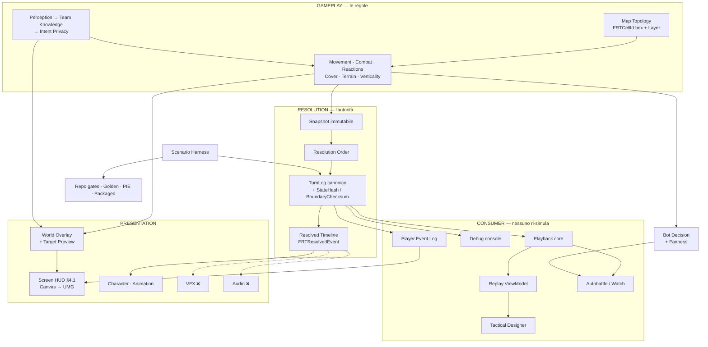

# Capability Map — cosa esiste, chi la possiede, cosa la verifica

> `CURRENT` · **Creato**: 2026-09-10 · **Rivisto**: 2026-09-10 (panel di revisione — §0.1)
> **Owner** di **una sola domanda**: per ogni capability del gioco,
> *chi la possiede, cosa la implementa, cosa la verifica, e cosa manca ancora*.
> **Dato macchina**: [`capability-map.yaml`](capability-map.yaml) — questo file ne è la vista umana.
>
> **Fotografia**: misurata il 2026-09-10 su `origin/main` `18065c28` e su GitHub LIVE.
>
> 🔴 **Questo documento non possiede stato.** La source of truth sono le **issue e le milestone GitHub**,
> il **codice su `main`** e i **test eseguibili**. Quando questo file e GitHub non concordano, **vince
> GitHub**. Non assegna lavoro, non è owner di nessuna specifica, non introduce una scala di release.
>
> ⛔ **Non è il Feature Registry.** Quello è uscito dal repository con `D-181` (commit `26f6955a`) e gli
> identificatori `RT-FEAT-*` **non sono autorevoli**. Gli `RT-CAP-*` sono identificatori **locali di questa
> vista**, nati oggi.
>
> ⛔ **Non duplica [`../../roadmap/capability-roadmaps.md`](../../roadmap/capability-roadmaps.md).** Quella
> risponde a *«come una capability matura fra le release»* su dieci viste `CR-*`; questa risponde a *«cosa
> c'è oggi, e dove sono i buchi»* su tutta la superficie del codice. Ogni riga qui dichiara la propria
> `CR-*` nel campo `owner.capability_view`.

---

## 0. Come si legge

Tre assi separati, **nessuna percentuale**. Una capability può essere implementata e non vedibile, oppure
vedibile e non verificata: un numero solo le confonderebbe, ed è esattamente la distinzione che serve per
decidere cosa fare dopo.

| Asse | ✅ `complete` | 🟡 `partial` | ❌ `missing` | — `not_applicable` |
|---|---|---|---|---|
| **Implementation** | esiste ed è raggiungibile dal percorso di gioco reale | esiste, e il contratto del suo owner ha buchi **misurati** da issue aperte | nessun codice di produzione la implementa | — |
| **Validation** | test mirati **e** scenari/golden che la esercitano dal percorso reale | test sì, ma manca scenario, mutazione, o un ramo che una issue dichiara scoperto | nessun test la nomina | — |
| **Presentation** | il giocatore o il designer vede l'esito senza leggere un log | visibile in parte, o solo da un canale di debug | la logica decide e nulla lo mostra | non ha superficie player-facing |

⚠️ **`validation` misura cosa ESISTE, non cosa è stato ESEGUITO.** L'esecuzione vive in `verification`, e
in questa passata è **`NOT RUN` per costruzione**: l'audit è statico e non esiste CI (`D-182`). Lo stato
degli esiti realmente misurati è nei gate di
[`../../roadmap/v0.1-definition-of-done.md`](../../roadmap/v0.1-definition-of-done.md) §3, riportato al §5
di questo file.

### 0.1 Come questa mappa sbaglia

Un panel di revisione ha riletto la prima stesura il 2026-09-10 e ha trovato **un difetto di metodo, non
tre difetti isolati**. Vale la pena scriverlo perché chiunque riusi questa mappa lo ripeterebbe.

🔴 **Il titolo di una issue aperta descrive il difetto *al momento dell'apertura*, non oggi.** In questo
repository il lavoro atterra sotto una issue che poi **resta aperta** per lo scope residuo — verifica PIE,
follow-up, accettazione. La prima stesura ha letto tre titoli come stato corrente, e **tutti e tre erano
già indirizzati nel codice su `origin/main`**:

| Claim ritirato | Cosa dice invece il codice |
|---|---|
| *«#2697: il feed del giocatore ha zero chiamanti fuori dai test»* | `9169c2ff feat(2697): il feed arriva a schermo` è su `main`; [`RTHUD.cpp`](../../../Source/RefactorTactics/UI/RTHUD.cpp) `:994` chiama `BuildPlayerEventFeed` in produzione e [`RTScreenHudWidgets.h`](../../../Source/RefactorTactics/UI/RTScreenHudWidgets.h) `:294` espone `GetFeed()` |
| *«#2742: la LOS non ha un canale verso lo schermo»* | `5149867f feat(2742)` è su `main`; [`RTHexMapActor.cpp`](../../../Source/RefactorTactics/Map/RTHexMapActor.cpp) `:1291-1307` disegna la linea con `ColorFor(ERTOverlayMeaning::Vision)` |
| *«#2554: l'anteprima dell'Anim Browser non si anima e non inquadra»* | `f29dd374` è antenato di `main`; [`SRTAnimPreviewViewport.cpp`](../../../Source/RefactorTacticsEditor/Private/SRTAnimPreviewViewport.cpp) fa override di `Tick` → `World->Tick(...)` e chiama `FocusViewportOnBox` |

**La regola che ne segue**, e che vale per ogni futura modifica di questo file: nessun campo `status` si
deriva da un titolo. Si deriva da (1) il simbolo nel codice e i suoi chiamanti **fuori dai test**, (2)
`git log origin/main --grep=<numero>` per vedere se il lavoro è atterrato, e **solo dopo** (3) la issue —
letta, non citata.

Altri due modi in cui la prima stesura ha sbagliato, entrambi della stessa famiglia — *misurare un token
invece del fatto*:

- **`git grep` di un token non distingue un riferimento vivo da una frase sulla sua assenza.** Tre difetti
  ritirati per questo: `WBP_RT_PauseMenu`, `WBP_RT_ScenarioComposer` (§6.5) e `RTPlayerState.h`, che era
  elencato fra i file di `RT-CAP-REPLICATION` mentre è un **commento** che descrive un seam futuro.
- **Una ricerca case-insensitive corta non è una misura di assenza.** `git grep -il FMOD` risponde 10 file,
  e sono **tutti** `FModuleManager` e `FModeToolkit`.

⚠️ Le rettifiche restano **scritte** nelle voci del `.yaml`, marcate `⌫`, invece di essere riscritte in
silenzio: una mappa che corregge senza lasciare traccia insegna a fidarsi della versione sbagliata la
prossima volta.

---

## 1. Overview



Le due frecce tratteggiate sono **assenze misurate**, non semplificazioni del disegno: vedi
`RT-CAP-VFX` e `RT-CAP-AUDIO` al §6.

L'invariante che tutta la metà destra protegge, e che questa passata ha **verificato**:

```text
Resolver autorevole → TurnLog / Resolved Timeline → Playback / Inspection → consumer
```

⛔ **Mai il verso opposto.** Misurato su `origin/main` `18065c28`: `LockInAndResolve`, `ResolveTurn` e
`AdvanceMovementResolution` hanno chiamanti **solo** in `Turn/`, `RTGameMode`, `RTPlayerController`,
`RTMatchBootstrapper` e `ScenarioHarness/RTScenarioRunner`–`RTScenarioSession`. **Zero** chiamanti in
`Replay/`, `UI/`, `Frontend/` e nell'intero modulo `RefactorTacticsEditor`.

---

## 2. Capability Matrix

### Gameplay

| Capability | Impl | Valid | Present | Owner | Open work |
|---|:--:|:--:|:--:|---|---|
| `RT-CAP-TURN-LOOP`<br>Turn Structure | ✅ | ✅ | 🟡 | #14 | #1818 · #1821 · #1816 |
| `RT-CAP-PLANNING`<br>Planning & Plan Validation | ✅ | 🟡 | 🟡 | #609 | #2826 · #2793 · #2698 · #2702 · #607 · #172 |
| `RT-CAP-ACTION-MODEL`<br>Action Model & Catalog | ✅ | ✅ | 🟡 | #609 | #2827 · #2578 · #1803 |
| `RT-CAP-ACTION-ECONOMY`<br>Action Economy (slot, cooldown, drawback) | 🟡 | 🟡 | 🟡 | #609 | #609 · #607 · #2088 |
| `RT-CAP-MOVEMENT-BUDGET`<br>Movement (budget path) | ✅ | ✅ | 🟡 | #16 | #2628 · #2501 · #2836 |
| `RT-CAP-MOVEMENT-LINEAR`<br>Linear Mobility (Dash, Charge, Leap, Reposition) | ✅ | ✅ | 🟡 | #609 | #704 · #2825 |
| `RT-CAP-SIMULTANEOUS-MOVEMENT`<br>Simultaneous Movement & Collision Resolution | ✅ | ✅ | 🟡 | #14 | #2629 |
| `RT-CAP-FACING`<br>Facing & Rotation Policy | ✅ | ✅ | 🟡 | #2276 | #2819 · #2167 · #1793 |
| `RT-CAP-PATHFINDING`<br>Tactical Pathfinding | ✅ | ✅ | 🟡 | #16 | — |
| `RT-CAP-LOS`<br>Line of Sight & Occlusion | ✅ | ✅ | 🟡 | #151 | #2742 · #1944 · #2795 |
| `RT-CAP-TARGETING`<br>Targeting & Engageability | ✅ | ✅ | 🟡 | #2276 | #2825 · #2827 |
| `RT-CAP-COMBAT`<br>Combat Resolution & Damage Pipeline | ✅ | ✅ | 🟡 | #2586 | #2586 · #2589 · #2588 · #2658 · #2798 |
| `RT-CAP-REACTIONS`<br>Reaction Windows & Clash | ✅ | ✅ | 🟡 | #152 | #2462 · #2516 · #2795 · #2367 · #166 · #314 · #319 |
| `RT-CAP-OVERWATCH-PREDICTIVE`<br>Overwatch & Predictive Fire | ✅ | ✅ | 🟡 | #152 | #2795 · #2367 · #329 · #330 |
| `RT-CAP-COVER`<br>Cover & Intra-Hex Placement | ✅ | ✅ | 🟡 | #323 | #1833 · #1829 · #1831 · #1317 · #2341 · #1561 · #323 |
| `RT-CAP-TERRAIN-ENV`<br>Terrain & Environmental Systems | ✅ | ✅ | 🟡 | #2276 | #2798 · #2505 · #257 · #2149 |
| `RT-CAP-STATUS`<br>Status Framework | 🟡 | 🟡 | 🟡 | #435 | #435 · #437 · #441 · #244 · #2456 · #2378 |
| `RT-CAP-STRUCTURES`<br>Structures, Walls, Doors & Arcs | ✅ | ✅ | 🟡 | #324 | #324 · #2828 · #2827 · #2731 · #2761 · #1850 · #1848 |
| `RT-CAP-VERTICALITY`<br>Verticality — Ledge, Fall & Forced Movement | ✅ | ✅ | 🟡 | #2388 | #2388 · #2408 · #2407 · #2405 · #2404 |
| `RT-CAP-OBJECTIVES-MATCHEND`<br>Objectives & Match End | ✅ | ✅ | 🟡 | #14 | #2281 · #331 · #332 · #940 |
| `RT-CAP-MATCH-FORMAT`<br>Match Format (2v2 / 3v3 / 4v4) | ✅ | ✅ | 🟡 | #325 | #325 · #333 · #221 |
| `RT-CAP-PERCEPTION`<br>Perception (vista, udito, propagazione) | ✅ | ✅ | 🟡 | #151 | #327 · #2795 · #824 |
| `RT-CAP-TEAM-KNOWLEDGE`<br>Team Knowledge & Memory | ✅ | ✅ | 🟡 | #151 | #2731 · #2632 · #2597 · #2485 |
| `RT-CAP-INTENT-PRIVACY`<br>Intent Privacy (planning privato) | ✅ | ✅ | — | #773 | #784 · #759 · #1466 · #2793 |
| `RT-CAP-HERO-KIT`<br>Hero Kits & Roster | ✅ | ✅ | 🟡 | #1408 | #1408 · #2297 · #2291 · #322 · #2381 |
| `RT-CAP-EQUIPMENT-LOADOUT`<br>Equipment, Variants & Loadout | ✅ | ✅ | 🟡 | #1408 | #1564 · #2577 |
| `RT-CAP-MAP-TOPOLOGY`<br>Tactical Map Topology (hex multilivello) | ✅ | ✅ | ✅ | #16 | #1868 · #1775 · #1218 |

### Resolution / Simulation

| Capability | Impl | Valid | Present | Owner | Open work |
|---|:--:|:--:|:--:|---|---|
| `RT-CAP-SNAPSHOT`<br>Immutable Snapshot | ✅ | ✅ | — | #26 | — |
| `RT-CAP-RESOLUTION-ORDER`<br>Deterministic Resolution Order | ✅ | ✅ | — | #26 | — |
| `RT-CAP-TURNLOG`<br>TurnLog canonico (traccia + serializzazione) | ✅ | ✅ | 🟡 | #26 | #1392 · #649 · #805 · #2516 |
| `RT-CAP-STATE-HASH`<br>StateHash & Boundary Checksum | ✅ | ✅ | — | #26 | #2620 |
| `RT-CAP-RESOLVED-TIMELINE`<br>Resolved Timeline (FRTResolvedEvent) | 🟡 | ✅ | 🟡 | #2453 | #2453 · #2828 · #2505 · #2457 |
| `RT-CAP-PLAYBACK`<br>Resolution Playback (pacing, pause, step, speed) | ✅ | ✅ | 🟡 | #1881 | #1881 · #2411 |
| `RT-CAP-REPLAY-ARCHIVE`<br>Replay Recording & Manifest | ✅ | ✅ | 🟡 | #26 | #813 · #805 · #2620 |
| `RT-CAP-REPLAY-SEEK`<br>Replay Seek (turno, fase, micro-step) | ✅ | ✅ | 🟡 | #1881 | — |
| `RT-CAP-REPLAY-STATE`<br>Replay State Reconstruction (UnitsAtBoundary) | ✅ | ✅ | 🟡 | #1881 | — |
| `RT-CAP-REPLAY-VIEWMODEL`<br>Replay ViewModel & Blueprint Bridge | ✅ | ✅ | ✅ | #1881 | #1625 |
| `RT-CAP-REPLAY-PRIVACY`<br>Replay Privacy (public/sanitized vs private audit) | 🟡 | 🟡 | ❌ | #1881 | #1805 · #759 |
| `RT-CAP-MATCH-HISTORY`<br>Match History Index | ✅ | ✅ | ✅ | #934 | — |
| `RT-CAP-PACING`<br>Pacing Telemetry | ✅ | ✅ | 🟡 | #1881 | #1818 · #2462 |

### Presentation

| Capability | Impl | Valid | Present | Owner | Open work |
|---|:--:|:--:|:--:|---|---|
| `RT-CAP-SCREEN-HUD`<br>Screen HUD (Canvas legacy → UMG §4.1) | 🟡 | ✅ | 🟡 | #25 | #613 · #1936 · #2764 · #2757 · #2752 · #2744 · #2732 · #2826 · #2184 · #2618 |
| `RT-CAP-WORLD-OVERLAY`<br>Tactical World Overlay (grammatica semantica) | 🟡 | 🟡 | 🟡 | #1769 | #1941 · #1942 · #1943 · #1944 · #2742 · #1614 · #921 |
| `RT-CAP-TARGET-PREVIEW`<br>Target & Movement Preview | 🟡 | 🟡 | 🟡 | #1769 | #2825 · #2793 · #2742 · #2632 · #2597 · #1944 · #607 · #172 |
| `RT-CAP-PLAYER-EVENT-LOG`<br>Player Event Log & Explainability | 🟡 | ✅ | 🟡 | #1937 | #1937 · #1936 · #2697 · #2281 · #1392 |
| `RT-CAP-COMBAT-FEEDBACK`<br>Combat Feedback (damage token, cue, status) | 🟡 | 🟡 | 🟡 | #2453 | #2453 · #2456 · #2457 · #2828 · #2505 |
| `RT-CAP-CHAR-PRESENTATION`<br>Character Presentation (mesh, anelli, sagome) | ✅ | ✅ | 🟡 | #286 | #286 · #1750 · #2545 · #1095 · #2167 |
| `RT-CAP-ANIMATION-RUNTIME`<br>Animation Runtime & Catalog | 🟡 | ✅ | 🟡 | #286 | #288 · #2521 · #2545 · #2167 |
| `RT-CAP-VFX`<br>VFX (Niagara) | ❌ | ❌ | ❌ | **nessuno** | #288 · #2453 |
| `RT-CAP-AUDIO`<br>Audio Feedback | ❌ | ❌ | ❌ | **nessuno** | — |
| `RT-CAP-CAMERA`<br>Tactical Camera & Map Presentation | ✅ | ✅ | 🟡 | #1769 | #1769 · #1781 · #1775 · #1809 |
| `RT-CAP-FOG-PRESENTATION`<br>Fog / Knowledge Veil presentation | ✅ | ✅ | 🟡 | #151 | #2731 · #1750 |
| `RT-CAP-ICON-LANGUAGE`<br>Icon Language | ✅ | ✅ | 🟡 | #217 | #217 · #265 |
| `RT-CAP-HERO-PROFILE`<br>Hero Profile / Profilo Tattico | ✅ | ✅ | 🟡 | #1408 | #2652 |
| `RT-CAP-FRONTEND-SHELL`<br>Frontend Shell & Navigation | ✅ | ✅ | ✅ | #934 | #934 · #940 |
| `RT-CAP-POINTER-INTERACTION`<br>Pointer Interaction Contract | ✅ | ✅ | 🟡 | #25 | #1614 · #2802 |

### AI / Bot

| Capability | Impl | Valid | Present | Owner | Open work |
|---|:--:|:--:|:--:|---|---|
| `RT-CAP-BOT-DECISION`<br>Bot Decision (candidate generation, scoring, selection) | ✅ | ✅ | 🟡 | #326 | #326 · #328 · #2629 · #2477 · #534 |
| `RT-CAP-BOT-FAIRNESS`<br>Bot Fairness (il bot non vede piu' di te) | ✅ | 🟡 | — | #326 | #160 · #327 |
| `RT-CAP-AUTOBATTLE`<br>Autobattle / la partita che si guarda | 🟡 | ✅ | 🟡 | #952 | #952 · #2748 · #2745 · #2744 |

### Tooling

| Capability | Impl | Valid | Present | Owner | Open work |
|---|:--:|:--:|:--:|---|---|
| `RT-CAP-SCENARIO-HARNESS`<br>Scenario Harness (loader, runner, report) | ✅ | ✅ | 🟡 | #1105 | #2702 · #2714 · #1515 · #2701 · #703 · #785 |
| `RT-CAP-SCENARIO-AUTHORING`<br>Scenario Authoring, Index & Corpus | ✅ | ✅ | 🟡 | #1105 | #1628 · #1564 · #1405 · #1809 |
| `RT-CAP-TACTICAL-DESIGNER`<br>Tactical Designer (un solo loop fra mappa, skill e scenario) | 🟡 | ✅ | 🟡 | #1105 | #1105 · #1625 · #1628 · #2802 |
| `RT-CAP-MAP-EDITOR`<br>Map Editor (Hex Map Mode, tool, cottura) | 🟡 | ✅ | 🟡 | #1861 | #1861 · #1864 · #1872 · #1868 · #1895 · #1831 · #1317 · #1186 · #921 · #2802 · #2330 |
| `RT-CAP-ANIM-BROWSER`<br>Anim Browser & Preview (l'«Animation Preview» del prompt) | 🟡 | ✅ | 🟡 | #286 | #2554 · #2521 |
| `RT-CAP-GRAYKIT-PLAYGROUND`<br>Gray Kit Playground (Visual Language & Validation Lab) | 🟡 | ✅ | 🟡 | #1990 | #1990 · #1993 · #1095 |
| `RT-CAP-DEBUG-CONSOLE`<br>Debug Console & Inspection | ✅ | ✅ | 🟡 | #25 | #2757 · #2485 |
| `RT-CAP-SKILL-WORKBENCH`<br>Skill Workbench & Ability/Hero Lab | 🟡 | ✅ | ❌ | #2565 | #2565 · #2577 · #2576 · #2579 · #2578 · #1950 · #776 · #403 |
| `RT-CAP-REPO-GATES`<br>Repository Gates (tooling locale, senza CI) | ✅ | ✅ | — | #26 | #2849 · #1405 · #2578 |

### Networking / Future Authority

| Capability | Impl | Valid | Present | Owner | Open work |
|---|:--:|:--:|:--:|---|---|
| `RT-CAP-AUTHORITY-BOUNDARY`<br>Authority Boundary (client propone, server valida) | ✅ | ✅ | — | #773 | #773 · #784 · #782 · #1820 |
| `RT-CAP-REPLICATION`<br>Replication Boundary | ❌ | ❌ | — | #773 | #773 · #775 · #782 · #781 · #784 · #785 |
| `RT-CAP-TEMPORAL-PRIVACY`<br>Temporal Privacy (quando un intento diventa pubblico) | 🟡 | 🟡 | — | #773 | #759 · #1805 · #1466 |

---

## 3. Dependency Map

Dipendenze **dirette** (l'arco autorevole del `.yaml`). Il grafo completo è **aciclico** — verificato con
una DFS su tutte le radici — e `consumers` ne è l'inverso esatto.

```text
RT-CAP-MOVEMENT-BUDGET
├─ RT-CAP-MAP-TOPOLOGY
├─ RT-CAP-PATHFINDING
├─ RT-CAP-SNAPSHOT
└─ RT-CAP-STRUCTURES
```

```text
RT-CAP-COMBAT
├─ RT-CAP-COVER
├─ RT-CAP-EQUIPMENT-LOADOUT
├─ RT-CAP-FACING
├─ RT-CAP-OVERWATCH-PREDICTIVE
├─ RT-CAP-REACTIONS
├─ RT-CAP-SNAPSHOT
├─ RT-CAP-STATUS
├─ RT-CAP-TARGETING
└─ RT-CAP-TERRAIN-ENV
```

```text
RT-CAP-PLAYBACK
├─ RT-CAP-FACING
├─ RT-CAP-MOVEMENT-BUDGET
├─ RT-CAP-PACING
├─ RT-CAP-REACTIONS
├─ RT-CAP-RESOLVED-TIMELINE
├─ RT-CAP-SIMULTANEOUS-MOVEMENT
├─ RT-CAP-TURN-LOOP
├─ RT-CAP-TURNLOG
└─ RT-CAP-VERTICALITY
```

```text
RT-CAP-REPLAY-VIEWMODEL
├─ RT-CAP-MATCH-HISTORY
├─ RT-CAP-PLAYBACK
├─ RT-CAP-REPLAY-ARCHIVE
├─ RT-CAP-REPLAY-PRIVACY
├─ RT-CAP-REPLAY-SEEK
└─ RT-CAP-REPLAY-STATE
```

```text
RT-CAP-SCREEN-HUD
├─ RT-CAP-ACTION-ECONOMY
├─ RT-CAP-COMBAT-FEEDBACK
├─ RT-CAP-FOG-PRESENTATION
├─ RT-CAP-HERO-PROFILE
├─ RT-CAP-ICON-LANGUAGE
├─ RT-CAP-INTENT-PRIVACY
├─ RT-CAP-OBJECTIVES-MATCHEND
├─ RT-CAP-PLAYBACK
├─ RT-CAP-PLAYER-EVENT-LOG
├─ RT-CAP-POINTER-INTERACTION
├─ RT-CAP-REACTIONS
├─ RT-CAP-STATUS
├─ RT-CAP-TARGET-PREVIEW
├─ RT-CAP-TEAM-KNOWLEDGE
└─ RT-CAP-TURN-LOOP
```

```text
RT-CAP-TARGET-PREVIEW
├─ RT-CAP-INTENT-PRIVACY
├─ RT-CAP-LOS
├─ RT-CAP-MOVEMENT-BUDGET
├─ RT-CAP-MOVEMENT-LINEAR
├─ RT-CAP-OVERWATCH-PREDICTIVE
├─ RT-CAP-PATHFINDING
├─ RT-CAP-PLANNING
├─ RT-CAP-POINTER-INTERACTION
├─ RT-CAP-TARGETING
└─ RT-CAP-WORLD-OVERLAY
```

```text
RT-CAP-AUTOBATTLE
├─ RT-CAP-BOT-DECISION
├─ RT-CAP-BOT-FAIRNESS
├─ RT-CAP-CAMERA
├─ RT-CAP-FOG-PRESENTATION
├─ RT-CAP-MATCH-FORMAT
├─ RT-CAP-OBJECTIVES-MATCHEND
├─ RT-CAP-PLAYBACK
├─ RT-CAP-PLAYER-EVENT-LOG
├─ RT-CAP-SCREEN-HUD
└─ RT-CAP-TURN-LOOP
```

```text
RT-CAP-TACTICAL-DESIGNER
├─ RT-CAP-CAMERA
├─ RT-CAP-FOG-PRESENTATION
├─ RT-CAP-MAP-EDITOR
├─ RT-CAP-PLAYBACK
├─ RT-CAP-REPLAY-SEEK
├─ RT-CAP-REPLAY-STATE
├─ RT-CAP-REPLAY-VIEWMODEL
├─ RT-CAP-SCENARIO-AUTHORING
├─ RT-CAP-SCENARIO-HARNESS
├─ RT-CAP-TARGET-PREVIEW
├─ RT-CAP-TEAM-KNOWLEDGE
└─ RT-CAP-TURNLOG
```

```text
RT-CAP-PLAYER-EVENT-LOG
├─ RT-CAP-INTENT-PRIVACY
├─ RT-CAP-TEAM-KNOWLEDGE
├─ RT-CAP-TEMPORAL-PRIVACY
└─ RT-CAP-TURNLOG
```

```text
RT-CAP-VERTICALITY
├─ RT-CAP-MAP-TOPOLOGY
├─ RT-CAP-SIMULTANEOUS-MOVEMENT
└─ RT-CAP-STRUCTURES
```

---

## 4. Consumer Map

Le capability che più sistemi condividono. È la lista che dice *«cosa si rompe se tocco questa»*.

| Capability condivisa | Consumer |
|---|---|
| `RT-CAP-MAP-TOPOLOGY` | `RT-CAP-BOT-DECISION` · `RT-CAP-CAMERA` · `RT-CAP-COVER` · `RT-CAP-FACING` · `RT-CAP-LOS` · `RT-CAP-MAP-EDITOR` · `RT-CAP-MOVEMENT-BUDGET` · `RT-CAP-MOVEMENT-LINEAR` · `RT-CAP-OBJECTIVES-MATCHEND` · `RT-CAP-PATHFINDING` · `RT-CAP-PERCEPTION` · `RT-CAP-PLANNING` · `RT-CAP-POINTER-INTERACTION` · `RT-CAP-SCENARIO-AUTHORING` · `RT-CAP-SCENARIO-HARNESS` · `RT-CAP-SNAPSHOT` · `RT-CAP-STRUCTURES` · `RT-CAP-TARGETING` · `RT-CAP-TERRAIN-ENV` · `RT-CAP-VERTICALITY` · `RT-CAP-WORLD-OVERLAY` |
| `RT-CAP-TURNLOG` | `RT-CAP-DEBUG-CONSOLE` · `RT-CAP-PLAYBACK` · `RT-CAP-PLAYER-EVENT-LOG` · `RT-CAP-REPLAY-ARCHIVE` · `RT-CAP-REPLAY-SEEK` · `RT-CAP-REPLAY-STATE` · `RT-CAP-RESOLVED-TIMELINE` · `RT-CAP-SCENARIO-HARNESS` · `RT-CAP-STATE-HASH` · `RT-CAP-STATUS` · `RT-CAP-TACTICAL-DESIGNER` · `RT-CAP-TURN-LOOP` |
| `RT-CAP-INTENT-PRIVACY` | `RT-CAP-BOT-FAIRNESS` · `RT-CAP-PLAYER-EVENT-LOG` · `RT-CAP-REACTIONS` · `RT-CAP-REPLAY-PRIVACY` · `RT-CAP-REPLICATION` · `RT-CAP-SCREEN-HUD` · `RT-CAP-TARGET-PREVIEW` · `RT-CAP-TEMPORAL-PRIVACY` · `RT-CAP-WORLD-OVERLAY` |
| `RT-CAP-TEAM-KNOWLEDGE` | `RT-CAP-BOT-DECISION` · `RT-CAP-BOT-FAIRNESS` · `RT-CAP-CHAR-PRESENTATION` · `RT-CAP-DEBUG-CONSOLE` · `RT-CAP-FOG-PRESENTATION` · `RT-CAP-PLAYER-EVENT-LOG` · `RT-CAP-SCREEN-HUD` · `RT-CAP-TACTICAL-DESIGNER` |
| `RT-CAP-SNAPSHOT` | `RT-CAP-BOT-DECISION` · `RT-CAP-COMBAT` · `RT-CAP-MOVEMENT-BUDGET` · `RT-CAP-RESOLUTION-ORDER` · `RT-CAP-SIMULTANEOUS-MOVEMENT` · `RT-CAP-STATE-HASH` · `RT-CAP-TURN-LOOP` · `RT-CAP-TURNLOG` |
| `RT-CAP-TURN-LOOP` | `RT-CAP-AUTOBATTLE` · `RT-CAP-OBJECTIVES-MATCHEND` · `RT-CAP-PACING` · `RT-CAP-PLAYBACK` · `RT-CAP-REACTIONS` · `RT-CAP-SCENARIO-HARNESS` · `RT-CAP-SCREEN-HUD` |
| `RT-CAP-ACTION-MODEL` | `RT-CAP-ACTION-ECONOMY` · `RT-CAP-BOT-DECISION` · `RT-CAP-EQUIPMENT-LOADOUT` · `RT-CAP-ICON-LANGUAGE` · `RT-CAP-PLANNING` · `RT-CAP-SKILL-WORKBENCH` · `RT-CAP-STATUS` |
| `RT-CAP-LOS` | `RT-CAP-DEBUG-CONSOLE` · `RT-CAP-MAP-EDITOR` · `RT-CAP-OVERWATCH-PREDICTIVE` · `RT-CAP-PERCEPTION` · `RT-CAP-TARGET-PREVIEW` · `RT-CAP-TARGETING` |
| `RT-CAP-FACING` | `RT-CAP-ANIMATION-RUNTIME` · `RT-CAP-CHAR-PRESENTATION` · `RT-CAP-COMBAT` · `RT-CAP-MOVEMENT-LINEAR` · `RT-CAP-PLAYBACK` · `RT-CAP-STATE-HASH` |
| `RT-CAP-STRUCTURES` | `RT-CAP-COVER` · `RT-CAP-LOS` · `RT-CAP-MAP-EDITOR` · `RT-CAP-MOVEMENT-BUDGET` · `RT-CAP-VERTICALITY` |
| `RT-CAP-RESOLVED-TIMELINE` | `RT-CAP-ANIMATION-RUNTIME` · `RT-CAP-AUDIO` · `RT-CAP-COMBAT-FEEDBACK` · `RT-CAP-PLAYBACK` · `RT-CAP-VFX` |
| `RT-CAP-REACTIONS` | `RT-CAP-BOT-DECISION` · `RT-CAP-COMBAT` · `RT-CAP-OVERWATCH-PREDICTIVE` · `RT-CAP-PLAYBACK` · `RT-CAP-SCREEN-HUD` |
| `RT-CAP-PLAYBACK` | `RT-CAP-AUTOBATTLE` · `RT-CAP-COMBAT-FEEDBACK` · `RT-CAP-REPLAY-VIEWMODEL` · `RT-CAP-SCREEN-HUD` · `RT-CAP-TACTICAL-DESIGNER` |
| `RT-CAP-PLANNING` | `RT-CAP-BOT-DECISION` · `RT-CAP-INTENT-PRIVACY` · `RT-CAP-SCENARIO-HARNESS` · `RT-CAP-TARGET-PREVIEW` · `RT-CAP-TURN-LOOP` |

🔑 **`RT-CAP-TURNLOG` è il collo di bottiglia condiviso del progetto**: live match, replay, designer,
debug, spiegazione al giocatore e checksum di determinismo leggono tutti la stessa traccia. È il motivo
per cui il formato si estende **solo in coda** e per cui `RT-CAP-PLAYBACK` non può diventare un secondo
simulatore.

---

## 5. Validation Map

```text
RT-CAP-MOVEMENT-BUDGET
├─ Automation: RefactorTactics.HexMove.* · RefactorTactics.HexSim.* · RefactorTactics.Movement.* · RefactorTactics.MovementProbe.*
├─ Scenari: Scenarios/Movement/Basic.json · Scenarios/Movement/LongWalk.json · Scenarios/Movement/Blocked.json
├─ Mutazione: —
├─ PIE: PIE-HEXPLAY-2
└─ Packaged: G10
```

```text
RT-CAP-COMBAT
├─ Automation: RefactorTactics.Combat.* · RefactorTactics.HexCombat.* · RefactorTactics.HexBlast.* · RefactorTactics.Damage.* · RefactorTactics.CombatLog.*
├─ Scenari: Scenarios/Combat/BasicAttack.json · Scenarios/Combat/CounterStrikesBack.json · Scenarios/Combat/SplashHitsAlliesNotSelf.json
├─ Mutazione: tools/mutation/costanti-combattimento.py
├─ PIE: —
└─ Packaged: —
```

```text
RT-CAP-REACTIONS
├─ Automation: RefactorTactics.Reactions.* · RefactorTactics.Reaction.* · RefactorTactics.Clash.*
├─ Scenari: Scenarios/Spec/Clash/ReadBeatsStand.json · Scenarios/Spec/Clash/ShiftBeatsRead.json · Scenarios/Spec/Clash/StandBeatsShift.json · Scenarios/Spec/Clash/TieAppliesOnce.json
├─ Mutazione: —
├─ PIE: —
└─ Packaged: —
```

```text
RT-CAP-LOS
├─ Automation: RefactorTactics.HexVision.* · RefactorTactics.Vision.* · RefactorTactics.Occlusion.* · RefactorTactics.Sight.* · RefactorTactics.Incidence.*
├─ Scenari: Scenarios/Combat/BlockedByWall.json · Scenarios/Combat/BlockedByInteriorWall.json
├─ Mutazione: —
├─ PIE: PIE-HEXPLAY-6
└─ Packaged: —
```

```text
RT-CAP-VERTICALITY
├─ Automation: RefactorTactics.Fall.* · RefactorTactics.ForcedMovement.* · RefactorTactics.Standability.*
├─ Scenari: —
├─ Mutazione: —
├─ PIE: —
└─ Packaged: —
```

```text
RT-CAP-BOT-FAIRNESS
├─ Automation: RefactorTactics.HexBot.* · RefactorTactics.Knowledge.*
├─ Scenari: Scenarios/Spec/Bot/HiddenEnemyFairness.json · Scenarios/Spec/Bot/PlansOnPartialKnowledge.json
├─ Mutazione: canary dell'onniscienza — RTHexBotIntegrationTests.cpp:616
├─ PIE: —
└─ Packaged: —
```

```text
RT-CAP-PLAYBACK
├─ Automation: RefactorTactics.Playback.* · RefactorTactics.Pacing.*
├─ Scenari: Scenarios/Movement/Basic.json
├─ Mutazione: —
├─ PIE: —
└─ Packaged: —
```

```text
RT-CAP-SCREEN-HUD
├─ Automation: RefactorTactics.HUD.* · RefactorTactics.ScreenHud.* · RefactorTactics.HudViewModel.* · RefactorTactics.UI.*
├─ Scenari: —
├─ Mutazione: —
├─ PIE: PIE-V01-HUD
└─ Packaged: G13
```

```text
RT-CAP-INTENT-PRIVACY
├─ Automation: RefactorTactics.Privacy.* · RefactorTactics.BlindActions.* · RefactorTactics.Reactions.IntentNotVisibleToEnemy · RefactorTactics.UI.IntentViewFieldsAreClassified · RefactorTactics.UI.EnemyViewCarriesNoAllyOnlyField
├─ Scenari: Scenarios/Spec/Bot/HiddenEnemyFairness.json
├─ Mutazione: —
├─ PIE: PIE-V01-INTENT
└─ Packaged: G8
```

### Stato reale dei gate di release

⚠️ Questi non sono stati rimisurati qui: sono **trascritti** da
[`../../roadmap/v0.1-definition-of-done.md`](../../roadmap/v0.1-definition-of-done.md) §3, con la data che
quella tabella dichiara. Un gate senza esecutore automatico **non è verde: è verde a una data**.

| Gate | Oggetto | Stato dichiarato | Data della misura |
|---|---|---|---|
| `G1` | Build Editor + Development + Shipping | ✅ | 2026-09-09 |
| `G2` | Suite automation completa | 🟡 Editor verde · packaged parziale | 2026-08-29 |
| `G3` | I dieci test nominati dal catalogo | ✅ | 2026-08-29 |
| `G4` | Determinismo, checksum identico | ✅ | 2026-08-29 |
| `G5` | Nessun gameplay quadrato residuo | ✅ **rimisurato in questa passata** | 2026-09-10 |
| `G6` | ID stabili e unici | ✅ | 2026-08-29 |
| `G7` | Nessun float in costi/priorità/danni | 🟡 validator sì, revisione `.uasset` no | 2026-08-29 |
| `G8` | Nessun intento avversario replicato | ✅ ma **offline**: misura il DTO, non il filo | 2026-09-04 |
| `G9` | Subset `RELEASE-V01` delle verifiche manuali | 🟡 **una voce FALLITA** (`PIE-HEXPLAY-6`) | 2026-09-09 |
| `G10` | Partita completa 2v2 con esito terminale | ⏳ mai registrata | — |
| `G11` | KPI misurati e registrati | ⏳ | — |
| `G12` | Packaging Development + Shipping | 🔴 **STANTIO** — timbro del 2026-08-16 | 2026-08-16 |
| `G13` | Partita giocabile dalla build packaged | 🟡 | 2026-09-03 |
| `G14` | Documentazione allineata | ⏳ | — |
| `G16` | Vertical Slice Labs & Playback — smoke integrato | ⏳ aperto | 2026-09-10 |

🔴 **Il perimetro non è un intervallo, e leggerlo come tale è il modo in cui si perde un gate.**
`G15` **è ritirato** — tolto il 2026-08-21 da `D-181` insieme al Feature Registry che ne era l'unico
meccanismo — e il numero **non si riusa**: la riga resta barrata perché un gate che sparisce senza traccia
si riscrive uguale sei mesi dopo. `G16` è il gate **successivo**, non il quindicesimo.

⚠️ **`G16` non è su `origin/main` `18065c28`**, cioè fuori dalla fotografia dichiarata in testa a questo
documento: entra con `1cdd0d03` (`D-377`), il commit **gemello di questo file nella stessa PR**. Al merge
il perimetro diventa `G1`…`G14` più `G16`. La riga è qui perché la prima stesura scriveva *«`G1`…`G14`»*
come se fosse tutto, e sarebbe atterrata contraddicendo il commit accanto al proprio.

🔑 **`G16` è il gate che questa mappa avrebbe voluto avere.** Chiede che **Ability Lab**, **Hero Lab**,
**Presentation**, **Turn Log proiettato al giocatore** e **Replay Viewer** siano usabili **nello stesso
giro** su una sola release candidate — invece che verdi ciascuno nel proprio checkpoint. È esattamente la
differenza fra la colonna `Impl` di questa matrice e la domanda *«il vertical slice esiste come
esperienza?»*, che qui resta senza risposta e al §9 è la voce `4`.

---

## 6. Gap Analysis

Solo problemi **verificati**. Ogni riga porta la misura o la issue che la dichiara.

### 6.1 Owner gap — capability senza owner

| Capability | Cosa manca | Evidenza |
|---|---|---|
| `RT-CAP-AUDIO` | **nessuna epic, nessuna spec, nessuna issue aperta** | `git grep -lE 'SoundBase\|UAudioComponent\|PlaySound' origin/main -- 'Source/*'` → **0 file**. Il Domain 10 *«Audio & Feedback»* di `CLAUDE.md` §12 non ha controparte nel codice |
| `RT-CAP-VFX` | nessuna epic proprietaria | `git grep -il niagara origin/main -- 'Source/*'` → **1 file, ed è un commento**: [`RTPresentationBinding.h`](../../../Source/RefactorTactics/Turn/RTPresentationBinding.h) dichiara che *«`Content/` non contiene un solo asset Niagara»*. La decisione *evento → asset* è **presa** (`FX-1`, chiusa da `D-278`) e non implementata; #288 e #2453 la sfiorano dai lati adiacenti |

➕ **Il gap ha una forma più precisa di «non c'è niente», e il panel l'ha misurata.** Il **seam esiste**:
[`RTTurnManager.h`](../../../Source/RefactorTactics/Turn/RTTurnManager.h) `:183-187` dichiara quattro
delegate `BlueprintAssignable` col commento *«per la presentazione in Blueprint (camera/VFX/SFX)»* —
`OnUnitMoveStarted`, `OnUnitDefeated`, `OnAttackResolved`, `OnResolvePlaybackFinished` — e `:981` ripete
*«per VFX/SFX di morte in Blueprint»*. Chi apre queste due capability **non deve progettare un canale**:
deve riempirne uno che c'è. Il buco è il **contenuto** e il **legame dichiarativo**, non l'attacco.

⚠️ La misura sull'audio è stata rifatta con una rete larga dopo il panel: `USound`, `SoundCue`,
`SoundWave`, `MetaSound`, `AudioComponent`, `SpawnSound`, `PlaySound`, `SoundBase`, `SoundClass`,
`AudioDevice`, `Audio::` → **zero file** su `Source/`, `Config/` e `Content/`. Tre token non erano una
misura di assenza; undici lo sono abbastanza da scriverlo.

### 6.2 Implementation gap — spec o decisione presente, codice mancante

| Capability | Il buco | Evidenza |
|---|---|---|
| `RT-CAP-RESOLVED-TIMELINE` | `ERTResolvedEventType` **non ha un valore per la struttura** e `HazardDamage` non ha una fase che lo riproduca | #2828 · #2505 — due assenze nello stesso enum, che è il vocabolario della presentazione: ciò che non ha un valore **non ha un momento** |
| `RT-CAP-STRUCTURES` | `Action.ModifyArc` è **senza esecutore per decisione** (`D-046`) | #2549: nessuna unità può provocare il crollo del ponte ⇒ `PIE-HEXPLAY-8` **non è osservabile** ⇒ `G9` non può raggiungere ✅ finché regge `D-046` |
| `RT-CAP-TARGETING` | `TargetKindForAction` non produce mai `Object`: il ramo è **morto** | #2827 |
| `RT-CAP-STATUS` | il motore **non ha immunità per categoria**; il framework è E36, v0.2 | commenti in [`RTCatalogLibrary.cpp`](../../../Source/RefactorTactics/Ability/RTCatalogLibrary.cpp) righe 512 e 822 |
| `RT-CAP-SKILL-WORKBENCH` | il dato della variante è consegnato e **non ha un ingresso** | #2577 · il diff baseline↔variante è #2576 |
| `RT-CAP-REPLICATION` | trasporto assente **per scope dichiarato** | `DOREPLIFETIME` in 2 file, `GetLifetimeReplicatedProps` in 1, `UFUNCTION(Server` in **0** |

### 6.3 Validation gap — codice presente, copertura insufficiente

| Capability | Il buco | Evidenza |
|---|---|---|
| `RT-CAP-BOT-FAIRNESS` | la proprietà *«il bot non vede più di te»* è **verificabile in casa e non dimostrabile a terzi** dalla traccia | `REP-2` in [`../../OPEN_DECISIONS.md`](../../OPEN_DECISIONS.md): *«un bot che pianifica su `FRTTeamKnowledge` e un bot onnisciente che fa la stessa mossa scrivono voci identiche»*. ⌫ La prima stesura aggiungeva *«la tiene solo la verifica di mutazione»*, ed **era falso**: `RTHexBotIntegrationTests.cpp:616` dichiara `RefactorTactics.HexBotPlay.HiddenEnemyFairness`, un **canary differenziale** — due partite identiche in tutto ciò che la squadra può sapere, diverse solo in ciò che non può, col piano che deve risultare identico |
| `RT-CAP-SCENARIO-HARNESS` | `"move": []` e `"dash": "None"` **caricano verdi come no-op silenziosi** | #2702 — un harness che accetta un no-op silenzioso produce scenari che passano senza esercitare |
| `RT-CAP-SCENARIO-HARNESS` | il corpus golden è **cieco su `SightBlockerCell`** | #2714 — il campo introdotto da `D-340` è fuori dal visitatore che discrimina |
| `RT-CAP-HERO-KIT` | `Hero.Wraith.PhaseGuard` **non è esercitato da niente** | #2381: né scenario, né voce PIE |
| `RT-CAP-COMBAT` | `TwoCountersKeepTheirOwnOrigin` è **intermittente** sul campo autore | #2658 — un test intermittente è un oracolo che non decide |
| `RT-CAP-SIMULTANEOUS-MOVEMENT` | **due test di stallo rossi su `main`** | #2629 — la suite di ogni branch eredita un rosso che non ha causato |
| `RT-CAP-CHAR-PRESENTATION` | **nessun test protegge `BaseMeshScale`** | `GBX-5` in [`../../OPEN_DECISIONS.md`](../../OPEN_DECISIONS.md): portarlo a `(0.6, 0.6, 1.8)` lascia tutta la suite verde |
| `RT-CAP-ACTION-MODEL` | `catalog-code` copre 4 eroi × 6 stat; **gli ID d'azione restano fuori** | #2578 · `G7` è 🟡 perché la revisione dei `.uasset` non è mai stata fatta |

### 6.4 Presentation gap — il gameplay funziona e non si capisce

| Capability | Il buco | Evidenza |
|---|---|---|
| `RT-CAP-SKILL-WORKBENCH` | il dato della variante **non ha nessuna superficie d'Editor o di UI** | misurato sul codice, non sul titolo di #2577: i consumatori di `FRTWorkbenchVariant` sono `RTScenarioRunner.*`, `RTScenarioSession.*`, `RTUnit.cpp` e due file di test. `SRTLabPanel` esiste ma è il pannello dell'Ability/Hero Lab sulle ability **canoniche** |
| `RT-CAP-LOS` | `PIE-HEXPLAY-6` è **l'unica voce ❌** del subset `RELEASE-V01`, con causa **indeterminata** | ⌫ il canale verso lo schermo **c'è** (§0.1): quello che resta aperto è il verdetto umano, non il codice |
| `RT-CAP-WORLD-OVERLAY` | Vision d'area, Ability Range, Hazard, Objective, Invalid **non hanno un produttore** | scritto nell'enum stesso: [`RTOverlayArea.h`](../../../Source/RefactorTactics/Map/RTOverlayArea.h) — *«non sono dimenticate: non hanno un produttore»*. Owner che le apre: #1944 |
| `RT-CAP-VERTICALITY` | la minaccia di caduta **non è leggibile in pianificazione**, e nel caso saturo l'esito non si spiega | #2405 |
| `RT-CAP-TURNLOG` | il colpo di boundary rispetta la copertura **e nessuno lo dice** | #1392 · #649 — la regola decide e la traccia tace |
| `RT-CAP-ANIMATION-RUNTIME` | il grafo ha **due sequence player** e consuma `Idle` e `Move` **e nient'altro** | [`RTPresentationRole.h`](../../../Source/RefactorTactics/Unit/RTPresentationRole.h): gli altri ruoli sono **vocabolario**, non clip che il runtime suona |
| `RT-CAP-SCREEN-HUD` | il roster e il feed **non sanno di essere in autobattle** | #2744 |

### 6.5 Traceability gap — le cose esistono e non sono collegate

| Difetto | Evidenza |
|---|---|
| **Un test vive in un gruppo di uno, per una differenza di maiuscole.** `RefactorTactics.Hud.ZeroCooldownAbilitiesExistForEveryHero` usa `Hud`, mentre gli altri 28 usano `HUD` — e sta in `RTBotReconBaselineTests.cpp`, un file **del bot** | misurato: `git grep -n '"RefactorTactics\.Hud\.'` → **1**, contro **28** `RefactorTactics.HUD.*` in sette file. **Conseguenza concreta**: una run filtrata `RunTests RefactorTactics.HUD` **non lo raccoglie**, e un test che l'Automation non raccoglie non fallisce — sparisce |
| **Nessun gate copre questo caso, e non è un difetto dei gate.** La regola 6.1 di `roadmap-v0.1.md` §6 vieta che un nome sia **prefisso gerarchico** di un altro — perché il padre diventa un nodo dell'albero e può essere saltato — e **non parla di maiuscole**. `Hud` e `HUD` sono due gruppi fratelli legittimi sotto 6.1 | ⌫ la prima stesura scriveva che *«`G3` dichiara 0 violazioni — il controllo non ha visto la differenza di case»*, che accusava un gate di mancare qualcosa che non ha mai promesso |
| **Il vecchio Feature Registry è uscito e i suoi ID sono rimasti.** `RT-FEAT-*` compare ancora in `docs/OPEN_DECISIONS.md`, `docs/DOC_CONFLICT_MATRIX.md`, in **tre** file di produzione e **quattro** di test, e in `Scenarios/Spec/ActionEconomy/CooldownBlocksWithSlotFree.json` | vedi §6.7 |

⚠️ **Sui riferimenti ad asset non c'è altro, e il gate che lo dice è stato eseguito**:
`node tools/asset-refs/check.ts` → *«136 asset versionati, 0 riferimenti non versionati»*. Copre una
domanda sola — *«un `.uasset` versionato cita un path che git non ha?»* — e **non** vede i riferimenti
scritti in C++ o in `.ini`, che è precisamente il buco che il riquadro qui sotto racconta.

> ⌫ **Due difetti sono stati segnalati e ritirati durante questa passata, e vale la pena scriverlo.**
> `WBP_RT_PauseMenu` e `WBP_RT_ScenarioComposer` sono nominati in `Config/DefaultGame.ini` e nei test
> senza essere versionati sotto `Content/RT/` — ma in **ogni** occorrenza il token sta dentro un
> **commento che dichiara l'assenza**: `DefaultGame.ini:60` dice *«la voce `Pause` di CP 46.6 NON sta
> qui, e l'assenza è deliberata»*, e `RTPackagingConfigTests.cpp:30` dice che il Composer *«è stato
> rimosso il 2026-09-09 da #2789»*, con il contratto già marcato `SUPERSEDED`.
> 🔑 La lezione è metodologica e riguarda chiunque riusi questa mappa: **`git grep` di un token non
> distingue un riferimento vivo da una frase sulla sua assenza.** Un finding di tracciabilità va letto
> nel punto in cui il valore è usato, non dove il nome compare.

### 6.6 Duplication — più sistemi sullo stesso problema

| Rischio | Verdetto |
|---|---|
| Playback come **secondo simulatore** | ❌ **non riscontrato.** Verificato per chiamanti (§1). `URTReplayStateLibrary` ricostruisce uno stato **di presentazione** dichiarato tale |
| Tactical Designer come **secondo resolver** | ❌ **non riscontrato.** `RTScenarioPlayback` è dichiaratamente *«il ponte fra la traccia e le viste d'authoring»* e delega a `URTReplayStateLibrary::UnitsAtPosition`. Il modulo Editor non chiama mai il resolver |
| **Due «hash» omonimi** | ⚠️ **reale ma dichiarato**: `FRTMatchStateHash` (fine partita) e `FRTBoundaryChecksum` (per boundary, #2189) sono cose diverse con lo stesso sostantivo. Non confonderli leggendo un log |
| **Due spazi di ID** nello Scenario Harness | ⚠️ **reale e presidiato**: `FString` dello scenario contro `int32` del TurnLog. Si incontrano in **un solo posto** (`RTScenarioPlayback`), fail-closed |
| HUD **Canvas e UMG** che disegnano lo stesso | ⚠️ **reale, ed è la transizione in corso**: vedi §6.7 |

### 6.7 Orphan — identificatori o documenti che puntano a sistemi rimossi

| Orfano | Dove | Perché conta |
|---|---|---|
| `RT-FEAT-*` | `docs/OPEN_DECISIONS.md` · `docs/DOC_CONFLICT_MATRIX.md` · [`RTCatalogLibrary.cpp`](../../../Source/RefactorTactics/Ability/RTCatalogLibrary.cpp) · [`RTHexBotLibrary.h`](../../../Source/RefactorTactics/Bot/RTHexBotLibrary.h) · [`RTTurnManager.cpp`](../../../Source/RefactorTactics/Turn/RTTurnManager.cpp) · tre file di `Tests/` · `Scenarios/Spec/ActionEconomy/CooldownBlocksWithSlotFree.json` | Il registry è uscito con `D-181` (`26f6955a`). Gli ID **rimasti nel codice sono citazioni storiche leggibili** (nominano il buco che uno scenario ha chiuso); quelli in `OPEN_DECISIONS.md` sono usati come **argomento corrente** — *«`RT-FEAT-ACTION-SUPERS` è `IMPLEMENTING` con sei gate `partial`»* — cioè leggono uno stato da una fonte che non esiste più |
| `HUD Canvas legacy` | [`RTHUD.cpp`](../../../Source/RefactorTactics/UI/RTHUD.cpp) | Non è orfano *ancora*: è il ramo che #613 e #1936 devono spegnere. Finché entrambi vivono, due superfici disegnano lo stesso stato — e #2184 misura che `DrawHUD` è *«la terza funzione più costosa, e l'unica alta fuori dai resolver»* |

---

## 7. Verifica della baseline

Ogni riga della baseline del mandato, misurata invece che assunta.

| Affermazione | Verdetto | Misura |
|---|---|---|
| Unreal Engine **5.8.1** | ⚠️ **vero nei documenti, non nel `.uproject`** | `RefactorTactics.uproject` dichiara `"EngineAssociation": "5.8"`; `5.8.1` è in `AGENTS.md`, `README.md` e `D-022`. Non è una contraddizione — `EngineAssociation` non porta la patch — ma **la patch non è verificabile dal repository** |
| v0.1 = vertical slice **2v2 offline vs bot** | ✅ `FATTO` | `URTMatchFormatData::UnitsPerTeam = 2`; epic #14; milestone *«v0.1 — Offline Vertical Slice»* |
| formato competitivo target **3v3** | ✅ `FATTO`, **non ancora spedito** | #325 (E24, v0.2) aperta. Il dato è già parametrico: `UnitsPerTeam` / `UnitsPerPlayer` |
| mappa **hex multilivello** | ✅ `FATTO` | `FRTCellId{X=q, Y=r, Layer}`, celle su layer diversi **non** adiacenti senza archi espliciti |
| `FRTCellId` coordinata autorevole | ✅ `FATTO` | interi, invariante cubica `q+r+s=0`, `GetTypeHash` esplicito |
| vecchio substrato quadrato **rimosso** | ✅ `FATTO` — **rimisurato oggi** | `git grep -l FRTGridCoord origin/main -- Source/` → **0 file**. La parola *«quadrato»* sopravvive **solo in commenti**: `git grep -in quadrat origin/main -- Source/ \| grep -vi inquadratur` dà righe di prosa, e gli unici identificatori con `Square` sono matematica (`SizeSquared`, `DistSquared`) |
| simulazione **deterministica** | ✅ `FATTO`, con gate | `G4` ✅ al 2026-08-29 · snapshot + ordine esplicito + id interi stabili + `BoundaryChecksum` |
| `ARTTurnManager` orchestratore | ✅ `FATTO`, **con debito dichiarato** | unico chiamante del resolver, ma #1818 lo dichiara *God Object* e #1821 misura sette file di produzione che ne includono l'header intero. ⌫ La prima stesura ricopiava «10 412 righe» dal **titolo** di #1818; rimisurato il 2026-09-10: `RTTurnManager.cpp` **8 085** righe e `.h` **2 783**, più `_Movement.cpp` **1 364**, `_Blast.cpp` **2 978** e `Internal.h` **225** |
| **TurnLog / Resolved Timeline** canonica | ✅ `FATTO` | formato alla v7, estensioni **solo in coda**, fixture legacy conservata |
| Replay/Playback **separato dal resolver** | ✅ `FATTO` — **verificato per chiamanti** | zero chiamate al resolver da `Replay/`, `UI/`, `Frontend/`, modulo Editor |
| Scenario Harness | ✅ `FATTO` | loader + runner + session + report versionato; il runner entra dagli **stessi ingressi del giocatore** |
| bot | ✅ `FATTO` | `URTHexBotLibrary` + canary dell'onniscienza; ⚠️ #2629 dichiara due test di stallo **rossi** |
| HUD **Canvas + transizione verso UMG** | 🟡 `FATTO`, **transizione a metà** | `RTHUD.cpp` è **1 357 righe** di Canvas; i `WBP_RT_*` di `Content/RT/UI/Match/` esistono e sono versionati; #613 e #1936 **aperte** |
| Tactical Designer consumer del **Replay ViewModel** | ✅ `FATTO` | `FRTReplayViewModel` è incluso da `RTScenarioAuthoring.h`, `RTScenarioDraft.h`, `RTScenarioPreviewSubsystem.h`, `RTLauncherScenarioBrowser.h` |
| networking **fuori v0.1** | ✅ `FATTO` | `UFUNCTION(Server` → **0**; la *preparazione* (privacy, autorità, determinismo) c'è, il trasporto no |

---

## 8. I casi che il mandato chiede di controllare

### 8.1 Replay / Playback — epic #1881

`FATTO`, verificato uno per uno:

- **micro-step indirizzabile**: `URTReplayStateLibrary::UnitsAtBoundary` esiste
  ([`RTReplayStateLibrary.h`](../../../Source/RefactorTactics/Replay/RTReplayStateLibrary.h)) e
  `UnitsAtPosition` vi delega con `MicroStepIndex = INDEX_NONE`. #1880 **chiusa**;
- **`UnitsAtBoundary`**: presente in cinque file di `Source/`, consumato da `RTBoundaryChecksum.cpp`;
- **state reconstruction**: `FRTTracedUnitState` è dichiaratamente uno stato **di presentazione**
  ricostruito, non uno stato di gioco;
- **playback ≡ seek**: `RTReplaySeekLibrary` è **fail-closed** — *«un bersaglio che non c'è deve dirlo,
  non restituire un indice plausibile»*;
- **ViewModel**: `FRTReplayViewModel` + ponte Blueprint `URTReplayViewerSubsystem` (#999 chiusa);
- **Tactical Designer**: consuma il ViewModel e `URTReplayStateLibrary`. Nessun secondo resolver.

⚠️ Cosa resta **aperto**, e non va riaperto altrove: #1881 (epic), #2411 (il caso **asimmetrico** creato
da #2370 — *«il corto che arriva prima e aspetta»* — che nessuno ha guardato), #1805 (public/sanitized
contro audit privata).

### 8.2 HUD — #613

Le due superfici vanno tenute separate, e in questa mappa lo sono:

| | Capability | Cosa possiede | Stato |
|---|---|---|---|
| **Screen HUD / UMG** | `RT-CAP-SCREEN-HUD` | §4.1 di `progettazione-hud.md`: header di turno, dock azioni, roster, overlay unità, feed | 🟡 implementazione **doppia**: Canvas vivo + UMG versionato |
| **Tactical World Overlay** | `RT-CAP-WORLD-OVERLAY` | la grammatica semantica sulla board: `ERTOverlayMeaning` + `URTOverlayPalette` | 🟡 sei significati con produttore, cinque **senza** |

🔴 Il rischio che #2764 nomina è di **categoria**, non di stile: *«il §4.1 ridecide nei Blueprint ciò che
il C++ decide e testa»*. È la seconda autorità, spostata nella presentazione.

### 8.3 Tactical Designer — #1625

`FATTO`: **non c'è un secondo resolver**. `RTScenarioPlayback` si dichiara *«il ponte fra la traccia e le
viste d'authoring»* e spiega perché sta nello Scenario Harness e non nel core replay — legarci
`URTReplayStateLibrary` lo accoppierebbe all'authoring *«per una conversione che serve a un consumatore
solo»*. La metà **riuso** è costruita (#1753 chiusa); #1625 resta aperta per la consegna nel viewport.

### 8.4 Scenario Harness — e l'audit #2190

#2190 è **chiusa**: *«un solo caso scrivibile su quattordici, e i tredici motivi»*.

⛔ **Non proporre scenari nuovi senza prima cercare la copertura esistente.** Il corpus vive in due posti,
e vanno guardati entrambi: `Scenarios/` (JSON, per famiglia: `AutoBattle`, `Combat`, `Movement`, `Spec/*`)
e `Source/RefactorTactics/Tests/Golden/` (`.rttl`, uno per turno). La ripartizione fra ciò che verifica
una macchina e ciò che richiede una persona è di
[`../tooling/scenario-map.md`](../tooling/scenario-map.md), che possiede anche il subset `RELEASE-V01`
del gate `G9`.

I difetti **verificati** dell'harness sono al §6.3: #2702, #2714, #1515, #2701.

### 8.5 Animation Preview

🔴 **La premessa del mandato è falsa, e va corretta invece che registrata.** «Animation Preview» **non è**
`NOT FORMALIZED`: esiste, è consegnata, ed è tracciata come `RT-CAP-ANIM-BROWSER`.

| Cosa esiste | Dove |
|---|---|
| pannello browser | [`SRTAnimBrowserPanel.h`](../../../Source/RefactorTacticsEditor/Private/SRTAnimBrowserPanel.h) |
| viewport d'anteprima | [`SRTAnimPreviewViewport.h`](../../../Source/RefactorTacticsEditor/Private/SRTAnimPreviewViewport.h) |
| modello separato dal widget, per essere misurabile | [`RTAnimBrowserModel.h`](../../../Source/RefactorTacticsEditor/Private/RTAnimBrowserModel.h) |
| catalogo versionato | `Data/Anim/AnimCatalog.json` + [`RTAnimCatalogLibrary.h`](../../../Source/RefactorTactics/Unit/RTAnimCatalogLibrary.h) |
| ponte verso il runtime | [`RTBuildAnimBindingsCommandlet.h`](../../../Source/RefactorTacticsEditor/Private/Content/RTBuildAnimBindingsCommandlet.h) |
| test | `RTAnimBrowserModelTests.cpp` · `RTAnimScanTests.cpp` · `RefactorTactics.Anim.*` |
| issue di consegna | #2443 **chiusa** · #2445 **chiusa** |

⌫ **Ciò che questa sezione diceva mancare è già atterrato.** La prima stesura chiudeva citando #2554 —
*«l'anteprima non si anima e non inquadra»* — come difetto corrente. Misurato dopo il panel: `f29dd374` è
**antenato di `origin/main`**, `SRTAnimPreviewViewport.cpp:37-44` fa override di `Tick` e chiama
`World->Tick(...)`, e `:133` chiama `FocusViewportOnBox`. Entrambi i difetti nominati dal titolo sono
indirizzati nel codice; #2554 resta aperta per un residuo che **questa mappa non ha misurato** — e che si
legge nella issue, non nel suo titolo.

⚠️ Il vincolo che rende il tutto fragile è dichiarato nel codice: i pack Paragon vivono in
`Content/FabAsset/`, **gitignorato**, quindi le clip non sono nel repository e `TSoftObjectPtr` è la
conseguenza, non una scelta di stile.

### 8.6 Target Preview System — una capability o un insieme?

**Risposta: un insieme coordinato da una grammatica, con produttori indipendenti.** Non è una capability
sola e non è un caos di sei.

```text
UNA grammatica            ERTOverlayMeaning + URTOverlayPalette   (OVL-01, #1941)
  ├─ reachable cells      URTHexSimLibrary                        (budget di movimento)
  ├─ rotta pianificata    ARTHexMapActor::DrawPlanningPreview     (PathTrace)
  ├─ origine e mira       ERTOverlayMeaning::AttackOriginAim
  ├─ area colpita         URTHexCombatLibrary                     (Attack · FriendlyFire)
  ├─ linea di tiro        URTSightLineLibrary                     (Vision, #2742 APERTA)
  ├─ regioni nemiche      FRTEnemyTacticalQuery                   (#2632 · #2597 APERTE)
  └─ hover                ERTOverlayMeaning::Hover                (#1614)
```

Tre fatti che questa struttura rende visibili:

1. **il colore vive in un posto solo** — `URTOverlayPalette::ColorFor` — ed è l'invariante che #1941
   chiede: *«`git grep` di un valore della palette dà UNA occorrenza, non una per consumatore»*;
2. **la certezza muove solo l'opacità, mai il colore** — pinnato da
   `RefactorTactics.AreaOverlay.CertaintyChangesOnlyOpacity`;
3. **la priorità è fissa mentre la decisione del giocatore non lo è** (#1943), e cinque significati della
   spec v0.2 **non hanno un produttore** (#1944).

🔴 E c'è un difetto di **privacy** dentro l'anteprima, non fuori: #2793 misura che il ventaglio verde è
costruito sull'occupazione **autorevole** e ha un buco dove sta un nemico che il giocatore non dovrebbe
vedere. Chi tocca `RT-CAP-TARGET-PREVIEW` tocca `RT-CAP-INTENT-PRIVACY`.

---

## 9. Verifiche runtime necessarie

⛔ **Nessuna verifica che richieda Unreal è stata eseguita in questa passata**, per mandato. Questo è il
**minimo** che chiuderebbe le righe che l'audit statico non può decidere — in ordine di valore, non di
costo.

| # | Cosa | Perché non si decide staticamente | Comando / riferimento |
|---|---|---|---|
| 1 | **Suite Automation completa in Editor** | #2629 dichiara **due test di stallo rossi su `main`**: finché non si esegue, ogni `validation: complete` di questa mappa significa *«esiste copertura»*, non *«la copertura passa»* | `AGENTS.md` §9, *Suite Unreal* |
| 2 | **`G12` — `RunUAT BuildCookRun`** Development **e** Shipping | il timbro è del 2026-08-16 e il gate è stato **verde-e-falso** dal 2026-09-04 al 2026-09-09; `G1` è tornato verde ma `G12` **non eredita**: chiede un'altra esecuzione e un altro artefatto | `../../roadmap/v0.1-definition-of-done.md` §3 |
| 3 | **`G9` — rigiudicazione di `PIE-HEXPLAY-6`** *dove il giocatore pianifica davvero* | le due cause scritte il 2026-09-09 sono state **entrambe ritirate**: misuravano il banco in auto-run, che non ha una fase di pianificazione | registro PIE + #2534 |
| 4 | **`G10` — una partita 2v2 completa registrata** | è l'unico gate che dice se il vertical slice esiste come **esperienza** e non come somma di parti verdi | playtest registrato (log o video) |

⚠️ **Il motore è uno per macchina.** Prima di eseguire una qualsiasi delle quattro, accertati che
nessun'altra sessione lo stia usando — `AGENTS.md` §11, *«Prendere il motore, senza un lease»*. Una
misura attraversata da un cambiamento è **`NON VALIDA`**, che non equivale a verde.

### I gate locali che il motore non lo toccano

Questi **sono stati eseguiti** il 2026-09-10, sul working tree che contiene i due file di questa mappa:

| Gate | Esito | Copertura dichiarata dal gate |
|---|---|---|
| `node tools/radar/doc-links.ts --check` | ✅ `PASS` | 6 064 link in 419 documenti (`docs/archive/` escluso) |
| `node tools/radar/doc-tables.ts --check` | ✅ `PASS` | 2 609 tabelle in 419 documenti · 26 blocchi sotto le tre righe **non confrontati** |
| `node tools/asset-refs/check.ts` | ✅ `PASS` | 136 asset versionati, 0 riferimenti penzolanti · residui dichiarati: 1 |

⚠️ Un verde dimostra soltanto ciò che quel tool misura: `doc-links` non vede le **ancore**, `doc-tables`
non vede la **riga staccata** dalla sua tabella, `asset-refs` non vede i riferimenti scritti in **C++ o
in `.ini`**. Ognuno lo dichiara nel proprio docstring.

⏳ **Non eseguiti**, e vanno eseguiti da chi possiede i domini che toccano: `node tools/radar/issue-refs.ts
--check` (guarda **fuori** dal repository, verso le issue), `node tools/radar/scenario-notes.ts --check`,
`node tools/radar/catalog-code.ts`, `node tools/radar/generate.ts --check`.

---

## 10. Cosa questo documento non è

- ⛔ Non è lo **stato**: quello vive nelle issue e nelle milestone GitHub.
- ⛔ Non è un **owner**: ogni capability dichiara l'owner che esiste già.
- ⛔ Non è il **Feature Registry**, e non ne ripristina gli identificatori.
- ⛔ Non è una seconda **roadmap di release**, né una seconda scala di maturità.
- ⛔ Non introduce **label o epic nuove**.

Una percentuale di capability `complete` **non è** una misura di maturità di prodotto: il peso di una
capability e di un gate non è lo stesso. Se serve un numero, si dichiari come conteggio strutturale e con
il comando che lo produce — non come *«il 70% è pronto»*.
