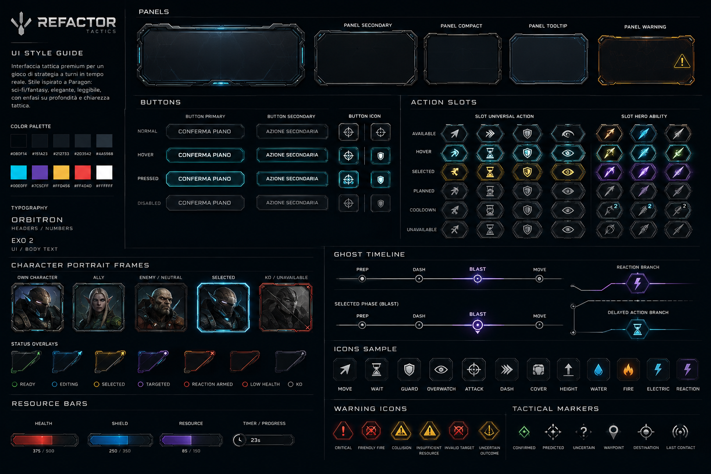

# RefactorTactics — Progettazione HUD

**Documento:** `progettazione-hud.md`  
**Stato:** consolidato iniziale per progettazione visuale e implementazione UMG  
**Target:** PC-first, 1920×1080 come riferimento primario  
**Engine:** Unreal Engine 5, patch bloccata dalla milestone corrente  
**Ambito:** HUD screen-space, componenti UI, stati adattivi, criteri per asset e handoff a Unreal

---

## 1. Riferimento visuale ufficiale

La style guide visuale di riferimento è il file PNG presente nel repository:

**`docs/technical/img/UI-style-guide.png`**

Riferimento Markdown:



La tavola di riferimento è una board da **1536×1024** e definisce il linguaggio grafico di base per:

- pannelli;
- pulsanti;
- action slot;
- frame ritratto;
- overlay di stato;
- barre risorsa;
- Ghost Timeline;
- reaction branch;
- delayed action branch;
- icone;
- warning;
- tactical marker.

### Regola di prevalenza visuale

Per la **presentazione grafica**, la style guide PNG è la fonte visiva primaria.

Le regole di gameplay, privacy, risoluzione, certezza e disponibilità dei dati restano invece governate dal codice e dalle specifiche di progetto.

La UI non deve mai inventare uno stato competitivo solo perché una variante grafica esiste nella style guide.

---

# 2. Obiettivo dell'HUD

L'HUD di RefactorTactics deve aiutare il giocatore a:

1. capire immediatamente in quale fase si trova;
2. sapere quale unità sta modificando o osservando;
3. costruire un piano senza perdere il contesto della scena 3D;
4. leggere intenti alleati autorizzati;
5. capire rischi, warning e dipendenze;
6. distinguere ciò che è confermato, previsto o incerto;
7. seguire la Resolution senza che l'animazione sembri decidere l'esito;
8. reagire rapidamente alle Fast Reaction;
9. comprendere perché un evento si è risolto in un certo modo;
10. restare leggibile anche quando entrano quota, cover, rumore, visibilità e ambiente.

L'HUD non deve diventare una plancia tattica permanente.

La superficie primaria di gioco resta il **mondo 3D isometrico / three-quarter**.

---

# 3. Principio spaziale fondamentale

La schermata normale deve essere progettata così:

- **70–80% centrale:** viewport 3D libero;
- **bordi e angoli:** HUD screen-space;
- **world-space:** path, AoE, facing, ghost, cone, marker, cover e altri overlay contestuali.

La griglia esagonale è un modello logico, non lo stile grafico dominante della schermata principale.

## 3.1 Cosa NON deve occupare permanentemente il centro

Non collocare al centro:

- grossi pannelli;
- minimappa permanente;
- board tattica 2D;
- griglia esagonale decorativa;
- grandi cornici full-screen;
- liste verticali di log;
- schede personaggio estese;
- action queue classica;
- informazioni già leggibili nel mondo.

## 3.2 Vista strategica separata

La vista top-down prodotta durante le prime esplorazioni è utile, ma va considerata una modalità secondaria:

**Strategic Overview / Tactical Overview**

Possibili usi:

- lettura generale del campo;
- comparazione intenti alleati;
- analisi multilivello;
- replay;
- spettatore;
- debug.

Non è la camera di gameplay standard.

---

# 4. Architettura visuale dell'interfaccia

Il sistema visivo è diviso in quattro layer.

## 4.1 Screen HUD / UMG

Contiene:

- turno;
- fase;
- timer;
- objective;
- team roster;
- selected unit;
- HP / shield / risorse;
- action dock;
- Ghost Timeline;
- warning;
- combat log;
- conferma piano;
- playback controls;
- notifiche di sistema.

## 4.2 Tactical World Overlay

Contiene elementi proiettati o ancorati nel mondo 3D:

- cell hover;
- reachable cells;
- movement path;
- waypoint;
- destination;
- Dash trajectory;
- target line;
- AoE;
- friendly-fire cells;
- facing;
- legal facing alternatives;
- Overwatch cone;
- cover relation;
- hazard;
- Action Ghost;
- last contact;
- sound contact.

Questi elementi **non devono essere realizzati come grandi widget HUD statici**.

## 4.3 Decision Windows

Finestre temporanee per:

- Fast Action — scelta live come continuazione di una **propria** azione;
- Fast Reaction — scelta live provocata da un evento **esterno**;

  > Sono categorie **distinte** ([D-019](../../decisions/RT_PDR_00_Decision_Log.md)) sulla stessa
  > `DecisionWindow`, e nessuna delle due è una *Delayed Action* (che si decide in Planning e non apre
  > finestre). La v0.1 non definisce ancora una Fast Action concreta.

- Overwatch;
- future decision boundary.

Devono essere compatte, leggibili e rapide.

## 4.4 Information Overlay Modes

Modalità tattiche contestuali:

- Default;
- Movement;
- Threat;
- Visibility;
- Sound;
- Terrain.

`Default` deve restare la modalità più pulita e usata più spesso.

---

# 5. HUD adattivo per fase

RefactorTactics non ha sette HUD indipendenti.

Ha **un unico HUD adattivo** che cambia densità a seconda del compito cognitivo del giocatore.

Ordine concettuale:

`Planning → Prep → Dash → Blast → Move → Cleanup`

Una Reaction non è una quinta fase.

## 5.1 Densità informativa

| Stato | Densità UI | Priorità |
|---|---:|---|
| Planning | Alta | decisione, preview, azioni, warning |
| Prep | Media-bassa | setup e stato |
| Dash | Bassa | mondo e movimento speciale |
| Blast | Bassa | mondo, impatto, VFX, risultato |
| Fast Reaction | Media-alta temporanea | decisione immediata |
| Move | Bassa | posizione finale, facing, cover |
| Cleanup | Bassa | stato persistente e transizione |

---

# 6. Layout base — Planning HUD

## 6.1 Top center

Mostra:

- numero turno;
- fase corrente;
- timer;
- stato del planning;
- progressione logica compatta.

Esempio:

`TURN 04 · PLANNING · 00:21`

## 6.2 Top left — Team roster

Compatto.

Ogni membro può mostrare:

- portrait frame;
- nome;
- HP;
- shield, se presente;
- status essenziali;
- Editing / Ready / Locked quando supportato;
- Reaction Armed, se legalmente noto.

Il roster non deve trasformarsi in tre enormi character card.

## 6.3 Top right — Objective

Compatto ma sempre leggibile.

Può mostrare:

- nome obiettivo;
- punteggio;
- stato;
- progresso;
- contestato;
- countdown;
- cambio recente.

## 6.4 Lower left — Selected Unit

Per l'unità selezionata:

- ritratto;
- nome;
- ruolo;
- HP;
- shield;
- risorsa specifica;
- status;
- buff / debuff temporanei;
- eventualmente costo o stato dell'azione selezionata.

Non è un character sheet RPG.

## 6.5 Right side — Team Intent

Pannello compatto e collassabile.

Per un alleato può mostrare:

- unità;
- destinazione;
- azione;
- target;
- facing;
- label tattica;
- Editing / Ready / Locked.

Il dettaglio completo compare solo su hover, click o focus.

## 6.6 Bottom center — Ghost Timeline

La timeline canonica è:

`PREP — DASH — BLAST — MOVE`

La timeline rappresenta lo stato/azione previsto per ciascuna macrofase, non una coda arbitraria.

Non deve mai sembrare:

`Attack → Move → Attack → Dash`

## 6.7 Bottom center — Action Dock

> ⚠️ **2026-08-12 — [D-025](../../decisions/RT_PDR_00_Decision_Log.md): le generiche sono sette, non quattro.**
> Questa sezione ne elencava `Move · Wait · Guard · Overwatch` e ometteva `BasicAttack`, `Brace` e
> `Interact`. L'elenco canonico è `Wait · Move · BasicAttack · Guard · Brace · Interact · Overwatch`.

Separare visivamente:

### Universal Actions

Le **sette** generiche di D-025, leggibili in quattro corsie:

| Corsia | Azioni |
|---|---|
| Movement | `Move`, e i profili rapidi `Sprint` / `Dash` |
| Attack | `BasicAttack` |
| Defense | `Guard`, `Brace` |
| Context | `Interact`, `Wait`, `Overwatch` |

Le corsie sono un aiuto alla lettura, non quattro economie d'azione.

Due avvertenze che il layout non deve tradire:

- **`Sprint` non è «Move più veloce».** Consuma **entrambi** gli slot e **nega la reazione** per il turno
  (`Action.Sprint`, catalogo v0.1 §2). Se sta accanto a `Move` e `Dash` senza distinzione, il giocatore lo
  sceglie credendo di spendere solo il movimento.
- **`Overwatch` non è ancora nel catalogo generico**: arriva con **E14**. Lo slot va previsto, ma finché
  l'azione non atterra non deve risultare pianificabile.

### Hero Kit

- Ability 1
- Ability 2
- Ability 3
- Ability 4

Questa è una **classificazione UI**, non una doppia economia d'azione.

Il layout non deve far pensare:

> scegli una Universal Action + una Hero Ability.

`Ready` **non è un'azione** e non prende uno slot nella dock: è uno stato di coordinamento, e appartiene alla
famiglia di pulsanti di §6.8 insieme a `CONFIRM PLAN`.

## 6.8 Bottom right

Azioni principali:

- `CONFIRM PLAN`
- `UNDO`
- stato piano;
- warning count;
- invalid state.

Per il flusso corrente offline/local usare `CONFIRM PLAN` / `LOCK IN`.

Non simulare un falso stato `TEAM READY 1/2` finché non è realmente supportato.

---

# 7. Action Dock

Ogni action slot deve poter rappresentare:

- Available;
- Hover;
- Selected;
- Planned;
- Cooldown;
- Unavailable;
- Invalid;
- Warning.

Dalla style guide:

- gli **Universal Action Slot** usano una famiglia più neutra;
- gli **Hero Ability Slot** hanno maggiore caratterizzazione energetica;
- lo stato Selected usa enfasi calda;
- Reaction può usare accento viola;
- Electric usa accento cyan/elettrico;
- warning/invalid usano rosso/arancio.

## 7.1 Contenuto di uno slot

Layer separati:

1. background/frame;
2. icon;
3. shortcut;
4. resource cost;
5. cooldown;
6. state overlay;
7. warning;
8. planned marker.

Non incorporare testo o numeri statici nel PNG di base.

---

# 8. Ghost Timeline

La Ghost Timeline è uno dei componenti identitari dell'HUD.

## 8.1 Fasi

- Prep
- Dash
- Blast
- Move

## 8.2 Stati

- Empty;
- Populated;
- Selected;
- Inactive;
- Resolution/Completed.

## 8.3 Scrubbing

Se il giocatore seleziona `BLAST`:

- Blast Ghost diventa prominente;
- origine dell'attacco diventa prominente;
- target e AoE diventano prominenti;
- warning Blast diventano prominenti;
- altri ghost restano visibili ma attenuati.

La camera resta isometrica.

Non si passa a una mappa top-down.

---

# 9. Action Ghost

Un Action Ghost non è principalmente un marker 2D.

È idealmente:

- copia 3D semitrasparente del personaggio;
- posa significativa;
- posizione prevista;
- facing;
- orientamento arma;
- origine attacco;
- anchor tattico a terra.

Il marker 2D sotto i piedi è solo supporto.

## 9.1 Regola rendering

Il Ghost non calcola il risultato.

Consuma dati prodotti dallo stesso stato/snapshot/regole usate dal gameplay.

---

# 10. Facing

Facing è stato logico di gameplay e deve essere leggibile nella UI.

> ⚠️ **2026-08-08 — [D-020](../../decisions/RT_PDR_00_Decision_Log.md): il facing cambia più volte per round.**
> Un'azione con bersaglio orienta l'unità **prima di risolvere**, quindi non esiste «il facing dell'unità in
> questo turno»: esiste il facing **della fase**. La UI deve mostrare quello della fase selezionata durante lo
> scrubbing (§8.3), non un valore unico — e il facing **finale**, dopo il `Move`, è quello che l'unità porta
> nel round successivo. Timeline completa in
> [ADR-0005](../../decisions/adr-0005-orientamento.md) §2-bis.

Possibili usi:

- difesa;
- percezione;
- Overwatch;
- direzione frontale;
- cover interaction.

## 10.1 Selezione

La scelta va mostrata nel mondo, non con una combo box testuale.

### Stationary

Può mostrare fino a sei direzioni.

### Budget Move

Mostra le direzioni legali finali.

### Linear Dash / Charge / Leap

Facing derivato automaticamente dalla direzione; evitare input inutile.

## 10.2 Overwatch

Il cono di Overwatch deriva dal facing.

Non introdurre due controlli indipendenti:

- Facing = NE
- Overwatch Direction = E

Il cono ruota con il facing.

---

# 11. Reaction e Fast Reaction

Una Reaction è una diramazione, non una fase.

Visualmente:

`PREP — DASH — BLAST — MOVE`

`              └── ⚡ REACTION`

La style guide contiene un **Reaction Branch** dedicato.

## 11.1 Overwatch Fast Reaction

Prompt base:

`⚡ OVERWATCH`

`Wraith entered the controlled area`

`2.4 s`

`[ FIRE ] [ HOLD ]`

Regole UX:

- prompt compatto;
- countdown immediatamente visibile;
- pochissime opzioni;
- non coprire la scena;
- timeout = Hold;
- nessuna anticipazione di futuri trigger;
- nessun contatore tipo `Opportunity 1/3`.

## 11.2 Target simultanei

Se più target triggerano nello stesso micro-step:

- un solo prompt;
- scelte FIRE A / FIRE B / HOLD;
- niente prompt sequenziali artificiali.

---

# 11-bis. Decision Time Bank

> Aggiunta del **2026-08-09**. Il Time Bank è entrato in v0.1 come **CP 14.8**, e questo documento non lo
> conosceva. **Owner dei requisiti**: [`../../gameplay/spec-decision-time-bank.md`](../../gameplay/spec-decision-time-bank.md) §11 — qui c'è
> soltanto **come si presenta**, non che cosa deve fare. Nessun requisito si riscrive: se le due fonti
> divergono, prevale lo spec.

Il bank è una **riserva temporale per giocatore**, condivisa da tutte le Decision Window live della
Resolution. Chi risponde in fretta la conserva, chi consuma la finestra intera la spende.

Convive con il countdown della finestra, che resta l'informazione primaria:

`⚡ OVERWATCH`

`Wraith entered the controlled area`

`2.4 s          ▓▓▓▓▓▓▓░░░  18.6 s`

Il numero grande è la **finestra**, la barra è il **bank**. Non invertire la gerarchia: la decisione si prende
sul primo, il secondo è contesto.

## 11-bis.1 Tre trappole, in ordine di gravità

**1 · Il bank non accorcia le finestre contested.** Nel Reaction Clash il reveal è a **scadenza fissa**: la
finestra costa 3,0 s anche se entrambi lockano subito. Una UI che suggerisce «rispondi presto e il turno
scorre» mente proprio sulla classe di finestre più costosa. Lì il bank è pressione strategica, non pacing.

**2 · I numeri sono `PROPOSED FOR PLAYTEST`.** `InitialBankMs` (24 s in 2v2), `GraceMs` (1,0 s),
`ExhaustedGraceMs` (0,75 s) hanno criteri di promozione dichiarati e **non vanno pubblicati come definitivi**,
né qui né sulla Wiki. L'unico valore canonico è `MaxWindowMs`, che **è** `FastReactionDuration` = 3,0 s — e
non prende un secondo nome.

**3 · Il bank residuo è informazione del proprietario.** Non compare nel prompt dell'avversario, in nessuna
forma e in nessuna granularità: quantizzare un delta correlato al tempo di lock non chiude il canale, lo
attenua. Vale [D-021](../../decisions/RT_PDR_00_Decision_Log.md) e ADR-0004 §7-bis.

## 11-bis.2 Il requisito vincolante

Fra i sei requisiti dello spec **uno solo è vincolante per la UI**, ed è il primo:

> il fallback deve essere raggiungibile **entro la grace**: un tasto, nessuna conferma, nessuna animazione
> bloccante, percorso equivalente su mouse, tastiera e controller.

Con `GraceMs` a 1,0 s, un menu a due passi rende il fallback irraggiungibile e trasforma il bank in una tassa
sull'interfaccia invece che una decisione. Gli altri cinque requisiti — distinguere **free** da **drain**,
countdown sempre visibile, esaurimento comunicato con **forma o testo mai col solo colore** — sono già
coerenti con §15.1 e §47-bis.

Se il playtest mostra che le cifre peggiorano la lettura in tre secondi, si degrada la **presentazione** —
barra senza numeri — non il requisito.

---

# 12. Delayed Action

Delayed Action è concettualmente diversa dalla Fast Reaction.

### Semantica visuale

- `⚡` = decisione live/interattiva durante Resolution
- `⏱` = azione già precommittata nel Planning ma risolta più avanti

La style guide contiene un **Delayed Action Branch** separato.

Lo stato Delayed Action deve restare **future/experimental** finché la feature non viene formalmente aperta.

---

# 13. Planning vs Resolution

## 13.1 Planning HUD

Mostra più controllo:

- action dock;
- Ghost Timeline;
- selected unit;
- warning;
- ally intent;
- confirm plan;
- preview.

## 13.2 Resolution HUD

Collassa o nasconde:

- action editing;
- Confirm Plan;
- controlli di modifica;
- warning da planning non più rilevanti.

Promuove:

- fase corrente;
- evento corrente;
- combat log;
- outcome;
- `WHY?`;
- playback controls;
- reaction prompt, se necessario.

---

# 14. Combat Log ed Explainability

Il combat log deve essere:

- piccolo/collassato durante Planning;
- più visibile durante Resolution;
- guidato dal TurnLog autorevole;
- espandibile.

Esempio:

`Gadget → Arc Lance`  
`Wet Chain +6`  
`Wraith → 26 Damage`

## 14.1 WHY?

Esempio:

`26 DAMAGE  [WHY?]`

Espanso:

| Voce | Valore |
|---|---:|
| Base | 20 |
| Wet Chain | +6 |
| Cover | 0 |
| Final | 26 |

Il widget non deve ricalcolare la formula.

Mostra dati/reason code già prodotti dal sistema logico.

---

# 15. Warning System

Tre livelli:

## Info

Segnalazione utile ma non bloccante.

## Warning

Rischio significativo.

## Critical

Errore o condizione bloccante.

Possibili categorie:

- Friendly Fire;
- Collision;
- Invalid Target;
- Insufficient Resource;
- Uncertain Outcome;
- Hazard;
- Plan Changed;
- Path Invalidated;
- Missing Plan;
- Target May Move.

## 15.1 Regola

Non creare un “Christmas tree” di alert.

Una warning hierarchy corretta usa:

- icona;
- forma;
- pattern;
- testo;
- colore.

Non affidarsi solo al colore.

---

# 16. Certainty Grammar

Tre stati principali:

## Confirmed

- linea solida;
- marker solido;
- frame stabile;
- alta opacità.

## Predicted

- linea tratteggiata;
- marker vuoto/hollow;
- ghost translucido.

## Uncertain

- linea puntinata/fading;
- dissolvenza;
- `?`;
- area di incertezza.

## 16.1 Separare i significati

Non usare il solo colore per codificare contemporaneamente:

- team ownership;
- certainty;
- phase;
- action type.

Usare insieme:

- forma;
- pattern;
- spessore;
- opacità;
- simbolo;
- colore.

La style guide contiene Tactical Marker separati:

- Confirmed;
- Predicted;
- Uncertain;
- Waypoint;
- Destination;
- Last Contact.

---

# 17. Team Planning e privacy

L'HUD può mostrare gli intenti della propria squadra.

Non deve mai progettare un flusso in cui:

1. il client riceve l'intento avversario;
2. il widget lo nasconde.

La privacy è architetturale.

La UI riceve solo dati autorizzati.

## 17.1 Team intent card

Può includere:

- character;
- destination;
- action;
- target;
- AoE;
- facing;
- reaction armed;
- label;
- freshness/state.

Default compatto, dettaglio on-demand.

---

# 18. Target / Hover Inspector

Elemento contestuale utile.

Può mostrare, se autorizzato:

- nome;
- HP;
- shield;
- status visibili;
- cover;
- quota;
- facing pubblico;
- resistenze pubbliche;
- relazione con il target corrente.

Non deve diventare un pannello permanente.

---

# 18-bis. Interaction Inspector

> Aggiunta del **2026-08-09**, superficie UI di
> [`../../gameplay/spec-interazioni-mappa-cp101.md`](../../gameplay/spec-interazioni-mappa-cp101.md) (**CP 10.1**). Owner della regola: quello spec.
> Qui c'è solo la forma.

Quando il giocatore seleziona un elemento interattivo — porta, consolle, ponte, obiettivo — l'inspector
mostra **che cosa può chiedergli, e perché no**:

`D1 — Porta di laboratorio`

`Stato: chiusa`

`[ APRI ]`

`[ FORZA ]      richiede Force`

`[ SOVRASCRIVI ] non disponibile`

Tre corsie, non una lista piatta: **disponibile** · **disponibile a chi ha la capability** · **non
disponibile**. È la distinzione che rende leggibile una mappa in cui la stessa porta offre opzioni diverse a
unità diverse, e senza la quale il giocatore legge «bug» dove c'è «design».

## 18-bis.1 Il rifiuto è informazione, ma non deve perdere informazione

Il motivo si mostra sempre: un pulsante grigio senza spiegazione è un puzzle, non una scelta tattica. I reason
code disponibili sono quelli dello spec (`MissingCapability`, `WrongState`, `OutOfRange`, `NotOwner`,
`Blocked`, `Disabled`, `Destroyed`, `InsufficientResource`, `WrongPhase`).

Con un vincolo che vale più dell'elenco, ed è lo stesso di §17:

> **Nessun reason code può rivelare informazione che il Team Knowledge non possiede.**

Se un elemento è governato da una consolle che la squadra non ha osservato, il rifiuto dice `Blocked`, non
«controllato da S1». E il collegamento sorgente → bersaglio **non si replica al client per poi nasconderlo nel
widget**: nascondere il widget non è sicurezza, qui come nel planning.

## 18-bis.2 Che cosa non è

Non è il `Target / Hover Inspector` di §18, che descrive **unità**. Non è un pannello permanente: vale la
regola finale di §49 — compare sulla selezione e sparisce con essa.

E non elenca i **verbi come azioni**: un verbo non consuma uno slot suo, è il modo in cui un `Interact` già
speso si specializza. La Action Dock (§7) non cresce quando la mappa cresce.

---

# 19. Cost Preview

Durante la selezione di un'azione può mostrare:

- costo;
- risorsa prima;
- risorsa dopo;
- cooldown;
- charge consumata;
- requisito non soddisfatto.

Serve soprattutto per evitare errori di commit.

---

# 20. Layer / Elevation Indicator

Con mappe multilivello deve poter indicare:

- current layer;
- sopra/sotto;
- tetto;
- ponte;
- tunnel;
- transizione verticale.

Deve restare compatto.

La quota deve essere percepita principalmente nel mondo 3D, non trasformata in tabella HUD.

---

# 21. Objective State

Oltre al punteggio può comunicare:

- neutral;
- controlled;
- contested;
- capture progress;
- scoring next turn;
- objective changed;
- temporary lock;
- countdown.

---

# 22. Plan Health / Validity

Non limitarsi a `VALID / INVALID`.

Possibili stati:

- Plan Valid;
- 1 Warning;
- Friendly Fire Risk;
- Depends On Ally;
- Resource Conflict;
- Invalid Target;
- Path Recompute Required.

Il reason code deve arrivare dalla logica, non essere inferito dal widget.

---

# 23. Ping e coordinazione

Supporto futuro/contestuale:

- ping ricevuto;
- focus target;
- hold;
- block route;
- area attention;
- short label;
- temporary drawing.

Devono avere TTL e sparire automaticamente.

---

# 24. Tactical Overlay Selector

Controllo piccolo e richiudibile.

Esempio:

`TACTICAL VIEW ▼`

- Default
- Movement
- Threat
- Visibility
- Sound
- Terrain

Non usare sei pannelli sempre aperti.

---

# 25. Partial Knowledge

Non usare una classica mappa nera.

La mappa statica resta leggibile.

Stati informativi:

## Hidden

Nessun marker.

## Uncertain Contact

`?` + area approssimata.

## Detected

Rappresentazione normale autorizzata.

## Last Contact

Marker storico fading.

La style guide include un Tactical Marker `LAST CONTACT`.

---

# 26. Sound / Acoustic Information

Il rumore è informazione, non rivelazione automatica della posizione esatta.

La modalità Sound può mostrare:

- direzione;
- area di incertezza;
- categoria;
- intensità;
- età;
- masking;
- rumore ambientale.

Possibili eventi HUD temporanei:

- footsteps detected;
- gunshot;
- explosion;
- electric discharge;
- environmental noise;
- decoy.

Il Sound overlay deve restare contestuale.

---

# 27. System Notices

Possibili notifiche transitorie:

- Plan Committed;
- Ally Changed Plan;
- Target No Longer Valid;
- Path Recomputed;
- Objective Updated;
- Contact Lost;
- Noise Detected;
- Reaction Armed;
- Connection Issue;
- Waiting For Server;
- Reconnected.

Non usare toast invasivi per ogni microevento.

---

# 28. Network / Competitive State

HUD tecnico necessario per build online:

- connection warning;
- reconnect;
- waiting for server;
- stale state;
- server response pending;
- desync/error, se rilevato.

Questi elementi devono essere separati dalla semantica gameplay.

---

# 29. Playback Controls

Durante Resolution possono esistere:

- pause visiva;
- speed;
- skip;
- focus event.

Sono controlli di presentazione.

Non alterano:

- snapshot;
- resolver;
- ordine logico;
- outcome;
- seed.

## 29.1 Cosa esiste in v0.1, e con quale superficie

> Scritto il **2026-08-16** con CP 47.7 ([#1015](https://github.com/DegrassiAaron/refactor-tactics-main/issues/1015)).
> Questa sezione descriveva quattro controlli **possibili**; due esistono, due no, e senza dirlo la sezione
> non distingue una decisione presa da una non ancora presa.

| Controllo | v0.1 | Dove |
|---|---|---|
| **skip** | ✅ esiste | `ARTHUD::DrawHUD`, tasto `Spazio`, etichetta `(Spazio: salta)` |
| **speed** | ✅ esiste — `x1 · x2 · x4` | `ARTHUD::ComposePlaybackSpeedLabel` + `ARTPlayerController`, tasto `V` |
| **pause visiva** | ⛔ **fuori scope dichiarato** | è del Replay Player (`RT-FEAT-REPLAY-ARCHIVE`, #472/#999): lì si guarda una partita **registrata**, qui una **in corso** |
| **focus event** | ⏳ non deciso | nessuna issue |

⚠️ **La `speed` è resa in Canvas, non come widget §4.1, ed è una deviazione consapevole da §13.2.**
La §13.2 elenca i `playback controls` fra gli elementi promossi nel `Resolution HUD`, cioè nel layer §4.1
— che è UMG. In v0.1 il controllo vive nella riga di stato del Canvas, insieme a `skip`. Le due ragioni,
in ordine di peso:

1. **Il contratto §4.1 vieta al widget di raggiungere il modello.** `URTScreenHudWidgetBase` non espone
   l'`ARTTurnManager` ai Blueprint — *«se non c'è il puntatore, non c'è il modo di ricalcolare»* — e
   `URTHudViewModel` è interamente `BlueprintPure`: **cinque viste, zero comandi**. Un controllo che
   *scrive* avrebbe richiesto di aprire una porta di scrittura in quel contratto, cioè una decisione
   architetturale, dentro un checkpoint che il suo stesso DoD dichiara «solo presentazione».
2. Un `WBP_RT_*` nuovo costa un `.uasset` — quindi una Binary Asset Lease e passi manuali in Editor —
   per un controllo che è un numero e un tasto.

**Quando questa deviazione va sciolta**: quando lo Screen HUD §4.1 acquisisce un percorso di *comando*
— cioè quando un widget avrà un modo dichiarato di scrivere nel modello. Allora `speed` e `skip` si
spostano insieme, e questa sottosezione va cancellata invece che aggiornata.

## 29.2 L'etichetta dice due numeri quando ne servono due

La velocità mostrata **non è sempre quella scelta**. La composizione è `Max(Viewer, Cap)`
(`URTPlaybackLibrary::EffectivePlaybackSpeed`, CP 47.2): quando il tetto di durata morde più forte della
preferenza, a scorrere è il tetto.

- coincidono → **un numero**: `x2`
- divergono → **due numeri, e chi vince**: `x2 -> x3 (tetto)`

⚠️ Mostrare la sola velocità scelta è l'implementazione che viene in mente per prima ed è **sbagliata**:
produce un'etichetta che dice `x1` mentre lo schermo scorre a `3x`. È il difetto che il controllo esiste
per togliere — dover dedurre il ritmo — aggravato dal fatto che un numero c'è e mente. Pinnato da
`RefactorTactics.HUD.PlaybackSpeedLabelDeclaresTheCapWhenItWins`.

⚠️ **Un limite noto, dichiarato**: la scelta **non sopravvive al riavvio** (`R`), perché `OpenLevel`
ricrea l'`ARTTurnManager`. Farla sopravvivere richiede uno stato fuori dall'attore, che v0.1 non ha.

---

# 30. Minimap

Per il vertical slice attuale:

**nessuna minimap permanente consigliata**.

Motivi:

- mappa relativamente contenuta;
- camera tattica;
- overview separata più leggibile;
- minimap duplicherebbe informazione.

Rivalutare solo quando dimensioni, verticalità e navigazione lo giustificano.

---

# 31. Persistente, contestuale, temporaneo

## Sempre visibile

- turn/phase/timer;
- selected unit essential state;
- compact team state;
- objective;
- essential action state.

## Contestuale

- target inspector;
- cost preview;
- facing;
- cover;
- elevation;
- ally intent detail;
- tactical overlay selector;
- warning details.

## Temporaneo

- Fast Reaction;
- combat result;
- objective capture;
- contact lost;
- noise detected;
- invalid plan;
- reconnect;
- system notice.

Questa classificazione è fondamentale per evitare sovraccarico.

---

# 32. Style Guide — palette

Colori estratti dalla style guide PNG:

## Neutrali

| Token | Hex | Uso |
|---|---|---|
| `RT_UI_BG_Deep` | `#080F14` | fondo profondo |
| `RT_UI_BG_Panel` | `#151A23` | superfici panel |
| `RT_UI_BG_Raised` | `#212733` | superfici rialzate |
| `RT_UI_Frame_Deep` | `#203542` | bordi/struttura |
| `RT_UI_Frame_Mid` | `#4A5568` | bordi secondari |

## Accenti

| Token | Hex | Uso |
|---|---|---|
| `RT_UI_Cyan` | `#00E0FF` | focus, active, editing, shield |
| `RT_UI_Violet` | `#7C5CFF` | reaction, special state |
| `RT_UI_Amber` | `#FFD456` | selected, warning, commitment |
| `RT_UI_Red` | `#FF4D4D` | critical, invalid, low health |
| `RT_UI_White` | `#FFFFFF` | testo/icone ad alta priorità |

Nota: i token semantici possono derivare da questi colori, ma la UI non deve dipendere solo dal colore.

---

# 33. Style Guide — tipografia

La style guide indica:

## Orbitron

Uso:

- headers;
- numeri;
- timer;
- phase label;
- valori importanti.

## Exo 2

Uso:

- UI;
- body text;
- label;
- descrizioni;
- tooltip.

Regole:

- leggibile a 1080p;
- evitare pesi troppo sottili;
- evitare testo molto piccolo;
- mantenere gerarchia chiara;
- non incorporare testo nei PNG riutilizzabili.

---

# 34. Style Guide — pannelli

Famiglie mostrate:

- Panel Primary;
- Panel Secondary;
- Panel Compact;
- Panel Tooltip;
- Panel Warning.

Caratteristiche:

- fondo scuro;
- bordi metallici sottili;
- cut corner;
- dettagli luminosi controllati;
- decorazione interna minima;
- centro relativamente uniforme.

## 34.1 Implementazione Unreal

Preferire pannelli **9-slice**.

Asset suggeriti:

- `RT_UI_Panel_Primary`
- `RT_UI_Panel_Secondary`
- `RT_UI_Panel_Compact`
- `RT_UI_Panel_Tooltip`
- `RT_UI_Panel_Warning`
- `RT_UI_Panel_FastReaction`
- `RT_UI_Panel_TeamIntent`

Non creare decori che si deformano quando il pannello viene ridimensionato.

---

# 35. Style Guide — pulsanti

Famiglie:

- Button Primary;
- Button Secondary;
- Button Icon.

Stati mostrati:

- Normal;
- Hover;
- Pressed;
- Disabled.

Asset suggeriti:

- `RT_UI_Button_Primary_*`
- `RT_UI_Button_Secondary_*`
- `RT_UI_Button_Icon_*`
- `RT_UI_Button_ConfirmPlan_*`

Il testo resta UMG.

---

# 36. Style Guide — portrait frame

Varianti:

- Own Character;
- Ally;
- Enemy / Neutral;
- Selected;
- KO / Unavailable.

Overlay separati:

- Ready;
- Editing;
- Selected;
- Targeted;
- Reaction Armed;
- Low Health;
- KO.

I portrait frame non devono dominare l'artwork del personaggio.

---

# 37. Style Guide — resource bars

Famiglie:

- Health;
- Shield;
- Resource;
- Timer / Progress.

Esempi presenti:

- Health `375 / 500`;
- Shield `250 / 350`;
- Resource `85 / 150`;
- Timer `23s`.

In Unreal separare:

1. frame;
2. fondo;
3. fill;
4. testo;
5. marker opzionali.

Non generare ogni percentuale come texture diversa.

---

# 38. Style Guide — icon system

La tavola include:

- Move;
- Wait;
- Guard;
- Overwatch;
- Attack;
- Dash;
- Cover;
- Height;
- Water;
- Fire;
- Electric;
- Reaction.

Requisiti:

- silhouette chiara;
- leggibile 24–48 px;
- preferibilmente tintabile;
- sfondo trasparente;
- coerenza di spessore;
- non eccessivamente dettagliata.

---

# 39. Style Guide — warning icons

Presenti:

- Critical;
- Friendly Fire;
- Collision;
- Insufficient Resource;
- Invalid Target;
- Uncertain Outcome.

Devono essere disponibili anche come:

- icon only;
- compact chip;
- full warning row.

---

# 40. Style Guide — tactical markers

Presenti:

- Confirmed;
- Predicted;
- Uncertain;
- Waypoint;
- Destination;
- Last Contact.

Aggiunte previste:

- Sound Contact;
- Targeted;
- Focus/Ping;
- Cover;
- Facing anchor.

---

# 41. Asset pipeline per Unreal

## 41.1 Cosa produrre come asset 2D

Buoni candidati:

- panel frame;
- button frame;
- action slot;
- portrait frame;
- status frame;
- resource frame;
- icon;
- warning icon;
- timeline node;
- reaction branch element;
- tactical marker;
- mask.

## 41.2 Cosa NON produrre come PNG statico

Non rasterizzare in asset fisso:

- path;
- AoE;
- reachable cells;
- facing cone;
- Overwatch cone;
- uncertainty area dinamica;
- ghost character;
- linee di targeting lunghe;
- riempimenti percentuali;
- cooldown numerici.

Questi elementi vanno generati dinamicamente in Unreal con:

- Material;
- UI Material;
- decals;
- geometry;
- instancing;
- line renderer custom;
- world-space primitives.

---

# 42. PNG e sorgenti

Per gli asset raster:

- PNG RGBA;
- alpha pulito;
- niente matte;
- crop consistente;
- padding consistente;
- niente testo incorporato;
- dimensioni power-of-two quando utile, non come dogma per UI;
- asset tintabile quando possibile.

Conservare anche la sorgente vettoriale/design quando disponibile.

---

# 43. Naming Unreal suggerito

Pattern:

`RT_UI_<Category>_<Name>_<State>`

Esempi:

- `RT_UI_Panel_Primary`
- `RT_UI_Panel_Warning`
- `RT_UI_Button_ConfirmPlan_Normal`
- `RT_UI_Button_ConfirmPlan_Hover`
- `RT_UI_Slot_Universal_Selected`
- `RT_UI_Slot_Ability_Cooldown`
- `RT_UI_Portrait_Selected`
- `RT_UI_Icon_Overwatch`
- `RT_UI_Icon_FriendlyFire`
- `RT_UI_Phase_Blast`
- `RT_UI_Branch_Reaction`
- `RT_UI_Marker_Uncertain`

---

# 44. Struttura Content suggerita

```text
Content/RT/UI/
├── HUD/
├── Panels/
├── Buttons/
├── ActionSlots/
├── PortraitFrames/
├── Bars/
├── Timeline/
├── Icons/
│   ├── Actions/
│   ├── Tactical/
│   ├── Environment/
│   └── Warnings/
├── Markers/
├── Materials/
└── Debug/
```

---

# 45. Componenti UMG suggeriti

Esempi di widget:

- `WBP_RT_TacticalHUD`
- `WBP_RT_TurnHeader`
- `WBP_RT_TeamRoster`
- `WBP_RT_TeamMember`
- `WBP_RT_SelectedUnitPanel`
- `WBP_RT_ObjectivePanel`
- `WBP_RT_ActionDock`
- `WBP_RT_ActionSlot`
- `WBP_RT_GhostTimeline`
- `WBP_RT_PhaseSlot`
- `WBP_RT_WarningStack`
- `WBP_RT_CombatLog`
- `WBP_RT_WhyPanel`
- `WBP_RT_FastReaction`
- `WBP_RT_TacticalViewSelector`

La logica competitiva non vive nei widget.

---

# 46. Stati HUD di riferimento

Per validare il design completo devono esistere almeno questi mockup:

## A. Planning — Clean

- nessun warning;
- unità selezionata;
- action dock;
- objective;
- roster.

## B. Planning — Selected + Warning

- azione selezionata;
- costo;
- warning;
- Ghost Timeline.

## C. Planning — Team Intent

- alleati con intenti;
- conflict warning;
- focus ally.

## D. Resolution

- action dock collassato;
- phase timeline;
- combat log;
- outcome.

## E. Fast Reaction

- prompt compatto;
- countdown;
- FIRE / HOLD.

## F. Partial Knowledge

- uncertain contact;
- last contact;
- sound contact.

---

# 47. Criteri di revisione visiva

## 47.1 Primo colpo d'occhio

Entro 2 secondi devo capire:

- fase;
- tempo;
- selected unit;
- azioni;
- conferma.

## 47.2 Centro libero

Pass/fail.

Se la HUD invade la scena, va ridotta.

## 47.3 Planning e Resolution

Devono sembrare lo stesso prodotto, con densità diversa.

## 47.4 Gerarchia

Livello 1:

- phase;
- timer;
- HP;
- Confirm Plan.

Livello 2:

- resource;
- objective;
- ally state;
- action detail.

Livello 3:

- warning detail;
- modifier;
- tooltip;
- explanation.

## 47.5 Action Dock

Universal e Hero Kit distinguibili, senza comunicare doppia action economy.

## 47.6 Ghost Timeline

Deve sembrare una timeline di fase, non una action queue.

## 47.7 Reaction

Deve essere immediatamente leggibile e selezionabile.

## 47.8 Character Panel

Non deve diventare RPG character sheet.

## 47.9 Warning

Forma + icona + pattern + colore.

## 47.10 Combat Log

Ignorabile quando non serve, utile quando serve.

## 47.11 Sci-fi restraint

Evitare:

- cockpit;
- neon ovunque;
- HUD da astronave;
- MMO chrome;
- texture rumorose;
- decorazione senza funzione.

---

# 47-bis. Accessibilità

> Aggiunta del **2026-08-09**. Il vincolo non è nuovo — «non affidarsi solo al colore» compare già in §15.1,
> §16 e nella checklist §50 — ma era **sparso in tre punti** e non copriva il caso più stretto del gioco: la
> finestra di reazione da 3,0 s. Questa sezione lo raccoglie e lo chiude.

## 47-bis.1 Il colore non porta mai il significato da solo

È la regola che governa tutte le altre. Ogni informazione codificata a colore deve essere leggibile anche da
chi quel colore non lo distingue, attraverso almeno un secondo canale:

| Informazione | Colore | Secondo canale obbligatorio |
|---|---|---|
| Certainty (§16) | opacità/tinta | **tratto**: pieno · tratteggiato · dissolto + `?` |
| Warning (§15) | tre livelli | **icona e forma**, più il testo |
| Squadra | palette | **posizione** e marker |
| Stato di uno slot (§7.1) | overlay | **testo** e cooldown numerico |
| Bank esaurito (§11-bis) | — | **forma o testo**, mai il solo colore |

La verifica è meccanica e va fatta prima di dichiarare finita una schermata: **portarla in scala di grigi e
rileggerla**. Se un'informazione sparisce, manca il secondo canale.

## 47-bis.2 La finestra di reazione è il caso stretto

Tre secondi sono il budget più severo dell'interfaccia, e ci si decide sotto pressione. Requisiti:

- countdown **sempre visibile**, non un'animazione periferica;
- lo stato urgente si distingue per **contrasto**, non per saturazione;
- **poche opzioni**, come già dice §11.1;
- nessun mini-gioco di precisione col mouse: il bersaglio si sceglie da un elenco, non mirando;
- percorso **tastiera e controller equivalente** a quello del mouse — è già requisito vincolante del Time
  Bank (§11-bis.2), e qui vale per ogni Decision Window.

## 47-bis.3 Leggibilità e movimento

- **1080p è la baseline**, non il caso limite: se un testo non si legge lì, non si legge;
- niente testo di cooldown minuscolo dentro un'icona — se non c'è spazio, l'informazione va altrove;
- **scala della UI** regolabile, e i pannelli devono reggerla senza sovrapporsi;
- **rimappatura** degli input;
- opzioni per **ridurre camera shake e motion**, e per l'**opacità degli overlay** (§24): chi fatica a
  distinguere due layer sovrapposti deve poterne attenuare uno.

## 47-bis.4 Che cosa questa sezione non promette

Non è una dichiarazione di conformità WCAG né un audit: è l'insieme di vincoli che il progetto si dà e che
la checklist di §50 verifica. Nessuno di questi punti è stato misurato su un giocatore reale — vanno nel
playtest di leggibilità di **E21**, insieme al resto della presentazione.

---

# 48. Brief compatto per Claude Design — HUD only

Usare la style guide PNG come riferimento visivo.

```text
Design HUD-only screens for RefactorTactics.

Use the provided RefactorTactics HUD Style Guide as the visual source of truth.

Create screen-space HUD components only.

No battlefield.
No map.
No characters in the world.
No hex grid.
No environment.
No tactical board.

Use transparent background or a neutral empty viewport placeholder.

Keep 70–80% of the center free for the future 3D isometric game view.

Maintain:
- dark translucent premium sci-fi/fantasy panels;
- restrained metallic frames;
- subtle angular/hex cuts;
- Orbitron for headers/numbers;
- Exo 2 for UI/body;
- palette based on #080F14, #151A23, #212733, #203542, #4A5568,
  with accents #00E0FF, #7C5CFF, #FFD456, #FF4D4D and #FFFFFF.

Create consistent states for:
Planning,
Resolution,
Fast Reaction.

Planning must include:
turn/phase/timer,
team roster,
objective,
selected unit,
Ghost Timeline,
Universal Actions,
Hero Kit,
warnings,
ally intent,
Confirm Plan.

Resolution must collapse planning controls and promote:
phase progression,
combat log,
event result,
WHY?,
playback state.

Fast Reaction must show a compact urgent prompt such as:
⚡ OVERWATCH
2.4 s
[FIRE] [HOLD]

Reaction is a branch, never a fifth phase.

Keep the HUD practical to reconstruct in Unreal Engine 5 UMG.
Do not flatten the whole interface into one large image.
```

---

# 49. Regola finale

Ogni elemento permanente deve superare questa domanda:

> Il giocatore ha bisogno di vederlo proprio adesso?

Se la risposta è no:

- collassarlo;
- mostrarlo on-hover;
- mostrarlo on-focus;
- trasformarlo in overlay mode;
- renderlo temporaneo.

Il battlefield 3D resta il protagonista.

---

# 50. Checklist per Definition of Done della HUD

Una feature HUD è considerata pronta quando:

- comunica lo stato corretto;
- non inventa logica competitiva;
- usa soltanto dati autorizzati;
- non espone planning avversario;
- ha stati default/hover/selected/disabled dove necessari;
- è leggibile a 1080p;
- non usa solo il colore — e **regge la prova in scala di grigi** (§47-bis.1);
- se apre una Decision Window, il percorso tastiera/controller è equivalente a quello del mouse (§47-bis.2);
- non degrada sensibilmente Slate/UI performance;
- è verificata in PIE e packaged build;
- ha debug/view-model sufficiente a spiegare eventuali mismatch;
- resta coerente con la style guide PNG.

---

## Fine documento
