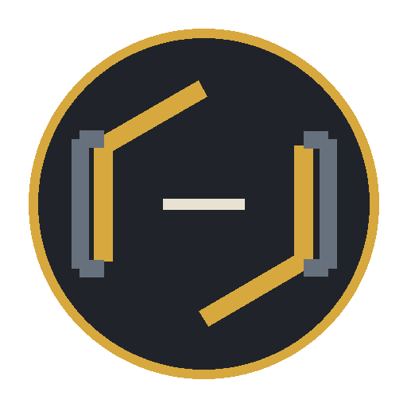

# Constrine

<!-- RT_FEATURE_STATUS:BEGIN RT-FEAT-FACTION-SYSTEM -->

> ⚠️ **Progettata, non implementata.** Questa pagina descrive una meccanica **decisa e documentata** che il gioco **non esegue ancora**: oggi non è giocabile. Blocco generato dal Feature Registry, non modificare a mano.  
> Feature: `RT-FEAT-FACTION-SYSTEM` · Release: `v0.2` · Roadmap: `—`  
> Stato: **DESIGNED** · Gate: `0/7`  
> Scenario: `—`  
> Verificato il `2026-08-08` su `2094b86`

<!-- RT_FEATURE_STATUS:END RT-FEAT-FACTION-SYSTEM -->

> **FactionId:** `Faction.Constrine`  
> **Prima apparizione:** `v0.1`  
> **Membri iniziali:** [Bastion](../../characters/v0.1/bastion.md) · [Vektor](../../characters/v0.1/vektor.md)

## Identità

**Ciò che è delimitato può essere controllato.**

Le fazioni definiscono identità narrativa, filosofia, linguaggio visivo e affinità tattiche. Non sono classi, non sono squadre e non possiedono kit condivisi.

## Affinità sistemica

**Route Control → Prediction**

Questa è un'affinità fra sistemi, non una abilità della fazione. Ogni abilità resta nel kit del proprio personaggio.

## Colore

Primary / Faction Mark: `#D7A83E`. Il colore di fazione è distinto dal colore runtime della squadra.

## Esempio di sinergia

I membri possono cooperare sfruttando **Route Control → Prediction**. È un esempio derivato dalle regole normali, non un bonus di composizione.

### Scenario dimostrativo

`Team.Constrine.BastionVektor.OnlyExit`

Lo ScenarioId dimostra la cooperazione; non possiede abilità né regole competitive. Finché non è presente/attivo nel registry, va mostrato come `GATED`.

## Approfondimenti

- [Sinergie e combinazioni](../game/sinergie-e-combinazioni.md)
- [Come si gioca](../game/come-si-gioca.md)
