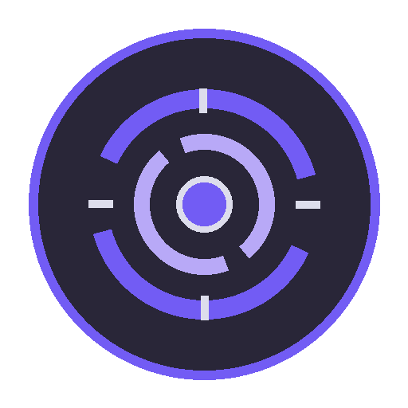

# Resonance

<!-- RT_FEATURE_STATUS:BEGIN RT-FEAT-FACTION-SYSTEM -->

> **Stato di sviluppo** — generato dal Feature Registry, non modificare a mano.  
> Feature: `RT-FEAT-FACTION-SYSTEM` · Release: `v0.2` · Roadmap: `—`  
> Stato: **DESIGNED** · Gate: `0/7`  
> Scenario: `—`  
> Verificato il `2026-08-08` su `2094b86`

<!-- RT_FEATURE_STATUS:END RT-FEAT-FACTION-SYSTEM -->

> **FactionId:** `Faction.Resonance`  
> **Prima apparizione:** `v0.2`  
> **Membri iniziali:** [Aurora](../../characters/v0.2/aurora.md) · [Kwang](../../characters/v0.2/kwang.md)

## Identità

**Potere e posizione hanno valore quando entrano in risonanza.**

Le fazioni definiscono identità narrativa, filosofia, linguaggio visivo e affinità tattiche. Non sono classi, non sono squadre e non possiedono kit condivisi.

## Affinità sistemica

**Terrain Shaping → Anchor Geometry**

Questa è un'affinità fra sistemi, non una abilità della fazione. Ogni abilità resta nel kit del proprio personaggio.

## Colore

Primary / Faction Mark: `#725CF4`. Il colore di fazione è distinto dal colore runtime della squadra.

## Esempio di sinergia

I membri possono cooperare sfruttando **Terrain Shaping → Anchor Geometry**. È un esempio derivato dalle regole normali, non un bonus di composizione.

### Scenario dimostrativo

`Team.Resonance.AuroraKwang.FrozenAnchor`

Lo ScenarioId dimostra la cooperazione; non possiede abilità né regole competitive. Finché non è presente/attivo nel registry, va mostrato come `GATED`.

## Approfondimenti

- [Sinergie e combinazioni](../game/sinergie-e-combinazioni.md)
- [Come si gioca](../game/come-si-gioca.md)
