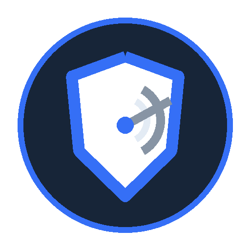

# Sentinel Directorate

> **FactionId:** `Faction.Sentinel`  
> **Prima apparizione:** `v0.2`  
> **Membri iniziali:** [Steel](../../characters/v0.2/steel.md) · [Murdock](../../characters/v0.2/murdock.md)

## Identità

**Una posizione controllata diventa una certezza.**

Le fazioni definiscono identità narrativa, filosofia, linguaggio visivo e affinità tattiche. Non sono classi, non sono squadre e non possiedono kit condivisi.

## Affinità sistemica

**Protection → Fire Sector**

Questa è un'affinità fra sistemi, non una abilità della fazione. Ogni abilità resta nel kit del proprio personaggio.

## Colore

Primary / Faction Mark: `#356FF6`. Il colore di fazione è distinto dal colore runtime della squadra.

## Esempio di sinergia

I membri possono cooperare sfruttando **Protection → Fire Sector**. È un esempio derivato dalle regole normali, non un bonus di composizione.

### Scenario dimostrativo

`Team.Sentinel.SteelMurdock.HoldTheLine`

Lo ScenarioId dimostra la cooperazione; non possiede abilità né regole competitive. Finché non è presente/attivo nel registry, va mostrato come `GATED`.

## Approfondimenti

- [Sinergie e combinazioni](../game/sinergie-e-combinazioni.md)
- [Come si gioca](../game/come-si-gioca.md)
